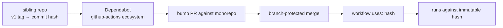

# Design 1310-a — SHA-pin sibling `forwardimpact/*` composite actions

## Architecture summary

The architectural change is one of *reference form*: every monorepo
workflow `uses:` line that targets a sibling action moves from a mutable
tag-shaped reference to an immutable hash-shaped reference. No workflow
gains or loses a step; no secret assignment changes; no sibling repository
is touched. The architectural surface is three artefacts plus one existing
update-path component — all already wired up.

## Components

| Component | Where | Role |
|---|---|---|
| Workflow reference site | `.github/workflows/*.yml` | Every `uses:` line targeting a sibling action holds the immutable reference. The line is authoritative; every other artefact describes or governs it. |
| Pinning policy statement | `CONTRIBUTING.md` § Security | Single source of truth for the rule: third-party actions including sibling `forwardimpact/*` repos are pinned to SHA. No carve-out. |
| Operator procedure | `.github/CLAUDE.md` § Third-party actions | Replaces the force-tag-move recipe; carries the sibling-internal exclusion clause. |
| Update path | `.github/dependabot.yml` § `github-actions` ecosystem | Pre-existing component the design verifies — already scanning workflow files for SHA-bump opportunities against same-org repos. No schema change. |

## Reference shape

Each sibling reference is the pair `(immutable hash, human-readable
canonical marker)`. The hash carries the security property (no tag
mutation reaches the runtime); the marker carries the human property
(readers see which major-version line the pin targets) and is the same
trailing-comment convention already used elsewhere in the workflow set.
Specific syntactic form is governed by the spec's success-criterion regex;
the design's contribution is the two-part shape, not the line-level
syntax.

## Data flow

The mutable `v1` tag is now an *advisory marker* read by Dependabot, not
an executable reference read by GitHub Actions. A compromised sibling
force-moving `v1` no longer reaches monorepo secrets on the next
scheduled run — it reaches a Dependabot PR that a human reviews.

## Replacement edit procedure

The current operator procedure (force-move `v1` on the sibling) is the
load-bearing artefact of the divergence: it *requires* the tag to be
mutable. The design retires it and routes future edits through three
already-existing components: an *immutable patch tag* on the sibling
(append-only history), the *Dependabot bump PR* (the same component the
data flow above names), and the *branch-protected merge* surface every
other PR uses. The plan owns step order, command syntax, and exact
section text.

Whether the sibling continues to advance the `v1` major-tag marker is a
sibling-side editorial choice. The monorepo's pin is unaffected either
way, because the monorepo no longer consumes `v1` at runtime.

## Sibling-internal exclusion clause

The replacement procedure adds an explicit scope-boundary statement that
the monorepo's pinning policy governs *workflow `uses:` references to
sibling actions*, and that *sibling-internal references* (a sibling's own
references inside its `action.yml`, including a sibling's calls to
another sibling) are governed by the sibling repos. The clause sits
beside the new operator procedure because that is the section a reader
consults when asking *what does pinning apply to here?* Exact wording is
plan-scope.

## Key decisions

| Decision | Choice | Rejected alternative |
|---|---|---|
| Reference shape | Immutable hash plus canonical marker | Bare hash with no marker — loses human-readable provenance; mechanical audit gains nothing. |
| Marker granularity | Major-tag marker (`v1`) | Patch-exact marker (`v1.x.y`) — drifts every Dependabot cycle, churns the diff for no security gain. |
| Update path | Reuse existing Dependabot `github-actions` ecosystem | New ecosystem block scoped to siblings — duplicates coverage; spec excludes new automation. |
| Single source of truth | `CONTRIBUTING.md` § Security holds the rule; `.github/CLAUDE.md` holds the operator procedure and exclusion clause | Both in `CONTRIBUTING.md` — bloats the policy document with operator detail. |
| Audit signal granularity | Binary (all references pinned, or audit red) | Per-sibling staged pinning — leaves the audit signal red between stages, removing the very property the rule asserts. |
| Replacement edit procedure | Immutable patch tag → Dependabot bump → reviewed merge | Keep `v1` mutable plus social policy on force-pushes — security cannot be enforced socially; the audit must be structural. |

## Interactions with existing policy

The four artefacts in § Components are the entire change surface.
`kata-release-cut` continues to tag sibling repos as it does today;
`kata-security-update` gains four new Dependabot PR sources that fall
under its existing third-party-action handling; branch-protection
required checks are unchanged (the spec anchors to the live
branch-protection list rather than enumerating jobs).

— Staff Engineer 🛠️
