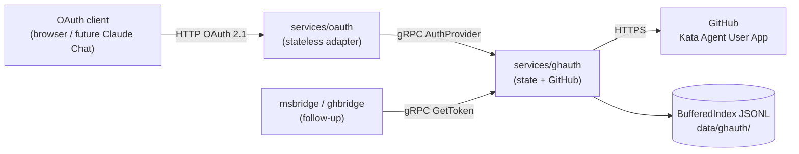
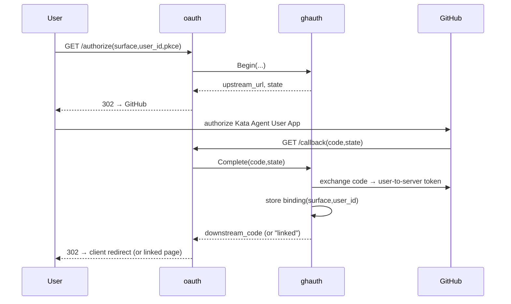

# Design 1320-a: oauth + ghauth

Spec 1320 asks for two services that let a chat surface dispatch under a
**per-user** GitHub identity: `services/oauth/` (protocol-only HTTP) and
`services/ghauth/` (GitHub-specific gRPC + state). First consumers are
`msbridge` and `ghbridge`; the contract must satisfy their linking and
token-resolution needs. Out of scope: `services/kata`, `services/mcp`, bridge
adoption, the Kata Agent **Team** App, cross-surface identity unification.

## Components

`oauth` holds no secrets and no state; every HTTP endpoint maps to one
`AuthProvider` gRPC call. It selects its backend by name from config
(`provider: "ghauth"`) and constructs that client at boot, the way
`services/mcp/server.js` constructs its gRPC clients — so `oauth`'s source
contains no GitHub-specific code (SC#3). `ghauth` implements the
provider-agnostic `AuthProvider` contract; a second provider (e.g. `msauth`)
would implement the same contract and be swapped in by config alone.

## AuthProvider gRPC contract

`ghauth` is internal-only (consumed by `oauth` and the bridges, never exposed
as an MCP tool), so it returns **domain messages**, not `tool.ToolCallResult`.
The token query is a discriminated `oneof` the bridge branches on directly.

| RPC | Request | Response | Drives |
| --- | ------- | -------- | ------ |
| `Begin` | `surface, surface_user_id, redirect_uri, code_challenge, scopes` | `upstream_authorize_url, state` | `GET /authorize` |
| `Complete` | `code, state` (from GitHub callback) | `downstream_code, redirect_uri, client_state` | `GET /callback` |
| `Redeem` | `code, code_verifier` | `access_token, token_type, expires_in` | `POST /token` |
| `GetToken` | `surface, surface_user_id` | `oneof { string token; LinkRequired{authorize_url}; ReAuthRequired }` | bridge dispatch |
| `Revoke` | `surface, surface_user_id` | `common.Empty` | unlink |

`Begin`/`Complete` are the **linking** path the bridges need (a user clicks a
link, authorizes GitHub, `ghauth` stores the binding). `Redeem` plus the
downstream `access_token` are the OAuth-server path an OAuth *client* (future
Claude Chat) needs; the bridges never call `Redeem`. `GetToken` is the
**dispatch read path**: `(channel, participant.external_id)` maps onto
`(surface, surface_user_id)`, and the `token` arm is a `string` directly usable
as `libbridge` `Dispatcher`'s `getGithubToken` result (whose contract is
`() => Promise<string> | string`).

## oauth HTTP surface

| Endpoint | Maps to |
| -------- | ------- |
| `GET /.well-known/oauth-authorization-server` | static metadata from config `issuer` |
| `GET /authorize` | `Begin` → 302 to `upstream_authorize_url` |
| `GET /callback` | `Complete` → 302 to client `redirect_uri` (or a "linked" page when no client awaits) |
| `POST /token` | `Redeem` → JSON token response |
| `GET /health` | liveness |

`oauth` serves these routes with **Hono + `@hono/node-server`** — the repo's
HTTP standard, shared by both bridges via `libbridge`'s `createBridgeServer`.
`oauth` uses Hono directly (its routes are OAuth-server-shaped, not
bridge-shaped) with the same security-headers middleware the bridge server
applies.

PKCE `code_challenge`/`code_verifier` pass through `oauth` untouched into
`Begin`/`Redeem`; `ghauth` verifies the verifier at `Redeem` against the
`code_challenge` carried in the grant. Whether `/callback` redirects or renders a "linked" page
is decided by the flow record: a client-initiated flow carries a `redirect_uri`
(302 with `downstream_code`); a bridge-initiated link carries none (linked
page).

## State (ghauth)

`BufferedIndex` instances over an injected `libstorage` store rooted at
`data/ghauth/`:

| Index | Key | Holds | Lifetime |
| ----- | --- | ----- | -------- |
| `bindings.jsonl` | `surface:surface_user_id` | `github_user_id`, access + refresh token, `expires_at`, scopes | until revoked |
| `flows.jsonl` | outer `state` | pending authorize: `surface, surface_user_id`, plus `code_challenge`/`redirect_uri`/`client_state` (client-initiated only) | short TTL sweep |
| `grants.jsonl` | `downstream_code` | client-initiated grant: binding ref, `code_challenge`, `redirect_uri`, `client_state` | short TTL; consumed once at `Redeem` |

`Begin` writes a `flows` row; `Complete` consumes it — exchanging the GitHub
code for a user-to-server token and writing the `bindings` row. For a
client-initiated flow (one carrying a `redirect_uri`), `Complete` also mints a
`downstream_code` into `grants`, carrying the `code_challenge` forward; a
bridge-initiated link writes no grant. `Redeem` consumes the `grants` row and
verifies `code_verifier` against the grant's `code_challenge`. This `grants`
store is the home for the outer (Claude↔`oauth`) "issued grants" state; the
bridges exercise only `bindings` + `flows`. Persisting an issued `access_token`
for later introspection is deferred to the Claude Chat surface (see below).

`GetToken` reads `bindings`, refreshing via the GitHub OAuth client when the
access token is near expiry. A refresh that fails because GitHub reports the
grant revoked yields `ReAuthRequired`; a transient refresh error surfaces as an
error, not `ReAuthRequired`. A missing binding yields `LinkRequired` whose
`authorize_url` **is** `oauth`'s own `/authorize` endpoint — `ghauth` composes
it from the configured `link_base_url` (one URL shape, not a second). The TTL
sweep mirrors `DiscussionContextStore`.

## Linking sequence

Dispatch read path: `bridge → GetToken(surface,user_id) → {token|LinkRequired|ReAuthRequired}`.

## Key decisions

| Decision | Rejected alternative | Why |
| -------- | -------------------- | --- |
| Two services: protocol front + provider backend | One combined service | A combined service mixes HTTP + gRPC + GitHub, can't add a second provider without editing the protocol layer, and breaks the thin-adapter precedent set by `services/mcp`. |
| Provider-agnostic `AuthProvider` contract | GitHub-specific RPCs on `oauth` | GitHub-specific RPCs would put `octokit`/GitHub code in `oauth`, failing SC#3 and blocking a second provider. |
| `ghauth` owns all state (flows, bindings, issued grants) | `oauth` owns outer-protocol state | Stateful `oauth` needs a datastore in every front instance, splits the token lifecycle across two services, and contradicts the user-set "ghauth owns state" principle. |
| Domain `oneof` result | `tool.ToolCallResult` | `ghauth` isn't an MCP tool; a typed `oneof` lets the bridge branch without string-parsing a `content` blob. |
| `BufferedIndex` JSONL via injected storage | External database | Honors the zero-runtime-dependency invariant and matches how the bridges already persist; no new infrastructure. |
| Binding key `(surface, surface_user_id)` | Unify on `github_user_id` | Spec excludes cross-surface unification; independent bindings are simpler and map 1:1 to the bridges' `(channel, external_id)`. |
| User-to-server token (Kata Agent User App) | Installation token | GitHub enforces the requester's own repo permissions at dispatch; user-to-server tokens are refreshable, so `ghauth` owns refresh. |
| `ghauth` composes the `LinkRequired` URL from `link_base_url` | Each consumer composes it | Keeps the consumer dumb and the URL shape in one place; the spec requires the typed result to carry the URL. |
| `oauth` HTTP via Hono + `@hono/node-server` | Raw `node:http` (as `services/mcp` uses) | Hono is the repo's established HTTP framework — both bridges use it through `libbridge`; `mcp` uses raw `node:http` only because the MCP SDK's `StreamableHTTPServerTransport` requires it, which `oauth` does not. |

## Configuration

- `service.oauth`: `host`, `port`, `issuer`, `provider: "ghauth"` (backend
  client name). `init.services` lists `ghauth` **before** `oauth` (dependency
  first).
- `service.ghauth`: `host`, `port`, `link_base_url`; secrets via env
  (`SERVICE_GHAUTH_*` client id/secret accessors, per `libconfig` credential
  resolution); storage under `data/ghauth/`.

## Future-surface note (not designed here)

The opaque `access_token` `oauth` issues maps to a `ghauth` binding, leaving
room for a later token-introspection endpoint and Dynamic Client Registration
when `services/kata` + `services/mcp` expose Claude Chat. Neither is built in
this spec; the contract above does not preclude them.
