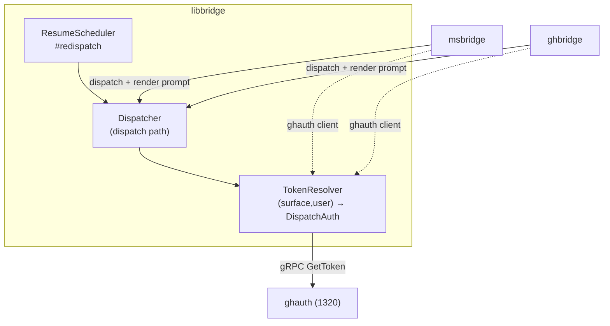
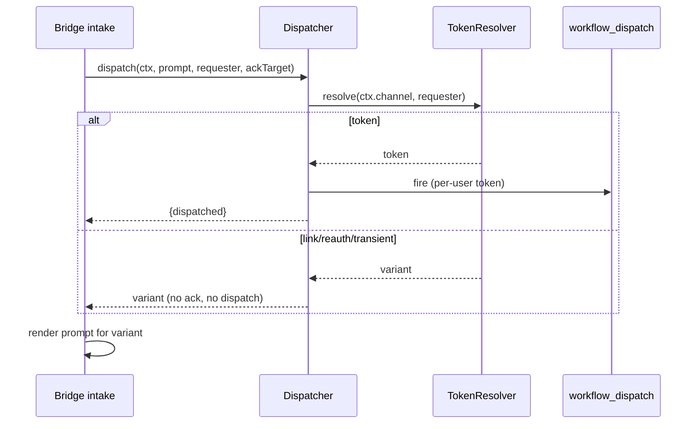

# Design 1340-a: bridges dispatch under the requester's GitHub identity

Spec 1340 makes `msbridge` and `ghbridge` acquire the `kata-dispatch` token
**per requester** from `ghauth` (Spec 1320), prompting on the channel when no
usable token exists instead of dispatching under a shared token. The bridges
share the dispatch primitive in `libbridge`, and a resumed conversation
redispatches through that same primitive. Out of scope: `oauth`/`ghauth`
themselves, the linking flow, Claude Chat, and `ghbridge`'s reply/reaction
posting (stays on the Team App installation credential).

## Components

The per-requester logic lives in `libbridge` because both bridges **and** the
resume path share one `Dispatcher`; duplicating it per bridge would leave the
resume redispatch (which never touches bridge code) unprotected.

## DispatchAuth outcome

`TokenResolver` wraps a `ghauth` gRPC client and maps 1320's `GetToken` `oneof`
plus transport state into one discriminated result the dispatch path returns:

| Variant | Source | Bridge renders |
| ------- | ------ | -------------- |
| `token(string)` | `GetToken` token arm | nothing — dispatch proceeds |
| `link_required(authorize_url)` | `GetToken` `LinkRequired` | post the authorize URL |
| `reauth_required` | `GetToken` `ReAuthRequired` | post a re-link prompt |
| `transient(error)` | any gRPC failure (`UNAVAILABLE`, deadline, and every other code) | post a transient-error notice |

`reauth_required` carries no URL of its own (1320 does not attach one); the
bridge directs the user to the same linking entrypoint as `link_required`.
Only the two typed arms 1320 defines map to `link_required` / `reauth_required`;
every other gRPC outcome folds into `transient`. The `transient` variant is the
**query's** transport failure; the existing throw/catch path for a failed
`workflow_dispatch` itself is unchanged.

## Dispatch path change

`Dispatcher.dispatch` today holds `getGithubToken` fixed at construction, and
starts the acknowledgement *before* fetching the token. The change:

1. Call `TokenResolver` with `(ctx.channel, requester)` — the surface is the
   context's existing `channel` value, so `libbridge` imports no channel constant
   (honoring its no-channel-SDK invariant), and `requester` is an explicit input
   the caller supplies (see below), not a value `dispatch()` reads off the
   context.
2. On `token`: start the acknowledgement and fire `workflow_dispatch` with that
   token — the existing dance, unchanged downstream.
3. On `link_required` / `reauth_required` / `transient`: start **no**
   acknowledgement, fire **no** workflow, and return the variant to the caller.

`dispatch()` gains a `requester` parameter and returns a `DispatchAuth` outcome.
The `token` variant still includes the existing `{token, correlationId}` the
intake success-caller destructures today. The intake caller renders any
non-`token` variant inline; the resume path (`#redispatch`), which discards the
return today, now inspects the outcome and, on a non-`token` variant, invokes
the declined-outcome handler (below) instead. The token is resolved *before* the
acknowledgement starts (see Key Decisions).

## Recorded requester

The triggering requester is the human who caused *this* dispatch — not the
conversation originator (`participant[0]`, which stays for history/attribution).
Each bridge derives the requester's surface user id for the current inbound
event and passes it into the dispatch path:

| Bridge | Surface (`ctx.channel`) | Requester source |
| ------ | ----------------------- | ---------------- |
| `msbridge` | `msteams` | the message sender (`activity.from.id`) |
| `ghbridge` | `github-discussions` | comment author for comment events, else discussion author |

Because the requester is an explicit dispatch input, fresh and resume dispatches
differ only in who supplies it. When a dispatch enters recess, `enterRecess` —
the sole writer of the open-rfc record (today only the trigger and timing) —
gains the requester and records it on that rfc. A resume — including an
`elapsed`-timer resume that has no fresh inbound — reads the requester from the
rfc it resumes and passes it back into `dispatch()`. The resolver therefore
always sees the `(surface, requester)` key of the dispatch being run, with no
shared mutable field to go stale.

## Bridge rendering

On the **intake** path the bridge has the `DispatchAuth` outcome as
`dispatch()`'s return value and renders it inline: `msbridge` through its Teams
`sendReply`, `ghbridge` through its discussion-comment GraphQL reply (which stays
on the installation credential — see Key Decisions).

The **resume** path runs inside `ResumeScheduler`, which is channel-agnostic and
holds no reply adapter, and an `elapsed`-timer resume has no live inbound to
reply through. So `ResumeScheduler` gains a caller-injected declined-outcome
handler in its constructor — mirroring its existing `buildCallbackMeta` /
`buildResumeInputs` constructor callbacks (not the reply handler, which lives on
the separate callback handler) — that each bridge wires to its reply path. When
a resume resolves to a non-`token` variant,
`ResumeScheduler` cancels the recess and invokes that handler, which posts the
prompt using the channel coordinates already stored on the context (the same
coordinates the bridges use to post recess replies today), so it works without a
live inbound.

## Configuration

Each bridge's startup wiring constructs a `ghauth` gRPC client (via `librpc`
`createClient`) from a `ghauth` client binding added to its service config, and
injects it into the `TokenResolver` the `Dispatcher` requires. The failing
component for SC#10 is that **bridge startup wiring**: with the binding absent
it cannot build the `ghauth` client, so the `TokenResolver` and `Dispatcher` are
never constructed and the service does not start — the same fail-fast posture
`Dispatcher` already takes for a missing token source. `init.services` lists
`ghauth` before the bridges so the dependency is up first.

## Key decisions

| Decision | Rejected alternative | Why |
| -------- | -------------------- | --- |
| Resolution in the shared `Dispatcher` (injected `TokenResolver`) | Resolve in each bridge, pass a token into `dispatch()` | The resume redispatch flows through `Dispatcher`, not bridge code; per-bridge resolution would leave resumes on the old shared token and duplicate the branch twice. |
| `dispatch()` returns a typed `DispatchAuth` outcome | Throw on non-`token` results | Link/re-auth/transient are expected control flow, not errors; a typed return lets each bridge render the right channel message without exception-as-control-flow. |
| Resolve the token **before** starting the acknowledgement | Keep today's order (ack, then token) | Starting the ack then declining leaves a dangling "received" reaction (SC#7); resolving first means the ack starts only when a dispatch will fire. |
| Requester as an explicit dispatch input (recorded on the rfc for resume) | Overwrite `participant[0].external_id` | The originator remains meaningful for history/attribution; overwriting conflates "who started the thread" with "who triggered this dispatch," and an explicit input avoids a shared mutable field. |
| Resume reuses the recorded requester | Re-derive from a fresh inbound | An `elapsed`-triggered resume has no inbound sender; the requester who entered recess is the authority to reuse. |
| `transient` → post a notice, fire nothing | Fail open to a fallback shared token | Dispatching under a fallback reintroduces the exact shared-identity gap 1320/1340 close. |
| `ghbridge` replies/reactions stay on the installation credential | Post replies as the per-user token | The bot's replies are the app's action, not the user's; only the dispatch is the user's authorized act. |

## Clean break

No compatibility shim: the static `ghToken` / installation-token dispatch
closures are removed from both bridges, and `Dispatcher`'s construction-time
`getGithubToken` is replaced by the injected `TokenResolver`. Nothing outside
the bridges + `libbridge` consumes that closure.
