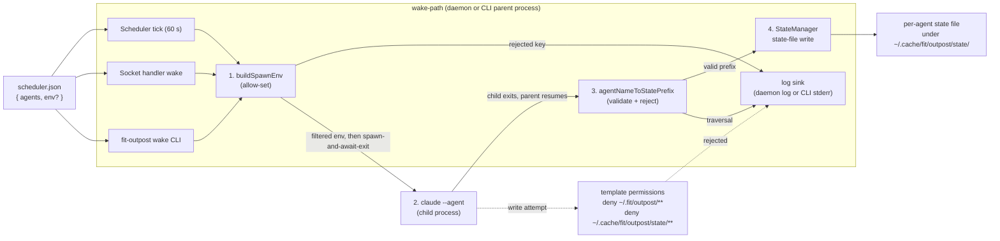

# Design — Outpost Scheduler-Config Trust Boundary

## Spec Restatement

Outpost's daemon-mediated wake paths forward `config.env` from
`~/.fit/outpost/scheduler.json` straight into spawned `claude` processes with
no key filter, no rejection log, and no audit. The agent template allow-lists
shell-tool patterns without restricting paths, so an agent session can rewrite
`scheduler.json` and `state.json`. The agent-state writer maps agent names to
filenames with only hyphen-substitution, so a config-supplied name like
`../../foo` writes outside the per-agent state directory. Together these
turn a single prompt-injection wake into persistent compromise.

Success means: (1) one env-merge contract enforced uniformly across the
scheduler-tick, socket-handler, and direct-CLI wake paths, with rejections
observable in the daemon log; (2) writes to the trust-boundary paths from
inside an agent session are rejected by the template, regardless of the
shell tool used to route them; (3) agent-name → state-filename mapping
cannot escape the state directory; (4) the contract is captured in
`products/outpost/CLAUDE.md` for future contributor review.

## Components and Data Flow



Two new pure modules carry the contract; three call sites converge on them;
one template change closes the write surface; one contributor doc records
the trust boundary.

## Components

| Component | Where | Responsibility |
|---|---|---|
| `buildSpawnEnv` | new module under `products/outpost/src/` | Take `(configEnv, baseEnv)`, return `{ env, rejections: string[] }`. Drop keys outside `AGENT_ENV_ALLOWSET`, retain tilde-expansion for permitted values. Pure function; logging is the caller's responsibility (Decision #9 fixes the sink per path). |
| `AGENT_ENV_ALLOWSET` | same module, exported constant | Frozen `Set<string>` of keys the daemon honors for agents. Membership is fixed by Decision #1. |
| `agentNameToStatePrefix` | new module under `products/outpost/src/` | Take an agent name, validate it contains no `/`, `\`, `..`, NUL, or leading `~`; return the hyphen→underscore prefix. Reject by raising a typed error the writer catches; on rejection the writer logs and skips the state write rather than failing the wake (see Decision #8). Pure function. |
| `AgentRunner` spawn-env site | existing module `products/outpost/src/agent-runner.js` (replaces the current private `#buildSpawnEnv`) | Thin wrapper that delegates to `buildSpawnEnv` and forwards each rejection to the runner's existing structured logger (`#log`). |
| `StateManager` state-write site | existing module `products/outpost/src/state-manager.js` (modifies the state-file writer) | Compute the prefix via `agentNameToStatePrefix` instead of inline `replace(/-/g, "_")`; on rejection, log a structured record and return without writing. |
| Wake-path convergence | existing `fit-outpost wake` CLI handler in `products/outpost/src/outpost.js` | Pass `loadConfig().env` into the runner so the direct-CLI path goes through `buildSpawnEnv`. With the scheduler-tick and socket-handler paths already forwarding `config.env`, all three paths now produce identical spawn env from identical config. |
| Template deny entries | `products/outpost/templates/.claude/settings.json` `permissions.deny` | Reject writes to `~/.fit/outpost/**` (covers `scheduler.json`, `state.json`, rotations) and `~/.cache/fit/outpost/state/**` across `Edit` and the Bash patterns that can route a write. Intent: deny narrows the existing `Edit(~/.cache/fit/outpost/**)` allow and `additionalDirectories` entry, so the agent's write surface keeps the legitimate sync-target subdirectories but loses the daemon-owned state subtree. Precedence semantics under the real permission engine are confirmed in Open Question Q3. |
| Trust-boundary doc | `products/outpost/CLAUDE.md` (new; sibling to `products/outpost/README.md`, distinct from the agent-template `products/outpost/templates/CLAUDE.md`) | Contributor-facing (per `products/CLAUDE.md`): names `~/.fit/outpost/` and `~/.cache/fit/outpost/state/` as user-only trust roots, enumerates the allow-set the spawn surface honors, and tells future reviewers what changes to push back on. |

## Interfaces

JSDoc tags; the codebase is plain JS with JSDoc throughout. Names and shapes
are binding; the concrete error class name is plan-scope.

```js
// spawn-env module

/** @type {ReadonlySet<string>} */
export const AGENT_ENV_ALLOWSET;

/**
 * @param {Record<string,string>=} configEnv
 * @param {NodeJS.ProcessEnv} baseEnv
 * @returns {{ env: Record<string,string>, rejections: string[] }}
 *   `env` is `baseEnv` with allow-set members from `configEnv` merged on top
 *   (tilde-prefixed values are home-expanded). `rejections` lists the keys
 *   that were dropped. Pure; the caller logs.
 */
export function buildSpawnEnv(configEnv, baseEnv);

// agent-path module

/**
 * @param {string} name
 * @returns {string} safe filename prefix
 * @throws {Error} typed error (class name picked in plan) when `name` contains
 *   `/`, `\`, `..`, NUL, or a leading `~`.
 */
export function agentNameToStatePrefix(name);
```

## Key Decisions

| # | Decision | Rejected alternative | Why |
|---|---|---|---|
| 1 | **Allow-set** for env keys, with initial membership = `ANTHROPIC_API_KEY` plus any key the daemon currently passes through `config.env` in shipped scheduler.json examples | Deny-set of dangerous keys (`NODE_OPTIONS`, `DYLD_*`, `LD_*`, `PATH`) | Deny-set is open-ended: new Node releases, new dynamic-linker flags, and platform-specific knobs (`NODE_DEBUG_NATIVE`, `BUN_INSTALL`) keep arriving. Allow-set forces every new key through a code review at the same place that owns the trust contract. |
| 2 | **One shared `buildSpawnEnv` module** called by all three wake paths | Per-path filter inlined in each call site | The spec demands "three paths produce the same spawn env from the same config.env". A shared module makes that a code property, not a coordination promise. |
| 3 | **Direct-CLI wake forwards `config.env`** through `buildSpawnEnv` | Direct-CLI continues to pass `undefined` for `configEnv` | Same-config-same-env is the verification criterion. Treating "CLI passes nothing" as "CLI is safe" hides the surface from the contract: a future contributor who restores config forwarding to the CLI would not know the allow-set exists. |
| 4 | **Validate-and-reject** agent names containing path segments | Sanitize (replace `/`, `..` with `_`) | Sanitization quietly accepts and rewrites attacker-supplied input. Legitimate agent names never contain `/` or `..`; a rejection log is a useful intrusion signal. |
| 5 | **Broad path deny** (`~/.fit/outpost/**`, `~/.cache/fit/outpost/state/**`) | Per-file deny (`scheduler.json`, `state.json`, each state file) | The trust root is the directory, not the file. Per-file leaves rotations, backups, and future state files writable, and forces every new daemon-owned file to be added to the deny list. |
| 6 | **Edit + Bash deny patterns together** | `Edit()` deny only | Spec says "regardless of how the write is routed". Allowed Bash patterns (`tee`, `cp`, `mv`) can write to any path; denying `Edit` alone leaves a routable bypass. |
| 7 | **Structured rejection record** (`{ event, key, agent }`) | Free-form log line | Structured records let operators grep for the canonical event and let future trace producers count rejections as a security metric. Matches the JSON record shape `AgentRunner.#log` already emits. |
| 8 | **Reject-and-skip** state-write on bad name (wake completes, no state file) | Reject-and-fail-wake | Failing the wake gives the attacker a denial-of-service primitive over an arbitrary agent slot. Skipping the write contains the damage to one absent state file plus one log line. |
| 9 | **One log sink per path**: daemon paths (scheduler tick, socket handler) write the structured `rejected-env-key` record to the existing scheduler log; direct-CLI prints the identical record to stderr only | Hybrid (CLI writes to both stderr and the daemon log) or single-sink for all paths | Spec's "observable record in the daemon log" applies to daemon paths by construction; the CLI is interactive and short-lived, so stderr is its operator-visible surface. A clean per-path mapping keeps each path's audit trail in one place and avoids cross-process log-file contention from a CLI that may run while the daemon is also writing. |

## Open Questions (resolve in plan, not design)

| Q | Resolution path |
|---|---|
| Concrete error-class name and field shape for the agent-path rejection | Plan picks the class name and JSDoc field set; the design fixes only the contract (typed error, caller catches, log + skip). |
| Exact Bash patterns to deny | Plan enumerates from `settings.json` `allow` list; any Bash pattern that accepts a path argument gets a path-scoped deny (e.g., `Bash(tee ~/.fit/outpost/**)`). |
| Whether Claude Code permission globs match tilde-expansion and `**` identically across `Edit()` and each `Bash(<cmd> …)` pattern | Plan verifies once on the real permission engine and either confirms or substitutes literal-path variants. |

## Out of Scope (per spec)

TCC entitlements; mail/Teams content sanitisation; sandboxing the spawn
process; harness-wide Claude Code permission changes; non-Outpost product
hardening.

— Staff Engineer 🛠️
