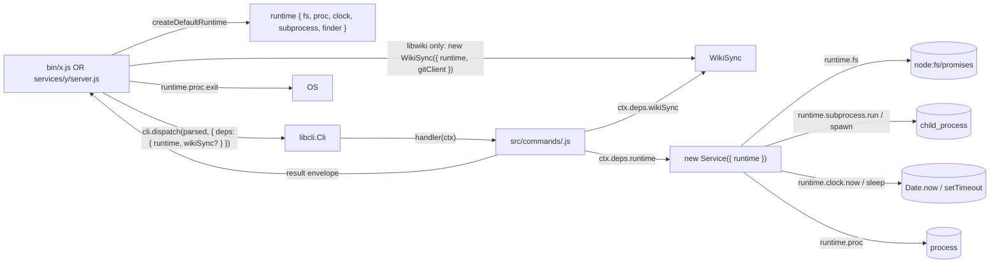

# Design 1370 — Ambient Dependencies to Injected Collaborators

One `runtime` bag flows from each binary's entry point through a new
`InvocationContext.deps` slot — a sibling of `ctx.data` dedicated to
host-injected ambient collaborators — into every constructor and factory
in the monorepo. All 30 CLI bins across `libraries/*/bin/` and
`products/*/bin/` converge on the same DI contract: dispatched bins
expose `ctx.deps.runtime` to their handlers via `cli.dispatch`,
single-flow bins construct `runtime` at the top of `main()` and thread
it explicitly (CLI Inventory § below). libutil owns the bag and the
typed subprocess clients; libmock owns the canonical fakes; libwiki's
commands keep their per-command-file layout and consume `runtime` plus
their domain collaborator (`WikiSync`) through `ctx.deps`, identical in
shape to every other multi-subcommand CLI — no per-CLI facade class
(Success Criterion 4 reframed after PR #1280 review); the only
`new Finder(...)` call site lives in libutil (Success Criterion 9). A
two-list lint check governs new code and shrinking debt; STATUS carries
one row per library/product (spec § Risks mitigation).

## Components

| Component | Lives in | Surface / shape |
|---|---|---|
| `Runtime` typedef | libutil (`src/runtime.js`) | `Object.freeze`d `{ fs, fsSync?, proc, clock, subprocess, finder }`. A module destructures `fs` **xor** `fsSync` — never both. |
| `createDefaultRuntime()` | libutil | Two-phase factory: (1) build `fs`/`fsSync`/`proc`/`clock`/`subprocess` from real node modules; (2) build `finder = new Finder({ fs, proc })` using phase-1 fields; (3) `Object.freeze` and return. |
| `createTestRuntime(overrides = {})` | libmock | Same two-phase shape over libmock fakes; every field defaulted (never undefined); `overrides.<field>` replaces a default; `Object.freeze` on return. Declares `Runtime` via `@typedef {import('../../libutil/src/runtime.js').Runtime}` — JSDoc-only import, no runtime coupling to libutil. |
| `createMockClock`, `createMockFs`, `createMockProcess`, `createMockSubprocess`, `createMockFinder`, `createMockGitClient`, `createMockGhClient` | libmock | Each fake captures every call (`calls[]`) and supports configurable responses; defaults are no-op/empty. `createMockProcess` keeps its already-shipped name. |
| `GitClient` | libutil (`src/git-client.js`) | Typed async methods over `runtime.subprocess`: `clone`, `init`, `fetch`, `status`, `rebase`, `mergeOursStrategy`, `commitAll`, `push`, `revListCount`, `configGet`, `configSet`, `aheadCount`, `remoteGetUrl`, `withAuth(token)`. Covers spec scope rebase + `-X ours` recovery + token-rotated push + `commands/init.js`'s `deriveWikiUrl` (`remoteGetUrl`) + parent-dir identity reads (`configGet` accepts a `cwd` opt). Replaces `WikiRepo`'s `#git`/`#authGit` helpers; `WikiRepo` is deleted (clean break — libwiki's own callers in `commands/*.js` and the bridges that thread WikiRepo through rewire to `WikiSync` in the libwiki PR). |
| `GhClient` | libutil (`src/gh-client.js`) | Typed async methods over `runtime.subprocess`: `prCreate`, `prMerge`, `apiGet`, `apiPost`. |
| `WikiSync` | libwiki (`src/wiki-sync.js`) | Consolidates pull/rebase/conflict-resolve/push currently spread across `wiki-repo.js`, `commands/sync.js`, and bridge call sites. Consumes `{ runtime, gitClient }`. Constructed once inside `bin/fit-wiki.js` (the same layer that builds `runtime`) and passed to handlers via `cli.dispatch(parsed, { deps: { runtime, wikiSync } })`. |
| libwiki command handlers | libwiki (`src/commands/<name>.js`) | Per-command files keep today's layout. Each handler signature changes from `(values, args, cli)` to `(ctx)` and reads `ctx.deps.runtime` plus `ctx.deps.wikiSync` (and any other host-injected collaborator the bin chooses to thread). No `LibwikiCommands` class wrapper — the shape matches every other multi-subcommand CLI's dispatched handlers. Handlers return the result envelope below. Spec § Scope enumerated 12 handlers; the implementation covers 13 to match the bin's shipped command set (`fix` post-dates the spec). |
| `Finder` (refactored) | libutil | Constructor `{ fs, proc }` — logger is **removed** from the constructor. `findUpward` / `findData` use the injected `fs` (the current dead-`fs` bug is fixed). Methods take an optional `{ logger }` per call; default logger is a `runtime.proc`-based stderr logger built inside `createDefaultRuntime`. Only `libutil` ever calls `new Finder(...)`; SC9 holds without escape hatches. |
| Entry points (`bin/*.js` **and** `services/*/server.js`) | unchanged paths | Sole construction site for `createDefaultRuntime()`. Sole callers of `runtime.proc.exit`. Bin shims translate handler results to exit codes; service entries call `runtime.proc.exit` only on shutdown signals. **Spec interpretation:** SC3 allow-lists "bin/*.js entry points"; spec § Scope row "products and services" puts services in scope alongside CLIs, so the design reads "bin shims" as "entry points (bin shims + service server.js)" — services are entry points by another name. If reviewers disagree, the spec returns to draft to widen SC3 explicitly. |
| `scripts/check-ambient-deps.mjs` | scripts/ | Invariant under `bun run invariants`. Reads two JSON files (schemas in Decision 9). Detection is AST-based on constructor parameter destructuring (catches `fs` xor `fsSync` violations) and on direct imports of `node:fs`, `node:child_process`. |
| `scripts/check-subprocess-in-tests.mjs` | scripts/ | Sibling invariant. Exempts `*.integration.test.js` files (whole-file granularity — mixed files split during their library's migration) and the one-entry-per-binary smoke allow-list. |
| `scripts/capture-cli-golden.mjs` + `test/golden/<bin>/*.txt` | scripts/ + test/ | Golden-capture mechanism. Ships in the libutil migration PR before any user-facing CLI migrates. Each library's first migration PR re-captures and commits; release-merge rejects PRs that change a golden without an explicit approval signal. |
| `MONOREPO.md` | repo root | Contributor doc per Success Criterion 10. Names collaborator surfaces, links libmock README's `## Collaborators` section, references the invariants. Referenced from `CONTRIBUTING.md § READ-DO`. |

## Data Flow

## CLI Inventory

Spec § Scope says "products and services" migrate alongside libraries.
The migration shape at the CLI layer depends on how each bin reaches its
handlers today. Survey of the 30 bin shims under `libraries/*/bin/` and
`products/*/bin/` (live source as of `origin/main`):

| Dispatch pattern today | Count | Bins | Migration |
|---|---|---|---|
| `cli.dispatch(parsed, { data })` | 1 | `coaligned` | Add `deps: { runtime }` to the dispatch call; handlers read `ctx.deps.runtime`. One-line touch per bin, one-line touch per handler. |
| `cli.parse(...)` + hand-rolled `COMMANDS[command]` / `switch (command)` dispatch — multi-subcommand bins | 14 | `fit-doc`, `fit-benchmark`, `fit-eval`, `fit-trace`, `fit-rc`, `fit-storage`, `fit-terrain`, `fit-wiki`, `fit-xmr`, `fit-landmark`, `fit-map`, `fit-outpost` (via `src/outpost.js`), `fit-pathway`, `fit-summit` | Convert to `cli.dispatch(parsed, { deps: { runtime } })`. Each subcommand in the libcli definition gains an `args: string[]` declaration and a `handler: (ctx) => …` field that imports the per-command implementation. The bin shim's `switch`/`COMMANDS` block is deleted. Handlers consume `ctx.deps.runtime`. |
| `cli.parse(...)` for flags only, no subcommand surface (one main flow) | 15 | `fit-codegen`, `fit-selfedit`, `fit-process-graphs`, `fit-query`, `fit-subjects`, `fit-process-resources`, `fit-unary`, `fit-logger`, `fit-svscan`, `fit-visualize`, `fit-download-bundle`, `fit-tiktoken`, `fit-process-vectors`, `fit-search`, `fit-guide` | No `cli.dispatch` migration owed (no subcommand surface to dispatch into). `main()` constructs `createDefaultRuntime()` once and passes it as an explicit parameter to the domain functions it calls — same DI contract, applied directly at the bin layer rather than through libcli. |

Two facts the inventory makes concrete:

- **Every bin shim becomes the sole construction site for
  `createDefaultRuntime()` in its CLI.** No domain module imports
  `node:fs`, calls `process.cwd()`, or constructs runtime ambient
  collaborators itself.
- **The `ctx.deps.runtime` channel becomes the universal handler
  contract for any CLI with a subcommand surface (15 of 30 bins).**
  Bins without a subcommand surface (the other 15) thread `runtime` as
  an explicit parameter — the same DI contract just hits one layer
  earlier. Decision 13 records the rationale.

Each library's / product's migration PR (Decision 8) carries its own
bin shim along with the src modules it drives.

## Key Decisions

| # | Decision | Rejected alternative | Why |
|---|---|---|---|
| 1 | Single `runtime` bag, destructured at constructors and read from `ctx.deps.runtime` in handlers. `fsSync` is a sibling field on the same bag (not a separate collaborator) — single-bag invariant holds. | Four separate args; per-collaborator optional bags (HmacAuth/Retry style). | Scales as collaborator count grows; destructuring stays readable. |
| 2 | Bag name is `runtime`. libwiki's four `io`-migrated commands rename once. Most fields map 1-1; the type-mismatched mapping `io.today() → new Date(runtime.clock.now()).toISOString().slice(0,10)` lives inline at each call site (the libwiki PR carries the rewrite). | Keep `io`. | `io` covers clock partially (`today()`) but excludes fs and subprocess; one bag name across the monorepo beats partial overlap. |
| 3 | Runtime flows through a new `InvocationContext.deps` slot — a sibling of `ctx.data` dedicated to host-injected ambient collaborators. Handlers receive `ctx` (per `cli.dispatch`'s extended contract — `libraries/libcli/src/cli.js`) and read `ctx.deps.runtime`. Bin shims call `cli.dispatch(parsed, { deps: { runtime } })`. `ctx.data` keeps its existing role as the host-loaded **domain values** slot (`root` in libcoaligned, `cities`/`services` in the published Every-Surface and Add-Capability guides) — existing `ctx.data.*` callers are untouched. libwiki's bin migrates from its hand-rolled `COMMANDS` switch to `cli.dispatch` — the CLI definition gains `handler` fields per subcommand (non-trivial rewrite, scheduled in the libwiki PR). | Overload `ctx.data` to also carry collaborators (per the typedef's current permissive wording — initially adopted in this design, withdrawn after PR #1259 review); mutate `cli.runtime`; add a fourth handler parameter; fork `InvocationContext` for the CLI side. | Two channels with distinct names match spec § "Personas and Jobs" — *"signatures are the dependency surface"*. A handler reading `ctx.deps.runtime` is self-evidently consuming a host-injected collaborator; the same value under `ctx.data.runtime` reads as input data and forces the reader to remember the typedef gloss. Spec § Scope > libcli contract explicitly contemplates extending `InvocationContext` with a collaborators slot (*"the existing `InvocationContext` extends with a `collaborators` slot, a sibling `runtime` context is added, or libcli takes a different shape is a design decision"*); this is design-authority. |
| 4 | Entry points are the sole construction site for `createDefaultRuntime()` and the sole callers of `runtime.proc.exit`. Handlers return `{ ok: true, value? } \| { ok: false, code, error }`; libeval's `runner` wraps its `{ records, errors }` payload as `{ ok: true, value: { records, errors } }`. Service handlers loop until SIGTERM. In production `runtime.proc.exit(code)` delegates to real `process.exit`; in tests the fake captures the code. | Construct in libcli; construct lazily inside handlers; treat services as bin shims by another name; per-domain result types. | Single boundary owns OS translation; one envelope across the monorepo means one handler-return discipline. |
| 5 | `GitClient`/`GhClient` live in libutil. `WikiSync` lives in libwiki. `WikiRepo` is deleted in the libwiki PR; bridge consumers and tests rewire to `WikiSync` and `GitClient` in the same PR. `wiki-repo.test.js` splits into `git-client.integration.test.js` (rebase + `-X ours` recovery, real git) and `wiki-sync.integration.test.js` (full pull/push flow, real git). | Keep `WikiRepo`; new `libgit`/`libgh` packages; inline `spawnSync` per consumer. | One library minimizes surface; named integration tests preserve the spec-required real-git coverage. |
| 6 | Handler envelope is inline plain objects: `{ ok: true, value? } \| { ok: false, code, error }`. | Shared `Result` type in libtype. | Inline objects work today and survive a future libtype migration; coupling two migrations is avoidable. |
| 7 | One fs surface per module: `runtime.fs` async-only; `runtime.fsSync` peer field, sync-only. The AST lint check rejects any constructor whose parameter destructuring of `runtime` names both `fs` and `fsSync`. | Namespaced `runtime.fs.sync`; force every sync site to migrate to async. | Peer fields satisfy spec § Scope "sync-only or async-only, not mixed" at the module boundary; AST detection makes the rule mechanical. |
| 8 | Migration order: **libmock** (add subprocess + finder + git + gh fakes) → **libcli** (extend `createCli` to accept `{ runtime }` so `Cli.error`/`usageError`/help write through `runtime.proc.stderr` instead of the captured global; existing positional signature kept as a deprecated alias for one migration cycle; extend the `InvocationContext` typedef with a `deps` property (host-injected ambient collaborators, frozen by `freezeInvocationContext` alongside `data`/`args`/`options`); extend `cli.dispatch`'s second argument from `{ data }` to `{ data, deps }` — both independently optional, default-`undefined`; update `libraries/CLAUDE.md § Invocation context` to document the new slot; the four existing `cli.dispatch(parsed, { data: ... })` call sites — `libraries/libcoaligned/bin/coaligned.js:109` and three libcli tests — remain unchanged) → **libutil** (Finder + GitClient + GhClient + `createDefaultRuntime` + `scripts/capture-cli-golden.mjs`; carries `fit-download-bundle` + `fit-tiktoken` bins) → **libconfig** (`process` arg → `runtime.proc`) → **libstorage** (carries `fit-storage` bin) → **libwiki** (per-command handler signature migration + WikiSync + bin rewrite to `cli.dispatch`) → **libcoaligned** (one-line `deps:` addition) → **libeval** (carries `fit-eval` + `fit-benchmark` + `fit-trace` + `fit-selfedit` bins) → **librpc** (carries `fit-unary` bin) → **libdoc** (`fit-doc`) → **libcodegen** (`fit-codegen`) → **libterrain** (`fit-terrain`) → **libxmr** (`fit-xmr`) → **librc** (`fit-rc`) → **libgraph** (`fit-query` + `fit-subjects` + `fit-process-graphs`) → **libvector** (`fit-search` + `fit-process-vectors`) → **libresource** (`fit-process-resources`) → **libsupervise** (`fit-logger` + `fit-svscan`) → **libtelemetry** (`fit-visualize`) → **products** (`fit-map`, `fit-pathway`, `fit-summit`, `fit-landmark`, `fit-guide`, `fit-outpost` — each product's bin shim + src in one PR per product) → **services**. STATUS carries one row per library/product — `1370/libutil`, `1370/libwiki`, `1370/products-map`, etc.; this extends the `id` field to permit a `/<library>` suffix and requires `fit-wiki claim`, `kata-dispatch`, and `kata-release-merge` to parse the suffix as a sub-row of spec 1370. Spec 1370's master row advances to `plan implemented` only when every sub-row is. Spec § Risks proposed `libutil → libmock`; the design inverts because `libraries/libutil/package.json` already devDepends on libmock. The async-only subprocess decision (§ Surfaces) means the libwiki PR converts every libwiki sync caller chain — `commands/sync.js`, `commands/init.js`, and any consumer threading through `WikiRepo` — from sync to async. | Single 1370 row + deny-list as sole tracker; new sub-spec dirs; single monolithic PR. | Per-library/per-product rows honor the spec mitigation, make claims visible to `fit-wiki claim`, and let libraries advance independently. |
| 9 | `scripts/check-ambient-deps.mjs` reads two JSON files. Allow-list: `[{ pattern: "<glob>", reason: "<text>" }]` — entry points (`**/bin/*.js`, `**/services/*/server.js`), `libraries/libutil/src/runtime.js`, `libraries/libcli/src/**`, libmock fakes, default-collaborator factories, scripts under `scripts/**`. Deny-list: `[{ pattern: "<glob>", library: "<lib>", smells: ["fs","child_process","date","process","setTimeout"] }]` — monotone (entries removed only, never added). Any new src file outside the allow-list lighting a smell fails CI. | One combined list; pure deny-list; ad-hoc YAML. | Two lists read as intent (exempt-forever vs. owes-migration); JSON schemas validate via `bun run invariants`. |
| 10 | Legacy seam disposition: libwiki's `io` → `ctx.deps.runtime` (libwiki PR); libconfig's `process` arg → `runtime.proc` (libconfig PR); WikiRepo's `resolveToken` callback → `GitClient.withAuth(token)` (libutil PR); HmacAuth's `{ now }` option → `runtime.clock.now` and Retry's `{ sleep }` option → `runtime.clock.sleep` (librpc/libutil PRs — each migrates only the field that exists today). Finder's positional `(fs, logger, process)` → `{ fs, proc }` with per-call `{ logger }` override; every `new Finder(...)` call site outside libutil is deleted (SC9's verification target — `rg "new Finder\\(" libraries/ products/ services/` returns matches only under `libraries/libutil/`). | Coexistence; rip-and-replace in one PR. | Each legacy seam has one replacement scheduled in the library PR that owns its callsites. |
| 11 | **No library gets a per-CLI facade class.** Every multi-subcommand CLI — libwiki included — keeps its per-command-file layout, with handlers reading `runtime` and any domain collaborator (e.g. libwiki's `WikiSync`) from `ctx.deps`. The construction site for a domain collaborator is the bin shim, the same layer that constructs `runtime`; the bin threads it through `cli.dispatch(parsed, { deps: { runtime, wikiSync? } })`. The monorepo-wide convergence is on **injected collaborators** flowing uniformly through `ctx.deps` (or as an explicit parameter for single-flow CLIs), **not** on class form — consistent with spec § Risks "OO-vs-DI conflation". | (a) `LibwikiCommands`-everywhere — generalise the class to all 15 dispatched bins; (b) `LibwikiCommands` libwiki-only — keep the original Decision 11 framing where libwiki is the lone class-shaped consumer. | (a) adds ~14 new `<Name>Commands` classes whose only job is to forward `(ctx)` to per-command files — pure ceremony for the dispatched bins that have no domain-singleton collaborator (most of them). The added construction layer obscures the DI contract instead of making it more visible. (b) makes libwiki structurally different from every other dispatched bin without buying anything the bin can't do directly: the bin already constructs `runtime`, so constructing `WikiSync` in the same spot and threading both via `ctx.deps` is the natural shape — no class wrapper required. Reviewer's note on PR #1280 made the consistency argument explicit; this design accepts it. SC4 is reframed in the spec amendment that accompanies this design change. |
| 12 | `ctx.deps` carries host-injected ambient collaborators (objects with methods: the `runtime` bag, future typed clients); `ctx.data` carries host-loaded domain values (paths, strings, arrays, plain-object configs — `root`, `cities`, `services`, future host-loaded catalogs). Both slots are `Object.freeze`d by `freezeInvocationContext`. The cut is enforced by convention + reviewers, not by lint — the "collaborator vs. value" discriminator is too fluid to police mechanically (a frozen plain object with no methods is ambiguous in either bucket), but the channel names themselves do the documentation work at every consumption site. | Single `data` slot carrying both (Decision 3's previously-adopted approach, withdrawn after PR #1259 review); rename `data` to `deps` and migrate every existing caller; add a third `config` slot for path-shaped host config. | Names should match the contract the reader holds. The spec calls out "make ambient dependencies more explicit" — a channel literally named `deps` does that work for free at every site (`ctx.deps.runtime` reads as DI; `ctx.data.runtime` reads as input data and forces a typedef lookup). Renaming `data` breaks `libcoaligned/bin/coaligned.js:81-85,109` plus the public `Every Surface` / `Add Capability` guides; an additive `deps` doesn't. The two-slot model is simpler than three (path-shaped config like `root` is a value, not a collaborator — `.data` fits). |
| 13 | **Every multi-subcommand CLI converges on `cli.dispatch(parsed, { deps: { runtime } })`** so `ctx.deps.runtime` is the universal handler contract across the 15 dispatched bins. The current hand-rolled-`switch` shape is treated as pre-spec-1370 debt to clear during each CLI's migration PR, not as a parallel-pattern to preserve. Single-flow bins (no subcommand surface — the other 15) construct `createDefaultRuntime()` at the top of `main()` and thread it as an explicit parameter; libcli's dispatch path adds nothing for them. **Whether a bin migrates dispatch style in the same PR as the underlying handler-DI work** is left to each library's plan author — both shapes (dispatch-conversion-in-flight or dispatch-conversion-deferred-as-follow-up) are acceptable, **but no library exits migration with handlers still consuming `(values, args)` instead of either `ctx.deps.runtime` or an explicit `runtime` param**. | Leave each bin on its existing dispatch style and pass `runtime` as a `COMMANDS[command](values, args, { runtime })` extra arg; mandate `cli.dispatch` everywhere in one PR; mandate `cli.dispatch` for single-flow bins too. | The extra-arg shape works but fragments handler signatures (some bins on `(ctx)`, others on `(values, args, { runtime })`) — readers of a random handler can't predict which form they'll see. Forcing `cli.dispatch` into single-flow bins adds dispatch ceremony for zero gain. The chosen rule converges signatures for the bins that have subcommands and keeps the trivial bins trivial. |

## Collaborator Surfaces

- `runtime.fs` — `readFile`, `writeFile`, `readdir`, `stat`, `mkdir`, `rm`,
  `access`, `copyFile`, `mkdtemp`. Async only.
- `runtime.fsSync` — `readFileSync`, `existsSync`, `statSync`. Sync only.
  Mutually exclusive with `fs` per Decision 7.
- `runtime.proc` — `cwd()`, `env` (a `Proxy` over the underlying source —
  property reads pass through on every access so token rotation and
  late-binding config work; tests override the fake's backing object),
  `argv` (read-only array — entry-point bins parse it; domain modules
  should not), `stdout.write`, `stderr.write`, `exit(code)`, `exitCode`
  setter (libcli sets this directly — the contract carries both `exit` and
  `exitCode` so libcli's existing pattern survives without a rewrite).
- `runtime.clock` — `now()` (ms); `sleep(ms)` is the primary wait
  primitive (Promise); `setTimeout(fn, ms)` / `clearTimeout(h)` for
  fire-and-forget scheduling (debounce, watchdog) only.
- `runtime.subprocess` — `run(cmd, args, opts) → Promise<{ stdout,
  stderr, exitCode }>` for one-shot commands (replaces every current
  `spawnSync` / `execFileSync`); `spawn(cmd, args, opts) → { stdout:
  AsyncIterable, stderr: AsyncIterable, exitCode: Promise<number>,
  kill(signal) }` for streaming and long-running children (the outpost
  scheduler's bash watcher consumes this). Sync subprocess is not in the
  contract.
- `runtime.finder` — pre-constructed `Finder` built inside
  `createDefaultRuntime` (phase 2). Methods accept `{ logger }` per call
  for sites that want a custom logger; default is a stderr logger built
  from `runtime.proc.stderr`.

## libmock README and Drift Detection

libmock's `README.md` gains `## Collaborators` — one subsection per
surface (production shape, factory, three-line example).
`libraries/libmock/test/runtime-completeness.test.js` imports the
`Runtime` typedef via `@typedef {import('...')}` (JSDoc-only) and asserts
every typedef field has a corresponding `createMock*` export — drift
fails CI.

## Integration Test Marker

Files named `*.integration.test.js` are integration tests by convention;
`scripts/check-subprocess-in-tests.mjs` exempts them. Each library PR
renames its own integration tests as part of migration. The release-merge
gate rejects a library row's `plan implemented` advance while any of that
library's deny-list entries or unrenamed integration tests remain.

## Out of Scope (Design-Level)

- File-level migration order inside a library — that's the plan's
  per-library section.
- Third-party SDK wrapping (`@grpc/grpc-js`, `botbuilder`, `@octokit/*`).
- A `runtime.logger` slot — logger is a per-call concern on Finder
  methods; other domains pass loggers as domain dependencies.
- Performance milestones M1/M2/M3 — covered by spec Success Criterion 6.

— Staff Engineer 🛠️
