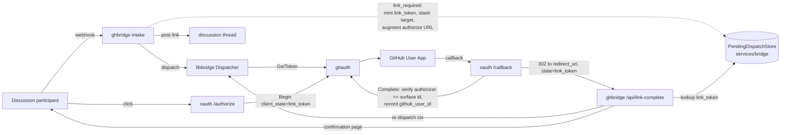

# Design 1380-a — link binding integrity and auth-completion resume

Spec 1380 closes two coupled defects on the `github-discussions` linking flow:
the completion step binds a token without checking who authorized, and the
message that triggered linking is dropped. The integrity fix lands in `ghauth`
(`Complete`); the resume flow is composed in `ghbridge` over a new
`services/bridge` store, the existing `libbridge` `Dispatcher`, and the
`oauth` round-trip already used for OAuth-client redirects. Out of scope:
the Teams surface, alternative token-minting methods, and the clickable-link
UX (retained).

## Components and flow

| Component | Role in this design |
|---|---|
| `ghauth.Complete` | Verifies the authorizing GitHub account against the flow's `surface_user_id`; records the verified id on the binding. |
| `PendingDispatchStore` (`services/bridge`) | Canonical, TTL'd map `link_token → replay target`; sibling to the discussion/origin stores so it survives `ghbridge` restarts. Like those stores it is reached over the bridge gRPC client, behind new RPCs (put / resolve-and-consume / sweep), not a local in-process object. |
| `ghbridge` link-prompt path | On a `link_required` decline, mints `link_token`, stashes the target, augments the authorize URL with its completion redirect + token. |
| `ghbridge` `/api/link-complete` | Post-auth landing endpoint: resolves `link_token`, re-dispatches, renders confirmation. |
| `oauth /authorize` | Gains one new pass-through: forwards `client_state` (carrying `link_token`) into `Begin` (today it forwards `redirect_uri`/`code_challenge`/`scope` but not `client_state`). |
| `libbridge.Dispatcher` | Unchanged dispatch primitive; the replay calls it exactly as intake does. |

## Identity verification (Defect 1)

`Complete` today binds `tokens.access_token` to `flow.surface_user_id` and
writes `github_user_id: null` with no authorizer check. The fix: after the code
exchange, resolve the authorizing account's GitHub id from the freshly minted
token, then bind **only** when that id equals the flow's `surface_user_id`,
recording it as the binding's `github_user_id`. A mismatch performs no upsert —
no create, no overwrite — and returns a typed `identity_mismatch` outcome the
`oauth /callback` renders as a refusal page.

The equality rule applies to surfaces whose identity namespace **is** GitHub
accounts, which `github-discussions` is (its `surface_user_id` is the GitHub
numeric id, per Spec 1340). This is expressed as a per-surface identity policy
on the provider so a future surface with a non-GitHub namespace records the
verified id without asserting equality. Teams is explicitly deferred.

## Resume flow (Defect 2)

When `Dispatcher.dispatch` returns `link_required`, `ghbridge` (not `libbridge`,
keeping it channel-agnostic) mints an opaque `link_token`, writes a
`PendingDispatch` target keyed by it, and augments the `authorize_url` with
`redirect_uri=<callback_base>/api/link-complete` and `client_state=<link_token>`
before posting. The other declined outcomes stash nothing: `reauth_required`
carries no `authorize_url` to augment and `transient` shows no link. Resume for
expired bindings (`reauth_required`) is out of scope per the spec — it would
first need `GetToken` to surface a re-link URL, which it does not today.

`oauth /callback` already redirects to a downstream `redirect_uri` with the
echoed `client_state`; `/api/link-complete` receives `state=link_token`,
resolves the `PendingDispatch` target, reloads the discussion context, and
re-dispatches through `Dispatcher.dispatch`. The pending record is deleted on
re-dispatch (idempotent against a page refresh) and renders a "processing your
message" page in place of today's terminal notice.

**Safety property:** the replay re-runs the same `GetToken` gate, which returns
a token only if a binding now exists for `target.surface_user_id` — and after
the Defect 1 fix, that binding exists only if the legitimate user authorized.
So a forged or stale `link_token` hit cannot dispatch; it re-posts the link
harmlessly. No separate proof-of-completion is needed.

## Canonical store as the single source of truth

The replay reconstructs the prompt from the discussion store, so the inbound
turn must reach the canonical store **before** the pending pointer is written.
The two intake paths are asymmetric today: the comment path appends the turn
and persists the context regardless of dispatch outcome, while the
discussion-created path never persists the turn on a declined dispatch — it
relies on `Dispatcher` appending `historyText` only when dispatch succeeds.

This design makes turn persistence the **intake's** responsibility on both
paths and removes the success-only append from the `Dispatcher` contract (a
clean break: the dispatch primitive no longer mutates history). The resulting
invariant — inbound turn persisted before resume bookkeeping — is what lets the
pending record carry **no message body**.

History entries gain an `author` field (the participant's `external_id`;
assistant turns carry none) so the replay selects the latest turn authored by
`target.surface_user_id` as the message to re-dispatch — correct even when
several humans have posted in the thread.

## Data structures

| Structure | Shape |
|---|---|
| `PendingDispatch` record | New `services/bridge` message `{ link_token, surface, surface_user_id, discussion_id, created_at }` — target only, TTL-swept like the flow/grant stores. `surface` is the channel value the replay feeds to `loadByChannel` (i.e. `ctx.channel`), not a second identifier. |
| `BeginRequest` (`ghauth`) | Gains a `client_state` field; `Begin` persists it on the flow instead of hard-coding `null`. This is the upstream half of the `client_state` round-trip. |
| Binding (`ghauth`) | `github_user_id` populated with the verified authorizer id (was always `null`). |
| History entry (`bridge` proto `HistoryEntry`) | `{ role, text, author? }` (was `{ role, text }`); the shared canonical schema, not just an in-memory shape. |

## Key Decisions

| Decision | Choice | Rejected alternative |
|---|---|---|
| How `Complete` learns who authorized | Resolve the account id from the minted token, compare to the flow's `surface_user_id` | Trust the OAuth callback / the request parameter — that is the current vulnerability |
| Where the replay target lives | Server-held `PendingDispatch` keyed by an opaque token | Encode `(user, thread)` in `client_state` — the completer could edit it to redirect the replay to another user/thread |
| Where the pending store lives | `services/bridge` alongside discussion/origin state | In-memory in `ghbridge` — lost on restart between link-post and completion; violates "ghbridge holds no own disk state" |
| Proof that completion was genuine | The `GetToken` gate during replay (binding exists ⇒ verified user linked) | `ghbridge` redeeming the downstream OAuth code — pulls the bridge into the OAuth-client role and hands it a user token it never uses |
| How resume is modeled | Dedicated pending store + completion endpoint | A new `ResumeScheduler` trigger kind — its triggers fire off inbound replies / elapsed time, not an external OAuth callback; overloading muddies the abstraction |
| How the message is re-sent | Replay through `Dispatcher.dispatch` | A bespoke dispatch path — would duplicate rate-limiting, callback registration, and the `GetToken` safety gate |
| Which message a multi-party thread replays | Latest history turn authored by the linking user | Latest turn regardless of author — could re-dispatch another participant's message |
| Where link augmentation happens | `ghbridge` (channel-specific completion endpoint) | `libbridge` `TokenResolver` — would import a channel-specific callback path, breaking its no-channel invariant |

## Constraints the plan must honor

- **`client_state` round-trips end to end across two contracts.** It must enter
  at `oauth /authorize` (a new query pass-through), cross the `ghauth.Begin`
  gRPC boundary (a new `BeginRequest.client_state` field, persisted on the flow
  instead of the current hard-coded `null`), and survive to `Complete`, which
  already echoes `flow.client_state`. `oauth`'s own HTTP surface needs no other
  change.
- **Two cross-bridge changes, different blast radius.** The `HistoryEntry`
  `author` field is a shared canonical-schema addition both bridges read.
  Removing the success-only `historyText` append is a change to the shared
  `libbridge.Dispatcher` contract — but only `ghbridge` is behaviourally
  affected: `msbridge` already appends its turn at intake and passes no
  `historyText`, so its dispatch path does not change.
- **`reauth_required` is the `libbridge` outcome name** (`TokenResolver` maps
  the `ghauth` gRPC `re_auth_required` arm onto it); the plan should grep the
  resolver-level spelling, not the wire spelling.
- **The confirmation page is a `ghbridge` HTTP response** — no channel SDK,
  preserving the libbridge no-channel invariant.
