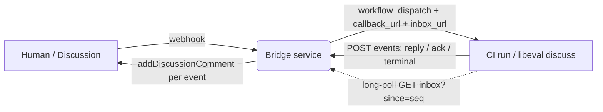
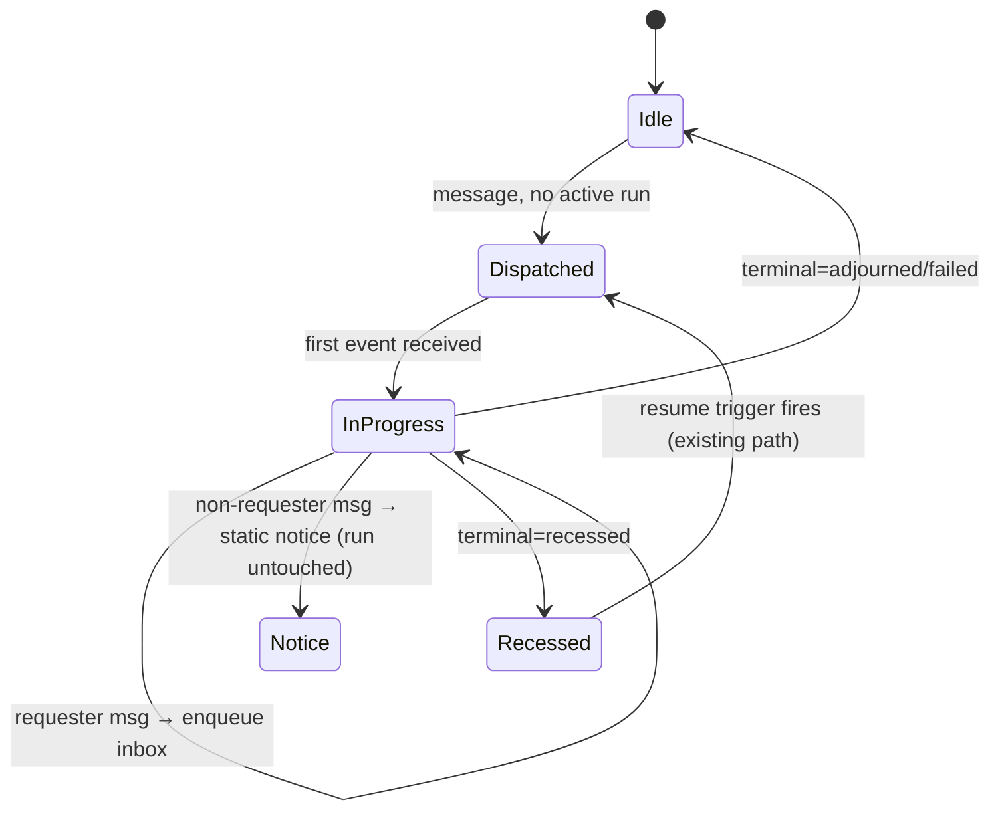

# Design 1390 — Realtime Bridge Conversations

Turns the bridge↔run contract from one terminal callback into a **streaming
session**: `correlation_id` stops being a one-shot callback nonce and becomes a
session id. The run streams events out as they happen and pulls injected
messages in while it is live.

## The constraint that shapes everything

The run executes inside an **ephemeral CI runner** that is not addressable —
nothing can POST *into* it — but it has full outbound network (it already calls
the GitHub API and the callback URL). So the run **dials home and holds both
channels itself**: it POSTs events out as they occur, and it long-polls the
bridge for injected messages. The bridge becomes a **broker** keyed by
`correlation_id`, never a pusher. Realtime therefore lives only inside the
active run window; gaps between runs fall back to the existing recess/resume
path (spec boundary, accepted).

## Components

| Component | Layer | Role change |
| --- | --- | --- |
| `CallbackRegistry` token lifetime | libbridge | The host stops calling `consume` (and clearing the pending-callback binding) on every callback; it defers that to the terminal verdict, so one token serves many in-progress deliveries |
| `Dispatcher` | libbridge | On dispatch, also passes the run an inbox URL; the existing pending-callback binding (token → correlation) now persists for the run's lifetime and becomes the "run is live" signal |
| `createCallbackHandler` | libbridge | Adds an `in_progress` verdict branch that posts replies without consuming the token or touching recess; the EYES `ack.finish` call moves out of the per-callback path onto the terminal branch |
| Inbox broker (new) | state in `services/bridge` store + proto; HTTP endpoint in `ghbridge`/`msbridge` | Per-`correlation_id` queue of injected messages: `enqueue` on channel intake, `drainSince(seq)` served by a long-poll route in each bridge's `createBridgeServer` wiring (where the callback route already lives) |
| Live-run record | `services/bridge` store + proto | Reuses the persisted pending-callback binding plus the already-stored `requester` (today on callback `meta` / `OpenRfc`) as the dispatch-vs-inject discriminator and the injection-authorization key — not a new parallel record |
| Reply emitter (new) | libeval `Discusser` | Outbound client that POSTs each reply/ack as produced; `ctx.replies` entries are extended to carry both a `kind` (`reply`/`ack`) and the emitted envelope `seq` |
| Inbound poller (new) | libeval, alongside the agent loops | A concurrent task that long-polls the inbox and lands each injected message on the **lead's** bus queue via `messageBus.synthetic`; the lead's existing `#drainOrWait` wakes on it — the shared drain is not modified |
| `Acknowledge` tool (new) | libeval `discuss-tools` | Agent-surface tool; emits an `ack`-kind reply, does not discharge the pending Ask |

## Session wire contract

One POST shape, discriminated by `kind`; `seq` is the existing `SequenceCounter`
value, making every event idempotent.

| `kind` | When | Bridge action |
| --- | --- | --- |
| `reply` | Answer routed to lead | `addDiscussionComment`; append history; dedupe by `seq` |
| `ack` | `Acknowledge` called | `addDiscussionComment` (own comment); **not** counted as a reply |
| `terminal` | Adjourn / Recess / Fail | Apply verdict (existing switch); close session token |

The post-hoc `fit-eval callback` workflow step is retained **only** as the
crash safety net: if the process dies without a `terminal` event, the trace
scan still POSTs a `failed` conclusion, exactly as today's placeholder branch.

## Egress: streaming replies and acks

The `Discusser` already intercepts `messageBus.answer` to push lead-routed
answers onto `ctx.replies`. That same interception point fires
`emitter.post({kind:"reply", seq, agent, body})`. `Acknowledge` posts
`{kind:"ack", …}` directly. `ctx.replies` entries — today `{body, agent,
thread_id}` — are extended with `kind` (so the terminal trace summary and the
bridge can tell ack from answer) and `seq`. The `seq` is the existing
per-run monotonic envelope counter (`SequenceCounter`), unique within a run,
which the bridge uses as the egress dedupe key. The **EYES** acknowledgement
reaction now spans the whole session and is finished only on the `terminal`
event, which is why `ack.finish` moves off the per-callback path.

## Ingress: message injection

The lead loop already idles in `#drainOrWait`, racing `waitForMessages(lead)`
against `donePromise`. The inbound poller runs as a **concurrent task beside the
agent loops** (not a change to the shared `#drainOrWait`): when the bridge's
inbox yields a new message, it calls `messageBus.synthetic(lead, text)`, which
lands only on the lead's queue; the lead's existing wait wakes, it sees the
human input, and may delegate with fresh `Ask` calls. **No change to the turn
model** — injection is just another source of bus traffic, scoped to the lead.

### Dispatch-vs-inject state machine (bridge, on inbound message)

Authorization: only the `requester` recorded on the `active_run` may inject;
a different user's message yields a brief static notice and leaves the run
untouched (spec §3). This reuses the `requester` already stored on dispatch.

## Key decisions

| Decision | Chosen | Rejected — why |
| --- | --- | --- |
| Ingress transport | Run **pulls** via long-poll | Bridge **pushes** to run — impossible; CI runner is not addressable |
| Execution substrate | Keep **ephemeral CI** | **Persistent addressable service** — would need per-conversation checkout/token/worktree sandbox; out of scope, separate effort |
| Callback token lifetime | **Session** (multi-delivery, closes on terminal) | Single-use `consume` — cannot carry many in-progress posts |
| Reply idempotency | **`seq`-tagged events**, bridge dedupes last-posted seq | Trust-once delivery — retries would double-post comments |
| Injection into loop | **Third racer** in `#drainOrWait` → `messageBus.synthetic` | Rework turn loop — breaks mode symmetry (spec §4) |
| `Acknowledge` surface | **Own comment**, `ack`-kind, does not discharge Ask | Status-edit / reaction — spec §3 wants it interactive and noisy |
| Conversation length | **Raise default turn budget**, semantics unchanged | Elastic/per-injection budget — adds a discuss-only branch, breaks symmetry |
| Adjourn/inject race | Bridge **reconciles**: unconsumed inbox at terminal → re-dispatch with that message | Drop the message — silent data loss; the human's steer vanishes |

## Edge cases

- **Adjourn/inject race.** Two sub-cases: a message arrives after the lead
  Adjourns (never fetched), or it is fetched onto the bus but the lead Adjourns
  before acting on it. To catch both, the inbox advances a high-water mark only
  when the lead *acts on* an injected message (produces output after it), not
  when the poller fetches it. On the `terminal` event, any injected message past
  that mark is unreconciled, and the bridge re-dispatches it as a fresh run
  carrying that message. This is a **dedicated reconciliation path**: the
  recess/resume machinery cannot be reused because `open_rfcs` is populated only
  on the `recessed` verdict, and an adjourned/failed run leaves none.
- **At-most-once posts.** Egress `seq` dedupe on the bridge plus the existing
  `Origin` record (which suppresses webhook echoes of the bridge's own
  comments) give at-most-once thread posting under retry.
- **Crash safety.** Process death without a `terminal` event → the retained
  workflow callback step posts a `failed` conclusion and closes the session.
- **Channel symmetry.** The streaming/injection contract lives at the libbridge
  layer; `services/msbridge` inherits it. Two things remain per-channel: the
  `handleReply` reply-posting (per-reply now, shifting how each channel uses its
  own post-one / post-many helpers), and a long-poll inbox route added to each
  bridge's `createBridgeServer` wiring next to the existing callback route.
  Neither is channel-specific *streaming* logic — the streaming/session logic
  itself stays shared.

## What stays identical

The `OrchestrationLoop` turn model, the Ask/Answer/Announce protocol, the
`{source, seq, event}` envelope **shape**, and the resumption-trigger set
(`missing_input` / `elapsed` / `escalation_needed`) are unchanged. Discuss mode
gains additive events (streamed reply/ack) and one additive agent tool
(`Acknowledge`); the only turn-model change is a larger default budget. Symmetry
means a shared envelope shape and turn model across `run`, `supervise`,
`facilitate`, and `discuss` — not an identical event set (discuss is already
richer via its `meta`/summary events).
