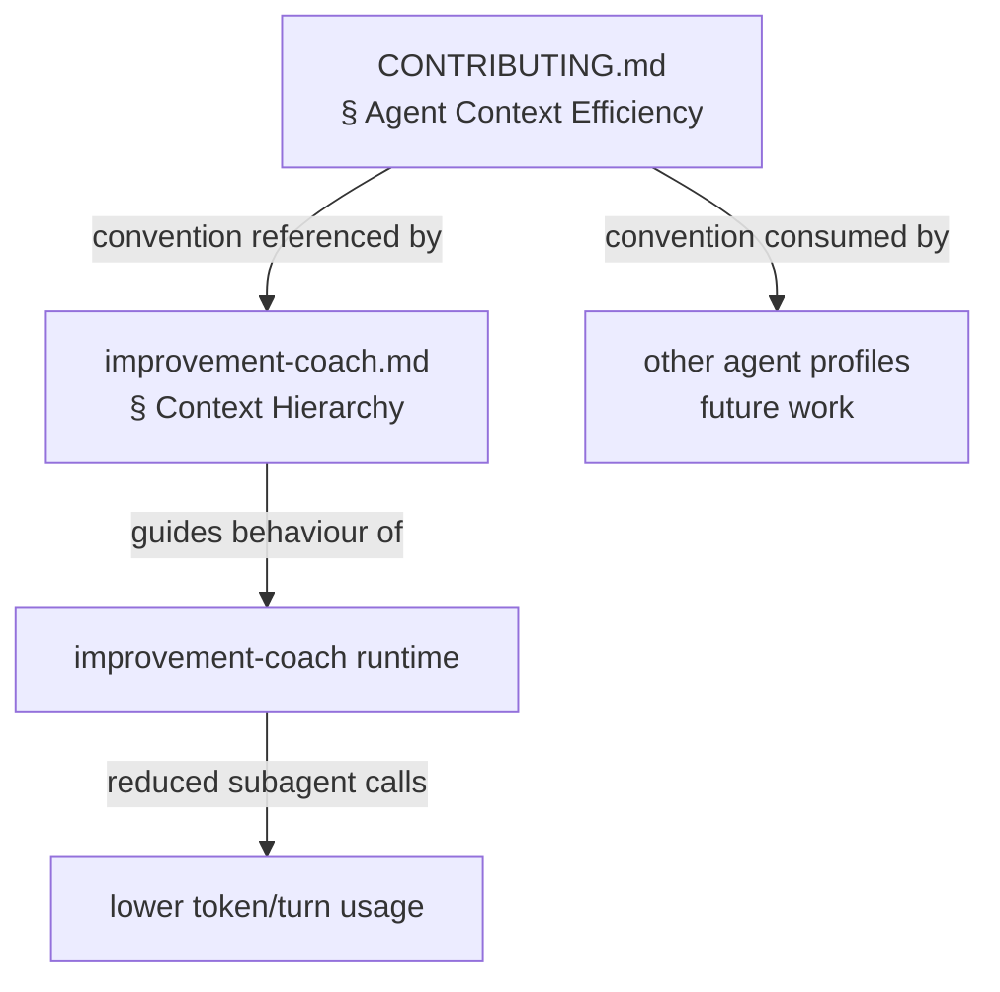

# Design 260: Improvement Coach Context Efficiency

## Problem Restated

The improvement-coach agent spends ~76K tokens and ~97 turns launching Explore
subagents to learn architecture already present in CLAUDE.md. Sessions hit the
50-turn limit before completing real work. The cause is missing guidance on when
existing context suffices versus when exploration is warranted.

## Components

Two components change; no new components are introduced.

### 1. Agent Profile — `improvement-coach.md`

Add a **Context Hierarchy** section to the agent profile between Voice and
Constraints. This section defines a ranked list of context sources the agent
must exhaust before escalating to subagent exploration.

```
System prompt (already loaded)
  → CLAUDE.md (already loaded — read it)
    → Direct file reads (Read/Glob/Grep tools)
      → Explore subagent (last resort)
```

The hierarchy is an instruction, not a mechanism — it works by telling the agent
what to do, not by restricting tool access.

### 2. Cross-Cutting Convention — CONTRIBUTING.md

Add an **Agent Context Efficiency** section under Core Rules. This codifies the
"read first, explore second" pattern as a contributor convention so all future
agent profiles follow it and the improvement-coach can audit compliance.

## Interfaces



The convention in CONTRIBUTING.md is the canonical definition. The
improvement-coach profile references it and adds coach-specific detail (the
hierarchy and escalation criteria). Other agent profiles adopt the convention
independently — that work is out of scope per the spec.

## Data Flow

No new data flow. The change alters the agent's decision-making at the start of
a session:

1. Agent session starts; system prompt and CLAUDE.md are already in context.
2. Agent reads Context Hierarchy instructions in its profile.
3. Agent consults system prompt and CLAUDE.md for architectural questions.
4. Agent uses Read/Glob/Grep for specific file lookups.
5. Agent launches Explore subagent only when steps 3-4 cannot answer the
   question (implementation details, code pattern searches across many files).

## Key Decisions

### Where to place context guidance in the agent profile

**Chosen: Dedicated section between Voice and Constraints.** The improvement-
coach lacks an Assess section (it delegates process to skills). A dedicated
Context Hierarchy section is visible before any skill is invoked, ensuring the
agent internalizes it at session start.

**Rejected: Inside skill SKILL.md files (kata-storyboard, kata-trace).** The
problem occurs before any skill step runs — the agent explores during initial
orientation, not during a specific skill process. Placing guidance in skills
would miss the window.

**Rejected: Adding an Assess section like other agents.** The improvement-coach
role is fundamentally different — it facilitates rather than assesses domain
work. Grafting an Assess section would conflate two concerns.

### Convention location

**Chosen: CONTRIBUTING.md § Agent Context Efficiency.** CONTRIBUTING.md is the
canonical location for contributor conventions and is referenced by CLAUDE.md.
All agents inherit it. Placing the pattern here makes it discoverable during
code review and agent authoring.

**Rejected: CLAUDE.md directly.** CLAUDE.md documents the system; CONTRIBUTING.md
documents how to contribute to it. Agent authoring guidance belongs in the
latter.

**Rejected: A new shared reference file.** Over-engineering for a three-paragraph
convention. CONTRIBUTING.md already groups this type of guidance.

### Escalation criteria specificity

**Chosen: Positive list of when Explore IS warranted.** The spec identifies
three valid uses (implementation details, file pattern searches, source code
reading). Listing these is more actionable than a negative list of "don't
explore for X" — agents pattern-match better on positive instructions.

**Rejected: Token budget / hard gate.** Restricting Explore access or setting
token budgets introduces mechanism where instruction suffices. The problem is
guidance, not capability — the agent has the right tools, it just reaches for
the expensive one first.

## Scope Boundary

- **In scope:** `improvement-coach.md` Context Hierarchy section;
  CONTRIBUTING.md Agent Context Efficiency section.
- **Out of scope:** Changes to other agent profiles, Explore subagent behaviour,
  max_turns configuration, enforcement mechanisms.
- The spec's "Step 0" framing is preserved in spirit but placed as a profile
  section rather than a numbered step, since the improvement-coach profile has
  no process steps — those live in skills.

## Verification

The design enables the spec's success criteria without adding verification
mechanisms. Measurement uses existing trace analysis (kata-trace) to compare
pre/post token consumption and turn counts during the initial context
establishment phase of improvement-coach sessions.
