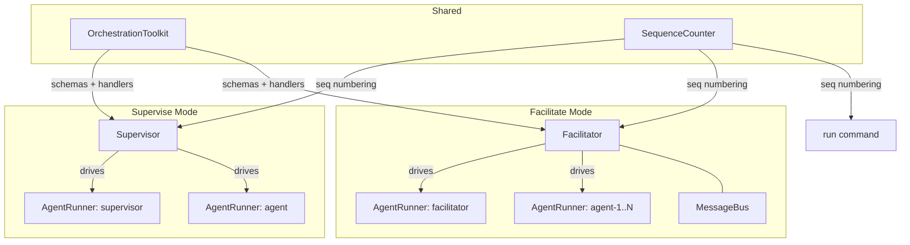
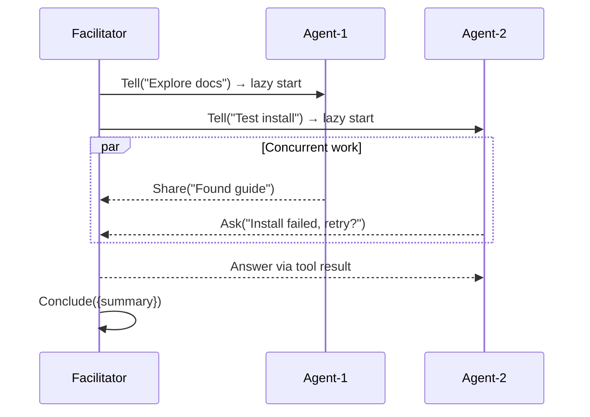

# 440 — Design: Tool-Based Orchestration and Facilitated Group Work

## Component Map



Three new components. Two changed: `Supervisor` (architectural — tool-based
signaling replaces regex) and `TraceCollector` (mechanical — `turn` field
rename to `seq` in envelope unwrapping, no structural change).

## OrchestrationToolkit

Tool schemas, per-role tool sets, and handler factories wired to an
orchestrator context object.

| Tool | Input | Handler behaviour |
|------|-------|-------------------|
| `Conclude` | `{ summary }` | Sets `ctx.concluded`, records summary |
| `Redirect` | `{ message, to? }` | Queues redirect in ctx, returns ack |
| `Ask` | `{ question }` | Returns a Promise resolved by orchestrator |
| `RollCall` | `{}` | Returns `[{ name, role }]` from ctx |
| `Share` | `{ message }` | Posts to `ctx.messageBus`, returns ack |
| `Tell` | `{ message, to }` | Posts direct to `ctx.messageBus`, returns ack |

**Per-role sets:** Supervisor gets Conclude + Redirect. Supervised agent gets
Ask. Facilitator gets all six. Facilitated agent gets Ask + RollCall + Share +
Tell.

Handlers communicate via shared context (flags, queues, Promises). The
orchestrator reads context at natural checkpoints — batch boundaries, end of
turn, tool completion. **Decision: context object over EventEmitter.** The
orchestrator already has checkpoints; events would add indirection without
reducing complexity.

Each participant gets a per-session MCP server (stdio transport, in-process)
exposing its role-appropriate tools. `AgentRunner` passes server config via the
SDK's `mcpServers` option. **Decision: per-participant MCP server, not shared.**
Tool sets vary by role; isolated servers are simpler to test.

## Supervisor Changes

**Removed:** `isComplete()`, `isIntervention()`, `completeSignalSeen`,
`interventionSignalSeen`, text scanning in `emitLine()`, magic-string prompt
instructions.

**Signaling flows:**

- **Conclude:** Supervisor calls tool. Handler sets `ctx.concluded`. Orchestrator
  checks flag after each supervisor turn and terminates.
- **Redirect:** Supervisor calls tool. Handler queues redirect. Orchestrator
  aborts agent SDK session, resumes with redirect message — same abort/resume
  mechanics as today, triggered by handler instead of regex.
- **Ask:** Agent calls tool. Handler returns a Promise (SDK blocks at tool call).
  Orchestrator runs supervisor with the question. Supervisor responds.
  Orchestrator resolves Promise. Agent receives answer as tool result.

`onBatch` still fires at batch boundaries. Mid-turn prompt changes to "review
the batch; use your tools if action is needed." System prompts describe tools,
not text conventions.

## Facilitator

New class for multi-agent concurrent orchestration.



**Agent outer loop** (managed by Facilitator, per agent):

1. `waitForMessages()` — block until first message (lazy start)
2. `runner.run(messages)` — start SDK session
3. On session end, `messageBus.drain()` — check pending messages
4. If messages, `runner.resume(messages)` — repeat until concluded or error

All loops run concurrently (`Promise.all`). Fail-fast: any rejection aborts all.

**Facilitator event loop** — LLM turn only when input arrives: `Ask` from agent
(serialized FIFO), lifecycle events, or accumulated shared messages. No idle
loop, no polling.

**Decision: separate class, not Supervisor variant.** Sequential relay vs.
concurrent async messaging share no structural logic. Alternative rejected:
extend Supervisor — the relay loop doesn't generalize.

## MessageBus

In-memory per-participant message queues for facilitate mode.

| Method | Behaviour |
|--------|-----------|
| `share(from, message)` | Copy to every other participant's queue |
| `tell(from, to, message)` | Copy to one participant's queue |
| `drain(participant)` | Return and clear pending messages |
| `waitForMessages(participant)` | Resolve when at least one arrives |

Messages: `{ from, text, direct: boolean }`. Facilitator sees shared messages
but not agent-to-agent directs.

**Decision: single bus, not per-pair channels.** Facilitator needs passive
shared-traffic visibility. Alternative rejected: per-pair channels miss
broadcast semantics.

## Unified Trace Envelope

All three modes wrap every event in `{ source, seq, event }`:

- `source` — participant name (`"agent"` in run mode)
- `seq` — global monotonic integer from a shared `SequenceCounter`
- `event` — raw SDK event payload

Replaces `{ source, turn, event }` in supervise mode and bare events in run
mode. `TraceCollector.addLine` unwraps `seq` instead of `turn`; its structured
`turns` array is unchanged (LLM conversation structure, not trace envelope).

**Decision: global counter, not per-participant counters.** Total ordering
without synchronization. Alternative rejected: per-participant counters
requiring merge sort — unnecessary given JS single-threaded execution.

## Public API

**New factory signatures:**

```js
createFacilitator({ facilitatorRunner, agents, messageBus, output, maxTurns })
// agents: [{ name, role, runner: AgentRunner }]
// returns Facilitator with run(task) → Promise<{ success, turns }>

createMessageBus({ participants })
// participants: string[] (names)
// returns MessageBus with share/tell/drain/waitForMessages
```

**New exports:** `Facilitator`, `createFacilitator`, `MessageBus`,
`createMessageBus`, orchestration tool schemas.
**Removed exports:** `isComplete`, `isIntervention`.
**CLI:** `fit-eval facilitate` — task, facilitator config, N agent configs.
