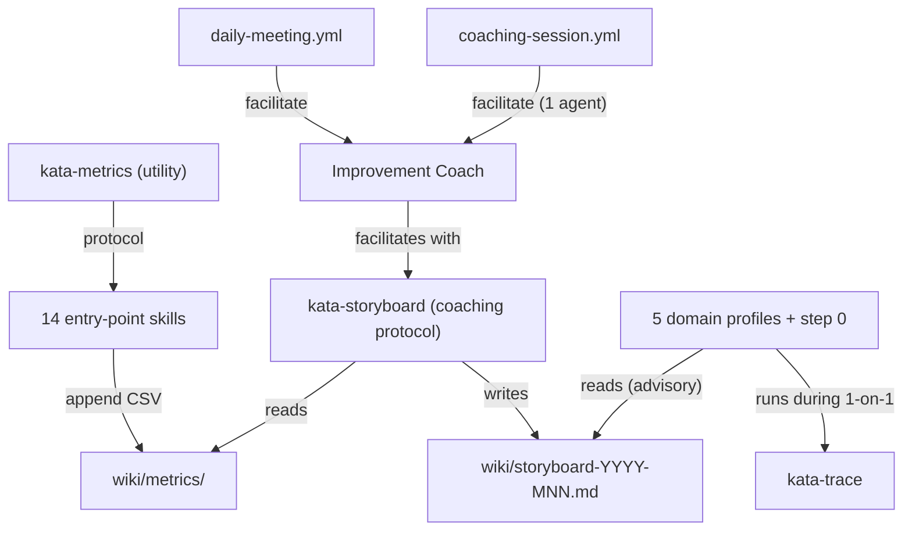

# Design 460 — Kata Coaching System

## Overview

Four interconnected components: a metrics recording protocol (utility skill), a
coaching protocol reused for team meetings and 1-on-1 sessions (entry-point
skill), a reframing of trace analysis as learner-driven, and holistic
integration across 14 entry-point skills and 6 agent profiles.

## Component Map



## Component 1: Metrics Infrastructure (kata-metrics)

Utility skill like kata-gh-cli — no agent routes to it directly. Defines the CSV
protocol that all 14 entry-point skills follow when recording data.

### CSV Schema

Long format, one row per data point. Six fields:

| Field  | Type   | Example                          |
| ------ | ------ | -------------------------------- |
| date   | ISO    | `2026-04-14`                     |
| metric | string | `open_vulnerabilities`           |
| value  | number | `3`                              |
| unit   | string | `count`, `days`, `minutes`       |
| run    | string | GitHub Actions run URL           |
| note   | string | Anomaly annotation (empty if ok) |

**Decision: long format vs. wide format (columns per metric).** Long chosen —
new metrics need no schema migration, each row is self-describing, append-only
preserved. Wide rejected: new column headers break append-only writes.

**Decision: CSV vs. JSONL vs. YAML.** CSV chosen — trivial append via `echo >>`,
grep/awk work without parsers, tabular format maps to XmR charts. JSONL
rejected: needs serialization. YAML rejected: fragile append semantics.

### Storage

```
wiki/metrics/{agent}/{domain}/{YYYY}.csv
```

Partitioned by year to bound file size. `{agent}` matches profile name,
`{domain}` matches skill domain slug (e.g. `audit`, `triage`). First line of
each file is the header row — agents create header on first write.

### Skill References

- `references/csv-schema.md` — field definitions, appending rules, header
  creation
- `references/control-charts.md` — XmR chart construction, natural process
  limits, signal vs. noise

## Component 2: Coaching Protocol (kata-storyboard)

Entry-point skill used by the improvement coach in two contexts:

- **Team meeting** — coach facilitates, 5 domain agents participate, scope is
  the team storyboard
- **1-on-1 coaching** — coach facilitates, 1 domain agent participates and
  analyzes its own trace via `kata-trace`

Same five coaching kata questions in both contexts. The skill defines the
storyboard artifact, the five-question protocol, and context-specific guidance.

### Storyboard Artifact

Monthly file at `wiki/storyboard-YYYY-MNN.md` with five sections mapping to the
five coaching kata questions: **Challenge** (long-term direction), **Target
Condition** (measurable state by month end), **Current Condition** (numbers from
metrics CSVs, updated daily), **Obstacles** (discovered through experiments,
tracks which is current), **Experiments** (PDSA cycles with expected/actual
outcomes). Full template at `references/storyboard-template.md`.

### Meeting Protocol

Two modes (planning and review) for team meetings, plus 1-on-1 coaching mode.
Protocol is read-do for preparation, do-confirm for conclusion.

**Decision: single skill for both team and 1-on-1 vs. separate skills.** Single
skill chosen — the five-question protocol is identical; only scope differs (team
storyboard vs. individual trace). Separate skills would duplicate the protocol
and risk divergence.

## Component 3: Coach/Learner Role Alignment

The improvement coach becomes a pure coaching role. Domain agents become
learners who analyze their own work.

### Improvement Coach Profile

Restructured `improvement-coach.md`:

- **Skills:** `kata-storyboard`, `kata-metrics`, `kata-spec`, `kata-review`,
  `kata-gh-cli`. Removes `kata-trace` — learners run it, not the coach.
- **Assess:** routes to coaching contexts — team storyboard meeting or 1-on-1
  coaching with a selected agent.
- **No separate facilitator profile** — the coach IS the facilitator.

**Decision: improvement coach as facilitator vs. separate facilitator profile.**
Coach chosen — Toyota Kata's coach role maps directly to the facilitator. The
coach holds no domain state to "report" as a participant; its job is to ask the
five questions. A separate profile would create a coordination-only role with no
Toyota Kata analogue. Rejected: separate profile — adds a 7th agent that
duplicates the coach's purpose.

### Domain Agent Profiles (5 profiles)

Each gains `kata-trace` in their skill list. During 1-on-1 coaching, the agent
runs kata-trace on its own trace — the agent does the analysis and writes
findings to its own memory. No memory routing needed.

**Decision: agents run kata-trace vs. coach runs and routes findings.** Agents
run it — Toyota Kata requires the learner to do the learning. Coach routing
rejected: inverts the learner/coach relationship and requires a memory routing
mechanism.

## Component 4: Skill Integration

Each of the 14 entry-point skills gains:

1. **`references/metrics.md`** — 3–5 domain-specific metric suggestions. Each
   entry: metric name (snake_case), unit, description, data source. Suggestions
   only — agents discover useful metrics through practice.

2. **Recording step** — one bullet added to "Memory: what to record":

   > **Metrics** — Record relevant measurements to
   > `wiki/metrics/{agent}/{domain}/` per the `kata-metrics` protocol

   Skills lacking a "Memory: what to record" section gain the full section.

## Component 5: Agent Profile Changes

### Assess Step 0 (5 domain profiles)

Each domain profile gains a step 0 before the existing numbered priority list:

> 0\. **Read the storyboard.** Check `wiki/storyboard-YYYY-MNN.md` for this
> month. If it exists, review the target condition and current obstacle. Weight
> priority assessment toward actions that advance the target condition. If no
> storyboard exists, proceed with your standard priority framework.

Advisory — urgency always overrides storyboard alignment.

## Component 6: Infrastructure

### kata-action Facilitate Mode

The spec deferred this decision: "design will determine whether it needs
changes." It does — both workflows require facilitate mode, and kata-action must
support it to preserve trace capture and git identity.

**Decision: extend kata-action vs. direct fit-eval in workflow YAML.** Extend
chosen — kata-action handles trace, identity, and bootstrap; all workflows share
it. Rejected: direct fit-eval — loses trace capture and identity setup.

Interface: `facilitator-profile` input (profile name) and `agents` input
(comma-separated config matching fit-eval `--agents`). Trace split per
participant like supervise mode.

### Workflows

**`daily-meeting.yml`** — scheduled 03:00 UTC daily, facilitate mode.
Improvement coach as facilitator, five domain agents as participants. Same
GitHub App token, bootstrap, and artifact infrastructure. 30-minute timeout.

**`coaching-session.yml`** — `workflow_dispatch` only, agent name as input.
Facilitate mode with improvement coach as facilitator and the selected agent as
sole participant. Triggered by the coach's regular `run`-mode workflow after
selecting which agent to coach.

### Documentation

- **KATA.md** — both workflows in table, Metrics section, coaching protocol
- **MEMORY.md** — entries for `wiki/metrics/` and `wiki/storyboard-YYYY-MNN.md`

## What Does NOT Change

- Existing domain agent schedules (04–11 UTC)
- fit-eval CLI (facilitate implemented in spec 440)
- kata-trace content (grounded theory, invariants, reports — only who runs it)
- Individual agent autonomy (storyboard is advisory, urgency overrides)
- Utility/leaf skills (kata-review, kata-ship, kata-gh-cli — no metrics)
- Wiki summary and weekly log conventions
- Trust boundary (product manager sole external merge point)
