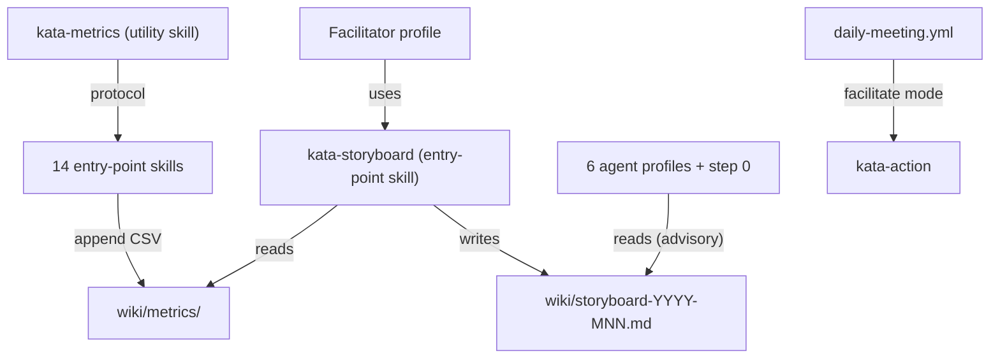

# Design 460 — Kata Storyboard and Metrics

## Overview

Three interconnected components: a metrics recording protocol (utility skill), a
storyboard meeting protocol (entry-point skill), and holistic integration across
14 entry-point skills and 6 agent profiles. The kata-action composite action
gains facilitate mode support to enable the daily meeting workflow.

## Component Map



## Component 1: Metrics Infrastructure (kata-metrics)

Utility skill like kata-gh-cli — no agent routes to it directly. Defines the CSV
protocol that all 14 entry-point skills follow when recording data.

### CSV Schema

Long format, one row per data point. Six fields:

| Field  | Type   | Example                          |
| ------ | ------ | -------------------------------- |
| date   | ISO    | `2026-04-14`                     |
| metric | string | `open_vulnerabilities`           |
| value  | number | `3`                              |
| unit   | string | `count`, `days`, `minutes`       |
| run    | string | GitHub Actions run URL           |
| note   | string | Anomaly annotation (empty if ok) |

**Decision: long format vs. wide format (columns per metric).** Long chosen —
new metrics require no schema migration, each row is self-describing, and
append-only semantics are preserved. Wide format rejected: adding a metric
requires a new column header, breaking append-only writes.

**Decision: CSV vs. JSONL vs. YAML.** CSV chosen — trivial append via `echo >>`,
grep/awk work without parsers, tabular format maps to XmR charts. JSONL
rejected: needs serialization. YAML rejected: fragile append semantics.

### Storage

```
wiki/metrics/{agent}/{domain}/{YYYY}.csv
```

Partitioned by year to bound file size. `{agent}` matches profile name,
`{domain}` matches skill domain slug (e.g. `audit`, `triage`). First line of
each file is the header row — agents create header on first write.

### Skill References

- `references/csv-schema.md` — field definitions, appending rules, header
  creation
- `references/control-charts.md` — XmR chart construction, natural process
  limits, signal vs. noise

## Component 2: Storyboard Meeting (kata-storyboard)

Entry-point skill referenced by the facilitator profile. Defines the Toyota Kata
Storyboard protocol.

### Storyboard Artifact

Monthly file at `wiki/storyboard-YYYY-MNN.md` with five sections mapping to the
five coaching kata questions: **Challenge** (long-term direction), **Target
Condition** (measurable state by month end), **Current Condition** (numbers from
metrics CSVs, updated daily), **Obstacles** (discovered through experiments,
tracks which is current), **Experiments** (PDSA cycles with expected/actual
outcomes). Full template at `references/storyboard-template.md`.

### Meeting Protocol

Two modes (planning and review) structured around the five coaching kata
questions. Protocol is read-do for preparation, do-confirm for conclusion.

**Decision: protocol in skill file vs. inline in facilitator profile.** Skill
chosen — reusable for future 1-on-1 coaching, keeps profile to ~60 lines, and
follows the pattern where agents reference skills for procedures. Rejected:
inline in profile — exceeds 200-line profile limit, prevents reuse.

### Facilitator Profile

`daily-meeting-facilitator.md` — skills: `kata-storyboard`, `kata-gh-cli`. No
Assess section (coordination role, not domain). No Memory section (storyboard is
the artifact). Constraints: 30-minute timeout, no code changes, no domain
decisions.

**Decision: separate profile vs. shared with mode flag.** Separate chosen —
clean role separation, no conditional logic, matches one-workflow-one-profile.
Rejected: mode flag — risks facilitator drifting into domain work.

## Component 3: Skill Integration

Each of the 14 entry-point skills gains:

1. **`references/metrics.md`** — 3–5 domain-specific metric suggestions. Each
   entry: metric name (snake_case), unit, description, data source (which
   command or check produces the number). Suggestions only — agents discover
   useful metrics through practice.

2. **Recording step** — one bullet added to "Memory: what to record":

   > **Metrics** — Record relevant measurements to
   > `wiki/metrics/{agent}/{domain}/` per the `kata-metrics` protocol

   Skills lacking a "Memory: what to record" section gain the full section.

## Component 4: Agent Profile Changes

### Assess Step 0 (6 profiles)

Each profile gains a step 0 before the existing numbered priority list:

> 0\. **Read the storyboard.** Check `wiki/storyboard-YYYY-MNN.md` for this
> month. If it exists, review the target condition and current obstacle. Weight
> priority assessment toward actions that advance the target condition. If no
> storyboard exists, proceed with your standard priority framework.

Advisory — urgency always overrides storyboard alignment.

### Improvement Coach Addition

`improvement-coach.md` gains `kata-metrics` in its skill list. The coach reads
metrics across all agents when assessing whether experiments produce measurable
improvement — cross-agent analysis beyond individual skill recording.

## Component 5: Infrastructure

### kata-action Facilitate Mode

The spec deferred this decision: "design will determine whether it needs
changes." It does — the daily meeting workflow requires facilitate mode, and
kata-action must support it to preserve trace capture and git identity setup.

**Decision: extend kata-action vs. separate action vs. direct fit-eval in
workflow YAML.** Extend chosen — kata-action handles trace capture, git
identity, and bootstrap; all workflows share it. Rejected: separate action —
duplicates logic. Rejected: direct fit-eval — loses trace and identity
infrastructure.

Interface: `facilitator-profile` input (profile name) and `agents` input
(comma-separated config matching fit-eval `--agents`). Trace split per
participant like supervise mode.

### Daily Meeting Workflow

`daily-meeting.yml` — scheduled 03:00 UTC daily, facilitate mode, all six agents
as participants, daily-meeting-facilitator as orchestrator. Same GitHub App
token, bootstrap, and artifact infrastructure as other kata workflows. 30-minute
timeout with concurrency group.

### Documentation

- **KATA.md** — daily-meeting in Workflows table, new Metrics section, five-
  question protocol reference
- **MEMORY.md** — entries for `wiki/metrics/` and `wiki/storyboard-YYYY-MNN.md`

## What Does NOT Change

- Existing agent schedules (04–11 UTC)
- fit-eval CLI (facilitate implemented in spec 440)
- Individual agent autonomy (storyboard is advisory, urgency overrides)
- Utility/leaf skills (kata-review, kata-ship, kata-gh-cli — no metrics)
- Wiki summary and weekly log conventions
- Trust boundary (product manager sole external merge point)
