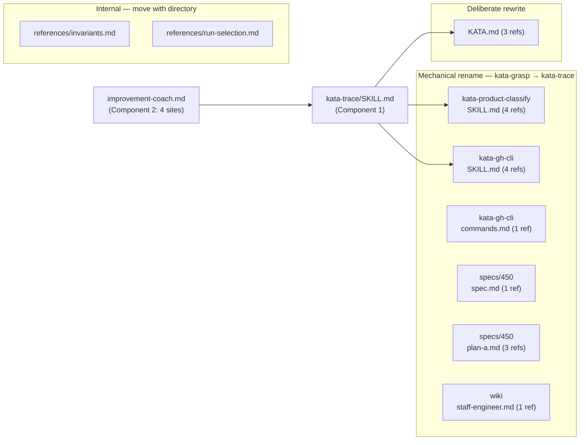

# Design 470 — Reframe kata-grasp as kata-trace

## Overview

A skill rename with reframed description text. Three components change: the
skill itself (directory, frontmatter, title, opening paragraph), the
improvement-coach agent profile (skill list and all routing/jargon references),
and 7 other external files that reference the skill by name. No interfaces, data
flow, or architecture change — the design's value is in the naming and
description decisions.

## Component 1: Skill Identity

### Directory

`.claude/skills/kata-grasp/` becomes `.claude/skills/kata-trace/`. All contents
move as-is — `SKILL.md`, `references/`, `scripts/`.

### Frontmatter

```yaml
---
name: kata-trace
description: >
  Go and see the work agents did by analyzing their execution traces. Select a
  workflow run, download its trace artifact, observe every turn via grounded
  theory, and produce a structured findings report with instruction-layer
  attribution.
---
```

**Decision: lead with "Go and see" vs. "Download and analyze" vs. keep "Grasp
the current condition."** "Go and see the work agents did" was chosen because:

- It is concrete and action-oriented — the agent knows to look at actual work.
- "by analyzing their execution traces" immediately names the object and method.
- It echoes the gemba ("go and see") philosophy without reintroducing the
  retired `gemba-*` naming convention (spec 340 consolidated those into
  `kata-*`).
- Rejected: "Grasp the current condition" — pattern-matched to general
  assessment by the LLM in run 24418764670.
- Rejected: "Download and analyze" as lead — technically correct but misses the
  intent (observation of actual work, not just data processing).

**Decision: name `kata-trace` vs. `kata-analyze-trace` vs. `kata-study`.**
`kata-trace` was chosen because:

- It is short and parallel to other kata skill names (`kata-spec`, `kata-plan`,
  `kata-ship`, `kata-review`).
- "trace" names the primary object, and the skill's only purpose is to operate
  on traces.
- Rejected: `kata-analyze-trace` — too verbose, breaks naming pattern.
- Rejected: `kata-study` — still abstract; "study" could mean studying code,
  docs, or specs, not specifically traces.

### Title and Opening Paragraph

```markdown
# Agent Trace Analysis

Go and see the work agents did by analyzing their execution traces. Select one
workflow run, download its trace, study every turn via grounded theory, categorize
findings, and act on what you find. Depth over breadth. This skill operates
within the Kata system defined in [KATA.md](../../../KATA.md), whose five-layer
instruction model (§ Instruction layering) and checklist design principles
([CHECKLISTS.md](../../../CHECKLISTS.md)) govern how findings translate into
system improvements.
```

The Toyota Kata connection ("step 2 of the improvement kata") moves out of the
frontmatter description and can remain as context later in the document — but
not in the title or first sentence that drives skill routing.

## Component 2: Agent Profile Routing

`improvement-coach.md` has four change sites — all must be updated to eliminate
the "grasp" jargon that the spec identifies as the root cause:

1. **Skills frontmatter** (line 9): `- kata-grasp` becomes `- kata-trace`.
   Mechanical rename — controls which skill the agent can invoke.

2. **Opening directive** (line 15): "Grasp the current condition of agent
   workflow runs" becomes "Go and see the work done by agent workflow runs."
   Deliberate reword — this is the agent's identity statement and must match the
   reframed skill language.

3. **Assess item 1** (lines 30-31): "Grasp the current condition (`kata-grasp`)"
   becomes "Go and see the work agents did by analyzing their traces
   (`kata-trace`)." Deliberate reword — this is the primary routing instruction.

4. **Assess item 2** (line 33): "Unaddressed findings from prior grasps?"
   becomes "Unaddressed findings from prior trace analyses?" Deliberate reword —
   removes the last "grasp" jargon from the profile.

**Decision: rewrite all four sites vs. just swap the skill name in the
frontmatter.** All four sites change because the spec identified that "Grasp the
current condition (`kata-grasp`)" reinforced the abstract interpretation.
Swapping only the frontmatter reference while keeping "Grasp" in the routing
text and identity statement would leave the same jargon anchor. The new phrasing
uses "go and see" and "trace analysis" consistently.

## Component 3: Cross-References

Seven remaining external files contain `kata-grasp` references
(`improvement- coach.md` is fully handled by Component 2). Most are mechanical
find-and-replace of `kata-grasp` with `kata-trace`, with two exceptions in
`KATA.md`:



**Exception 1: `KATA.md` line 117.** The skill table entry currently reads
`kata-grasp — grasp the current condition via trace observation and grounded theory`.
This becomes
`kata-trace — go and see the work agents did via trace analysis and grounded theory`.
Not a pure find-and-replace — the description clause also changes.

**Exception 2: `KATA.md` lines 197-201.** The accountability section references
`kata-grasp` by name and its directory path for `invariants.md`. Both the name
and the path update to `kata-trace`.

All other cross-reference files are pure `kata-grasp` → `kata-trace` string
replacement with no surrounding text changes needed.

## What Does NOT Change

- Grounded theory methodology (open/axial/selective coding, memos, paradigm
  model)
- Invariant definitions and audit procedure
- Scripts (`find-runs.sh`, `trace-queries.sh`)
- Reference content (`invariants.md`, `examples.md`, `report-template.md`,
  `run-selection.md`)
- Checklists (read-do and do-confirm)
- Any other agent profile or workflow
