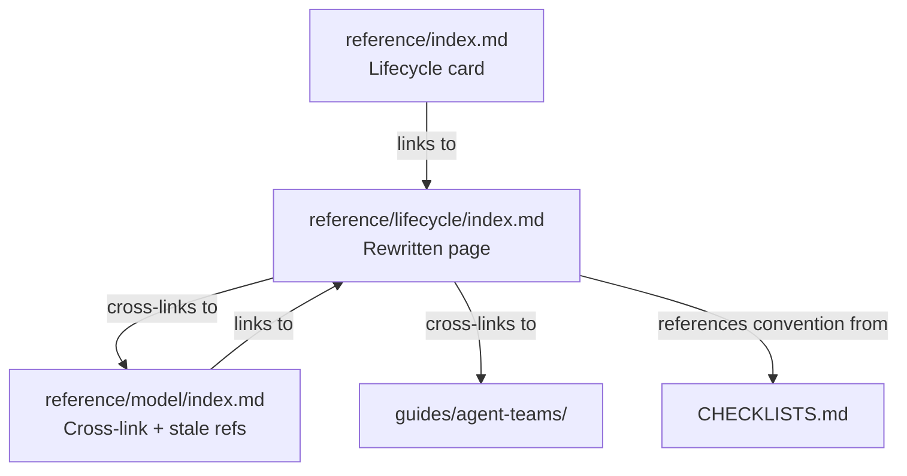

# Design 480: Rewrite Reference Lifecycle Page

## Problem Restated

The Reference Lifecycle page (`website/docs/reference/lifecycle/index.md`)
describes six lifecycle stages as data-driven YAML entities — `stages.yaml`,
`stages.schema.json`, `--stage` CLI flag, stage x skill matrix checklists, and
per-stage agent generation. Spec 420 removed stages as entities. Checklists are
now flat per-skill fields (`agent.readChecklist`, `agent.confirmChecklist`).
Agents are one per discipline x track, not per stage. The page misleads users
into looking for entities and CLI options that no longer exist.

## Decision: Reframe, Don't Remove

**Chosen: Option A — Reframe as conceptual workflow reference.** The six
lifecycle phases (specify, plan, scaffold, code, review, deploy) still describe
a useful mental model for how engineering work flows. The phases have value as
vocabulary for handoffs, constraints, and workflow discipline — they just no
longer back YAML entities.

**Rejected: Option B — Remove the page entirely.** The lifecycle concept has
real pedagogical value. Removing it loses the "how does work flow?" reference
that users (especially leadership) consult. The Reference index would shrink to
three cards (CLI, Core Model, YAML Schema), and cross-links from Core Model and
guides would break or need removal.

## Components

Three files change. No new files or components are introduced.

### 1. Lifecycle Page — `website/docs/reference/lifecycle/index.md`

Full rewrite. The page becomes a conceptual workflow reference: it names the six
lifecycle phases, describes when each applies, and explains how handoffs,
constraints, and checklists guide transitions. No entity semantics — the phases
are vocabulary for workflow discipline, not YAML-backed definitions.

The page exposes: phase definitions with purpose, a phase-flow diagram, handoff
triggers between phases, per-phase constraint boundaries, and the read-do /
do-confirm checklist protocol as it works post-420 (flat per-skill fields, not
stage x skill matrix derivation). The agent section describes the one-agent-per-
discipline-x-track model with phases guiding workflow focus.

### 2. Reference Index — `website/docs/reference/index.md`

Update the Lifecycle card description. Replace "lifecycle stages" entity language
with "workflow phases" guidance language.

### 3. Core Model — `website/docs/reference/model/index.md`

Update the cross-link at the bottom from "Stages, handoffs, and checklists" to
phase-based language matching the rewritten page.

Additionally fix two stale stage references in the same file (lines 100 and
289) that describe deleted entities. See Key Decision "Fix stale references in
scoped files" below for rationale.

## Interfaces

No new interfaces. The existing link graph is preserved with updated
descriptions. No links are added or removed.

## Data Flow

No runtime data flow changes. This is a documentation-only rewrite. The
lifecycle page currently has no backing data source (stages.yaml was deleted);
the rewritten page similarly has no backing data source — it is pure conceptual
reference content.

## Key Decisions

### Preserve handoff and constraint tables

**Chosen: Keep per-phase handoff and constraint tables.** These tables describe
workflow discipline (what triggers transitions, what each phase cannot do) and
are referenced by leadership and agents. They are useful as conceptual guidance
even without entity backing.

**Rejected: Remove handoff/constraint tables.** Deleting them loses actionable
workflow guidance. The tables are small, accurate as phase descriptions, and
cost nothing to maintain since they reference concepts, not code.

### Simplify checklist section

**Chosen: Replace derivation formula with flat-field explanation.** The current
section describes `Stage x Skill Matrix x Capability` derivation that no longer
exists. The replacement explains that checklists are authored per-skill as
`agent.readChecklist` and `agent.confirmChecklist`, following the `read_do` /
`do_confirm` protocol from CHECKLISTS.md.

**Rejected: Remove checklist section entirely.** Checklists are a core workflow
concept — removing them from the lifecycle page leaves users without a reference
for how checklists connect to phases. The section just needs updating, not
removal.

### Keep and relabel the phase-flow Mermaid diagram

**Chosen: Keep the existing six-node flowchart, relabel from "stages" to
"phases."** The diagram's structure (linear flow with review-to-code backtrack)
is accurate for phases. Removing and redrawing would produce the same topology.

**Rejected: Remove all Mermaid diagrams per spec Option A bullet 4.** The spec
says "remove mermaid diagrams showing stage-specific agent handoffs" — plural,
referring to the multi-agent handoff diagram (lines 158-173 of the current
page). The phase-flow diagram (lines 16-23) shows workflow topology, not agent
handoffs. Keeping it is consistent with the spec's intent; the multi-agent
diagram is removed as specified.

### Fix stale references in scoped files

**Chosen: Fix lines 100 and 289 of `model/index.md` alongside the cross-link
update.** Both lines describe deleted entities ("Stage handoff items", "Stage-
specific agent instructions") in a file already scoped for editing. Leaving them
creates a contradiction between the updated cross-link and stale body text in
the same page.

**Rejected: Limit changes to the cross-link only.** The spec scopes
`model/index.md` for cross-link updates. Touching only the cross-link while
stale stage language remains two scrolls away invites user confusion. The fixes
are minimal text changes in an already-scoped file, not a scope expansion into
new files.

### Replace multi-agent stage diagram with single-agent model

**Chosen: Describe the one-agent-per-track model.** Post-420, agents are
generated per discipline x track. Lifecycle phases guide an agent's workflow
focus (what to prioritize at each phase), not agent identity (which agent
handles which phase).

**Rejected: Keep the multi-agent handoff diagram with caveats.** Adding "this
is conceptual, not how it actually works" caveats to a reference page
undermines trust. Better to describe the actual model clearly.

## Scope Boundary

- **In scope:** `lifecycle/index.md` rewrite, `reference/index.md` card update,
  `model/index.md` cross-link and stale stage references.
- **Out of scope:** Other pages referencing lifecycle/stages (authoring-frameworks
  guide, pathway internals, map overview, pathway overview). Those are separate
  documentation updates.
