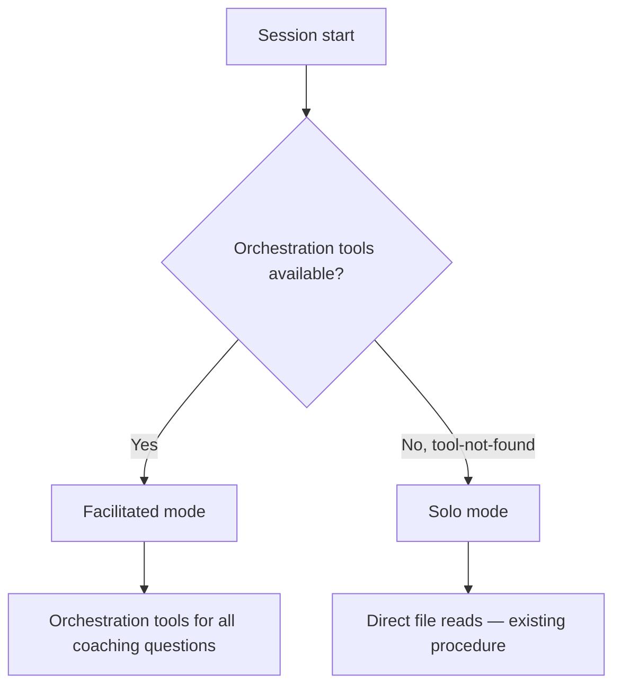
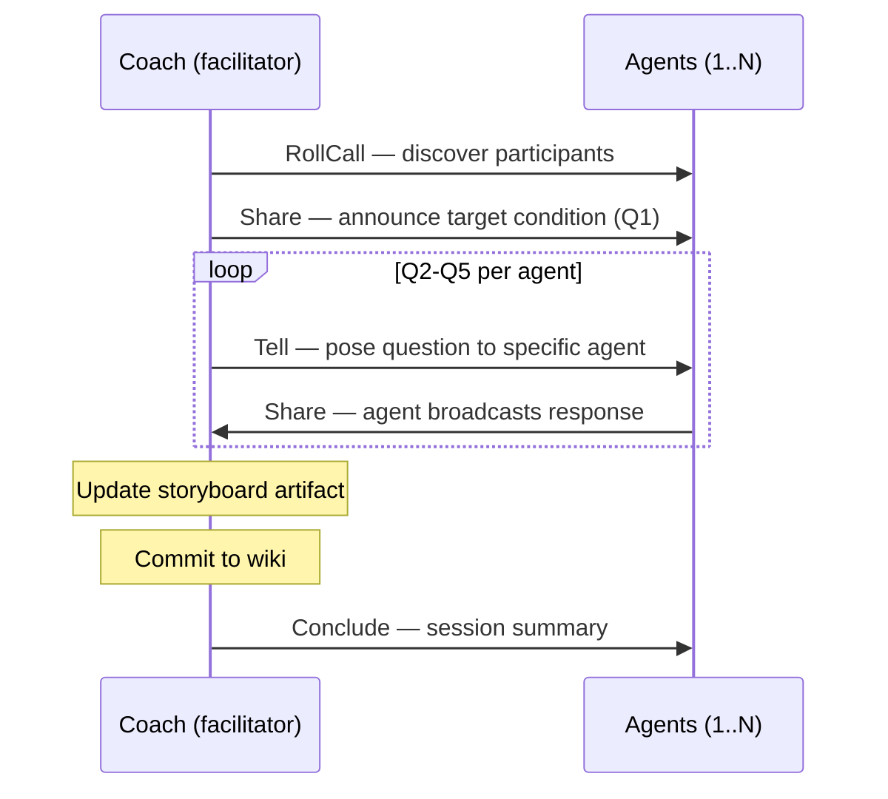

# Design 490 — Improvement Coach as Pure Facilitator

## Problem (restated)

The kata-storyboard skill's process steps are all facilitator self-actions. The
skill (layer 4) never references orchestration tools, so the agent follows its
solo procedure and never wakes participant agents via the message bus.
Compounding this, the system prompt constants (layer 1) use imperative phrasing
("Use Tell to...") that overlaps with the procedural role layer 4 should own.

A structural conflict reinforces the layering gap: the coach's agent profile
contains an Assess section — a solo decision tree for the standalone
`improvement-coach.yml` workflow — that loads in every context, including
facilitated meetings where the task already specifies the action. The standalone
workflow and Assess section must be removed to align the profile with the
coach's pure facilitator identity.

## Components

Six change sites: two skill files, one code constant pair, one agent profile,
one workflow deletion, one documentation file.

### SKILL.md — Session lifecycle and context detection

The Process section gains:

1. **Context detection** — determine facilitated vs. solo mode at session start.
2. **Orchestration-aware steps** — steps 2-3 become facilitation actions in
   facilitated mode.

### coaching-protocol.md — Per-question facilitation mechanics

Each of the five questions gains: which tool the coach uses to pose it, how
agents respond (Share), and how the coach integrates responses before advancing.

### facilitator.js — System prompt constants

`FACILITATOR_SYSTEM_PROMPT` and `FACILITATED_AGENT_SYSTEM_PROMPT` are refactored
from imperative to descriptive semantics. Layer 1 becomes purely descriptive —
what each tool is — so layer 4 can own procedural instructions without overlap.

## Architecture

### Context Detection

The skill probes for facilitated mode by calling RollCall. If the orchestration
MCP server is not wired, the call fails with tool-not-found — the skill falls
back to solo mode. If RollCall succeeds, the coach must use Tell, Share, and
Conclude for all participant interaction.

**Rejected: separate process sections** for facilitated and solo. Doubles
maintenance surface and creates divergence risk.

**Rejected: environment variable or config flag.** Couples the skill to
infrastructure details and violates instruction layering.

### Session Lifecycle (Facilitated Mode)

The coach owns the storyboard artifact (read, write, commit) and session
lifecycle (RollCall, Conclude). Domain data flows from agents — the coach must
not read agent wiki files or metrics CSVs directly in facilitated mode.

In 1-on-1 coaching, the same mechanism applies with a single participant.

### Question Delivery and Response Pattern

| Question              | Coach tool              | Agent response      | Rationale                             |
| --------------------- | ----------------------- | ------------------- | ------------------------------------- |
| Q1: Target condition  | Share                   | — (context-setting) | All agents hear the same direction    |
| Q2: Current condition | Tell (per agent)        | Share               | Each agent reports own domain metrics |
| Q3: Obstacles         | Tell (per agent)        | Share               | Obstacles are domain-specific         |
| Q4: Next step         | Tell (obstacle owner)   | Share               | Experiment ownership is individual    |
| Q5: When can we see   | Tell (experiment owner) | Share               | Timeline is per-experiment            |

Agents respond via Share so all participants see each response — cross-domain
awareness in team meetings.

**Rejected: all-Share delivery.** Coach cannot integrate Q2 before posing Q3.
**Rejected: all-Tell delivery.** Q1 broadcast beats N identical Tell calls.
**Rejected: Tell responses.** Loses cross-domain visibility.

### Redirect

Available but unmapped to any question — corrective, not questioning. The
protocol notes its availability without prescribing when.

### Solo Mode Fallback

When orchestration tools are unavailable, steps 2-3 fall back to direct file
reads (current behavior). Other steps are coach-owned and unchanged.

**Rejected: remove solo mode.** Breaks manual and development use cases.

### System Prompt Refactoring

Both constants shift from imperative to descriptive — each tool description
becomes a declarative statement ("Tell sends a direct message to one
participant") instead of a procedural instruction ("Use Tell to assign work").
Layer 4 then owns all imperative phrasing without overlap.

**Current (imperative, overlaps layer 4):** "Use Tell to assign work…", "Use
Share to broadcast…"

**Proposed (descriptive, no overlap):** "Tell sends a direct message…", "Share
broadcasts to all…"

**Rejected: leaving prompts unchanged.** Both layers would say "Use Tell to
[verb]," violating "no layer restates another's content."

### Checklist Changes

Read-do and do-confirm checklists gain orchestration-related verification
concerns: mode detection occurred (read-do), orchestration tools were used for
all coaching questions in facilitated mode, and Conclude was called
(do-confirm).

### Agent Profile — Pure Facilitator Identity

Delete `§ Assess` from `.claude/agents/improvement-coach.md`. The profile
retains: frontmatter, persona, Voice, Constraints, and Memory. Update the
description to reflect the pure facilitator role. Solo activities previously
routed through Assess are reassigned: coaching session scheduling becomes a
storyboard meeting outcome; acting on findings routes to domain agents or
staff-engineer. The skill's "When to Use" section references the two
facilitation contexts directly, removing the Assess coupling.

### Workflow Deletion and KATA.md

Delete `.github/workflows/improvement-coach.yml`. Update KATA.md: workflow count
from eight to seven, remove the standalone improvement-coach row from the
workflows table, remove the "all producers before the improvement coach"
scheduling constraint.

### Coaching Session Scheduling

The storyboard process gains a team-meeting-only outcome: evaluate whether a
participant would benefit from a 1-on-1 and trigger `coaching-session.yml` if
warranted. Skipped in 1-on-1 sessions.

**Rejected: always trigger after every meeting.** Coaching sessions are
expensive (30-min timeout, Opus). Only trigger when the meeting surfaces a clear
need.

**Rejected: schedule outside the meeting.** The meeting is where all agents'
conditions are visible.

## Key Decisions

| Decision            | Chosen                                 | Rejected                    | Why                                          |
| ------------------- | -------------------------------------- | --------------------------- | -------------------------------------------- |
| Context detection   | RollCall probe (tool-not-found = solo) | Separate sections; env var  | Intrinsic, no coupling                       |
| Question delivery   | Mixed Tell + Share                     | All Share; all Tell         | Q1 broadcast; Q2-Q5 directed                 |
| Agent responses     | Share (broadcast)                      | Tell (direct)               | Cross-domain visibility                      |
| System prompts      | Refactor to descriptive                | Leave unchanged             | Prevents layer 1/4 overlap                   |
| Mechanics location  | coaching-protocol.md                   | Inline in SKILL.md          | Protocol exists, missing mechanism           |
| Solo mode           | Preserved as fallback                  | Removed                     | Manual/dev use cases                         |
| Standalone workflow | Remove                                 | Keep with narrowed Assess   | Coach is a facilitator, not a solo actor     |
| Assess section      | Remove from profile                    | Keep for solo routing       | Pollutes facilitation contexts               |
| Coaching scheduling | Meeting outcome                        | Separate scheduled workflow | Meeting is where conditions are visible      |
| Acting on findings  | Route to domain agents                 | Coach implements            | Facilitator identity, separation of concerns |
