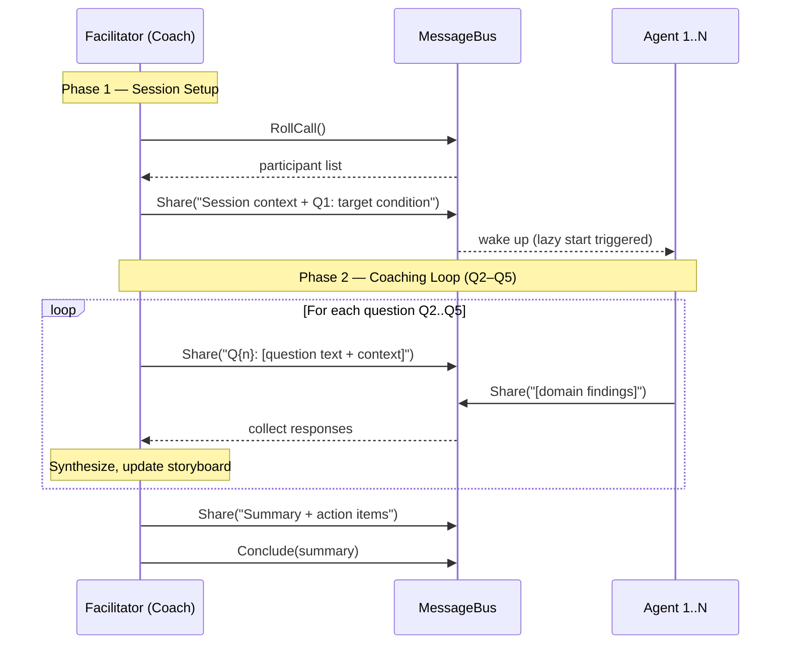
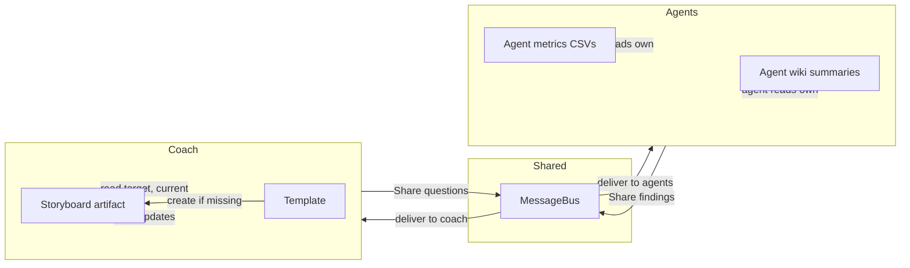

# Design 490 — Orchestration-Aware Storyboard Facilitation

## Problem Recap

The `kata-storyboard` skill defines a solo procedure. The orchestration tools
(RollCall, Tell, Share, Conclude) exist at the relay layer but the skill never
references them. Result: the coach performs every step alone, participant agents
never wake up. Fix is instruction-only — two markdown files change.

## Components

Two files, one interface contract:

| Component                         | Role                                      | Layer           |
| --------------------------------- | ----------------------------------------- | --------------- |
| `SKILL.md`                        | Process steps, checklists, mode detection | Skill (L4)      |
| `references/coaching-protocol.md` | Per-question facilitation mechanics       | Skill reference |
| `FACILITATOR_SYSTEM_PROMPT`       | Tool semantics (unchanged)                | System (L1)     |
| `FACILITATED_AGENT_SYSTEM_PROMPT` | Agent tool semantics (unchanged)          | System (L1)     |

**Interface contract:** The coach communicates with agents exclusively through
orchestration tools. Agents respond via Share (broadcast findings) or Tell
(direct to facilitator). The message bus is the only data channel — no direct
file reads of agent wiki summaries or metrics by the facilitator. All messages
are natural-language prompts (not structured JSON) — the same format agents use
in normal conversation.

## Architecture: Two-Phase Session

### Phase 1: Session Setup

The coach owns session lifecycle. Three steps execute before any coaching
question reaches participants:

1. **RollCall** — discover available agents, detect mode (team vs. 1-on-1)
2. **Read storyboard** — load/create storyboard artifact (coach-owned)
3. **Share** — broadcast session context (storyboard state, target condition)
   plus Q1 to all participants. This triggers lazy agent startup.

### Phase 2: Coaching Loop

For each question Q2 through Q5, the coach:

1. **Shares the question** with context from the storyboard
2. **Waits for agent responses** (agents Share their domain findings)
3. **Synthesizes responses** into the storyboard artifact
4. **Proceeds to next question**

Redirect is an error-handling tool, not part of the happy-path question flow. If
an agent's response is off-topic or misunderstands the question, the coach uses
Redirect to correct course before proceeding. It is not mapped to any specific
coaching question.

After Q5, the coach shares a summary and calls Conclude.

## Mode Detection via RollCall

The coach detects meeting mode from RollCall results, not from workflow config:

| RollCall result | Mode            | Behavior                              |
| --------------- | --------------- | ------------------------------------- |
| 2+ participants | Team meeting    | Share all questions to all agents     |
| 1 participant   | 1-on-1 coaching | Tell questions to single agent        |
| 0 participants  | Solo fallback   | Existing solo process preserved as-is |

**Decision:** Detect from RollCall, not from workflow YAML. **Rejected
alternative:** Hard-code mode in the skill based on workflow name. Why rejected:
the skill should work in any orchestration context without coupling to workflow
definitions. RollCall is the canonical runtime discovery mechanism.

## Question-to-Tool Mapping

Each coaching question specifies which tool delivers it and how agents respond:

| Question              | Coach sends via   | Agent responds via                | Coach action                   |
| --------------------- | ----------------- | --------------------------------- | ------------------------------ |
| Q1: Target condition  | Share (broadcast) | — (grounding, no response needed) | Read aloud from storyboard     |
| Q2: Actual condition  | Share (broadcast) | Share (domain metrics)            | Update Current Condition table |
| Q3: Obstacles         | Share (broadcast) | Share (identified obstacles)      | Update Obstacles list          |
| Q4: Next experiment   | Tell (per agent)  | Share (proposed experiment)       | Record in Experiments section  |
| Q5: When will we know | Share (broadcast) | Share (timeline)                  | Record feedback timing         |

**Decision:** Q4 uses Tell (directed) rather than Share (broadcast). **Rejected
alternative:** Share Q4 to all agents simultaneously. Why rejected: experiments
are per-agent and per-obstacle. Directing Q4 to the agent owning the current
obstacle produces focused proposals. Other agents overhear via the message bus
but are not prompted to respond to someone else's obstacle.

**Decision:** Q1 does not require agent responses. **Rejected alternative:**
Have agents confirm they understand the target. Why rejected: Q1 is a grounding
step — the facilitator reads the target from the storyboard. Requiring
acknowledgment adds round-trips without information gain. Agents receive the
context via Share and use it to inform Q2–Q5 responses.

## 1-on-1 Adaptation

Same question-to-tool mapping but all communication uses Tell (single
participant) instead of Share. Q1 still requires no response. The agent runs
`kata-trace` on its own trace when Q2 is posed — the coach does not run trace
analysis on the agent's behalf.

**Decision:** Agent runs its own trace analysis, not the coach. **Rejected
alternative:** Coach runs `kata-trace` and reports findings. Why rejected: the
coaching kata requires the learner to observe their own work. The agent must
analyze its own trace to internalize the findings.

## Checklist Additions

All checklist items live in `SKILL.md` (the skill owns checklists per KATA.md
instruction layering). The coaching protocol reference describes mechanics only.

### Read-do additions (SKILL.md)

- Verify orchestration tools are available (RollCall returns without error)
- For 1-on-1: confirm the single participant agent is in the RollCall list

### Do-confirm additions (SKILL.md)

- RollCall was called before first Share or Tell
- Every coaching question (Q2–Q5) was delivered via Share or Tell
- Agent responses received before the coach updated each storyboard section
- Conclude was called with a session summary
- No direct wiki reads replaced agent-reported data (coach reads storyboard and
  template only, not agent summaries or agent metrics CSVs)

## Data Flow

Key invariant: agents read their own wiki and metrics files. The coach reads
only the storyboard artifact (which it owns) and the template. Domain data flows
through the message bus, not through the coach reading agent files.

## Scope Boundary

Only `SKILL.md` and `references/coaching-protocol.md` change. The
FACILITATOR_SYSTEM_PROMPT, orchestration toolkit, workflow configs, and agent
profiles remain unchanged — they work correctly. The design adds no new
components, interfaces, or data structures. It restructures the instruction flow
within existing skill files to leverage existing infrastructure.
