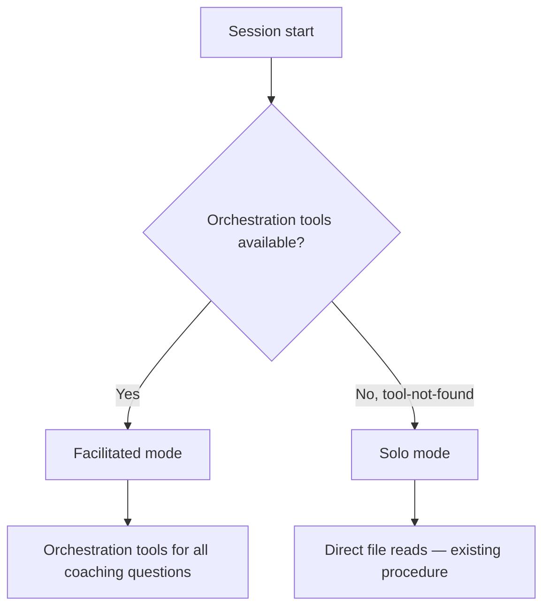
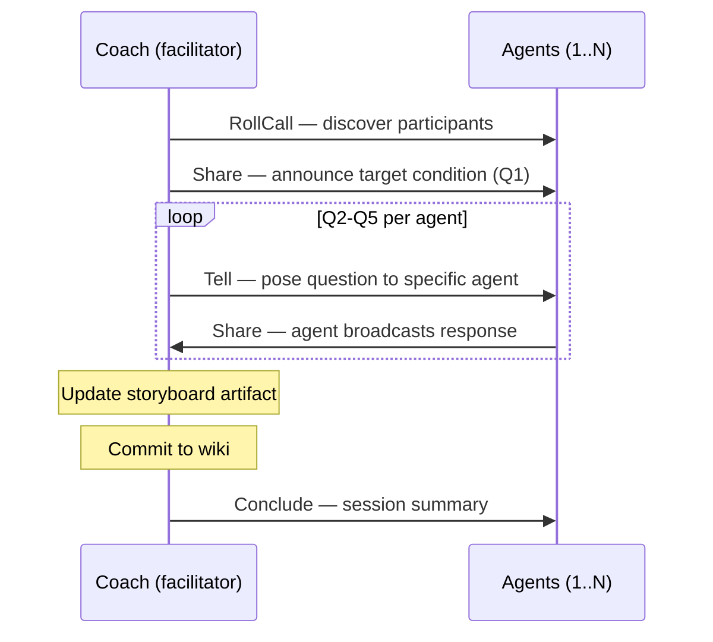

# Design 490 — Storyboard Facilitation Instructions

## Problem (restated)

The kata-storyboard skill's process steps are all facilitator self-actions. The
skill (layer 4) never references orchestration tools, so the agent follows its
solo procedure and never wakes participant agents via the message bus.
Compounding this, the system prompt constants (layer 1) use imperative phrasing
("Use Tell to...") that overlaps with the procedural role layer 4 should own.

## Components

Three change sites: two skill files, one code constant pair. No new files.

### SKILL.md — Session lifecycle and context detection

The Process section gains:

1. **Context detection** — determine facilitated vs. solo mode at session start.
2. **Orchestration-aware steps** — steps 2-3 become facilitation actions in
   facilitated mode.

### coaching-protocol.md — Per-question facilitation mechanics

Each of the five questions gains: which tool the coach uses to pose it, how
agents respond (Share), and how the coach integrates responses before advancing.

### facilitator.js — System prompt constants

`FACILITATOR_SYSTEM_PROMPT` and `FACILITATED_AGENT_SYSTEM_PROMPT` are refactored
from imperative to descriptive semantics. Layer 1 becomes purely descriptive —
what each tool is — so layer 4 can own procedural instructions without overlap.

## Architecture

### Context Detection



The skill probes for facilitated mode by calling RollCall. If the orchestration
MCP server is not wired, the call fails with tool-not-found — the skill falls
back to solo mode. If RollCall succeeds, the coach must use Tell, Share, and
Conclude for all participant interaction.

**Rejected: separate process sections** for facilitated and solo. Doubles
maintenance surface and creates divergence risk.

**Rejected: environment variable or config flag.** Couples the skill to
infrastructure details and violates instruction layering.

### Session Lifecycle (Facilitated Mode)



The coach owns the storyboard artifact (read, write, commit) and session
lifecycle (RollCall, Conclude). Domain data flows from agents — the coach must
not read agent wiki files or metrics CSVs directly in facilitated mode.

In 1-on-1 coaching, the same mechanism applies with a single participant.

### Question Delivery and Response Pattern

| Question | Coach tool | Agent response | Rationale |
|----------|-----------|----------------|-----------|
| Q1: Target condition | Share | — (context-setting) | All agents hear the same direction |
| Q2: Current condition | Tell (per agent) | Share | Each agent reports own domain metrics |
| Q3: Obstacles | Tell (per agent) | Share | Obstacles are domain-specific |
| Q4: Next step | Tell (obstacle owner) | Share | Experiment ownership is individual |
| Q5: When can we see | Tell (experiment owner) | Share | Timeline is per-experiment |

Agents respond via Share (broadcast) rather than Tell (direct to facilitator).
This lets the facilitator and other agents see each response, enabling
cross-domain awareness in team meetings. The facilitator's event-driven
architecture already supports this — agent Share messages arrive in the
facilitator's message queue and trigger a resume turn.

**Rejected: Share all questions simultaneously.** Agents respond out of order
and the coach cannot integrate Q2 answers before posing Q3.

**Rejected: Tell every question (no Share).** Q1 is context-setting —
broadcasting is more efficient than N identical Tell calls.

**Rejected: agents respond via Tell (direct to facilitator).** Loses
cross-domain visibility. In team meetings, agents benefit from hearing each
other's responses.

### Redirect — Corrective Intervention

Redirect is available to the coach but not mapped to any coaching question. It
interrupts an agent whose response drifts off-topic. The coaching protocol notes
its availability without prescribing when.

**Rejected: mapping Redirect to a specific question.** Redirect is corrective,
not questioning.

### Solo Mode Fallback

When orchestration tools are unavailable:

- **Steps 2-3:** Coach reads metrics CSVs and agent wiki files directly (current
  behavior preserved).
- **Steps 1, 4, 5:** Unchanged in both modes (coach-owned actions).

**Rejected: remove solo mode.** Breaks manual and development use cases.

### System Prompt Refactoring

Both constants shift from imperative to descriptive. Each tool description
becomes a declarative statement of what the tool does — no "use X to..." phrasing
remains at layer 1.

**Current layer 1 (imperative — overlaps layer 4):**

```
FACILITATOR:  "Use Tell to assign work to individual agents. Use Share to
               broadcast to all. Use Redirect to interrupt and correct agents."

AGENT:        "Use Share to broadcast findings. Use Tell to message a specific
               participant. Use Ask to ask the facilitator a question."
```

**Proposed layer 1 (descriptive — no overlap):**

```
FACILITATOR:  "Tell sends a direct message to one participant. Share broadcasts
               to all. Redirect interrupts with a corrective message."

AGENT:        "Share broadcasts to all participants. Tell sends a direct message
               to one participant. Ask sends a question to the facilitator
               (blocks until answered)."
```

Layer 4 (skill) then owns all imperative instructions:

```
Layer 4: "Use Tell to pose Q2 to each agent — ask them to report current metrics."
```

**Rejected: leaving system prompts unchanged.** Both layers would say "Use Tell
to [verb]," violating the layering rule "no layer restates another's content."

### Checklist Changes

Read-do and do-confirm checklists gain orchestration-related verification
concerns: mode detection occurred (read-do), orchestration tools were used for
all coaching questions in facilitated mode, and Conclude was called (do-confirm).

## Key Decisions

| Decision | Chosen | Rejected | Why |
|----------|--------|----------|-----|
| Context detection | RollCall probe (tool-not-found = solo) | Separate sections; env var | Intrinsic, no coupling |
| Question delivery | Mixed Tell + Share | All Share; all Tell | Q1 broadcast; Q2-Q5 directed |
| Agent responses | Share (broadcast) | Tell (direct) | Cross-domain visibility |
| System prompts | Refactor to descriptive | Leave unchanged | Prevents layer 1/4 overlap |
| Mechanics location | coaching-protocol.md | Inline in SKILL.md | Protocol exists, missing mechanism |
| Solo mode | Preserved as fallback | Removed | Manual/dev use cases |
