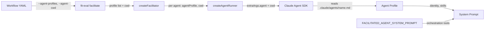

# Design 500 — Facilitated Agent Identity via Profile Loading

## Context

Spec 500 identified that facilitated agents collapse to a single identity
because they receive an anonymous system prompt. The root cause is simpler than
the spec's prompt-injection fix suggests: agents are spawned in temp directories
where `.claude/agents/` does not exist, so the Claude Agent SDK never loads
their profile. The profiles already contain name, description, model, and skill
assignments — everything needed for identity and domain focus.

This design addresses identity and domain focus by making profiles load
correctly. It does not add defensive prompt instructions — if the profile loads,
the agent knows who it is.

## Components

Three components change. No new components are introduced.

### 1. `fit-eval facilitate` CLI option

**Current:** `--agents` accepts a colon-delimited config string
(`name:role=x:cwd=y`) parsed by `parseAgentConfigs()`. `--agent-profile` exists
on `run` and `supervise` commands but not on `facilitate`.

**Changed:** Replace `--agents` with `--agent-profiles` (comma-separated list of
profile names). Add `--agent-cwd` (single directory, shared by all agents).

```
# Before
fit-eval facilitate --agents "sec:role=sec:cwd=.,tw:role=tw:cwd=."

# After
fit-eval facilitate --agent-profiles "security-engineer,technical-writer,..." \
                    --agent-cwd "."
```

Agent name and role derive from the profile name — no separate `role` or `name`
parsing. `cwd` is a single value for all agents, not per-agent.

**Rejected alternative — keep `--agents` and add `agentProfile` parsing.** The
`name:key=val` format exists because agents previously needed per-agent cwd and
role overrides. With profiles supplying identity and a shared cwd, the parsing
complexity is unnecessary.

### 2. `parseAgentConfigs()` in facilitate.js

**Current:** Parses `name:key=val:key=val,...` into config objects. Creates temp
directories when cwd is absent. Never sets `agentProfile`.

**Changed:** Replace with a function that splits the comma-separated profile
list and pairs each with the shared cwd. Each config gets
`{ name: profileName, role: profileName, cwd: agentCwd, agentProfile: profileName }`.

**Rejected alternative — retain per-agent cwd.** No current or planned use case
requires agents in different directories. A single `--agent-cwd` eliminates the
temp-directory default that caused the original bug.

### 3. `FACILITATED_AGENT_SYSTEM_PROMPT` append in facilitator.js

**Current (post-4f18e5f):** Prepends `You are "${config.name}" (role: ...)` and
appends domain-focus and data-reuse instructions to every agent's system prompt.

**Changed:** Remove the identity prefix and domain-focus instruction. The
profile provides identity and domain context. Retain only the base
`FACILITATED_AGENT_SYSTEM_PROMPT` constant (orchestration tool descriptions)
which agents need regardless of identity.

**Rejected alternative — keep the identity prefix as defense-in-depth.**
Duplicating identity across profile and prompt creates two sources of truth. If
they diverge (e.g. profile renamed but prompt not updated), the agent receives
contradictory identity signals. A single authoritative source — the profile — is
both simpler and correct by construction.

## Data Flow



Each agent runner receives the profile name via `agentProfile` and the monorepo
as `cwd`. The SDK resolves `.claude/agents/{name}.md` relative to cwd, loading
the full profile with identity, description, and skills. The system prompt
append contributes only orchestration tool descriptions — identity comes
entirely from the profile.

## Workflow Interface

Workflow callers (`kata-action`, `daily-meeting.yml`, `coaching-session.yml`)
replace the `agents` input with two inputs: `agent-profiles` (comma-separated
profile names) and `agent-cwd` (single directory, defaults to `.`). The
`kata-action` facilitate branch passes these as `--agent-profiles` and
`--agent-cwd` to `fit-eval facilitate`.

## Scope Boundary

This design addresses spec 500 success criteria 1 (identity) and 2 (domain
focus) through profile loading. It does not address criterion 3 (data reuse of
facilitator broadcasts). Data reuse is a facilitation protocol concern — it
governs how the facilitator's broadcast content is consumed, not whether agents
know their identity. Solving identity first lets us observe whether diverse,
domain-aware agents naturally reduce redundant data gathering before adding
protocol-level instructions. Criterion 3 will be evaluated separately after this
change lands and its trace impact is measured.

## Success Criteria Mapping

| Spec criterion                      | Addressed | Mechanism                                    |
| ----------------------------------- | --------- | -------------------------------------------- |
| 1. System prompt contains name/role | Yes       | Profile loaded by SDK provides full identity |
| 2. Domain-specific reporting        | Yes       | Profile skills list defines domain           |
| 3. Reuse facilitator data           | No        | Deferred — independent protocol concern      |
| 4. `bun run check` passes           | Yes       | Verified at implementation                   |
