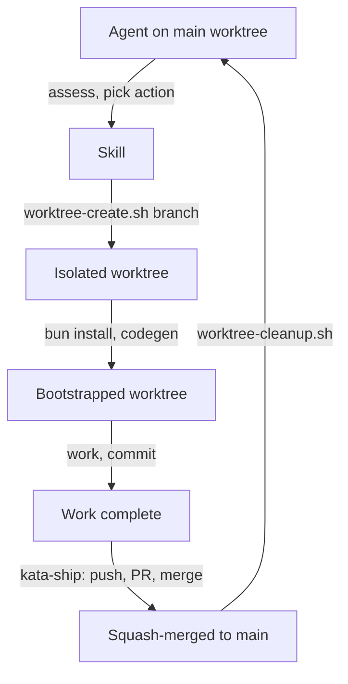

# Design 510 — Worktree Lifecycle as a Shared Skill

## Context

Spec 510 replaces in-place branch switching with git worktrees across 5 skills
and 5 agent profiles. The design question is where the worktree lifecycle lives
and how existing skills consume it.

## Components

Four components change. One new component is introduced.

### 1. `kata-worktree` utility skill (new)

A utility skill (no PDSA phase) with three procedures and two shell scripts.

**Procedures:**

- **Create from main** — new branch from `origin/main`
- **Create from existing** — existing remote branch
- **Cleanup** — return to main worktree, remove worktree directory

**Scripts:**

- `scripts/worktree-create.sh` — derives slug from branch name (`/` → `--`),
  resolves `KATA_WORKTREE_BASE` (default: `../.worktrees`), runs
  `git worktree add`, calls `just worktree-bootstrap`.
- `scripts/worktree-cleanup.sh` — resolves main worktree path from
  `git worktree list`, `cd`s there, runs `git worktree remove --force`.

Scripts export `WORKTREE_DIR` and `MAIN_DIR` for callers. Both are idempotent —
create skips if the worktree exists, cleanup skips if it doesn't.

**Rejected alternative — inline git worktree commands in each skill.** Five
skills need worktree creation. Duplicating the slug derivation, base-path
resolution, and bootstrap call creates five sources of truth. A shared script
centralizes the convention.

**Rejected alternative — use Claude Code's built-in `EnterWorktree` /
`ExitWorktree` tools.** These tools place worktrees under `.claude/worktrees/`
(inside the repo tree, causing Glob/Grep noise) and enforce a "must not already
be in a worktree" constraint that blocks concurrent worktrees. The kata system
needs multiple concurrent worktrees (release-readiness processes N PRs) and a
location outside the repo tree.

### 2. `kata-ship` — guard and cleanup

**Guard:** Replace branch-name check with worktree detection. The current guard
checks `git branch --show-current != main`. The new guard checks whether the
current working directory is a linked worktree (not the main working tree) using
`git worktree list --porcelain`.

**Cleanup:** New final step after squash-merge. Call `worktree-cleanup.sh` to
remove the worktree directory and return to the main working tree.

Steps 2–8 (approve, rebase, check, push, PR, watch, merge) are unchanged — they
work identically inside a worktree.

**Rejected alternative — separate "ship" and "cleanup" skills.** Cleanup is
always paired with ship. Separating them creates a risk of forgotten cleanup.
Making cleanup the final ship step ensures every successful merge removes its
worktree.

### 3. Branch-creating skills — worktree delegation

Three skills replace `git checkout -b` / `git checkout` with a call to
`kata-worktree`:

| Skill                    | Current                            | New                                               |
| ------------------------ | ---------------------------------- | ------------------------------------------------- |
| `kata-implement`         | Caller creates `feat/` branch      | Insert worktree-create step before implementation |
| `kata-release-readiness` | `git checkout <pr-branch>` per PR  | Worktree per PR; cleanup after push               |
| `kata-security-update`   | `git checkout -b fix/dependabot-N` | Worktree from Dependabot branch                   |

`kata-product-issue` changes only its hand-off wording (step 4) — the actual
branch creation is done by the calling agent, which follows the agent profile
instructions.

`kata-design` and `kata-plan` need no skill-level changes. They say "push on the
existing `spec/` branch — never start a new branch." The worktree change happens
in the agent profile's Assess section, which now says "add a worktree for the
existing `spec/` branch" instead of assuming the agent already checked it out.

### 4. Agent profiles — branch → worktree wording

Five profiles replace branch-switching language with worktree language in their
Assess sections. The skill list for each gains `kata-worktree`.

| Profile             | Change                                                                                                                                             |
| ------------------- | -------------------------------------------------------------------------------------------------------------------------------------------------- |
| `staff-engineer`    | "implement on a `feat/` branch" → "implement in a worktree on `feat/`"; "push on existing `spec/` branch" → "worktree for existing `spec/` branch" |
| `security-engineer` | "`fix/` branch from `main`" → "worktree on `fix/`"; "`spec/` branch" → "worktree on `spec/`"                                                       |
| `product-manager`   | "trivial fix — `fix/` branch" → "worktree on `fix/`"                                                                                               |
| `technical-writer`  | Same pattern as security-engineer                                                                                                                  |
| `release-engineer`  | No Assess changes; add `kata-worktree` to skills                                                                                                   |

## Data Flow



The main worktree's `HEAD` never changes. Each branch operation is fully
contained in a worktree lifecycle: create → bootstrap → work → ship → cleanup.

## Worktree Location Convention

```
<repo-root>/../.worktrees/<branch-slug>/
```

Branch slug: replace `/` with `--` (e.g. `feat/pathway-export` →
`feat--pathway-export`). Override via `KATA_WORKTREE_BASE` env var.

Git's built-in branch lock prevents two worktrees from checking out the same
branch — this is a feature. If a stale worktree locks a branch,
`git worktree prune` (run by bootstrap.sh) clears the lock.

## Bootstrapping

New justfile recipe `worktree-bootstrap` runs inside the worktree:

1. `bun install --frozen-lockfile` (~130ms, hard-linked from bun cache)
2. `bunx fit-codegen --all` (regenerate proto types/services)
3. Symlink `wiki/` from main worktree (shared state, not per-worktree)

## bootstrap.sh Simplification

Remove lines 13–27 (feature-branch detection and rebase). The main worktree is
always on `main`. Add `git worktree prune` at the top to clear stale entries
from crashed prior runs.

## Success Criteria Mapping

| Spec criterion                        | Addressed | Mechanism                            |
| ------------------------------------- | --------- | ------------------------------------ |
| 1. No `checkout -b` for branching     | Yes       | Skills call `worktree-create.sh`     |
| 2. `kata-worktree` skill exists       | Yes       | New utility skill with scripts       |
| 3. Ship guards main worktree          | Yes       | `kata-ship` worktree detection guard |
| 4. Release readiness per-PR worktrees | Yes       | `kata-release-readiness` loop change |
| 5. bootstrap.sh simplified            | Yes       | Remove branch logic, add prune       |
| 6. No orphaned worktrees              | Yes       | Ship cleanup + bootstrap prune       |
| 7. Check and test pass                | Yes       | Verified at implementation           |
