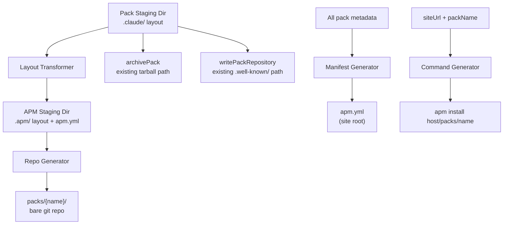
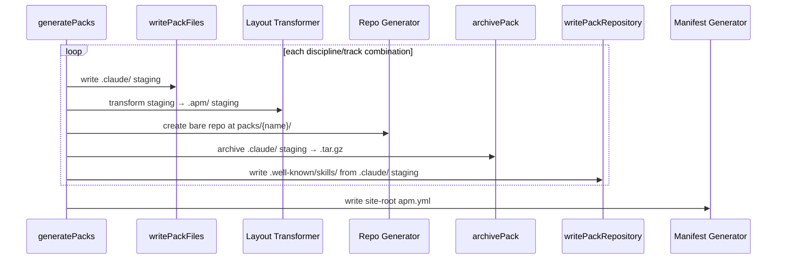

# 520 — Design: Native APM Support for Pathway Agent Team Packs

## Problem Recap

Pathway packs are tarballs with a `.claude/` layout. APM only installs git
repos with an `.apm/` layout. Three things must change: the pack layout, the
transport, and the manifest format.

## Components



Four new components, two existing paths unchanged:

| Component | Responsibility |
|---|---|
| **Layout Transformer** | Converts `.claude/` staging tree to `.apm/` layout |
| **Repo Generator** | Creates a minimal bare git repo from a directory tree |
| **Manifest Generator** | Emits a valid APM project manifest at the site root |
| **Command Generator** | Produces native `apm install` commands (replaces current) |

## Layout Transformer

Converts the existing `.claude/` pack staging directory into APM's `.apm/`
package structure. A second staging directory per pack; no mutation of the
original.

**Mapping rules:**

| Source (`.claude/`) | Target (`.apm/` or root) |
|---|---|
| `agents/{name}.md` | `.apm/agents/{name}.agent.md` |
| `skills/{name}/SKILL.md` | `.apm/skills/{name}/SKILL.md` |
| `skills/{name}/scripts/*` | `.apm/skills/{name}/scripts/*` |
| `skills/{name}/references/*` | `.apm/skills/{name}/references/*` |
| `CLAUDE.md` | *(dropped — no APM primitive)* |
| `settings.json` | *(dropped — no APM primitive)* |

The `.agent.md` extension is required by APM's agent detection. `CLAUDE.md` and
`settings.json` have no usable APM equivalent — APM's instructions primitive
deploys to `.claude/instructions/`, which Claude Code does not read (it reads
`.claude/CLAUDE.md`). Both files are excluded from the git repo; the tarball
remains the distribution path for them.

An `apm.yml` is generated at the APM staging root with `name` and `version`
fields — the minimum APM requires to recognize a package.

**Why a separate staging dir instead of in-place transform?** The `.claude/`
staging is read by `archivePack` and `writePackRepository` after transformation.
Mutating it would require either ordering guarantees or re-staging. A parallel
directory is simpler.

**Why not rewrite `writePackFiles` to emit both layouts?** That couples the APM
layout to the formatter layer. The transformer operates on the finished staging
output, so APM-specific knowledge stays in one place and formatter changes don't
require APM-aware updates.

## Repo Generator

Creates a minimal bare git repository from a directory of files. Interface:

- **Input:** directory path (APM-layout staging dir), pack name, version string
- **Output:** bare git repo directory at `packs/{name}/` in the build output

**Determinism contract:** Fixed commit metadata (author, committer, email,
timestamps, message) guarantees identical object hashes across builds given
identical input files. The commit message encodes the Pathway version.

**Minimal output:** The bare repo is trimmed to only the files dumb HTTP git
requires. Anything git creates that the protocol doesn't need is removed.

**Coexistence:** The bare repo files share the `packs/{name}/` directory with
the existing `.well-known/skills/` tree. No path conflicts — git metadata files
do not start with `.` and `.well-known` is not a git-recognized path.

**Why shell out to git rather than constructing objects in JS?** Git's object
format (zlib-compressed, SHA-1 addressed) is stable but fiddly to reimplement.
Delegating to git is deterministic when env vars are fixed and guarantees
format correctness.

## Manifest Generator

Replaces the current `writeApmManifest`. Emits a valid APM project manifest at
the site root.

**Format:**

```yaml
name: engineering-pathway
version: 0.25.29
dependencies:
  apm:
    - <host>/packs/se-platform
    - <host>/packs/se-forward-deployed
    - <host>/packs/de-dx
```

Each entry is a FQDN-style reference that APM resolves via `git ls-remote`.
The `description` and per-pack `digest` fields from the current manifest are
dropped — APM computes integrity from the git commit hash in its lockfile.

**Why not keep the current `skills:` array format alongside?** APM ignores
unknown top-level keys, so it wouldn't break anything, but it would mislead
anyone reading the file into thinking the URL-based format works. A single
valid format avoids confusion.

## Command Generator

Replaces the current `getApmInstallCommand`. Produces:

```
apm install <host>/packs/<name>
```

The host is extracted from `siteUrl` by stripping the `https://` scheme prefix.
APM's FQDN resolution format requires a bare host, not a full URL.

**Why strip the scheme?** APM's non-GitHub resolution format is
`host.com/org/repo`, not `https://host.com/org/repo`. The sample formats from
APM docs: `gitlab.com/org/repo`, `dev.azure.com/org/project/_git/repo`. A full
URL would cause APM to misparse the host.

## Data Flow



The Layout Transformer and Repo Generator run after `writePackFiles` and before
cleanup. The existing `archivePack` and `writePackRepository` calls continue to
read from the `.claude/` staging directory, unchanged.

## Risks

1. **Dumb HTTP fallback timing.** Git tries smart HTTP first, then falls back to
   dumb HTTP. Static hosts return `info/refs` for both but with a generic
   content-type, triggering the fallback. If a CDN rewrites the response or a
   future git version changes fallback behavior, cloning could break. Mitigation:
   success criterion 2 (`git ls-remote` test) catches this in CI.

2. **Bare repo size.** Each bare repo adds ~50–100KB of git objects (loose,
   uncompressed) per pack. With 12 packs in the current starter data, this is
   ~1MB total — negligible against the existing tarball and `.well-known/` output.
