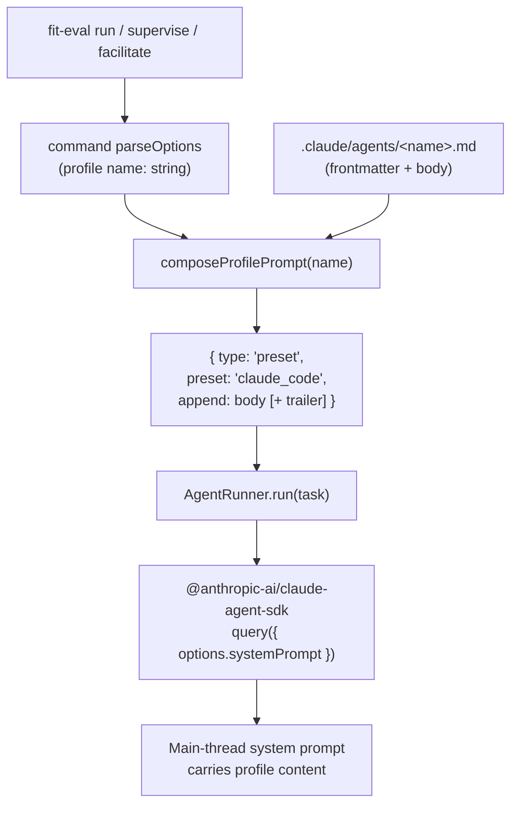

# Design 530 — Agent Profile Main-Thread Binding

## Architectural summary

libeval owns main-thread profile binding. A new pure function,
`composeProfilePrompt`, reads `.claude/agents/<name>.md` and returns an SDK
`systemPrompt` value. All three execution modes route through
`AgentRunner`, and `AgentRunner` becomes the single place that knows how to
attach a profile. The SDK's top-level `agent` option and its `--agent` CLI
mirror are removed from libeval's source — they remain a subagent-registration
concern for Claude Code itself, not a main-thread input we control.

### Components

| Component | Role | Where it lives conceptually |
| --- | --- | --- |
| `composeProfilePrompt(name, { profilesDir })` | Pure: load + merge profile file into `{ type: "preset", preset: "claude_code", append: string }` | New module inside libeval (`src/profile-prompt.js`) |
| `AgentRunner` | Continues to own the single SDK `query({ options })` call; gains a `profileName` input, drops `agentProfile`/`options.agent` | `libraries/libeval/src/agent-runner.js` |
| `run` command | Loads the profile via `composeProfilePrompt` and passes the resulting `systemPrompt` to `AgentRunner`; stops forwarding `--agent` | `src/commands/run.js` |
| `Supervisor` factory | Same load-and-pass pattern for both agent and supervisor runners; `AGENT_SYSTEM_PROMPT` becomes a trailer merged into the profile's `append`, not a replacement | `src/supervisor.js` |
| `Facilitator` factory | Same pattern per agent config and for the facilitator runner; `FACILITATED_AGENT_SYSTEM_PROMPT` / `FACILITATOR_SYSTEM_PROMPT` become trailers | `src/facilitator.js` |

### Interface — `composeProfilePrompt`

```
composeProfilePrompt(
  name: string,
  opts: { profilesDir: string, trailer?: string }
): { type: "preset", preset: "claude_code", append: string }
```

- Reads `${profilesDir}/${name}.md`. A missing or unreadable file propagates
  the underlying `ENOENT` / permission error unchanged — that is the spec's
  first safety net.
- Returns the SDK-shaped `systemPrompt` with `append` equal to the profile
  body plus, when provided, a blank line and `trailer`. Orchestration modes
  pass their existing boilerplate (`AGENT_SYSTEM_PROMPT`,
  `FACILITATED_AGENT_SYSTEM_PROMPT`, `FACILITATOR_SYSTEM_PROMPT`) as
  `trailer` so today's working behaviour is preserved.
- `name` is the only identity the caller knows. The function never guesses,
  never falls back to a default profile, and never silently returns a prompt
  with empty `append`.

## Data flow



Every main thread — solo agent, supervised agent, supervisor, facilitated
agent, facilitator — enters the SDK through the same two-step sequence:
`composeProfilePrompt` → `AgentRunner` with `systemPrompt` set. There is no
other path.

## What lands in the system prompt

The full file contents after YAML frontmatter — the human-readable body — are
what carries voice markers, scope constraints, and skill routing. The
frontmatter itself (name, description, skills list) is stripped because the
body already expresses those contracts in natural language and the skills
list duplicates registrations the SDK discovers via `settingSources:
["project"]`. `composeProfilePrompt` parses and discards the frontmatter
fence, appends only the body, then appends the optional mode trailer.

### Decision — append the profile body, not the whole file

**Chosen:** Strip the frontmatter, append the markdown body via
`systemPrompt.append` on top of the `claude_code` preset.

**Rejected — append the entire raw file including frontmatter.** Cheaper to
implement but it leaks a YAML block into the model's system prompt that was
never written for the model to read, and it re-asserts a `skills:` list the
SDK already loads from the filesystem when `settingSources: ["project"]` is
set — inviting contradiction if the two drift.

**Rejected — replace the `claude_code` preset with the profile as a custom
string prompt.** Gives cleaner separation but forfeits Claude Code's default
tool-use scaffolding that every successful run in the Evidence table depended
on. The facilitated-mode baseline proves preset-plus-append is the shape that
works today; do not regress.

## Where profile loading lives

### Decision — loader in libeval, one module, pure function

**Chosen:** `composeProfilePrompt` is a pure function in
`libraries/libeval/src/profile-prompt.js`. Each command calls it once at
startup and passes the result into its runner factory.

**Rejected — load inside `AgentRunner`.** Would couple the runner to the
filesystem and to a specific profile directory layout, making the
long-standing test pattern of injecting a mock `query` awkward (tests would
now need to stub `fs` too).

**Rejected — load inside each command's options parser.** Scatters the
profile-shaping logic across `run.js`, `supervise.js`, and `facilitate.js`.
Three copies drift; one module does not.

## How the three modes converge

### Decision — `AgentRunner` takes a pre-composed `systemPrompt`, not a profile name

**Chosen:** Drop the `agentProfile` constructor field from `AgentRunner`.
Callers construct `systemPrompt` via `composeProfilePrompt` and pass it in.
The runner loses its only filesystem concern; the orchestration factories
each call `composeProfilePrompt` once per runner they create, passing the
mode-specific trailer.

**Rejected — have `AgentRunner` accept `profileName` and call the loader
internally.** Convenient for callers but re-introduces the same two failure
modes in three places: either every mode needs its own trailer parameter
plumbed through `AgentRunner`'s constructor, or the runner grows a
mode-awareness switch. Neither is the runner's job.

**Rejected — leave solo mode wiring `options.agent` and only touch the
solo-mode path.** The spec explicitly forbids this: libeval must stop using
`options.agent` as a binding mechanism everywhere, so that if a future SDK
makes the option attach profile content, we do not end up double-stacking
the profile in supervised and facilitated modes.

## Safety nets (restated, not re-designed)

- **Unreadable profile file.** The `fs.readFileSync` inside
  `composeProfilePrompt` throws; the command exits non-zero with the
  underlying error. No bespoke validation layer is added.
- **Bound-but-wrong content.** A main thread carrying an empty or mismatched
  profile drifts across domain boundaries in the first few turns.
  `kata-trace`'s grounded-theory analysis already detects this from trace
  artifacts; no dedicated trace event is introduced.

## Removed surface area

- `AgentRunner.agentProfile` and the `options.agent` spread in its `run()` /
  `resume()` calls.
- `--agent-profile` and `--facilitator-profile` CLI flags' pass-through to
  `options.agent`. The flags may keep their names at the CLI boundary, but
  in libeval's source they now feed `composeProfilePrompt` and nothing else.
- `AGENT_SYSTEM_PROMPT` etc. stay exported — they become trailer strings
  passed into `composeProfilePrompt`, not standalone `append` values.

## Out of scope (per spec)

Profile file contents, subagent registration via `Task`/`Agent`, future SDK
behaviour of `options.agent`, dedicated startup validation, dedicated trace
events, task-prompt rewording.

— Staff Engineer 🛠️
