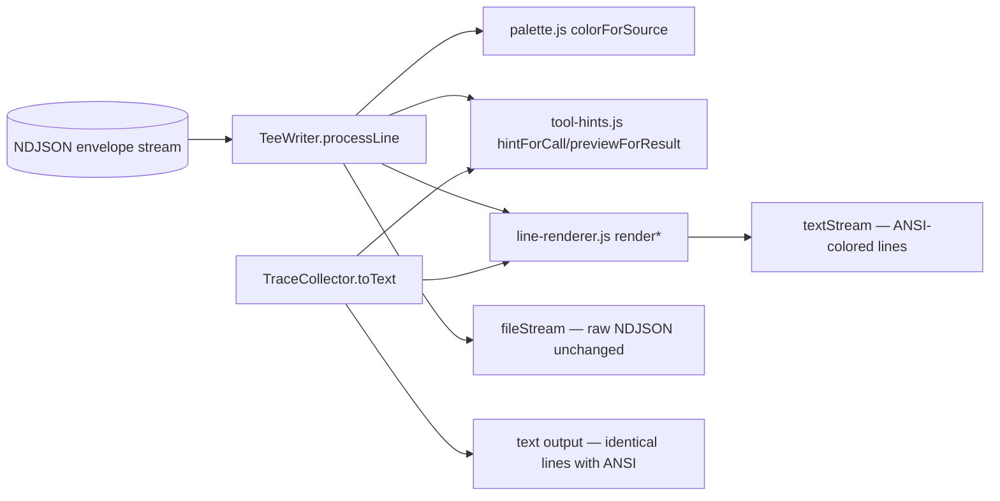

# Design 540 — Readable Agent Workflow Logs

## Scope recap

Render-path only. NDJSON writers, artifact splitting, and agent behaviour are
untouched. We reshape what `TeeWriter` streams live and what
`TraceCollector.toText()` replays offline so the two outputs agree modulo ANSI
escapes.

## Components



Four new modules live in `libraries/libeval/src/render/`:

| Module                   | Exports                                                          | Responsibility                           |
| ------------------------ | ---------------------------------------------------------------- | ---------------------------------------- |
| `palette.js`             | `colorForSource`, `ERROR_COLOR`, `RESET`                         | Pure profile-name → ANSI SGR string      |
| `tool-hints.js`          | `hintForCall(name, input)`, `previewForResult(content, isError)` | Pure one-line formatters                 |
| `line-renderer.js`       | `renderTextLine`, `renderToolCallLine`, `renderToolResultLine`   | Compose prefix + color + body + reset    |
| `orchestrator-filter.js` | `isSuppressedOrchestratorEvent(event)`                           | Predicate for suppressed lifecycle types |

`TeeWriter` and `TraceCollector.toText()` are the only consumers; both delegate
all formatting to these modules so the live stream and the offline replay share
one rendering path.

## Data model

### `ColorCode`

An ANSI SGR foreground-color escape (string). The palette exports a fixed,
ordered list of 8 distinct codes drawn from the standard 16-color terminal set,
red excluded. `colorForSource(name)` hashes the name with a stable FNV-1a 32-bit
and indexes into the palette. Determinism is a pure function of the string — no
state, no time, no randomness.

Reserved: **red (`\u001b[31m`)** — tool-result error lines only. Never returned
from `colorForSource`, regardless of input.

### `ToolHint`

A single-line string — tool name plus a short human indicator. Per-tool shape:

| Tool                       | Hint shape                                                      |
| -------------------------- | --------------------------------------------------------------- |
| `Bash`                     | first ~60 chars of `command`, whitespace-collapsed              |
| `Read` / `Write`           | `file_path`                                                     |
| `Edit`                     | `file_path` (plus `(replace_all)` when set)                     |
| `Glob`                     | `pattern`                                                       |
| `Grep`                     | `pattern` (plus `in <path>` when `path` set)                    |
| `WebFetch`                 | `url`                                                           |
| `WebSearch` / `ToolSearch` | `query`                                                         |
| `TodoWrite`                | `N todos`                                                       |
| `NotebookEdit`             | `notebook_path`                                                 |
| `Skill`                    | `skill` name                                                    |
| `Agent` / `Task`           | first ~60 chars of `prompt` or `description`                    |
| `mcp__orchestration__*`    | method after `mcp__orchestration__`, plus any `to`/`from` field |
| `mcp__github__*`           | method after `mcp__github__`                                    |
| fallback                   | `""` — bare tool name only                                      |

Every hint is bounded to 80 chars of payload, stripped of newlines, and has
every `{`, `}`, and `"` from the input **removed** before rendering — so
`Bash echo "hi"` is printed as `Bash echo hi` (success criterion #2). This
applies uniformly to every hint branch; the per-tool rules above pick the field,
the sanitizer enforces the character ban.

### `ResultPreview`

- **Success**: first non-blank line of content, truncated to 80 chars with
  trailing `...` when truncated. Empty content → `"(ok)"`.
- **Error**: same truncation, prefixed with `error: `. Rendered in red.

## Rendering rules

`TeeWriter` emits lines with full ANSI escapes. `TraceCollector.toText()` emits
the **same lines with ANSI escapes too** so `fit-eval output --format=text` is a
faithful offline renderer — criterion #6 requires equivalence "ignoring ANSI,"
which implies both sides produce ANSI. Downstream consumers that want plain text
strip ANSI with a standard regex.

Every line is `[<prefix>]<ESC><color><body><RESET>` where:

- `<prefix>` — `[<source>] ` in `supervised` / `facilitate` mode, empty in `raw`
  mode. Kept outside the color escape so grep and color-stripped views still
  work.
- `<color>` — `colorForSource(source)` for text and tool-call lines;
  `ERROR_COLOR` for failed tool-result previews, regardless of source.
- `<body>` — agent text, `> <ToolName> <hint>`, or `  <- <preview>` for results.
  The two-space indent + `<-` ties the preview visually to its call.
- `<RESET>` — `\u001b[0m` so color does not bleed into the next line.

No banners, no boxes, no emoji, no separators.

### Example

```
[facilitator] Let me open with roll call.
[facilitator] > mcp__orchestration__RollCall
[facilitator]   <- 6 participants
[staff-engineer] Checking the branch state.
[staff-engineer] > Bash git status
[staff-engineer]   <- error: fatal: not a git repository
```

## Orchestrator event suppression

`TeeWriter.processLine` short-circuits any event where
`isSuppressedOrchestratorEvent(event)` is true — the line still reaches
`fileStream` but never `textStream`. Suppressed types: `session_start`,
`agent_start`, `ask_received`, `ask_answered`, `redirect`, `summary`. The
`--- Evaluation … ---` footer emitted by `TeeWriter._final` is deleted. The
`TraceCollector.toText()` trailing `--- Result: … ---` block stays (spec: "the
one summary line humans want").

## Decisions and rejected alternatives

1. **Hash-based palette, not round-robin**  
   Chosen: `FNV-1a(name) % paletteSize` — pure function of the name.  
   Rejected: counter or order-of-arrival assignment. Reason: would make a
   profile's color depend on who spoke first, breaking "same profile, same
   color, every call, in every process."

2. **Standard 8-color palette, not 256-color or truecolor**  
   Chosen: fixed 8 codes from the 16-color ANSI set, red excluded.  
   Rejected: 256-color. Reason: GitHub Actions' terminal renders basic SGR
   cleanly; truecolor support is patchy and accessibility plugins cope worse.
   Eight slots cover ≥ 6 participants with headroom.

3. **Pure modules, not classes**  
   Chosen: pure functions across all four modules.  
   Rejected: a stateful `PaletteManager` or `Renderer` object. Reason: no state
   to manage — determinism falls out of inputs. No DI needed.

4. **Per-tool hint table, not a generic JSON-field heuristic**  
   Chosen: `hintForCall` dispatches on tool name.  
   Rejected: one generic "stringify top field" formatter. Reason: tools pick
   different fields as their key identifier; a generic heuristic either leaks
   JSON characters (fails criterion #2) or picks the wrong field.

5. **One preview line per call, always**  
   Chosen: every `tool_use` is followed by exactly one preview line.  
   Rejected: only show previews for errors. Reason: criterion #3 requires a
   preview "following every tool call." Readers need the call↔result visual tie
   on every call.

6. **Prefix retained outside the color escape**  
   Chosen: `[<source>]` always present in multi-participant modes.  
   Rejected: drop it when color is on. Reason: spec's accessibility clause —
   grep, color-stripping terminals, and text search all depend on the prefix.

## Test surface

Four kinds of unit test:

1. **`palette.test.js`** — `colorForSource` is deterministic, distinct for ≥ 6
   profile names (facilitator + 5 domain agents), and never returns red.
2. **`tool-hints.test.js`** — every tool in the hint table produces a one-line
   output with no `{` or `"` from the input; long inputs are truncated; fallback
   returns `""`; previews respect the success/error split.
3. **`tee-writer.test.js`** — assistant text and tool-call lines carry the
   expected color; failed tool results carry red; the six suppressed
   orchestrator event types produce no text output; no `--- Evaluation … ---`
   footer.
4. **Fixture equivalence** — a committed multi-agent trace fixture renders
   identically (ANSI stripped) through `fit-eval output --format=text` and
   through `TeeWriter` (criterion #6).

## Out of scope (restated)

- NDJSON envelope — unchanged
- Agent behaviour, profiles, system prompts — unchanged
- `fit-eval output --format=json` — unchanged
- `.github/actions/kata-action/action.yml` splitting — unchanged

— Staff Engineer 🛠️
