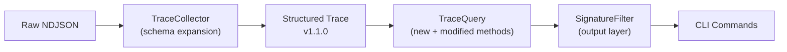
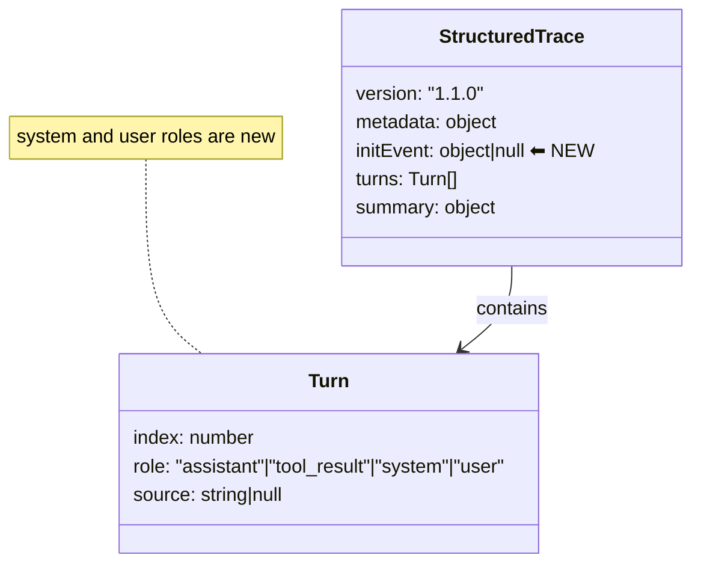
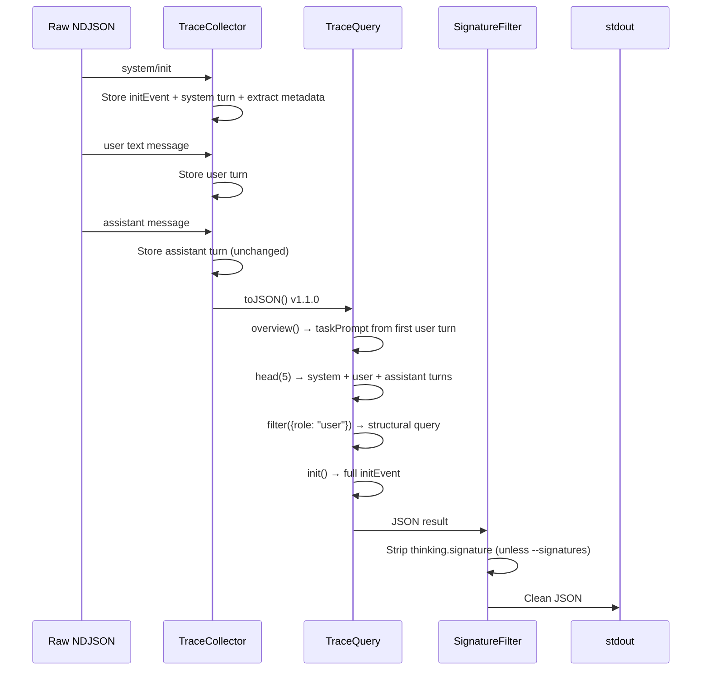

# Design 570 — fit-trace Structured Introspection

## Architecture

Three existing layers change: the **TraceCollector** expands its schema to store
events it currently discards, the **TraceQuery** adds new query methods and
enriches existing ones, and a new **SignatureFilter** intercepts output to strip
noise by default.

## Structured Trace Schema Changes

Existing fields are unchanged — queries against traces produced before this
change continue to work.

### New turn roles

The collector currently stores only `assistant` and `tool_result` turns. Two new
roles are added:

- **`system`** — System events (init, hooks). Carries the event subtype and full
  payload. The init event's curated subset continues to populate `metadata` for
  backward compatibility.
- **`user`** — User text messages. Carries content blocks using the same
  `content[]` shape as assistant turns.

### `initEvent` top-level field

The full `system/init` event is stored as a dedicated top-level field alongside
`metadata`. This provides O(1) access without scanning turns, while the system
turn in the turns array enables init to appear in `head` and `filter` results.

## Component Changes

### TraceCollector

| Method           | Change                                                                                                                                                                                        |
| ---------------- | --------------------------------------------------------------------------------------------------------------------------------------------------------------------------------------------- |
| `handleSystem()` | Store all system events as system turns (subtype + full data). Continue extracting curated metadata from init. Store full init payload as `this.initEvent`.                                   |
| `handleUser()`   | Store user text messages as user turns alongside existing tool_result extraction. A user event with both text and tool_result items produces one user turn and one or more tool_result turns. |
| `toJSON()`       | Include `initEvent` field. Version becomes `"1.1.0"`.                                                                                                                                         |
| `toText()`       | Extend rendering loop to handle `system` and `user` role turns (currently only handles `assistant` and `tool_result`).                                                                        |

### TraceQuery — New Methods

| Method         | Purpose                                                                                                                                                                                                                                             | SC  |
| -------------- | --------------------------------------------------------------------------------------------------------------------------------------------------------------------------------------------------------------------------------------------------- | --- |
| `init()`       | Return the full init event from `trace.initEvent`.                                                                                                                                                                                                  | SC2 |
| `turn(index)`  | Return a single turn by its index.                                                                                                                                                                                                                  | SC5 |
| `filter(opts)` | Filter turns by composable criteria: `role`, `toolName`, `isError`. Composed as AND. Returns `Turn[]`. Existing `tool()` and `errors()` remain as convenience shortcuts — they predate `filter` and have established usage in kata-trace workflows. | SC4 |

### TraceQuery — Modified Methods

| Method                  | Change                                                                                                                                                                                                | SC  |
| ----------------------- | ----------------------------------------------------------------------------------------------------------------------------------------------------------------------------------------------------- | --- |
| `overview()`            | Add `taskPrompt`: extract text from the first user-role turn.                                                                                                                                         | SC1 |
| `head(n)`               | No code change needed — schema expansion means system/user turns are in `this.turns`, so `head` naturally returns them.                                                                               | SC3 |
| `search(pattern, opts)` | New `full` option: when true, match descriptions emit the full content block text instead of the narrow excerpt. Search extends to include user turn text content (user turns now carry text blocks). | SC7 |

### SignatureFilter

A pure function that walks a JSON-serializable value and strips
`thinking.signature` fields from content blocks. Applied at the CLI JSON output
boundary, not inside TraceQuery — queries return complete data internally.
Non-JSON commands (timeline, count) produce output formats that do not include
raw content blocks, so they are unaffected.

| Concern        | Decision                                                                         |
| -------------- | -------------------------------------------------------------------------------- |
| Where applied  | CLI `writeJSON()` — single interception point for all commands                   |
| Default        | Signatures stripped                                                              |
| Opt-in restore | `--signatures` global CLI flag bypasses the filter                               |
| Stored data    | Signatures remain in the structured trace file — lossless storage, lossy display |

### CLI

| Command                                            | Type            | Maps to                           |
| -------------------------------------------------- | --------------- | --------------------------------- |
| `init <file>`                                      | New             | `TraceQuery.init()`               |
| `turn <file> <index>`                              | New             | `TraceQuery.turn(index)`          |
| `filter <file>` with `--role`, `--tool`, `--error` | New             | `TraceQuery.filter(opts)`         |
| `--signatures`                                     | New global flag | Disables SignatureFilter          |
| `search --full`                                    | New option      | `search(pattern, { full: true })` |

## Key Decisions

### 1. Schema expansion at collector level

**Chosen:** Collector stores system events and user text messages as turns.

**Rejected:** Query layer synthesizes missing events from a parallel raw NDJSON
stream. This would couple the query layer to two data sources, add a merge step,
and break the clean structured-trace-to-TraceQuery contract.

### 2. Dual storage for init event

**Chosen:** Init stored as both a system turn and a `trace.initEvent` field.

**Rejected:** Init as turn only — requires O(n) scan for a frequent query. Init
as field only — excludes init from `head` and `filter`, contradicting SC3.

### 3. Output-layer signature suppression

**Chosen:** Signatures stored in trace, stripped at CLI output boundary.

**Rejected:** Strip during collection — permanently destroys data. Future
analysis (signature verification, thinking-block integrity) would require
re-downloading raw NDJSON.

### 4. Composable filter method

**Chosen:** Single `filter()` method with `role`, `toolName`, `isError` criteria
composed as AND intersection.

**Rejected:** Separate commands per dimension (`roles`, `error-turns`). Combined
queries like "errors from Bash" would need a third command or piping. Composable
options cover all combinations in one method.

### 5. Task prompt derived at query time

**Chosen:** `overview()` finds the first user-role turn and extracts its text.

**Rejected:** Collector stores `taskPrompt` as a top-level field. This couples
collection to a specific analysis pattern. After schema expansion the user turn
is already in the turns array — the query just reads it.

### 6. Full content block mode for search

**Chosen:** `--full` flag emits the entire content block containing the match.

**Rejected:** Configurable excerpt width (`--excerpt-width N`). A wider window
is still a partial view — investigators need full context, not "80 chars instead
of 40." Binary choice (excerpt vs. full block) is simpler and sufficient.

### 7. Backward-compatible version bump

**Chosen:** Version `1.1.0` — all changes are additive. Old traces work with all
existing and new queries unchanged.

**Rejected:** Breaking `2.0.0`. New turn roles are ignored by queries that
filter on `assistant` or `tool_result`. No existing schema field changes
meaning.

## Data Flow

