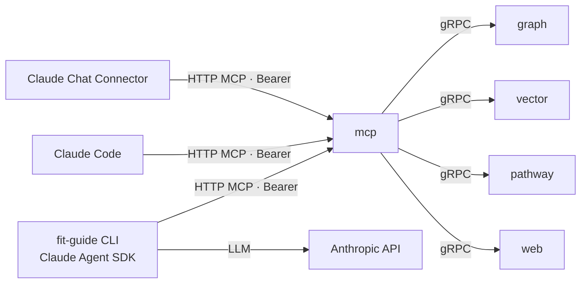

# Design 580 — Guide on Claude Agent SDK and MCP

## Context

Spec 580 replaces Guide's bespoke OpenAI-compatible harness with the Claude
Agent SDK and exposes Guide's knowledge as a Model Context Protocol (MCP)
endpoint so three surfaces — `fit-guide` CLI, Claude Code, Claude Chat — reach
the same tools under the same instructions. Clean break: every retired component
is deleted in the same change that introduces its replacement.

## Components

`trace` is retained unchanged for cross-service observability; it is not on the
request path and is omitted from the diagram.

### 1. `services/mcp` — unified HTTP MCP server (new)

Single HTTP+SSE MCP server on one port, built on `@modelcontextprotocol/sdk`.
Exposes every retained Guide tool, the `guide-default` prompt, and a `/health`
probe. Fans out to the existing `graph`, `vector`, `pathway`, and `web` gRPC
services — those services are unchanged.

Configuration follows the standard libconfig `SERVICE_MCP_*` convention
(`SERVICE_MCP_URL`, `SERVICE_MCP_HOST`, `SERVICE_MCP_PORT`), consistent with
every other service (`SERVICE_GRAPH_*`, `SERVICE_VECTOR_*`, etc.).

Authentication: one static bearer token (`MCP_TOKEN`) verified on the
`Authorization` header, resolved through libconfig's credential store. Token is
an init-time secret registered by every surface.

**Rejected — one MCP server per backend.** Forces every surface to register four
URLs and four secrets. One gateway has the smallest footprint (resolves "MCP
gateway shape").

**Rejected — SDK in-process MCP (`createSdkMcpServer`).** Works only inside the
CLI. Claude Code and Claude Chat cannot attach to an in-process server, so
parity on those surfaces is impossible without a remote endpoint.

### 2. `fit-guide` CLI rewrite — Claude Agent SDK harness

The CLI becomes a thin driver around `@anthropic-ai/claude-agent-sdk`'s
`query()`: wire the Anthropic credential, register `mcp` as a remote MCP
server, fetch `guide-default` as the system prompt, stream the reply. Session
persistence (JSONL + `resume`), context compaction, and tool dispatch come from
the SDK.

New subcommands exposed on the CLI: `login`, `logout`, and `resume`; `init` and
`status` are retained but re-wired onto the new credential and health surfaces.
The default (no subcommand) remains interactive / stdin-pipe chat. Subcommand
behaviour details are plan-level.

**Rejected — keep `librepl` + gRPC agent service.** The spec requires deleting
`services/agent` and `libagent`; re-implementing their job reintroduces the
harness the pivot removes.

### 3. `libconfig` — transparent Anthropic credential + MCP token

Two new methods on the existing `Config` class — no new library.

- `Config#anthropicToken(): Promise<string>` — returns a usable Anthropic
  credential. Callers (SDK, status) do not branch on the source: libconfig
  treats `ANTHROPIC_API_KEY` and an OAuth-acquired access token as equivalent,
  preferring the env-var form when both exist and raising a typed "not
  authenticated" error when neither is. This is the "transparently managed by
  libconfig" contract the spec asks for.
- `Config#mcpToken(): string` — returns the bearer token used by all three
  surfaces to call `mcp`.

Credential stores: the existing env-var store for `ANTHROPIC_API_KEY` and
`MCP_TOKEN`, and a new typed OAuth resource shaped
`{ access_token, refresh_token, expires_at }`, owned by libconfig and refreshed
on read when expired. Missing or corrupt OAuth resource is treated as "not
logged in". The OpenAI-path credentials the old harness owned are dropped from
libconfig entirely — neither readable nor writable.

**Rejected — new `libauth` library.** Two methods on an existing class is not a
library. `libconfig` already owns credential resolution.

**Rejected — delegate OAuth entirely to the Claude Agent SDK.** The SDK's auth
store is Claude Code account-scoped and not a documented public API. A minimal
in-repo PKCE flow keeps the dependency surface flat and the credential store
Guide-owned.

### 4. `fit-guide login` — OAuth flow

Three collaborating components inside the CLI process:

- **PKCE initiator** builds the Anthropic `/oauth/authorize` URL (with verifier,
  challenge, and `state`) and hands it to the user's browser.
- **Loopback callback listener** on an ephemeral `127.0.0.1` port receives the
  authorization code, validates `state`, exchanges the code at `/oauth/token`.
- **Token store writer** persists the resulting token tuple via the
  `anthropic-oauth` resource defined in §3.

Headless environments (no browser) use the same three components, substituting a
"paste the callback URL" prompt for the listener-bound browser step. The
endpoints and token store are identical.

**Rejected — API-key-only `login`.** `ANTHROPIC_API_KEY` covers the env-var
path; `login` exists for the browser-based flow analogous to `claude login`.

### 5. Retired packages (deleted same commit)

| Retired                             | Replaced by                          |
| ----------------------------------- | ------------------------------------ |
| `libraries/libagent`                | SDK `query()` loop                   |
| `libraries/libmemory`               | SDK compaction + JSONL sessions      |
| `libraries/libllm`                  | SDK provider integration             |
| `services/agent`                    | SDK in the CLI process               |
| `services/memory`                   | SDK session store                    |
| `services/llm`                      | SDK → Anthropic API                  |
| `services/tool`                     | `mcp` MCP tools                |
| `starter/agents/*.agent.md`         | `guide-default` prompt served by MCP |
| `starter/config.json` endpoints map | MCP tool definitions                 |

No adapters, no shims, no deprecation window. The new `.env` shape carries
`SERVICE_MCP_URL`, `MCP_TOKEN`, and an `ANTHROPIC_API_KEY` placeholder;
`LLM_TOKEN` in a user's old `.env` is simply ignored because no code reads it.

## Agent instructions

One prompt, `guide-default`, collapses the planner → researcher → editor chain
into a single-agent system prompt that retains the workflow (explore ontology →
query → synthesize; never fabricate). The three personas existed to constrain
weaker models; on frontier Claude with the SDK's tool loop, one prompt achieves
the same constraint with fewer moving parts. Resolves open question "agent
pipeline representation". Delivery differs by surface:

- **CLI** — fetches `guide-default` via MCP `prompts/get` and passes it as the
  SDK `system` parameter.
- **Claude Code** — the published `fit-guide` skill carries the prompt text;
  Claude Code injects it as the agent's system instructions.
- **Claude Chat** — Connector configuration embeds the prompt as the system turn.

**Rejected — SDK subagents for planner/researcher/editor.** Doubles prompt
surface and adds handoff plumbing; parity fixtures do not require it.

## Tool coverage

Every tool in `products/guide/starter/tools.yml` is exposed on MCP **except**
the four bespoke-orchestration tools, retired with rationale:

| Retired tool      | Rationale                                             |
| ----------------- | ----------------------------------------------------- |
| `list_sub_agents` | Bespoke handoff mechanics replaced by SDK agent loop. |
| `run_sub_agent`   | No bespoke agent service to dispatch to.              |
| `list_handoffs`   | Single-agent design; nothing to list.                 |
| `run_handoff`     | No handoff target exists.                             |

All other tools in `tools.yml` are retained, each backed by the same gRPC
service as today.

## Authentication per surface

| Surface         | LLM auth                                    | MCP auth                                  |
| --------------- | ------------------------------------------- | ----------------------------------------- |
| `fit-guide` CLI | `libconfig.anthropicToken()` (env or OAuth) | Bearer `MCP_TOKEN` from `libconfig` |
| Claude Code     | Host credential (not Guide's concern)       | Bearer `MCP_TOKEN` in MCP config    |
| Claude Chat     | Host credential (not Guide's concern)       | Bearer `MCP_TOKEN` in Connector     |

One shared bearer secret on each surface's MCP transport. `mcp` returns `401`
for anything else. Resolves open question "Authentication mechanism".

**Rejected — per-surface OAuth to MCP.** The token already lives in `.env`.

## Provider scope

Anthropic API is the sole supported provider at acceptance. AWS Bedrock is **out
of scope** (resolves open question "additional provider targets"); the SDK's
provider abstraction leaves room for a follow-up without touching `libconfig`.

## Parity rubric (SC8)

Ten representative Guide questions, each shaped
`{ id, question, expected_answer_substance, expected_tools }`. Each fixture runs
on all three surfaces and passes only if: (a) answer substance matches the
reference (LLM-judged), (b) observed tool-call set ⊇ `expected_tools`, (c)
every factual claim cites a URI or snippet in retrieved data. Fixture file and
per-surface runner live under Guide's test tree; exact paths are plan-level.

Fixtures span discipline lookup, level progression, job description, capability →
skills traversal, behaviour lookup, semantic search, software toolkit,
agent-profile lookup, ontology discovery, multi-hop graph + vector.

## First-run UX & status

On a missing `.env`, the CLI exits with a pointer to `fit-guide init` and
`fit-guide login` (or `ANTHROPIC_API_KEY`). `LLM_TOKEN` is never read; the break
is surfaced by the pointer, not by silent compatibility. `fit-guide status`
reports three health blocks — credentials, MCP `/health`, and backend gRPC
health — green only when all three pass.
