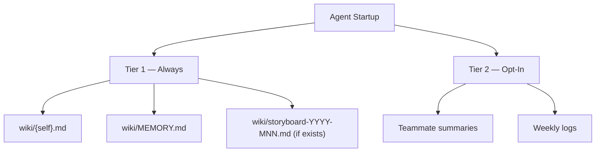
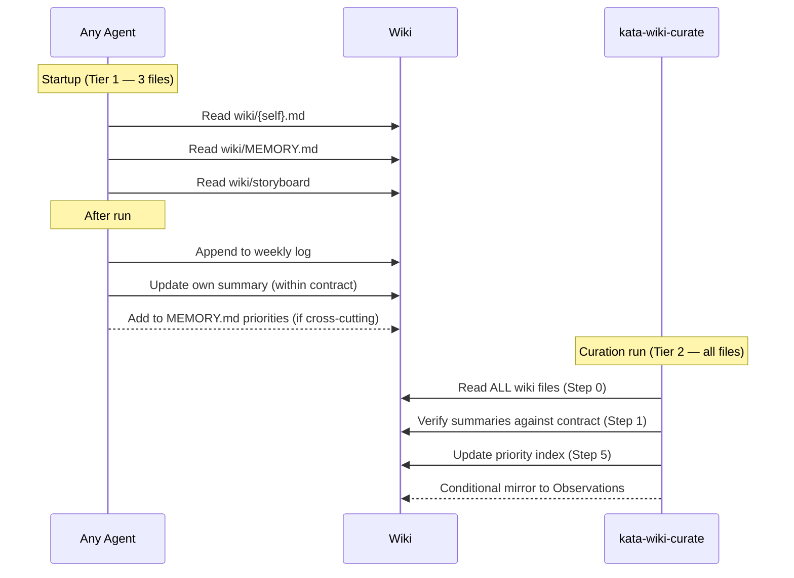

# Design 590 — Condensed Agent Memory and Cross-Cutting Priority Index

## Overview

Three structural changes reshape the wiki: a priority index in MEMORY.md, a
tiered memory protocol, and a summary contract with a line budget. Together they
cut the default startup surface from ~25 file reads to 3, and give cross-cutting
items a single canonical home.

## Components

### 1. Cross-Cutting Priority Index (MEMORY.md)

MEMORY.md gains a `## Cross-Cutting Priorities` section above the existing
navigation. Each entry is a Markdown table row:

| Field  | Purpose                                       |
| ------ | --------------------------------------------- |
| Item   | Short description of the priority             |
| Agents | Comma-separated list of affected agent slugs  |
| Owner  | Agent slug or `human` — who drives resolution |
| Status | `active` or `resolved`                        |
| Added  | ISO date when the item entered the index      |

Maximum 10 active entries. Explicit empty state: a single row reading "None" so
agents can distinguish "no items" from "not tracked yet." Resolved items are
removed by the curator within one curation cycle.

**Rejected alternative — separate `wiki/priorities.md`.** Adds a file to the
startup path. MEMORY.md is already read by every agent; embedding the index
keeps the file count flat.

### 2. Tiered Memory Protocol (memory-protocol.md)

Replace the current "read all agent summaries" instruction with two tiers:

**Tier 1 (always, every run):** own summary, MEMORY.md, current storyboard.
Three files. Does not grow with agent count or week count.

**Tier 2 (opt-in, stated conditions):**

- **Teammate summaries** — when the current task requires direct coordination
  with a named agent, or when investigating a priority index item that names
  them.
- **Weekly logs** — when the skill is `kata-wiki-curate`, `kata-trace`, or
  `kata-storyboard`, or when explicitly investigating a historical decision.

The protocol states these conditions. Skills that need Tier 2 files declare it
in their own Step 0.

**Rejected alternative — read all summaries, skip weekly logs.** Still O(n) in
agents. The priority index eliminates the main reason to scan teammate summaries
(discovering cross-cutting items).

**Rejected alternative — pre-aggregate a "team state" file.** Creates a sync
problem: who writes it, when, with what authority? The priority index solves
discovery without duplicating state.

### 3. Summary Contract (memory-protocol.md)

Each `wiki/<agent>.md` conforms to a mechanically-checkable contract.

**Permitted sections (in order):**

1. `# {Agent Title} — Summary` (H1, exactly one)
2. `**Last run**:` line — date and one-line description
3. Agent-specific state section(s) — backlog, coverage, active work (H2)
4. `## Open Blockers` — currently-blocking items only
5. `## Observations for Teammates` — items not yet promoted to the priority
   index; agent-to-agent callouts

**Excluded from summaries:** historical audit data (previously tracked PRs,
resolved blockers, evaluation history), storyboard commitments (live in the
storyboard file), gate policy clarifications (live in skills or
CONTRIBUTING.md), metrics tables (live in CSV files).

**Line budget: 80 lines.** Mechanically checked: `wc -l wiki/<agent>.md ≤ 80`.
Current state: PM 163, IC 137, SE 103. The budget forces historical material
into weekly logs or removal. Analysis of the PM summary shows ~61 lines of
genuine state content after excluding history — 80 is tight enough to enforce
discipline, loose enough to accommodate legitimate multi-section state.

**Rejected alternative — 60-line budget.** Too aggressive for agents with
multi-section state (PM tracks issues, PRs, deferred work, and observations).

**Rejected alternative — no Observations section.** Some observations are purely
agent-to-agent and don't warrant a priority index entry. The section stays; the
priority index is the required first destination for multi-agent items.

### 4. Weekly Log Contract (memory-protocol.md)

Weekly logs (`wiki/<agent>-YYYY-Www.md`) are:

- **Append-only audit records** — no edits to past entries except format fixes
- **Tier 2** — not in the default startup load
- **Named readers:** `kata-wiki-curate` (always), `kata-storyboard` (for
  experiment verification), agents explicitly investigating past decisions
- **Format:** unchanged (`## YYYY-MM-DD` / `### Decision` structure)

No size budget on logs — they are write-once records. Growth is acceptable
because they are off the critical startup path.

### 5. Curation Skill Role (kata-wiki-curate/SKILL.md)

The curator is the only agent whose default read scope is the full wiki — that
does not change. What changes is the curator's output responsibilities:

- **Summary contract enforcement.** The curator verifies that each summary
  conforms to the contract (permitted sections, line budget) during its accuracy
  check and fixes violations directly.
- **Priority index as primary output.** Cross-cutting items discovered during
  curation are written to MEMORY.md's priority index. Mirroring an item into an
  affected agent's Observations section is conditional — only when the agent
  needs context beyond what the index entry conveys.

**Rejected alternative — all agents write to the priority index.** Any agent
_may_ add an item when it discovers a cross-cutting concern mid-run, but the
curator is the authoritative writer. Distributed writes without a single
verifier lead to duplicates and stale entries.

## Data Flow

## Contract Canonical Location

All contracts (tiered memory load, summary contract, weekly log contract) live
in `memory-protocol.md` — one file, one source of truth. Skills reference
memory-protocol.md; they do not restate the contracts. The priority index schema
(fields, count bound, empty state) is defined by the structure of MEMORY.md
itself; `memory-protocol.md` references MEMORY.md as the canonical location.

**Rejected alternative — contracts in CONTRIBUTING.md.** Wiki memory is agent
infrastructure, not contribution standards. memory-protocol.md is the shared
agent protocol; contracts belong with the protocol they constrain.

## Archival Decision

Historical material removed from summaries (previously tracked PRs, evaluation
history, resolved blockers) is deleted, not archived to a separate location. The
data already exists in weekly logs and git history; an archive directory adds a
maintenance surface for data that no agent reads on the critical path.

**Rejected alternative — `wiki/history/` archive.** Creates files that are never
read but must be maintained. Weekly logs already serve the audit purpose.

## Migration

Migration steps are plan scope. The design constraint is that protocol changes
and wiki file changes must land together — the protocol must not reference
contracts or a MEMORY.md shape that does not yet exist.

## Conformance Check

The summary contract, weekly log contract, and priority index schema are all
designed to be mechanically checkable — a reader (human or script) can decide
pass/fail per file in bounded time. The implementation form of the conformance
check (script, lint rule, manual checklist, or curation step) is a plan
decision.
