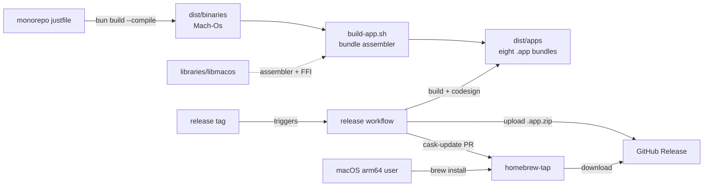

# Design 600 — Native Binary Distribution via Homebrew

See [`spec.md`](./spec.md) for WHAT/WHY. This document captures WHICH components
exist and WHERE they interact.

## Architecture

Four cooperating surfaces: a **local build pipeline** (monorepo justfile + bun),
a **shared bundle assembler** in `libraries/libmacos/` that every release
artifact flows through, a **release workflow** that zips and uploads bundles
then opens cask-update PRs, and a **separate tap repository** users install
from. The existing npm path is untouched.

## Component 1 — Native binary build

`bun build --compile` runs per target to produce Mach-Os in `dist/binaries/`.
Outputs are **intermediate**, not release artifacts — they flow into Component 8
(bundle assembly). The build fans out across three input categories: product
CLIs (one Mach-O per product), gRPC services under `services/` (one Mach-O per
service), and library CLIs under `libraries/*` with a `bin` field (one Mach-O
per CLI). The architectural invariant is that generated gRPC code (`generated/`)
is baked into each binary at compile time so brew users never run codegen.
Recipe shape, target-triple flags, and codegen chaining are plan concerns.

**Rejected — `pkg`/`nexe` bundlers.** Bun is already our primary runtime and
produces single-file executables; a second toolchain adds a parallel dependency
graph without shrinking or speeding up the output.

**Rejected — lazy codegen at first run.** Requires either embedding protoc (~20
MB + ABI risk) or finding it on `PATH` — violates the zero-dependency install
promise.

## Component 2 — GitHub Actions release workflow

A new workflow triggered on release tags builds the single bundle the tag
targets, codesigns and zips the `.app`, uploads it as a GitHub Release asset,
and opens a cask-update PR against the tap repository. The tag pattern matches
`publish-npm.yml` (`*@v*`) so one tag fires both channels in parallel. The build
runs on Apple's native arm64 macOS runner — no cross-compile risk.

Authentication for the tap-PR step is a monorepo secret (`HOMEBREW_TAP_PAT`)
scoped to the tap repo only. Tag-to-bundle mapping (`<product>@v*`,
`services@v*`, `utilities@v*`), runner label, workflow filename, artifact-naming
scheme, job layout, and `.sha256` sidecar shape are plan concerns.

**Rejected — `homebrew-releaser` action.** Opinionated about formula shape,
inflexible for per-cask `arch` gating, and hides the diff from review.

## Component 3 — Homebrew tap and casks

A separate repository `forwardimpact/homebrew-tap` hosts one cask per bundle:
six product casks plus `fit-services` and `fit-utilities` for the two shared
bundles. Each product cask declares a cask-level dependency on both shared
casks, so a single `brew install --cask forwardimpact/tap/fit-<product>`
delivers the full runtime. Each cask installs its `.app` bundle into
`/Applications/` and symlinks every `fit-*` Mach-O from the bundle's
`Contents/MacOS/` onto the user's `PATH`. Specific stanza values,
Homebrew-prefix-dependent symlink directories, livecheck strategy, and update
automation are plan concerns.

**Rejected — tap directory inside this monorepo.** Brew taps repos, not
subdirectories; users would need a brittle custom URL, and casks would ride the
monorepo PR cycle instead of updating independently.

**Rejected — casks as formulae.** Formulae compile from source; our bundles ship
prebuilt, so casks are the right shape.

## Component 4 — fit-guide codegen story

The spec leaves the mechanism open. **This design chooses option (b): the
`fit-guide` bundle ships its generated gRPC artifacts baked in**, via Component
1's compile-time codegen prerequisite. Bun's bundler embeds imports from
`generated/` automatically, so this adds no new moving parts.

**Rejected — option (a): fit-guide invokes fit-codegen at first run.** Requires
embedding protoc or finding it on `PATH` — violates the zero-dependency install
promise.

## Component 5 — Non-arm64 macOS behaviour

Casks gate on `depends_on arch: :arm64`. Homebrew's built-in arch check produces
a standard error on Intel macs and Linuxbrew — no bespoke stub. Docs add one
line: "Intel macOS and Linux users continue via npm."

**Rejected — custom-stub cask with bespoke error.** Brew's native check is
already clear and discoverable; a stub would be code for identical UX.

## Component 6 — Version sync

The git tag `<name>@v<version>` is the single source of truth for both channels.
Both release workflows resolve the version from the same `package.json` at the
tagged commit, so npm and brew cannot carry different versions for a given tag.

**Rejected — a release manifest file.** Adds a second source of truth that can
drift; the tag already serialises the version.

## Component 7 — Per-product documentation

Spec SC6 requires every affected product's Overview page to document the brew
install flow. Each gains an **Install** section with two blocks: npm (unchanged)
and brew. Docs ship through the existing website workflow — no new publishing
surface.

**Rejected — a single shared install page.** Per-product pages are the external
landing surface; cross-linking to a shared page doubles the first-install click
count.

## Component 8 — macOS `.app` bundle assembly

Every release artifact is a `.app` bundle. Bundles are the unit of release —
Mach-Os are intermediate. Each bundle follows the standard macOS shape
(`Contents/{Info.plist, MacOS/…, Resources/…}`) and is ad-hoc codesigned with
Hardened Runtime enabled and a stable, content-hash-independent identifier so
TCC grants survive rebuilds.

Three bundle categories:

- **Per-product bundles** (six total). Each holds the product's bun-compiled CLI
  as its primary executable; basecamp additionally holds its Swift launcher.
- **Shared services bundle.** Holds every Mach-O compiled from `services/*`;
  each is independently exposed via the shared cask's PATH symlinks.
- **Shared utilities bundle.** Same shape for library CLIs with a `bin` field.

The signing identity is ad-hoc (no Developer ID); the follow-up Developer-ID
spec swaps the identity without disturbing any other metadata. Specific
bundle-identifier strings, entitlement keys, and the exact codesign invocation
are plan concerns.

**Rejected — bare Mach-Os with `__TEXT,__info_plist` embedding.** An earlier
iteration proposed splicing `Info.plist` into the Mach-O section table. It
needed an Xcode-CLI-tools spike, was fragile against bun runtime changes, and
left no clean PATH symlink story. Bundles eliminate the problem — `Info.plist`
lives on disk.

**Rejected — one `.app` per library CLI / service.** Would produce ~25 bundles
from `libraries/` and `services/`, each needing its own Info.plist,
entitlements, codesign pass, and cask. Two shared bundles cut the signing
surface from ~31 to 8 without losing TCC granularity (none of the library CLIs
or services request TCC resources today).

**Rejected — skip hardening under ad-hoc signing.** The follow-up Developer-ID
spec would have to re-add every metadata piece and force a cdhash change across
every previously-installed user, wiping TCC grants.

## Component 9 — Shared `libraries/libmacos`

A new Darwin-only library owning every piece of macOS-specific surface shared
across bundles: the `posix-spawn` / responsibility-disclaim FFI wrapper (lifted
from `products/basecamp/`), the parameterized bundle-assembly script every
bundle flows through, the `codesign` wrapper it invokes, and the default
entitlements and `Info.plist` templates. One library means one canonical place
to change bundle-assembly shape as signing policy evolves.

`libmacos` does **not** own basecamp's Swift launcher (product-specific),
basecamp's `.pkg` installer flow (orthogonal channel), or Developer-ID signing
(follow-up spec).

**Rejected — put this in `libcli` or `libbuild`.** Those are cross-platform;
importing a macOS-only FFI would bleed Darwin code into every CLI's import
graph.

**Rejected — leave the assembler in basecamp and copy per bundle.** Eight copies
of a ~70-line script guarantee drift.

## Open questions for plan phase

- **Tap repo bootstrap.** Whether the tap repo starts empty, with placeholder
  casks, or with a manually-written initial cask. Affects idempotency of the
  release workflow's first run.
- **Gatekeeper UX copy.** Signing is deferred; the exact caveat wording on
  Overview pages and its placement relative to the install command is a plan
  concern.
