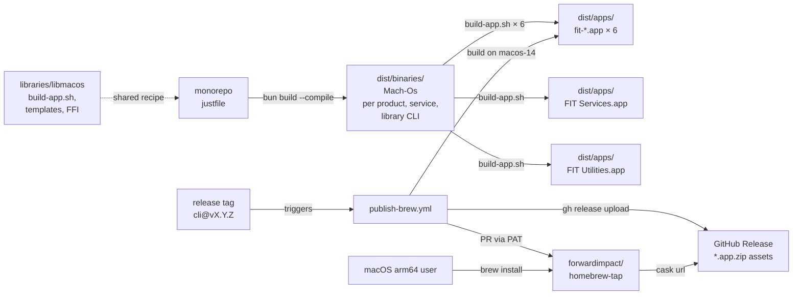

# Design 600 — Native Binary Distribution via Homebrew

See [`spec.md`](./spec.md) for WHAT/WHY. This document captures WHICH components
exist and WHERE they interact.

## Architecture



Four cooperating surfaces: a **local build pipeline** (justfile + bun +
`libmacos/scripts/build-app.sh`) used by contributors and CI, a **bundle
assembler** in `libraries/libmacos/` that every release artifact flows
through, a **release workflow** that uploads `.app.zip` artifacts and opens
cask-update PRs, and a **separate tap repository** with eight casks users
tap. The existing npm path is untouched.

## Component 1 — Native binary build (justfile)

**Entry point.** Each CLI's existing `bin/fit-<name>.js` is already a runnable
ES module — it becomes the `bun build --compile` entry unchanged. The
`#!/usr/bin/env node` shebang is a no-op in a compiled binary and the npm path
keeps using it, so no source rewrite is needed.

**Recipe shape.** One **parameterized recipe** `build-binary CLI TARGET` invokes
bun's compile bundler for a CLI × target triple. A top-level `build-binaries`
recipe fans out over the seven CLIs for the default target (`darwin-arm64`).
Exact flag set is a plan concern.

| Field          | Value                                                            |
| -------------- | ---------------------------------------------------------------- |
| Target triple  | `bun-darwin-arm64` (acceptance); `bun-darwin-x64` Phase 2        |
| Output path    | `dist/binaries/<cli>-<os>-<arch>`                                |
| Size ceiling   | 150 MB per binary (bun runtime ~60 MB + app code/deps), CI-gated |
| Startup budget | `--help` in < 500 ms cold on an M-series mac, CI-gated           |

"Phase 2" throughout this design is a placeholder for a follow-up spec that
promotes `bun-darwin-x64` from pre-reserved (target name wired in the recipe, no
CI job) to acceptance (built, released, tapped). No Phase 2 work lands here.

**Compilation is intermediate; bundles are the release artifact.**
`build-binary` runs `bun build --compile` to produce Mach-Os in
`dist/binaries/`. Those Mach-Os are **inputs** to Component 8 (bundle
assembly) and are never themselves release artifacts. The final `.app`
bundles at `dist/apps/` are what Component 2's release workflow uploads.

**Three fan-out targets.** `build-binaries` fans out into three recipes:

- `build-product-binaries` — six Mach-Os, one per product (basecamp, guide,
  landmark, map, pathway, summit).
- `build-service-binaries` — five Mach-Os from `services/*` (graph, mcp,
  pathway, trace, vector), each named `fit-service-<name>`.
- `build-utility-binaries` — ~20 Mach-Os from `libraries/*` that declare a
  `bin` field (`fit-codegen`, `fit-terrain`, `fit-eval`, `fit-doc`, `fit-rc`,
  `fit-xmr`, `fit-storage`, `fit-logger`, `fit-svscan`, `fit-trace`,
  `fit-visualize`, `fit-query`, `fit-subjects`, `fit-process-graphs`,
  `fit-process-resources`, `fit-process-vectors`, `fit-search`, `fit-unary`,
  `fit-tiktoken`, `fit-download-bundle`).

**Rejected — one recipe per CLI.** Seven near-identical recipes duplicate the
flag set; a parameterized recipe keeps flags in one place.

**Rejected — `pkg`/`nexe` bundlers.** Bun already produces single-file
executables and is our primary runtime; a second toolchain adds a parallel
dependency graph without a smaller or faster output than `bun build --compile`.

**Rejected — no budgets.** Without size/startup ceilings, bundled deps drift
silently; a cheap CI check at the build step catches regressions before release.

**Codegen as build prerequisite.** `build-binary` depends on `codegen` (the
existing `just codegen` recipe that runs `fit-codegen --all`). Generated gRPC
clients and types land in `generated/` before `bun build --compile`; bun's
bundler follows the import graph and embeds them into the executable. Generated
code is baked into every binary — brew users never run codegen.

**Rejected — lazy codegen at first run.** Requires either embedding protoc (~20
MB + ABI risk) or requiring it on `PATH` (violates zero-dependency promise).

## Component 2 — GitHub Actions release workflow

New workflow: `.github/workflows/publish-brew.yml`.

**Trigger.** Tag push matching `*@v*` — the same pattern `publish-npm.yml` uses.
A single tag fires both workflows in parallel.

**Job matrix.**

| Job              | Runner          | Per CLI | Output                                  |
| ---------------- | --------------- | ------- | --------------------------------------- |
| `build`          | `macos-14`      | matrix  | `fit-<cli>-…-darwin-arm64` + sha256     |
| `release-assets` | `macos-14`      | once    | `gh release upload` for all             |
| `tap-pr`         | `ubuntu-latest` | once    | PR against `forwardimpact/homebrew-tap` |

`macos-14` is GitHub's arm64 runner — native build, no cross-compile risk.
Matrix dimension is **CLI only** (seven parallel jobs); target stays single
until Phase 2.

**Rejected — monolithic build job.** Seven sequential builds add ~5–7 minutes;
matrix parallelism keeps release feedback under 3 minutes.

**Rejected — `release`-event trigger.** Tag push is how npm already fires;
keeping one trigger shape means one `git tag` launches both channels.

**Artifact naming.** `fit-<cli>-<version>-<os>-<arch>` (e.g.
`fit-pathway-0.25.32-darwin-arm64`). Version in the filename keeps old release
assets immutable and gives casks a stable, versioned URL. A matching `.sha256`
sidecar is uploaded alongside each binary so casks can pin the hash without a
separate manifest file.

**Interaction with `publish-npm.yml`.** Two independent workflows on the same
trigger; both read `products/<cli>/package.json` for the version, so npm and
brew cannot diverge.

## Component 3 — Homebrew tap and casks

**Tap repository.** Separate repo `forwardimpact/homebrew-tap`. Users run
`brew tap forwardimpact/tap` then
`brew install --cask forwardimpact/tap/fit-pathway`.

**Rejected — tap directory inside this monorepo.** Brew only taps repos, not
subdirectories; users would need a brittle custom tap URL. A separate repo also
lets casks be updated without a monorepo PR cycle.

**Cask vs formula.** Casks, not formulae. Formulae compile from source; casks
install prebuilt artifacts. Our bundles ship prebuilt from CI, casks unlock
`depends_on arch:` gating, and the cask `app` stanza installs `.app` bundles
to `/Applications/` out of the box.

**Tap layout — eight casks.** Six product casks plus two shared-bundle casks:

- `fit-basecamp.rb`, `fit-guide.rb`, `fit-landmark.rb`, `fit-map.rb`,
  `fit-pathway.rb`, `fit-summit.rb` — per-product casks.
- `fit-services.rb` — installs `FIT Services.app` (gRPC servers).
- `fit-utilities.rb` — installs `FIT Utilities.app` (library CLIs, including
  `fit-codegen`, `fit-terrain`, `fit-eval`, etc.).

Each product cask declares `depends_on cask: ["forwardimpact/tap/fit-services",
"forwardimpact/tap/fit-utilities"]`, so a single `brew install --cask
forwardimpact/tap/fit-<product>` pulls in the full runtime. Users who only want
the library CLIs install `fit-utilities` directly.

**Cask shape.** One cask per bundle:

| Field        | Value                                                                                                                                                                                          |
| ------------ | ---------------------------------------------------------------------------------------------------------------------------------------------------------------------------------------------- |
| `version`    | npm package version (e.g. `"0.25.32"`)                                                                                                                                                         |
| `sha256`     | sha256 of the arm64 `.app.zip`                                                                                                                                                                 |
| `url`        | `…/releases/download/<bundle>@v#{version}/<Bundle>.app-#{version}-darwin-arm64.zip`                                                                                                            |
| `app`        | `"<Bundle>.app"` — installs into `/Applications/Forward Impact/`                                                                                                                              |
| `binary`     | `"#{appdir}/Forward Impact/<Bundle>.app/Contents/MacOS/fit-<cli>"` — one `binary` line per CLI exposed by the bundle; for `fit-services` and `fit-utilities`, one line per Mach-O in `MacOS/` |
| `depends_on` | `arch: :arm64` + for product casks, `cask: ["forwardimpact/tap/fit-services", "forwardimpact/tap/fit-utilities"]`                                                                             |
| `livecheck`  | GitHub Releases API, `<bundle>@v*` tag series                                                                                                                                                  |
| `uninstall`  | `quit "com.forwardimpact.<bundle>"` for GUI bundles; (none) for headless                                                                                                                       |
| `zap`        | `trash: ~/Library/Preferences/com.forwardimpact.<bundle>.plist` + any bundle-specific caches                                                                                                   |

**Update automation — chosen: PR via PAT.** The `tap-pr` job proposes a cask
update against `forwardimpact/homebrew-tap` via a pull request that carries the
new `version` and `sha256`. Authentication is a repo secret `HOMEBREW_TAP_PAT`
scoped to the tap repo only. PR title, body, and commit message shape are plan
concerns.

**Rejected — `homebrew-releaser` action.** Opinionated about formula shape,
inflexible for per-cask `arch` gating, and hides the diff from review.
**Rejected — manual updates.** Guarantees drift between npm and brew versions.

## Component 4 — fit-guide codegen story

The spec leaves the choice open. **This design chooses option (b): the
`fit-guide` binary ships its generated gRPC artifacts baked in** (via Component
1's codegen prerequisite). Bun's compile bundler already embeds `generated/`
imports, so this option adds zero new moving parts.

`fit-codegen` is still built as a standalone binary (spec requires all seven),
but brew users of `fit-guide` never need to invoke it.

**Rejected — option (a) exclusive (fit-guide invokes fit-codegen at first
run).** Requires embedding protoc or finding it on `PATH` — violates the
zero-dependency install promise.

## Component 5 — Non-arm64 macOS behaviour

Casks use `depends_on arch: :arm64`. Homebrew's built-in arch check produces a
standard "Cask depends on hardware: ARM64" error on Intel macs and Linuxbrew —
no bespoke stub needed. Docs add one line: "Intel macOS and Linux users continue
via npm."

**Rejected — custom-stub cask with bespoke error.** Brew's native check is
already clear and discoverable; a stub is code for identical UX.

x64 macOS is not in this spec — reserved for Phase 2. The `bun-darwin-x64`
target is pre-reserved in the parameterized recipe so Phase 2 is a matrix
expansion, not a redesign.

## Component 6 — Version sync (single source of truth)

The **git tag** `<cli>@v<version>` is the single source of truth for both
channels. `publish-npm.yml` and `publish-brew.yml` resolve the version from the
same `products/<cli>/package.json` at the tagged commit; since both read the
same file in the same commit, npm and brew cannot carry different version
numbers for a given tag. The two channels can lag only in publication timing —
npm publishes directly, while brew publication waits on the tap PR being merged
by a human. No cross-workflow state is shared; the invariant is enforced by the
common tag + common file.

**Rejected — a release manifest file.** Adds a second source of truth that can
drift from `package.json`; the tag already serialises the version.

## Component 7 — Per-product documentation

Spec SC6 requires every affected product's Overview page to document the brew
install flow. Each `website/<product>/index.md` gains an **Install** section (or
extends the existing one) with two blocks: npm (unchanged) and brew (the
`brew tap` + `brew install` invocation and the Gatekeeper-warning caveat). Docs
live in the monorepo and ship through the existing website workflow — no new
publishing surface.

**Rejected — a single shared install page.** Per-product pages are the entry
points external users land on; cross-linking to a shared page doubles the click
count on the first-install path.

## Component 8 — macOS `.app` bundle assembly

Every release artifact is a `.app` bundle. Bundle assembly is a single script
— `libraries/libmacos/scripts/build-app.sh` (see Component 9) — invoked
eight times per release set (six product bundles, `FIT Services.app`,
`FIT Utilities.app`).

**Bundle layout.** Each bundle follows the standard macOS shape:

```
<Bundle>.app/
  Contents/
    Info.plist                          # from libmacos template, per-bundle substitutions
    MacOS/
      <primary-executable>              # CFBundleExecutable
      <additional Mach-Os for shared bundles>
    Resources/
      <per-bundle resources, e.g. icons, templates>
    _CodeSignature/                     # produced by codesign
```

Per-bundle specifics:

| Bundle              | `CFBundleIdentifier`           | `CFBundleExecutable` | Extras in `MacOS/`                                |
| ------------------- | ------------------------------ | -------------------- | ------------------------------------------------- |
| `fit-basecamp.app`  | `com.forwardimpact.basecamp`   | `Basecamp` (Swift)   | `fit-basecamp` (bun scheduler)                    |
| `fit-guide.app`     | `com.forwardimpact.guide`      | `fit-guide`          | —                                                 |
| `fit-landmark.app`  | `com.forwardimpact.landmark`   | `fit-landmark`       | —                                                 |
| `fit-map.app`       | `com.forwardimpact.map`        | `fit-map`            | —                                                 |
| `fit-pathway.app`   | `com.forwardimpact.pathway`    | `fit-pathway`        | —                                                 |
| `fit-summit.app`    | `com.forwardimpact.summit`     | `fit-summit`         | —                                                 |
| `FIT Services.app`  | `com.forwardimpact.services`   | `fit-service-graph`  | `fit-service-{mcp,pathway,trace,vector}`          |
| `FIT Utilities.app` | `com.forwardimpact.utilities`  | `fit-codegen`        | 19 other `fit-*` library CLIs                     |

`FIT Services.app` and `FIT Utilities.app` are bundles-as-container:
`CFBundleExecutable` names a single "primary" Mach-O to satisfy the bundle
shape, but every Mach-O in `Contents/MacOS/` is independently exposed via
its cask's `binary` stanza (Component 3).

**Hardening.** After assembly, each bundle is ad-hoc codesigned:

```
codesign --force --sign - \
  --entitlements <bundle-entitlements>.plist \
  --options runtime \
  --identifier com.forwardimpact.<name> \
  --deep \
  dist/apps/<Bundle>.app
```

`--identifier` fixes the designated requirement, so TCC grants keyed on
the bundle ID survive rebuilds. `--options runtime` enables Hardened
Runtime so the JIT entitlement applies and the later Developer ID spec is
a pure identity swap. `--deep` recursively signs every Mach-O under
`Contents/MacOS/`, giving `FIT Services.app` and `FIT Utilities.app` a
single codesign pass over their multi-executable contents.

**Rejected — bare Mach-Os with `__TEXT,__info_plist` embedding.** An
earlier iteration of this design proposed splicing `Info.plist` into the
Mach-O section table. That required an Xcode-CLI-tools spike, was fragile
against future bun runtime changes, and left Homebrew without a clean
PATH symlink story. Bundles eliminate the whole problem — `Info.plist`
lives on disk at `Contents/Info.plist`.

**Rejected — one `.app` per library CLI.** Would produce ~20 `fit-*.app`
bundles from `libraries/` plus five from `services/`. Each would need
its own Info.plist, entitlements, codesign pass, and Homebrew cask;
coarsening into two shared bundles cuts signing surface from 31 to 8
without losing TCC granularity (none of the library CLIs or services
request TCC resources today).

**Rejected — skip hardening under ad-hoc signing.** The follow-up
Developer ID spec would have to re-add every metadata piece and force a
cdhash change across every previously-installed user, wiping TCC grants.
Landing hardening now is near-free and forward-compatible.

## Component 9 — Shared `libraries/libmacos`

New library: `libraries/libmacos/`. Owns every piece of macOS-specific
surface shared across bundles.

| Module                             | Contents                                                                                                                          |
| ---------------------------------- | --------------------------------------------------------------------------------------------------------------------------------- |
| `src/posix-spawn.js`               | Bun FFI wrapper around `posix_spawn` + `responsibility_spawnattrs_setdisclaim`. Lifted verbatim from `products/basecamp/src/posix-spawn.js`. |
| `src/tcc-responsibility.js`        | Higher-level helper: spawn a child, disclaim TCC responsibility, return a Promise for exit code. Wraps `posix-spawn.js`.          |
| `scripts/build-app.sh`             | **Bundle assembler.** Generalized from `products/basecamp/pkg/macos/build-app.sh`. Parameterized on bundle name, identifier, executable list, entitlements path, resource list, version. |
| `scripts/sign-app.sh`              | Ad-hoc `codesign --force --sign - --options runtime --deep --identifier <id> --entitlements <path>` wrapper. Invoked by `build-app.sh` as its final stage. |
| `templates/entitlements.plist`     | Default entitlements (JIT + disable-library-validation only).                                                                     |
| `templates/entitlements-gui.plist` | Extended template for GUI bundles that need Calendar/Contacts/Network access; seeded from basecamp's current `Basecamp.entitlements`. |
| `templates/Info.plist.hbs`         | `Info.plist` template with `{{bundleId}}`, `{{bundleName}}`, `{{executable}}`, `{{version}}`, `{{minOS}}`, `{{lsuiElement}}` placeholders. |

**Adoption.** Basecamp is the first consumer. Its current
`src/posix-spawn.js` becomes `import { spawn } from "libmacos/spawn"`.
Its `pkg/macos/build-app.sh` is deleted; basecamp's justfile `build-app`
recipe calls `libmacos/scripts/build-app.sh` with basecamp-specific
arguments (Swift launcher as `CFBundleExecutable`, `fit-basecamp` as a
secondary Mach-O in `Contents/MacOS/`, `Basecamp.entitlements` as the
entitlements path, `LSUIElement=true`). The other five products,
`FIT Services.app`, and `FIT Utilities.app` call the same script with
their own arguments.

**Scope boundary.** `libmacos` does **not** own:

- Swift launcher source — basecamp's Swift target stays with basecamp.
- `.pkg` installer flow — basecamp's `build-pkg.sh` stays with basecamp
  for as long as the `.pkg` channel remains; spec 600's distribution
  channel is Homebrew.
- Developer ID signing / notarization — follow-up spec.

**Rejected — put this in `libcli` or `libbuild`.** `libcli` is
cross-platform, and consuming a macOS-only FFI would bleed Darwin code
into every CLI's import graph. A dedicated `libmacos` library makes the
boundary obvious and lets `libmacos/package.json` declare
`"os": ["darwin"]`.

**Rejected — leave `build-app.sh` in basecamp and have each bundle copy
it.** Eight copies of a 70-line assembler script guarantee drift. Lifting
into libmacos is the natural home given `posix-spawn.js` and the
templates already want to live there.

## Open questions for plan phase

- **Tap repo bootstrap.** Whether `forwardimpact/homebrew-tap` is created fresh,
  seeded with empty casks the first release populates, or seeded with a manual
  initial cask. Bootstrapping only happens once, but it changes which CI steps
  are idempotent vs. first-run-only.
- **Gatekeeper UX copy baseline.** Signing is deferred per spec; the design
  commits to a caveat block on Overview pages, but the exact wording and where
  it sits relative to the install command is a plan concern.
