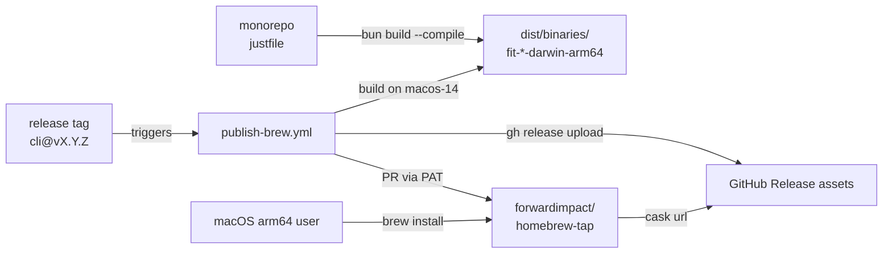

# Design 600 — Native Binary Distribution via Homebrew

See [`spec.md`](./spec.md) for WHAT/WHY. This document captures WHICH components
exist and WHERE they interact.

## Architecture

Three cooperating surfaces: a **local build pipeline** (justfile + bun) used by
contributors and CI, a **release workflow** that uploads artifacts and opens a
cask-update PR, and a **separate tap repository** users tap. The existing npm
path is untouched.

## Component 1 — Native binary build (justfile)

**Entry point.** Each CLI's existing `bin/fit-<name>.js` is already a runnable
ES module — it becomes the `bun build --compile` entry unchanged. The
`#!/usr/bin/env node` shebang is a no-op in a compiled binary and the npm path
keeps using it, so no source rewrite is needed.

**Recipe shape.** One **parameterized recipe** `build-binary CLI TARGET` invokes
bun's compile bundler for a CLI × target triple. A top-level `build-binaries`
recipe fans out over the seven CLIs for the default target (`darwin-arm64`).
Exact flag set is a plan concern.

| Field          | Value                                                     |
| -------------- | --------------------------------------------------------- |
| Target triple  | `bun-darwin-arm64` (acceptance); `bun-darwin-x64` Phase 2 |
| Output path    | `dist/binaries/<cli>-<os>-<arch>`                         |
| Size ceiling   | 150 MB per binary (bun runtime ~60 MB + app code/deps)    |
| Startup budget | `--help` in < 500 ms cold on an M-series mac              |

**Rejected — one recipe per CLI.** Seven near-identical recipes duplicate the
flag set; a parameterized recipe keeps flags in one place.

**Rejected — `pkg`/`nexe` bundlers.** Bun already produces single-file
executables and is our primary runtime; a second toolchain adds surface for no
gain.

**Codegen as build prerequisite.** `build-binary` depends on `codegen` (the
existing `just codegen` recipe that runs `fit-codegen --all`). Generated gRPC
clients and types land in `generated/` before `bun build --compile`; bun's
bundler follows the import graph and embeds them into the executable. Generated
code is baked into every binary — brew users never run codegen.

**Rejected — lazy codegen at first run.** Requires either embedding protoc (~20
MB + ABI risk) or requiring it on `PATH` (violates zero-dependency promise).

## Component 2 — GitHub Actions release workflow

New workflow: `.github/workflows/publish-brew.yml`.

**Trigger.** Tag push matching `*@v*` — the same pattern `publish-npm.yml` uses.
A single tag fires both workflows in parallel.

**Job matrix.**

| Job              | Runner          | Per CLI | Output                                  |
| ---------------- | --------------- | ------- | --------------------------------------- |
| `build`          | `macos-14`      | matrix  | `fit-<cli>-…-darwin-arm64` + sha256     |
| `release-assets` | `macos-14`      | once    | `gh release upload` for all             |
| `tap-pr`         | `ubuntu-latest` | once    | PR against `forwardimpact/homebrew-tap` |

`macos-14` is GitHub's arm64 runner — native build, no cross-compile risk.
Matrix dimension is **CLI only** (seven parallel jobs); target stays single
until Phase 2.

**Rejected — monolithic build job.** Seven sequential builds add ~5–7 minutes;
matrix parallelism keeps release feedback under 3 minutes.

**Rejected — `release`-event trigger.** Tag push is how npm already fires;
keeping one trigger shape means one `git tag` launches both channels.

**Artifact naming.** `fit-<cli>-<version>-<os>-<arch>` (e.g.
`fit-pathway-0.25.32-darwin-arm64`). Version in the filename keeps old release
assets immutable and gives casks a stable, versioned URL. A matching `.sha256`
sidecar is uploaded alongside each binary so casks can pin the hash without a
separate manifest file.

**Interaction with `publish-npm.yml`.** Two independent workflows on the same
trigger; both read `products/<cli>/package.json` for the version, so npm and
brew cannot diverge.

## Component 3 — Homebrew tap and casks

**Tap repository.** Separate repo `forwardimpact/homebrew-tap`. Users run
`brew tap forwardimpact/tap` then `brew install forwardimpact/tap/fit-pathway`.

**Rejected — tap directory inside this monorepo.** Brew only taps repos, not
subdirectories; users would need a brittle custom tap URL. A separate repo also
lets casks be updated without a monorepo PR cycle.

**Cask vs formula.** Casks, not formulae. Formulae compile from source; casks
install prebuilt artifacts. Our binaries ship prebuilt from CI, and casks unlock
`depends_on arch:` gating.

**Cask shape.** One cask per CLI at `Casks/fit-<cli>.rb`:

| Field        | Value                                                                     |
| ------------ | ------------------------------------------------------------------------- |
| `version`    | npm package version (e.g. `"0.25.32"`)                                    |
| `sha256`     | sha256 of the arm64 binary                                                |
| `url`        | `…/releases/download/<cli>@v#{version}/fit-<cli>-#{version}-darwin-arm64` |
| `binary`     | artifact, renamed to `fit-<cli>` on install                               |
| `depends_on` | `arch: :arm64` — blocks install on non-arm64                              |
| `livecheck`  | GitHub Releases API, `<cli>@v*` tag series                                |
| `zap`        | no-op — CLIs are stateless; user data in `data/*` is theirs               |

**Update automation — chosen: PR via PAT.** The `tap-pr` job proposes a cask
update against `forwardimpact/homebrew-tap` via a pull request that carries the
new `version` and `sha256`. Authentication is a repo secret
`HOMEBREW_TAP_PAT` scoped to the tap repo only. PR title, body, and commit
message shape are plan concerns.

**Rejected — `homebrew-releaser` action.** Opinionated about formula shape, less
flexible for per-cask `arch` gating, and hides the diff from review.

**Rejected — manual updates.** Guarantees drift between npm and brew versions.

## Component 4 — fit-guide codegen story

The spec leaves the choice open. **This design chooses option (b): the
`fit-guide` binary ships its generated gRPC artifacts baked in** (via Component
1's codegen prerequisite). Bun's compile bundler already embeds `generated/`
imports, so this option adds zero new moving parts.

`fit-codegen` is still built as a standalone binary (spec requires all seven),
but brew users of `fit-guide` never need to invoke it.

**Rejected — option (a) exclusive (fit-guide invokes fit-codegen at first
run).** Requires embedding protoc or finding it on `PATH` — violates the
zero-dependency install promise.

## Component 5 — Non-arm64 macOS behaviour

Casks use `depends_on arch: :arm64`. Homebrew's built-in arch check produces a
standard "Cask depends on hardware: ARM64" error on Intel macs and Linuxbrew —
no bespoke stub needed. Docs add one line: "Intel macOS and Linux users continue
via npm."

**Rejected — custom-stub cask with bespoke error.** Brew's native check is
already clear and discoverable; a stub is code for identical UX.

x64 macOS is not in this spec — reserved for Phase 2. The `bun-darwin-x64`
target is pre-reserved in the parameterized recipe so Phase 2 is a matrix
expansion, not a redesign.

## Component 6 — Version sync (single source of truth)

The **git tag** `<cli>@v<version>` is the single source of truth for both
channels. `publish-npm.yml` and `publish-brew.yml` resolve the version from the
same `products/<cli>/package.json` at the tagged commit; since both read the
same file in the same commit, npm and brew cannot carry different version
numbers for a given tag. The two channels can lag only in publication timing —
npm publishes directly, while brew publication waits on the tap PR being merged
by a human. No cross-workflow state is shared; the invariant is enforced by the
common tag + common file.

**Rejected — a release manifest file.** Adds a second source of truth that can
drift from `package.json`; the tag already serialises the version.

## Component 7 — Per-product documentation

Spec SC6 requires every affected product's Overview page to document the brew
install flow. Each `website/<product>/index.md` gains an **Install** section (or
extends the existing one) with two blocks: npm (unchanged) and brew (the
`brew tap` + `brew install` invocation and the Gatekeeper-warning caveat).
Docs live in the monorepo and ship through the existing website workflow — no
new publishing surface.

**Rejected — a single shared install page.** Per-product pages are the entry
points external users land on; cross-linking to a shared page doubles the click
count on the first-install path.

## Open questions for plan phase

- **Tap repo bootstrap.** Whether `forwardimpact/homebrew-tap` is created fresh,
  seeded with empty casks the first release populates, or seeded with a manual
  initial cask. Bootstrapping only happens once, but it changes which CI steps
  are idempotent vs. first-run-only.
- **Gatekeeper UX copy baseline.** Signing is deferred per spec; the design
  commits to a caveat block on Overview pages, but the exact wording and where
  it sits relative to the install command is a plan concern.
