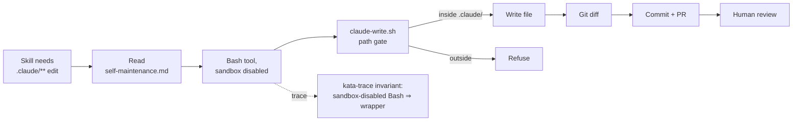

# Design 610 — Agent Self-Maintenance Under `.claude/**` Write Protection

## Overview

Three components bridge the `.claude/**` write gap until Anthropic issues
[claude-code#38806](https://github.com/anthropics/claude-code/issues/38806)
(regression in v2.1.78 where documented `bypassPermissions` exemptions for
`.claude/commands|agents|skills` are not honored): a path-gated wrapper script,
a canonical agent reference, and a kata-trace invariant. In parallel,
`.claude/settings.json` is moved to the configuration Anthropic's docs prescribe
for that exemption, so the settings file is correct at the target state and no
edit is required once the upstream regression is fixed. The wrapper retires by
deletion; settings stay as-is.

## Architecture

## Components

### 1. `scripts/claude-write.sh` — path-gated writer

The only approved destination for a `dangerouslyDisableSandbox: true` Bash call.
Takes a target path and file content as inputs and writes the content to the
target **iff the target's resolved location is strictly inside the repo's
`.claude/` subtree**. Any other target is refused without a write. Failure is
non-silent (the caller sees a distinct exit status); success leaves the working
tree modified and nothing else. The gate is the only behaviour — no git calls,
no hook invocations. Review stays at the commit boundary where it already lives.

The script lives outside `.claude/**` so agents can normally edit it without
needing the escape hatch to change its own rules.

### 2. `.claude/agents/references/self-maintenance.md` — canonical reference

A new sibling of `memory-protocol.md`. Agent profiles' existing startup surface
includes that directory, so placing the reference there makes it reachable
without a new startup-tier rule.

The reference is the single canonical source for four facts: the rule (every
`.claude/**` edit goes through the wrapper), the invocation contract (one
Bash-tool shape, stdin-delivered content, sandbox-disabled), the refusal surface
(what is out of scope and what a refused write looks like), and a pointer to the
kata-trace invariant enforcing uniform use. Wording is plan-level.

### 3. `.claude/settings.json` — target-state configuration

`defaultMode` moves from `acceptEdits` to `bypassPermissions`. The
`permissions.allow` list is rewritten to the three `.claude/` subpaths
Anthropic's docs enumerate as exempt in `bypassPermissions` mode
(`.claude/commands/**`, `.claude/agents/**`, `.claude/skills/**`, each for
`Edit` and `Write`).

These rules do not grant writes today — the same regression the spec documents
still blocks them. They will grant writes the moment
[claude-code#38806](https://github.com/anthropics/claude-code/issues/38806)
lands, at which point the wrapper becomes redundant and is retired. The settings
file is therefore correct at target state on day one; retirement requires no
settings edit.

This sits in tension with SC3 as literally read: every allow entry must grant
writes under trace evidence today. The design reads SC3's intent ("settings must
not lie about capability") as honored when rules match Anthropic's published
exemption contract, even when a current regression prevents the contract from
being fulfilled. PR #470's rules were aspirational with no documented basis; the
new rules track documented behaviour.

### 4. kata-trace invariant — uniform use

`.claude/skills/kata-trace/references/invariants.md` gains one cross-cutting
invariant applicable to every agent trace:

| Invariant                                                         | Evidence                                                                                                                                  | Severity |
| ----------------------------------------------------------------- | ----------------------------------------------------------------------------------------------------------------------------------------- | -------- |
| `dangerouslyDisableSandbox: true` only used to invoke the wrapper | Every turn with `tool=="Bash"` and `input.dangerouslyDisableSandbox==true` has a `command` beginning with `bash scripts/claude-write.sh ` | **High** |

Violation evidence surfaces in the existing per-run invariant audit. This is the
mechanical enforcement that SC6 (no skill invents its own workaround) depends
on.

### 5. Skill citations

Skills whose plans write under `.claude/**` (`kata-documentation`,
`kata-wiki-curate`, any skill editing its own `references/` subdir) cite the
canonical reference in their Process section with a one-line pointer. Which
skills cite it is a plan-level enumeration, not a design question.

## Key Decisions

### Wrapper script, not raw heredoc pattern

Alternatives considered:

- **Documented raw pattern (per spec candidate 1).** Rejected. Each skill
  assembles its own `sed -i` or here-doc invocation. Path validation lives in
  prose, not in code — nothing prevents a skill from writing to `.git/**` or
  `.github/**` once the sandbox is disabled. The trace invariant would need a
  more complex match (argv pattern + path substring) and the spec's "ad-hoc
  per-skill reinvention" prohibition has no teeth.
- **Staging directory + Stop-hook copy (per spec candidate 2).** Rejected.
  Agents write to `/tmp/claude-writes/...` and a Stop hook mirrors into
  `.claude/**`. Breaks read-after-write within a run: the agent reads the old
  `.claude/**` content until the hook fires at Stop. If the run dies before
  Stop, writes are lost. Adds hook surface that duplicates the git commit
  boundary already enforced by wrapper writes.
- **Runtime/permission-mode change alone (per spec candidate 3).** Rejected as
  sufficient. Anthropic's docs prescribe `bypassPermissions` with
  `.claude/commands|agents|skills` exempt — Component 3 adopts it — but it is
  inert today due to regression
  [claude-code#38806](https://github.com/anthropics/claude-code/issues/38806)
  (open, no fix ETA). PR #470's prior settings-layer attempt used the wrong
  shape and the trace proved it inert. The wrapper bridges until the regression
  is fixed, then retires.
- **Human-only edits (per spec candidate 4).** Rejected. Fails SC2 — the spec
  requires a newly-scheduled agent run to complete a `.claude/**` edit without
  human intervention. Also accepts permanent latency for 47 files.

The wrapper is small (shell script, one gate), observable (stable trace
signature `bash scripts/claude-write.sh ...`), and composable with the existing
commit + PR review boundary.

### Reference lives under `.claude/agents/references/`, not a new top-level doc

Alternatives:

- **`CONTRIBUTING.md` section.** Rejected. Every CLAUDE.md policy entry is
  already canonical in one location; adding a section here spreads the rule
  across two files. Agents read `CONTRIBUTING.md` only when the skill directs
  them — it is not on the startup surface the spec requires.
- **`.claude/memory/MEMORY.md` addition.** Rejected. MEMORY.md is the
  cross-cutting priority index per spec 590; policies do not belong there.
- **`.claude/references/` (new top-level dir).** Rejected. Creates a parallel
  directory to `.claude/agents/references/`; agents would need a new
  startup-tier rule to find it. Sibling placement reuses the protocol already in
  every agent profile.

### Path gate resolves before it compares

The gate must resolve `..` segments and follow symlinks before the
inside-`.claude/`-subtree check, not compare the raw input string. Correctness
is non-negotiable when the sandbox is disabled: a raw-string prefix match admits
`.claude/../anywhere` and symlinks pointing out of the subtree.

Alternative — string-prefix match on the caller-supplied path. Rejected. Any
accidental `..` segment or symlink slips the gate. Plan selects the resolver
tool and syntax.

### Configure for target state, not runtime-today

Alternatives:

- **Strict SC3-today: remove all allow rules, add none.** Rejected. Correct in
  isolation but would need a second edit (adding the documented allow rules)
  when #38806 lands. Front-loading the target configuration eliminates that
  migration step; the rules advertise capability the runtime is documented to
  grant, not a fabricated guess.
- **Add `Bash(bash scripts/claude-write.sh *)` to allow.** Rejected at design
  level pending plan-time evidence. Plan decides whether the Bash invocation
  itself needs an allow entry; the trace evidence (product-manager run
  `24757518688`) succeeded without one.

### Retirement

The wrapper and its supporting machinery are designed to be deleted:

- Delete `scripts/claude-write.sh`.
- Delete `.claude/agents/references/self-maintenance.md`.
- Remove the kata-trace cross-cutting invariant from `invariants.md`.
- Remove skill citations (one-line pointers in each citing skill's Process
  section).

`.claude/settings.json` is unchanged at retirement — it was written to the
target state in Component 3.

Trigger: #38806 closes and a test `Edit`/`Write` on `.claude/skills/**`
succeeds. The kata-trace invariant's zero-use window across a week confirms the
wrapper is no longer reached, and it is deleted.

## Success-criteria alignment

| SC  | How the design satisfies it                                                                                                                                                         |
| --- | ----------------------------------------------------------------------------------------------------------------------------------------------------------------------------------- |
| 1   | `.claude/agents/references/self-maintenance.md` is the canonical reference, located on existing agent startup surface.                                                              |
| 2   | Wrapper + heredoc Bash call is the documented invocation; trace shows the tool call and no permission-denial error.                                                                 |
| 3   | Settings file tracks Anthropic's documented exemption contract; PR #470's aspirational rules replaced with ones grounded in docs. Design reinterprets SC3 intent — see Component 3. |
| 4   | Plan reopens #441 and closes it via the wrapper path, trace-verified.                                                                                                               |
| 5   | kata-trace emits a two-week comparative report of `.claude/**` permission-denial counts into `wiki/metrics/improvement-coach/`; wrapper path yields zero post-fix.                  |
| 6   | kata-trace invariant enforces wrapper use; no skill invents its own escape hatch.                                                                                                   |
| 7   | Wrapper is a dormant script; `fit-map validate`, `just quickstart`, wiki pipelines are unchanged.                                                                                   |
