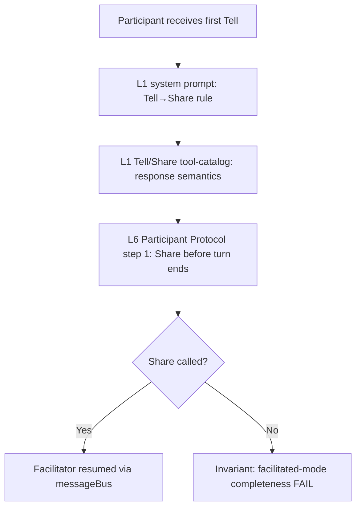
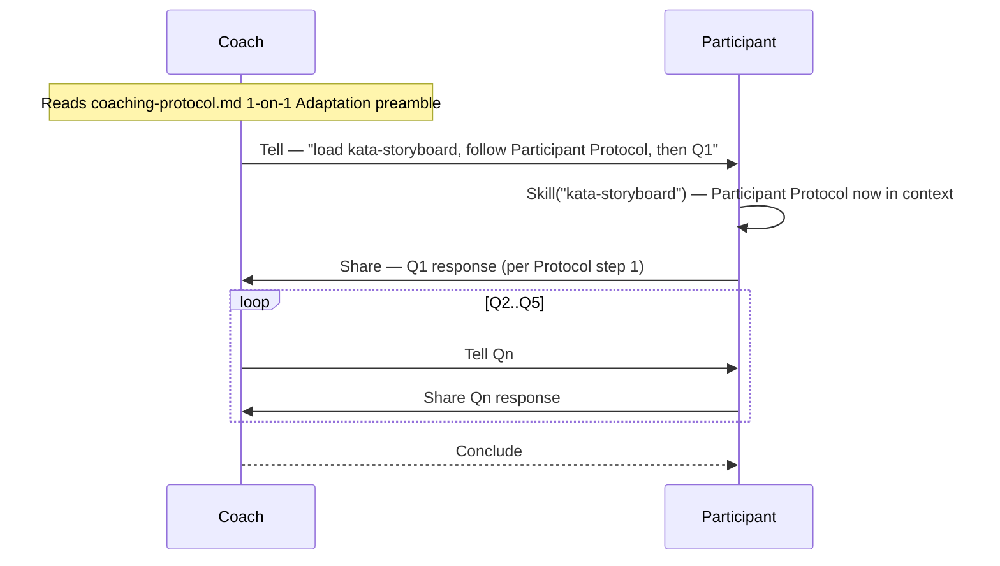

# Design 620 — Facilitated Tell→Share Response Protocol

## Problem (restated)

Facilitated participants lack any instruction that a `Tell` requires a `Share`
response. The facilitator side is enforced (`FACILITATOR_SYSTEM_PROMPT`,
`facilitator.js:30-33`); the participant side survives only because
team-storyboard Q2 `Tell`s end with "then Share". 1-on-1 coaching has no such
template and stalls after Q1. Fix: state the rule at each layer the participant
reads, deliver the Participant Protocol into the 1-on-1 context, and catalogue
an invariant so the silent hang surfaces in audits.

## Components

Six change sites spanning four of the eight instruction layers defined in
[KATA.md § Instruction layering](../../KATA.md#instruction-layering). Layer
numbers below refer to that model — L1 = libeval system prompt + relay
mechanics, L4 = workflow task, L6 = skill procedure (`SKILL.md`), L7 = skill
references (`references/*.md`).

| Layer              | Component                                                                      | Role                                                      |
| ------------------ | ------------------------------------------------------------------------------ | --------------------------------------------------------- |
| L1 (system prompt) | `FACILITATED_AGENT_SYSTEM_PROMPT`                                              | Mode-universal base rule                                  |
| L1 (tool server)   | `createFacilitatedAgentToolServer`                                             | Tool-catalog reinforcement                                |
| L6                 | `kata-storyboard/SKILL.md` § Participant Protocol                              | Mode-agnostic step list                                   |
| L7                 | `kata-storyboard/references/coaching-protocol.md` § 1-on-1 Coaching Adaptation | Invokes Participant Protocol; carries skill-load preamble |
| L4                 | `.github/workflows/kata-coaching.yml`                                          | Minimal task-text, skill-delivery input                   |
| L7                 | `kata-trace/references/invariants.md`                                          | Facilitated-mode completeness invariant                   |

## Architecture

### Defence-in-depth rule placement

The rule is stated once per layer, progressively more specific. Per
[KATA.md § Instruction layering](../../KATA.md#instruction-layering), L1 is
descriptive (tool semantics) and L6 is procedural (steps): L1 names the
Tell→Share response semantic, L6 requires the call.

**Rejected: single layer only.** If the participant misses that layer (skill not
loaded, prompt truncation, SDK update), the rule vanishes. Defence in depth
costs four short edits.

**Rejected: stronger enforcement in `facilitator.js`** (auto-inject a
Share-reminder when an agent's turn ends without Share). Infrastructure that
repairs a protocol violation masks it from trace audits, where spec 620 Success
Criterion 3 needs it to be visible.

### L1: participant system-prompt rule

`FACILITATED_AGENT_SYSTEM_PROMPT` gains one sentence stating the Tell→Share
response semantic, symmetric in shape to the facilitator's existing rule at
`facilitator.js:30-33`. Final wording belongs in the plan; the architectural
commitment is (a) a single sentence, (b) appended to the constant, (c)
describing the contract without new imperatives beyond the minimum needed to
teach it.

### L1: agent-side Tool-catalog descriptions

`createFacilitatedAgentToolServer` `Share` description gains an addendum naming
the "respond to a facilitator Tell" use of the tool. Agent-side `Tell`
description is left unchanged.

**Rejected: describe response via `Tell` back to the facilitator.** Works
mechanically but loses cross-domain visibility (spec 490).

**Rejected: mirror the addendum on agent-side `Tell`.** Participants in current
workflows do not Tell each other; adding the rule there both increases surface
without protocol benefit and risks suggesting agent-to-agent Tell as a response
pattern, which is not the contract.

### L6: universal Participant Protocol

`kata-storyboard/SKILL.md` § Participant Protocol gains a universal step for the
Tell→Share response rule ahead of its mode-specific steps (CSV recording,
metrics sharing). Whether the universal step is prepended with renumbering or
appears as an unnumbered preamble is a plan-level choice; the architectural
commitment is that the rule appears once in the Protocol, in mode-agnostic form,
before any mode-specific content.

**Rejected: duplicate the rule in both the Team and 1-on-1 adaptations.**
Divergence risk; the rule is mode-agnostic by construction.

### L7: 1-on-1 Coaching Adaptation invokes the Participant Protocol

`references/coaching-protocol.md` § 1-on-1 Coaching Adaptation gains a preamble
that explicitly invokes the Participant Protocol in `SKILL.md` — making the
universal Tell→Share step apply by reference rather than by inheritance. The
existing question table follows as the mode-specific overlay. Preamble wording
is a plan concern.

### L4: coaching workflow task-text

`.github/workflows/kata-coaching.yml` `task-text` is reduced to the same shape
as `kata-storyboard.yml`: a single sentence that dispatches to the skill and
names no participant-side work. The Q1-content prescription and the `kata-trace`
assignment leave the workflow; `kata-trace` is reached under Q2 via the skill's
existing `coaching-protocol.md` § Q2 guidance once the round-trip protocol
works. Final wording is a plan choice.

### Participant-Protocol delivery to 1-on-1 participants

**Chosen: the 1-on-1 Coaching Adaptation section of `coaching-protocol.md`
carries the skill-load preamble.** The section already guides the coach through
the five questions in 1-on-1 mode (the coach reads it at Step 4 of the existing
Facilitator Process). Adding a preamble there — "before Q1, instruct the
participant to load `kata-storyboard` and follow its Participant Protocol" —
puts the skill-load directive into the coach's first `Tell` to the participant
without changing the Facilitator Process step list in `SKILL.md`. Spec SC 6
(Facilitator Process unchanged) is preserved because the only modification to
`SKILL.md` stays within the Participant Protocol section, as SC 6 explicitly
permits.

**Rejected: add an opening step to the Facilitator Process in `SKILL.md`.** Spec
SC 6 constrains the Facilitator Process to be unchanged; adding a new step would
expand scope beyond what the spec allows.

**Rejected: workflow `task-text` carries the protocol.** Couples protocol
content to workflow config; every edit to the Protocol forces a workflow change,
and the facilitate command only delivers `task-text` to the facilitator, not to
participants.

**Rejected: agent-profile addendum.** Would bleed into every non-facilitated
invocation of each domain agent, confusing solo runs.

**Rejected: direct `Skill("kata-storyboard")` at participant session start via a
facilitator.js change.** Requires infrastructure to inject a skill load into the
participant's initial prompt, preferring infrastructure over an
instruction-layer fix.

### Facilitated-mode completeness invariant

A new `## Facilitator traces` table in `kata-trace/references/invariants.md`
with two rows (spec SC 3). The evidence interface each row requires, at the
architectural level:

| Invariant                                         | Evidence signature                                                                               | Severity |
| ------------------------------------------------- | ------------------------------------------------------------------------------------------------ | -------- |
| Every addressed participant responded via `Share` | Set of distinct `Tell.to` values ⊆ set of distinct `Share` source values over the combined trace | **High** |
| Session closed with exactly one `Conclude`        | Count of `Conclude` tool calls from the facilitator source equals 1                              | **High** |

Both signatures are computable from combined-trace tool-call records already
produced by `facilitator.js`'s trace splitter — no new trace instrumentation.
The concrete `fit-trace` query shape belongs in the plan (or inline in the
invariant entry itself, the pattern the other tables in that file already
follow).

**Rejected: agent-typed invariant** (under `improvement-coach traces`). The
contract is facilitated-mode, not coach-specific — any future facilitator
benefits from the same audit.

## Key Decisions

| Decision                    | Chosen                                                        | Rejected                                                                             | Why                                                    |
| --------------------------- | ------------------------------------------------------------- | ------------------------------------------------------------------------------------ | ------------------------------------------------------ |
| Rule placement              | Defence in depth across L1 system prompt + L1 tools + L6 + L7 | Single layer                                                                         | Survives skill-load gaps and SDK updates               |
| Enforcement site            | Instruction layers                                            | Auto-inject in `facilitator.js`                                                      | Keeps violation visible to invariant audit (SC 3)      |
| Participant Protocol shape  | Universal rule before mode-specific steps                     | Duplicate per mode                                                                   | No divergence; single source of truth                  |
| Response tool               | `Share`                                                       | `Tell` back to facilitator                                                           | Cross-domain visibility (spec 490)                     |
| Protocol delivery to 1-on-1 | Preamble in `coaching-protocol.md` § 1-on-1 Adaptation        | Opening step in Facilitator Process; `task-text`; profile addendum; infra skill-load | Stays within spec SC 6 (Facilitator Process unchanged) |
| `task-text` shape           | Single sentence                                               | Keep prescription                                                                    | Matches `kata-storyboard.yml`; spec SC 4               |
| Invariant scope             | Facilitated-mode (any facilitator)                            | Coach-specific                                                                       | Generalises to future facilitators                     |

## Out of Scope

Per spec 620: facilitator-side system prompt and tool descriptions, the
`Facilitator` class orchestration logic, `kata-storyboard.yml` workflow,
behavioural recovery (retry/timeout shortening), and any redesign of
facilitated-agent identity. This design makes no changes to those surfaces.
