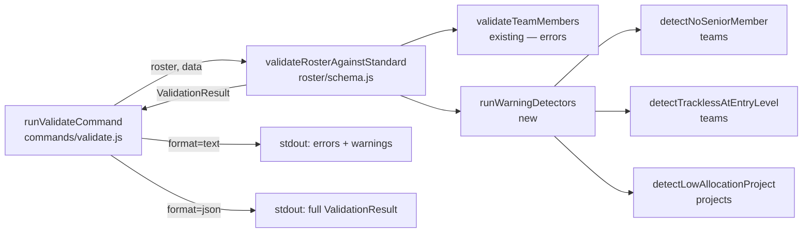
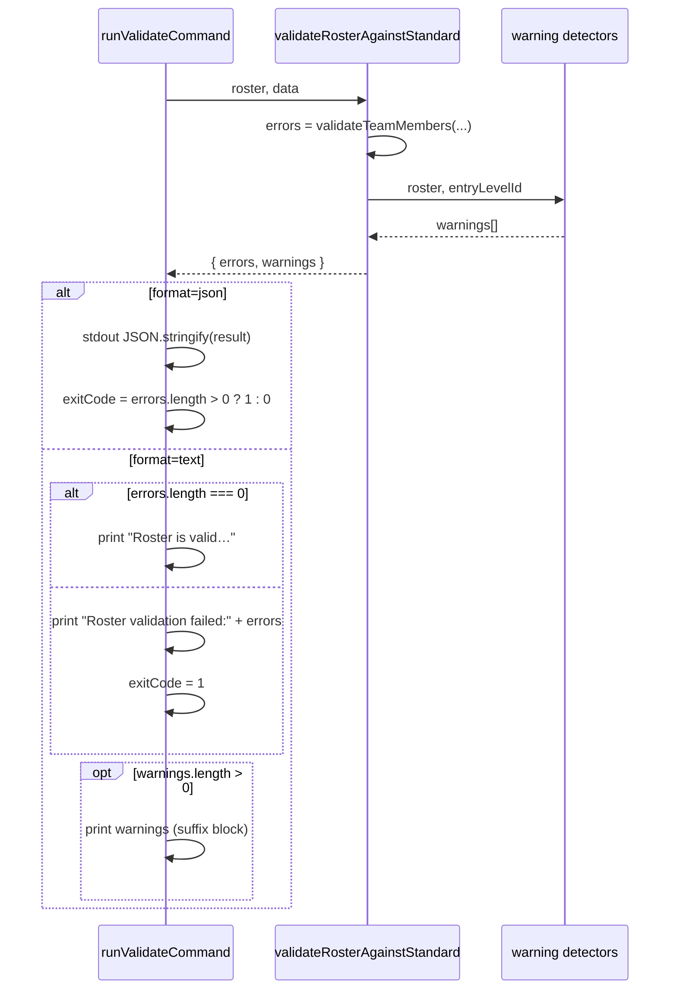

# Design 630-A — Summit Validate Composition Warnings

See [`spec.md`](./spec.md) for WHAT/WHY. This document captures WHICH components
exist, WHERE they interact, and the architectural decisions behind detection,
display, and serialization of composition warnings.

## Components



| Component                       | Home                                        | Role                                                                                                                |
| ------------------------------- | ------------------------------------------- | ------------------------------------------------------------------------------------------------------------------- |
| `validateRosterAgainstStandard` | `roster/schema.js` (existing)               | Orchestrator. Computes `entryLevelId` once, runs error pass, runs warning pass, returns `{ errors, warnings }`.     |
| `validateTeamMembers`           | `roster/schema.js` (existing, unchanged)    | Per-member ID-existence checks. Continues to populate `errors` only.                                                |
| `runWarningDetectors`           | `roster/schema.js` (new, private)           | Fans out across `roster.teams` and `roster.projects`, calling each detector and concatenating its `Issue[]` output. |
| `detectNoSeniorMember`          | `roster/schema.js` (new, private)           | Per reporting team: emits one `NO_SENIOR_MEMBER` if every member is at `entryLevelId`.                              |
| `detectTracklessAtEntryLevel`   | `roster/schema.js` (new, private)           | Per reporting team member: emits `TRACKLESS_AT_ENTRY_LEVEL` if `level === entryLevelId` and `track` is unset.       |
| `detectLowAllocationProject`    | `roster/schema.js` (new, private)           | Per project: emits one `LOW_ALLOCATION_PROJECT` if every member has `allocation < 0.5`.                             |
| `runValidateCommand`            | `commands/validate.js` (existing, modified) | Adds a warning-emit branch in the text formatter only. JSON branch is unchanged — `warnings` already round-trips.   |

## Data flow



## Key Decisions

| #   | Decision                                                                                               | Rejected alternative                                                                                                                                  |
| --- | ------------------------------------------------------------------------------------------------------ | ----------------------------------------------------------------------------------------------------------------------------------------------------- |
| 1   | Warnings live next to errors in `roster/schema.js` as private detector functions.                      | Separate `roster/composition.js` module — premature; three small detectors do not justify a new module and break locality with `validateTeamMembers`. |
| 2   | "Entry level" = level with the lowest `ordinalRank` in `data.levels`, computed once per call.          | Hard-coded ID like `J040` — couples Summit to the starter dataset. Per-detector recomputation — wastes work and risks divergence.                     |
| 3   | When `data.levels` is empty/missing, all level-aware detectors are no-ops (no warnings emitted).       | Throw — duplicates schema-level validation already covered by error pass. Emit a meta-warning — adds noise without informing the user's roster.       |
| 4   | Warnings printed as a single suffix block in the text formatter, regardless of error presence.         | Print only on success — hides composition signals from authors who already broke validation. Print before errors — buries the failure headline.       |
| 5   | Each warning's `context` object mirrors the team/member shape that errors use (`{ team, member, … }`). | Bespoke per-warning context — burdens downstream JSON consumers with three different shapes. Empty context — defeats the JSON contract.               |
| 6   | One `LOW_ALLOCATION_PROJECT` warning per project (not per member).                                     | One per member — three warnings for a three-member project drown out the team-level pattern the spec asks to surface.                                 |
| 7   | One `NO_SENIOR_MEMBER` warning per team (consistent with #6).                                          | Per member — same drowning effect on team-level patterns.                                                                                             |
| 8   | Empty teams or empty projects skip all warnings rather than emit any.                                  | Treat empty as `every-member-at-entry` (vacuous truth) — false positives on freshly-scaffolded roster sections.                                       |
| 9   | Warnings are stably ordered by detector, then by source iteration order.                               | Sort by code or severity — Issues have no severity field and detector order already groups related findings.                                          |

## Warning catalog

| Code                       | Section           | Trigger                                                       | Context fields                       |
| -------------------------- | ----------------- | ------------------------------------------------------------- | ------------------------------------ |
| `NO_SENIOR_MEMBER`         | `roster.teams`    | Team has ≥1 member, all at `entryLevelId`.                    | `{ team, level }`                    |
| `TRACKLESS_AT_ENTRY_LEVEL` | `roster.teams`    | Member's `level === entryLevelId` and `track` is unset/empty. | `{ team, member, level }`            |
| `LOW_ALLOCATION_PROJECT`   | `roster.projects` | Project has ≥1 member, all with `allocation < 0.5`.           | `{ project, threshold: 0.5, count }` |

The 0.5 threshold reuses the same boundary `aggregation/risks.js`
(`severityForAllocation`) already treats as the high-severity cut-off, so users
see one consistent allocation gradient across `validate` and `risks`.

## ValidationResult contract

`{ errors: Issue[], warnings: Issue[] }` is unchanged. The shape already exists;
the change is that `warnings` may now be non-empty. JSON consumers receive
populated `warnings` arrays without code changes — items 1 and 3 of the spec's
success criteria collapse onto the same serialized field.

## Text-output formatter

When `warnings.length > 0`, the formatter prints:

```
  Composition warnings:

    [NO_SENIOR_MEMBER] message…
    [TRACKLESS_AT_ENTRY_LEVEL] message…
```

The leading "Composition warnings:" header makes the suffix block scannable when
concatenated below the success message. When errors are also present, the
warnings block follows the existing error block with the same two-space indent
pattern. Exit code is governed solely by `errors.length` — warnings never set
`process.exitCode`.

## Out of scope (per spec)

- New warning codes beyond the three above.
- A `--nowarn` suppression flag.
- Markdown formatter for `validate` (none exists today).
- Changes to `Issue` type, `risks`, `coverage`, or other analytical commands.

## Open questions

None. The spec, existing `ValidationResult` shape, and `severityForAllocation`
threshold pin every architectural choice the design needs to make.

— Staff Engineer 🛠️
