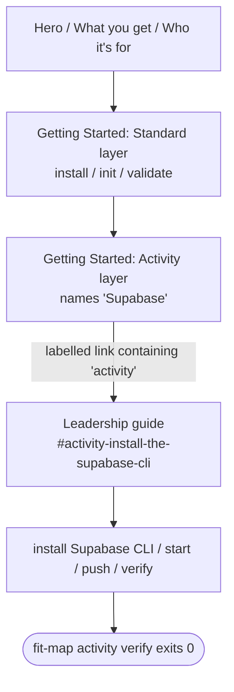

# Design A — Spec 660: Map Product Page Activity-Layer Walkthrough

## Approach

**Link prominently** over inline walkthrough. Restructure the
`websites/fit/map/index.md` § Getting Started block (the page's only "Quick
Start"-shaped section, currently titled "Getting Started" — kept as-is) into two
named subsections that mirror the leadership guide's existing two-layer framing
— **Standard layer** and **Activity layer** — and put a labelled link from the
Activity-layer subsection to the Supabase setup anchor in the leadership guide.

The leadership guide stays the canonical walkthrough. The product page changes
from one flat command block to a two-layer reading path that signals (a) more
exists beyond `validate`, (b) Supabase is the prerequisite, and (c) the next
step is named — not buried under an audience-filter card.

## Components

| Component                       | File                                                        | Responsibility                                                                                                                                                                         |
| ------------------------------- | ----------------------------------------------------------- | -------------------------------------------------------------------------------------------------------------------------------------------------------------------------------------- |
| Getting Started: Standard layer | `websites/fit/map/index.md` § Getting Started               | Three current commands (`install`, `init`, `validate`); names the standard layer.                                                                                                      |
| Getting Started: Activity layer | `websites/fit/map/index.md` § Getting Started               | One-sentence purpose, names "Supabase" as prerequisite, carries the labelled link.                                                                                                     |
| Audience cards                  | `websites/fit/map/index.md` (below Getting Started)         | The single Leadership card stays inside its existing `
`; its text no longer needs to carry the activity-layer entry-point load — the Getting Started block now does. |
| Leadership guide                | `websites/fit/docs/getting-started/leadership/map/index.md` | Unchanged. Canonical activity-layer walkthrough; contains Supabase install, env-var exports, `start`/`push`/`verify` sections.                                                         |

## Reading Order Contract

The interface that joins product page to guide carries three invariants from the
spec's success criteria:

| Invariant                                                                                         | Source criterion | Where enforced                                                                                               |
| ------------------------------------------------------------------------------------------------- | ---------------- | ------------------------------------------------------------------------------------------------------------ |
| Reading-order: "Supabase" appears before any `fit-map activity` reference (page or linked target) | #2               | Activity-layer subsection names "Supabase" before the `<a>` element                                          |
| Link text contains the word "activity" (case-insensitive)                                         | #4               | Link label                                                                                                   |
| Link target reaches `MAP_SUPABASE_URL` / `MAP_SUPABASE_SERVICE_ROLE_KEY` by top-down reading      | #3               | Anchor lands in `## Activity: install the Supabase CLI`; env-vars are documented in the next sibling section |
| `fit-map activity verify` reachable by following links                                            | #1               | Anchor lands in a section whose top-down read continues to the verify section                                |

## Key Decisions

| Decision                      | Choice                                                                   | Rejected                                               | Why                                                                                                                                                                                                                                                                                                                                                          |
| ----------------------------- | ------------------------------------------------------------------------ | ------------------------------------------------------ | ------------------------------------------------------------------------------------------------------------------------------------------------------------------------------------------------------------------------------------------------------------------------------------------------------------------------------------------------------------ |
| Inline vs. link               | Link prominently                                                         | Inline activity-layer commands                         | The leadership guide is 458 lines because Supabase setup branches (self-host vs. hosted, migration apply, env-var quirks). Inlining a flat happy path either misleads or explodes the product page. Drift on a fast-moving CLI is eliminated.                                                                                                                |
| Getting Started structure     | Two subsections matching the guide's two-layer framing                   | Single flat command list with a footnote paragraph     | Vocabulary continuity. The guide already names "Standard layer" / "Activity layer" in its intro; reusing them on the product page gives readers one mental model across pages.                                                                                                                                                                               |
| Activity-layer link text      | Action verb + the word "activity"                                        | "Read the leadership guide" / a generic audience tag   | Criterion 4 requires the link to name the activity layer, not an audience. Action-verb phrasing also signals "more to do," not just "more to read." Exact wording is the planner's call.                                                                                                                                                                     |
| Supabase prerequisite surface | Name "Supabase" inline in the Activity-layer subsection                  | Embed Supabase install commands on the product page    | Naming the dependency satisfies criterion 2 cheaply. Install branching stays in the guide where it belongs.                                                                                                                                                                                                                                                  |
| Env-vars placement            | Leave in leadership guide (already in `## Activity: start the database`) | Duplicate `MAP_SUPABASE_*` exports on the product page | Criterion 3 only requires reachability via labelled link — already satisfied. Duplication invites drift.                                                                                                                                                                                                                                                     |
| Anchor target                 | `#activity-install-the-supabase-cli` (contractual)                       | Page root of the leadership guide                      | Users have already done the standard layer via Getting Started; jumping past the guide's standard-layer section saves re-reading. Anchor is canonical (already referenced from `websites/fit/docs/products/authoring-standards/index.md:72`). The literal anchor is part of this design's interface contract — slug regeneration is not silently authorized. |

## Drift-Mitigation

The link approach trades duplication risk for two coupling points the planner
must protect:

| Coupling point                                    | Failure mode                                              | Mitigation owner                                                |
| ------------------------------------------------- | --------------------------------------------------------- | --------------------------------------------------------------- |
| String "Supabase" in product-page Getting Started | Removed in a future copyedit; criterion 2 silently breaks | Plan adds a regression assertion on `websites/fit/map/index.md` |
| Anchor `#activity-install-the-supabase-cli`       | Guide heading renamed; anchor 404s; criteria 3 + 4 break  | Plan adds a link-target assertion against the leadership guide  |

## Out of Design Scope

- New audience cards or grid restructuring — the existing card stays; only its
  text role changes implicitly because Getting Started now carries the
  activity-layer entry point.
- Any change to the leadership guide's content or structure.
- Inline copy text — the design fixes the contract (subsection structure, link
  invariants, contractual anchor), not the exact wording. The planner picks the
  wording.
- Test-mechanism selection for the two coupling points (CI grep, fit-doc
  link-validator, or build-time check) — that is plan scope.

## Non-goals (architectural)

- The product page does not become a substitute for the guide. After this change
  it routes attention; it does not duplicate content.
- No new component, file, or build-pipeline step is introduced. The change is
  contained to one file plus the link-target invariant on a second file.
