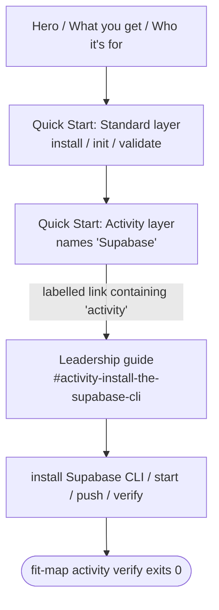

# Design A — Spec 660: Map Product Page Activity-Layer Walkthrough

## Approach

**Link prominently** over inline walkthrough. Restructure the
`websites/fit/map/index.md` Quick Start into two named subsections that mirror
the leadership guide's existing two-layer framing — **Standard layer** and
**Activity layer** — and put a labelled link from the Activity-layer subsection
to the Supabase setup anchor in the leadership guide.

The leadership guide stays the canonical walkthrough. The product page changes
from one flat command block to a two-layer reading path that signals (a) more
exists beyond `validate`, (b) Supabase is the prerequisite, and (c) the next
step is named — not buried under an audience filter card.

## Components

| Component                   | File                                                        | Responsibility                                                                                                                 |
| --------------------------- | ----------------------------------------------------------- | ------------------------------------------------------------------------------------------------------------------------------ |
| Quick Start: Standard layer | `websites/fit/map/index.md` § Getting Started               | Three current commands (`install`, `init`, `validate`); names the standard layer.                                              |
| Quick Start: Activity layer | `websites/fit/map/index.md` § Getting Started               | One-sentence purpose, names "Supabase" as prerequisite, carries the labelled link.                                             |
| Audience cards              | `websites/fit/map/index.md` (below Quick Start)             | Existing card grid stays. Leadership card text no longer carries the activity-layer entry-point load — Quick Start now does.   |
| Leadership guide            | `websites/fit/docs/getting-started/leadership/map/index.md` | Unchanged. Canonical activity-layer walkthrough; contains Supabase install, env-var exports, `start`/`push`/`verify` sections. |

## Reading Order Contract

The interface that joins product page to guide carries three invariants from the
spec's success criteria:

| Invariant                                                 | Source criterion | Where enforced                                                                |
| --------------------------------------------------------- | ---------------- | ----------------------------------------------------------------------------- |
| Reading-order: "Supabase" appears before the link target  | #2               | Activity-layer subsection text precedes the `<a>` element                     |
| Link text contains the word "activity" (case-insensitive) | #4               | Link label                                                                    |
| Link reaches env-var exports without further navigation   | #3               | Anchor `#activity-install-the-supabase-cli` lands above guide lines 181–182   |
| `fit-map activity verify` reachable by following links    | #1               | Anchor lands in a section whose top-down read continues to the verify section |

## Key Decisions

| Decision                      | Choice                                                         | Rejected                                               | Why                                                                                                                                                                                                                                           |
| ----------------------------- | -------------------------------------------------------------- | ------------------------------------------------------ | --------------------------------------------------------------------------------------------------------------------------------------------------------------------------------------------------------------------------------------------- |
| Inline vs. link               | Link prominently                                               | Inline activity-layer commands                         | The leadership guide is 458 lines because Supabase setup branches (self-host vs. hosted, migration apply, env-var quirks). Inlining a flat happy path either misleads or explodes the product page. Drift on a fast-moving CLI is eliminated. |
| Quick Start structure         | Two subsections matching the guide's two-layer framing         | Single flat command list with a footnote paragraph     | Vocabulary continuity. The guide already names "Standard layer" / "Activity layer" in its intro; reusing them on the product page gives readers one mental model across pages.                                                                |
| Activity-layer link text      | Action verb + "activity" (e.g., "Set up the activity layer →") | "Read the leadership guide" / a generic audience tag   | Criterion 4 requires the link to name the activity layer, not an audience. Action-verb phrasing also signals "more to do," not just "more to read."                                                                                           |
| Supabase prerequisite surface | Name "Supabase" inline in the Activity-layer subsection        | Embed Supabase install commands on the product page    | Naming the dependency satisfies criterion 2 cheaply. Install branching stays in the guide where it belongs.                                                                                                                                   |
| Env-vars placement            | Leave in leadership guide (already at lines 181–182)           | Duplicate `MAP_SUPABASE_*` exports on the product page | Criterion 3 only requires reachability via labelled link — already satisfied. Duplication invites drift.                                                                                                                                      |
| Anchor target                 | `#activity-install-the-supabase-cli`                           | Page root of the leadership guide                      | Users have already done the standard layer via Quick Start; jumping past the guide's standard-layer section saves re-reading. Anchor is already a canonical reference (used from `authoring-standards/index.md`).                             |

## Drift-Mitigation

The link approach trades duplication risk for two coupling points the planner
must protect:

| Coupling point                                | Failure mode                                              | Mitigation owner                                                                   |
| --------------------------------------------- | --------------------------------------------------------- | ---------------------------------------------------------------------------------- |
| String "Supabase" in product page Quick Start | Removed in a future copyedit; criterion 2 silently breaks | Plan adds a regression test or grep-based assertion on `websites/fit/map/index.md` |
| Anchor `#activity-install-the-supabase-cli`   | Guide heading renamed; anchor 404s; criteria 3 + 4 break  | Plan asserts the heading exists in the leadership guide (link-target check)        |

The plan chooses the test mechanism (CI grep, fit-doc link-validator, or manual
review checklist). The design only fixes that the coupling points exist and need
protecting.

## Out of Design Scope

- New audience cards or grid restructuring — cards stay; only the Leadership
  card's role changes implicitly because Quick Start now carries the entry
  point.
- Any change to the leadership guide's content or structure.
- Anchor format selection — fit-doc default slugification governs.
- Inline copy text — the design fixes the contract (subsection structure, link
  invariants), not the exact wording. The planner picks the wording.

## Non-goals (architectural)

- The product page does not become a substitute for the guide. After this change
  it routes attention; it does not duplicate content.
- No new component, file, or build-pipeline step is introduced. The change is
  contained to one file plus the link-target invariant on a second file.
