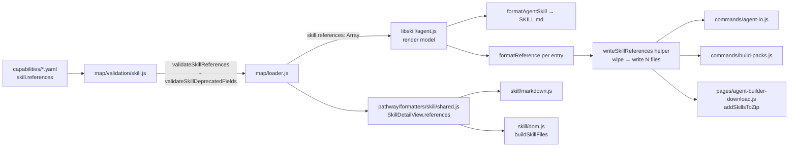

# Design 660: Skill Multiple References

## Problem Restated

Replace `skill.implementationReference` (string → single
`references/REFERENCE.md`) with `skill.references` (array of
`{name, title, body}` → one file per entry under `references/`). The change
propagates through the sites enumerated in spec § Affected entities. The
design's job is to settle the _shape_ of the data at each hop and _where_ the
per-entry loop, directory-ownership contract, and deprecation rejection live —
so the plan can execute without rediscovering the mechanics.

## Data Flow



The array stays an array at every hop. No layer flattens it, rekeys it, or
splits `{name, title, body}` into parallel fields.

## Components

### 1. Validation — `products/map/src/validation/skill.js`

| Change                                           | Mechanism                                                                                                                                                                                                                                                         |
| ------------------------------------------------ | ----------------------------------------------------------------------------------------------------------------------------------------------------------------------------------------------------------------------------------------------------------------- |
| Validate `skill.references`                      | New `validateSkillReferences(skill, path)` enforcing all nine rules from spec § Validation rules (authoritative): array type, regex `^[a-z0-9][a-z0-9_-]*$` with length 1–64, case-insensitive uniqueness, `title` non-empty string, `body` non-whitespace string |
| Reject top-level `skill.implementationReference` | New `validateSkillDeprecatedFields(skill, path)` — a skill-level sibling of the existing agent-level `validateSkillAgentDeprecatedFields()`. Emits `INVALID_FIELD` whose message names `skill.references` as the replacement                                      |
| Update legacy `agent.reference` hint             | Retarget the hint text in the existing `validateSkillAgentDeprecatedFields` deprecation list to `skill.references`                                                                                                                                                |
| Remove `<scaffolding_steps>` check               | Delete the conditional in `validateSkillOptionalStringFields`                                                                                                                                                                                                     |

`validateSkillReferences` and `validateSkillDeprecatedFields` both run and both
append to the error array — a YAML that contains `implementationReference` _and_
an invalid `references` entry reports both errors. Neither short-circuits the
other. This matches how the existing validators already accumulate errors.

### 2. Loader — `products/map/src/loader.js`

`skill.references` flows through the destructuring block alongside
`toolReferences` and `instructions`. Shape on the normalized skill record:

```
skill.references: Array<{ name: string, title: string, body: string }> | undefined
```

Absent and empty-array inputs both yield `undefined` on the record — the writer
treats them identically (§ 6).

### 3. Render model — `libraries/libskill/src/agent.js`

`generateSkillMarkdown()` replaces the single `implementationReference: string`
field with `references: Array` passed through verbatim. Rendering lives in the
Pathway layer per the existing libskill/Pathway layering (libskill owns the
model shape, Pathway owns output formatting). All five Pathway callers of
`generateSkillMarkdown` — `commands/agent.js`, `commands/build-packs.js`,
`commands/skill.js`, `pages/agent-builder-preview.js`, `pages/skill.js` —
consume the new shape; no external callers exist.

### 4. Agent SKILL.md template + formatter — `products/pathway/src/formatters/agent/skill.js` and `templates/skill.template.md`

The `{{#hasReference}}` block in `skill.template.md` currently hard-codes a
pointer to `references/REFERENCE.md`. With N titled references, no single
pointer is correct, and the spec makes reference discovery author-driven via
`skill.instructions`. **Decision: remove the block.** Authors who want to
mention references in SKILL.md do so through the `instructions` field, which
lands in the `{{#hasInstructions}}` region.

Consequently `prepareAgentSkillData` drops `implementationReference`,
`hasReference`, and `trimmedReference`. `formatReference` changes signature:

```
formatReference(entry, template) → string
```

Takes one `{name, title, body}` entry plus the reference template; returns the
file body. Filename resolution (`{name}.md`) moves to the writer. Rejected
alternative: `formatReferences(skill, template) → Array<{filename,content}>` —
bundles directory layout with rendering, making the formatter aware of output
path conventions. Kept rendering pure instead.

### 5. Reference template — `products/pathway/templates/skill-reference.template.md`

```
# {{{title}}}

{{{body}}}
```

Triple-brace ensures verbatim output — no HTML escaping, no whitespace collapse.
`body` is rejected as invalid before rendering (see § 1 — whitespace-only `body`
fails validation), so the template never has to handle empty input. Rendered
once per entry. The old `# {{{title}}} — Reference` suffix is dropped: each
entry now carries its own title, and the suffix is incompatible with titles like
"CLI Usage" or "Metrics Schema".

### 6. Writer helper — new function in `products/pathway/src/commands/agent-io.js`

New `writeSkillReferences(skillDir, references, template)` lives in
`agent-io.js` (the canonical file-writing module for skills) and is imported by
`commands/build-packs.js` and `pages/agent-builder-download.js`. Chosen over a
standalone module: the helper is a peer of `writeSkills`; extracting it to its
own file would add an import hop without changing the ownership.

Ownership contract (spec § Output shape, criterion 6): the helper treats
`<skillDir>/references/` as generator-owned. Every invocation:

1. Remove `<skillDir>/references/` recursively if it exists.
2. If `references.length > 0`, create the directory and write `{entry.name}.md`
   for each entry using `formatReference(entry, template)`.

Wipe runs on _every_ call, including when `references` is empty/`undefined` —
otherwise stale files from a prior run violate criterion 4. Filesystem errors
propagate to the caller and abort generation for the current skill; the helper
does not retry. Wipe-then-write chosen over diff-apply: simplest path to
"contents exactly match YAML", and the one-skill-per-call scope removes any
cross-skill race concern.

The zip-generation branch (`addSkillsToZip` in
`pages/agent-builder-download.js`) cannot use the helper as-is (it writes to a
`JSZip` instance, not the filesystem). It gets its own per-entry loop with the
same rendering but zip-based output — no wipe needed since the zip is built
fresh. The shared piece is `formatReference(entry, template)`; the file layout
differs.

### 7. Non-agent view-model & formatters — `products/pathway/src/formatters/skill/`

`shared.js` — `SkillDetailView.implementationReference: string|null` becomes
`references: Array<{name, title, body}>` (empty array when absent).

`markdown.js` — the single `## Implementation Patterns` section becomes a loop
emitting `## {title}` / `{body}` per entry. Two entries sharing a title produce
two identical `##` headings; acceptable, since `title` is human-written and
uniqueness is only required on `name`.

`dom.js` — `buildSkillFiles` replaces its single `references/REFERENCE.md` push
with a loop pushing `references/{name}.md` per entry. The gate condition in
`createSkillFilesSection` that decides whether to render the "Agent Skill Files"
block switches from checking the old string field to checking
`view.references.length > 0`.

### 8. Starter framework — `products/map/starter/capabilities/`

Success criterion 5 requires at least one starter skill to declare a
`references:` array with two or more entries. The design commits the feature to
the `incident_response` skill (the spec's running example) in
`reliability.yaml`: two entries of form `{name, title, body}`. The precise
content is plan/implementation work; the architectural commitment is that
starter data exercises the multi-file path end-to-end.

### 9. Authoring documentation — `website/docs/guides/`

Two documentation files reference the removed field (spec § Affected entities
lines 189–193): `authoring-frameworks/index.md` (teaches the field with a YAML
example) and `agent-teams/index.md` (generator-mapping table row). These are
content rewrites, not architectural changes — the plan updates them to describe
`references` and the `references/{name}.md` output. The design decision is only
that they stay _content_ work and no new doc mechanism (e.g. autogeneration from
schema) is introduced.

### 10. Pathway YAML loader — `products/pathway/src/lib/yaml-loader.js`

Mirrors the Map loader field swap (§ 2). Same destructuring and same
undefined-collapse semantics.

## Key Decisions

| Decision                            | Chosen                                                                 | Rejected alternative                                              | Why                                                                                                                                                             |
| ----------------------------------- | ---------------------------------------------------------------------- | ----------------------------------------------------------------- | --------------------------------------------------------------------------------------------------------------------------------------------------------------- |
| Where the per-entry loop lives      | Writer layer (shared helper + per-caller zip loop)                     | Formatter returns `Array<{filename,content}>`                     | Keeps rendering pure — strings only; directory/zip layout is a writer concern                                                                                   |
| Directory ownership enforcement     | Wipe-then-write, every call                                            | Diff-apply (compare expected vs actual, delete extras, write new) | Simplest path to "exactly matches YAML"; acceptable filesystem churn for a build step                                                                           |
| SKILL.md `hasReference` pointer     | Remove the block entirely                                              | Replace with an auto-generated list of references                 | Spec makes discovery author-driven; any auto-list would duplicate what `skill.instructions` can already express and conflict with the "no auto-index" exclusion |
| Deprecated-field rejection location | New skill-level function                                               | Extend `validateSkillAgentDeprecatedFields`                       | `implementationReference` sits at skill top level, not under `agent.*`; shoehorning two nesting levels into one function conflates paths                        |
| `formatReference` signature         | `(entry, template) → string`                                           | `(skill, template) → Array`                                       | Filename is a writer concern; formatter shouldn't know output lives at `{name}.md`                                                                              |
| Helper module home                  | `commands/agent-io.js` (peer of `writeSkills`)                         | Standalone `commands/skill-references.js`                         | No new ownership introduced; adds an import hop for no gain                                                                                                     |
| Reference template line             | `# {{{title}}}`                                                        | Keep `— Reference` suffix                                         | Per-entry titles now carry the heading's meaning                                                                                                                |
| Error accumulation                  | Both `validateSkillReferences` and `validateSkillDeprecatedFields` run | Short-circuit on `implementationReference` presence               | Matches existing validator behavior; user sees all issues in one pass                                                                                           |

## Scope Boundary

- **In scope:** Every file listed in spec § Affected entities (lines 170–196),
  including the starter skill and the two documentation files. Two new functions
  (`validateSkillReferences`, `validateSkillDeprecatedFields`) and one new
  helper (`writeSkillReferences`); all other changes modify existing functions
  in place.
- **Out of scope:** Automatic `SKILL.md` index injection, per-reference
  `useWhen`, alternative output formats, runtime reference discovery — all
  deferred by the spec.
