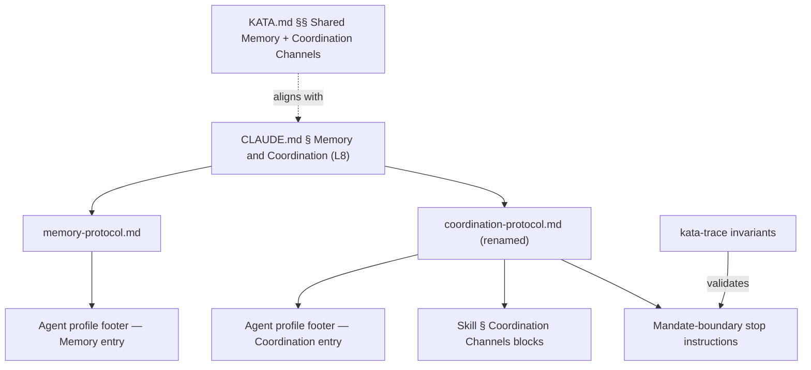
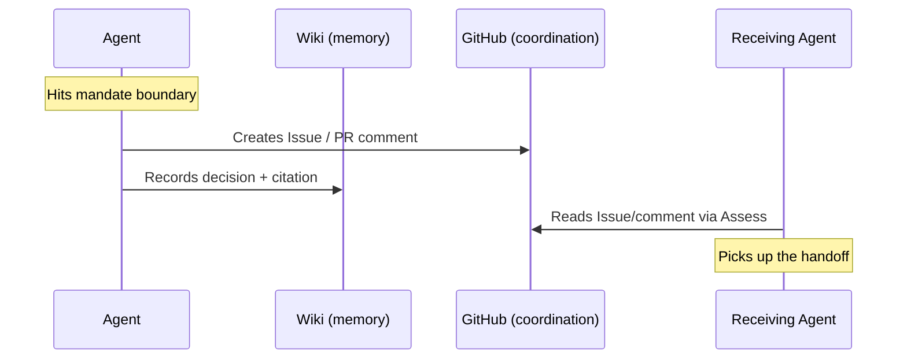

# Design A — Separate Memory and Coordination

## Overview

Eight touch-points enforce the memory/coordination separation at layers L5–L8.
The changes are all textual (protocol docs, profiles, skill docs, CLAUDE.md) —
no code, no tooling, no new channels.



## Components

| #   | Component                            | File(s)                                              | Change                                                         |
| --- | ------------------------------------ | ---------------------------------------------------- | -------------------------------------------------------------- |
| C1  | Policy declaration                   | `CLAUDE.md`                                          | New `## Memory and Coordination` section                       |
| C2  | Protocol rename                      | `.claude/agents/references/coordination-protocol.md` | Rename from `routing-protocol.md`; update opening framing      |
| C3  | Agent profile footers                | 6 files in `.claude/agents/*.md`                     | Split single footer into Memory + Coordination entries         |
| C4  | Rotation procedure                   | `.claude/agents/references/memory-protocol.md`       | Extend § Cross-Cutting Priority Index with Add/Update/Remove   |
| C5  | Mandate-boundary receiving artifacts | 2 files (see § Mandate Boundaries)                   | Name the non-wiki artifact each boundary stop must produce     |
| C6  | Inbound reference updates            | 18 references across 13 files in `.claude/`          | `routing-protocol` → `coordination-protocol` in all references |
| C7  | Mandate-boundary invariant           | `.claude/skills/kata-trace/references/invariants.md` | New row in § Cross-cutting invariants                          |
| C8  | Reference documentation alignment    | `KATA.md`                                            | Update § Shared Memory and § Coordination Channels             |

## Interfaces

### C1 — CLAUDE.md section placement

Sits between `## Contributor Workflow` and `## Domain Concepts` — visible to
every contributor but below the external-facing sections. Content declares:

- Wiki is a **memory** layer: own state, append-only logs, metrics
- Coordination requires a **named receiver** and an **addressable artifact**:
  Issue, PR/issue comment, Discussion, or `agent-react` invocation
- Writing "routing to X" in own wiki does not constitute a handoff

### C3 — Profile footer format

Current single footer replaced by two bullets under `## Constraints`:

```markdown
- **Memory**: [memory-protocol.md](...) — files: `wiki/{agent}.md`,
  `wiki/{agent}-$(date +%G-W%V).md`
- **Coordination**: [coordination-protocol.md](...) — channels: Issues,
  Discussions, PR/issue comments, `agent-react`
```

No line links both protocols. The wiki files appear only under Memory.

### C4 — Rotation procedure shape

Three operations added to the existing § Cross-Cutting Priority Index in
`memory-protocol.md` (not a separate section — the procedure governs the same
table the section already describes):

| Operation  | Trigger                                                                |
| ---------- | ---------------------------------------------------------------------- |
| **Add**    | Finding affects ≥2 agents and persists beyond the run that surfaced it |
| **Update** | Ownership transfers or material progress lands (PR opened/merged)      |
| **Remove** | Underlying problem resolved; permanent record lives in linked artifact |

### C8 — KATA.md section alignment

§ Shared Memory already frames the wiki correctly. Gains the wiki non-purpose
statement currently in § Coordination Channels: "The wiki holds settled state —
open questions live in Discussions until answered."

§ Coordination Channels changes:

- Opening paragraph: drop "including the wiki described above"; channel count
  from five to four; `routing-protocol.md` → `coordination-protocol.md`
- Table: remove the Wiki row
- Bullet list: remove the Wiki non-purpose bullet (moved to § Shared Memory)

### C7 — Invariant detection shape

The mandate-boundary invariant has a two-part structure matching the spec's
trigger/evidence split:

**Trigger (left-hand side):** an assistant turn contains boundary-stop language
— any of: `stop and report`, `stopping per protocol`, `exceeds scope`,
`mandate boundary` — AND the trace contains no `fix/` or `spec/` branch creation
(no `git checkout -b fix/`, `git switch -c fix/`, `git checkout -b spec/`, or
`git switch -c spec/` in Bash tool calls). The first two keywords match current
profile/skill instructions; the latter two are forward-looking coverage for
equivalent phrasings.

The canonical failure trace (`25039150119`) contains "Stopping per protocol;
routing to staff engineer" — matched by `stopping per protocol`.

**Evidence (right-hand side):** at least one of these tool-call patterns appears
after the trigger turn:

| Artifact            | Tool-call pattern                                                           |
| ------------------- | --------------------------------------------------------------------------- |
| Issue creation      | `tool=="Bash"`, `command` matches `gh issue create`                         |
| Issue/PR comment    | `tool=="Bash"`, `command` matches `gh (issue\|pr) comment`                  |
| Discussion creation | `tool=="Bash"`, `command` contains `createDiscussion` in GraphQL query      |
| Discussion comment  | `tool=="Bash"`, `command` contains `addDiscussionComment`                   |
| Agent conversation  | `tool=="Agent"` with description or prompt referencing `agent-react` |

The existing "Open questions in wiki cite a Discussion" invariant catches wiki
entries that should have been Discussions. The new invariant catches runs that
end at a mandate boundary with no non-wiki output at all. Together they cover
both failure modes of wiki-as-handoff.

## Mandate Boundaries

Two files currently contain "stop and report" language. Each gets a named
receiving artifact chosen by output context:

| File                                 | Boundary context                        | Receiving artifact | Rationale                                                                       |
| ------------------------------------ | --------------------------------------- | ------------------ | ------------------------------------------------------------------------------- |
| `.claude/agents/release-engineer.md` | CI failures persist after `check:fix`   | **GitHub Issue**   | Diagnosis is cross-cutting (affects all open PRs), not tied to a single thread  |
| `.claude/skills/kata-ship/SKILL.md`  | Any PR check fails during the ship flow | **PR comment**     | Failure is specific to the PR in context; the PR thread is the natural receiver |

The instruction text at each boundary names the artifact type and includes a
brief example — e.g., "stop and open a GitHub Issue describing the failure and
bisect findings" — so the action is unambiguous.

## Key Decisions

| Decision                                             | Chosen                                                     | Rejected                                               | Why                                                                                                                 |
| ---------------------------------------------------- | ---------------------------------------------------------- | ------------------------------------------------------ | ------------------------------------------------------------------------------------------------------------------- |
| Footer format for profiles                           | Two separate bullet points under `## Constraints`          | Separate `## Memory` and `## Coordination` subsections | Bullets match the existing weight; subsections overstate the importance relative to the profile's Assess procedure  |
| Where to place rotation procedure in memory-protocol | Extend existing § Cross-Cutting Priority Index             | New top-level section                                  | The procedure governs the same table the section already describes — co-location avoids indirection                 |
| Skill `## Coordination Channels` heading             | Keep unchanged                                             | Rename to match the protocol rename                    | Skills use the heading correctly (for non-wiki outputs); the conflation problem is in profile footers, not skills   |
| CLAUDE.md section placement                          | Between `## Contributor Workflow` and `## Domain Concepts` | After `## Documentation Map`                           | Contributor-facing policy should sit with other contributor workflow content, not after reference material          |
| Invariant trigger detection                          | Keyword match on assistant turns                           | Structural analysis of tool-call absence               | Keyword match is auditable by inspection; structural analysis requires modeling agent intent from negative evidence |
| Release-engineer boundary artifact                   | GitHub Issue                                               | PR comment on affected PRs                             | CI failure is cross-cutting; commenting on each open PR duplicates the diagnosis and fragments the thread           |
| Wiki non-purpose bullet placement                    | Move to § Shared Memory                                    | Duplicate in both sections                             | One home per fact; the bullet describes a memory-layer property, not a coordination-layer property                  |

## Diagram — Mandate-Boundary Data Flow


