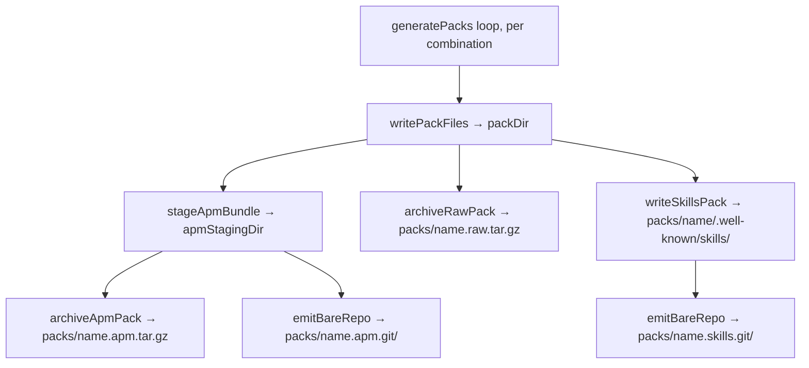

# Design A — Git-Installable Pack Repos

## Overview

Add a single architectural primitive
`emitBareRepo(stagedTree, version, targetDir)` to the pack pipeline and reuse it
twice per pack: once for the APM staging tree (→ `packs/{name}.apm.git/`) and
once for the skills-channel tree (→ `packs/{name}.skills.git/`). The existing
`framework.distribution.siteUrl` gate continues to control all per-pack output;
when it is unset, no `.git/` directories are emitted.

The agent-builder install UI surfaces two new command cards (`apm install <url>`
and `git clone <url>`) alongside the existing three. Tarballs and the
`.well-known/skills/` discovery index keep their current bytes.

## Components

| Component                             | Lives in                        | Responsibility                                                                                         | New / Changed                  |
| ------------------------------------- | ------------------------------- | ------------------------------------------------------------------------------------------------------ | ------------------------------ |
| `emitBareRepo`                        | new module `build-packs-git.js` | Take a staged tree + version, produce a static bare git repo with deterministic SHAs                   | new                            |
| `generatePacks`                       | `build-packs.js`                | Orchestrates per-pack channels; calls `emitBareRepo` twice per pack inside the existing `siteUrl` gate | changed (additive)             |
| Install UI                            | `agent-builder-install.js`      | Adds two command cards: APM-git and skills-git                                                         | changed (two additional cards) |
| `framework.distribution.siteUrl` gate | `generatePacks`                 | Single switch controlling all per-pack output, including the new `.git/` dirs                          | unchanged                      |

The APM working tree is the existing `stageApmBundle` output directory and the
skills working tree is the existing per-pack `packs/{name}/.well-known/skills/`
directory (including `index.json`). Both are consumed by `emitBareRepo` as
read-only inputs — no new staging tree is introduced.

### `emitBareRepo` contract

| Field        | Value                                                                                                                                                                                         |
| ------------ | --------------------------------------------------------------------------------------------------------------------------------------------------------------------------------------------- |
| Inputs       | `stagedTree` (absolute path, must exist and be a directory tree of regular files); `version` (semver string used for the tag and commit message); `targetDir` (absolute path, must not exist) |
| Output       | `targetDir/` populated with the bare-repo layout below                                                                                                                                        |
| Error mode   | Throws on any underlying failure; partial output is removed before re-throwing so the caller's `siteUrl`-gated loop fails fast and leaves no half-written `.git/` directory                   |
| Side effects | Writes only under `targetDir`; no global state, no network                                                                                                                                    |

## Data Flow

The whole loop runs only when `framework.distribution.siteUrl` is set; nothing
is emitted when the gate is closed. Both `emitBareRepo` calls feed off
directories that already exist for the tarball and discovery channels — no new
staging tree is introduced and no existing tree is restructured.

## Bare-Repo Layout

Each emitted `.git/` directory is a frozen single-commit bare repo that clones
correctly over plain HTTP from any static file host (dumb HTTP only, no smart
HTTP, no CGI). Layout:

| Path                           | Contents                                                                                                                                        |
| ------------------------------ | ----------------------------------------------------------------------------------------------------------------------------------------------- |
| `HEAD`                         | `ref: refs/heads/main\n`                                                                                                                        |
| `config`                       | minimal bare config (`bare = true`, `repositoryformatversion = 0`)                                                                              |
| `description`                  | `Pathway pack: {name}\n`                                                                                                                        |
| `info/refs`                    | sorted lexicographically by ref name; one line per ref shaped `<sha>\t<ref>`; lightweight tags appear as the commit SHA with no `^{}` peel line |
| `objects/info/packs`           | `P pack-<sha>.pack\n` (single line, single pack)                                                                                                |
| `objects/pack/pack-<sha>.pack` | one pack containing every commit/tree/blob/tag for the single commit                                                                            |
| `objects/pack/pack-<sha>.idx`  | matching index                                                                                                                                  |
| `packed-refs`                  | header `# pack-refs with: peeled fully-peeled sorted \n` followed by sorted `<sha> <ref>` lines                                                 |

The list is exhaustive — no `refs/heads/`, `refs/tags/`, loose-object, or
sub-pack directories beyond `objects/info/` and `objects/pack/` are emitted.
Clients negotiate branches and tags from `info/refs` plus `packed-refs`, and
objects from `objects/info/packs` plus the pack/idx pair — the dumb-HTTP fetch
order described in the Git HTTP protocol spec.

## Determinism Contract

The contract extends today's tarball byte-equality: identical input → identical
bytes across every emitted file in the bare repo, including the commit SHA and
packfile bytes (Spec SC4).

| Field                           | Pinned value                                                              |
| ------------------------------- | ------------------------------------------------------------------------- |
| Commit author / committer name  | `Forward Impact Pathway`                                                  |
| Commit author / committer email | `pathway@forwardimpact.team`                                              |
| Commit author / committer date  | epoch (`1970-01-01T00:00:00Z`)                                            |
| Commit message                  | `pathway v{version}\n`                                                    |
| Default branch                  | `main`                                                                    |
| Tag                             | lightweight `v{version}` ref-only — no tag object emitted in the pack     |
| Pack input order                | objects fed to pack-objects in deterministic SHA order                    |
| Pack contents                   | every commit/tree/blob; no delta reuse from any prior pack or source repo |
| `description` file              | `Pathway pack: {name}\n`                                                  |
| `config` file                   | minimal bare config, fixed key order                                      |
| `info/refs`, `packed-refs`      | sorted lexicographically by ref name                                      |
| `objects/info/packs`            | sorted by pack basename                                                   |

## Install UI Changes

Two new command cards are added to `createInstallSection`. Order is read-time
useful: most-canonical first.

| Card label                  | Channel          | URL                              |
| --------------------------- | ---------------- | -------------------------------- |
| _existing_ Direct download  | raw              | `<site>/packs/{name}.raw.tar.gz` |
| _existing_ Microsoft APM    | apm-tarball      | `<site>/packs/{name}.apm.tar.gz` |
| **new** Microsoft APM (git) | apm-git          | `<site>/packs/{name}.apm.git`    |
| _existing_ npx skills       | skills-discovery | per-pack `.well-known/skills/`   |
| **new** Git clone (skills)  | skills-git       | `<site>/packs/{name}.skills.git` |

Existing card commands are unchanged. The two new cards run `apm install <url>`
and `git clone <url>` against the URLs above.

No existing card is removed (Spec Requirement 7 coexistence clause).

## Key Decisions

| #   | Decision                                                                                                   | Rejected                                              | Why                                                                                                                                                                                                                        |
| --- | ---------------------------------------------------------------------------------------------------------- | ----------------------------------------------------- | -------------------------------------------------------------------------------------------------------------------------------------------------------------------------------------------------------------------------- |
| 1   | One generic `emitBareRepo` primitive, called per channel                                                   | Two channel-specific emitters                         | Spec Requirement 1 demands a single mechanism; duplicate logic is a determinism risk                                                                                                                                       |
| 2   | Use the system `git` binary as the packfile/wire-format engine                                             | Use `isomorphic-git` or hand-write packfile           | Adds a runtime dep with its own determinism quirks; system git is already a transitive build dep and has the canonical wire format                                                                                         |
| 3   | Lightweight tag (no annotated tag object)                                                                  | Annotated tag                                         | Annotated tags add a SHA dependency on a second object; consumers gain nothing for a fresh single-commit repo                                                                                                              |
| 4   | Pack everything every build with no delta reuse                                                            | Reuse deltas from a source repo                       | Delta selection is non-deterministic across git versions; whole-pack repack with `--no-reuse-delta` is the documented stable path                                                                                          |
| 5   | Latest-only — fresh repo per build, no preserved history                                                   | Append commits across builds                          | Spec Out-of-Scope explicitly defers multi-version distribution; matches today's distribution semantics where every channel overwrites                                                                                      |
| 6   | Source the APM and skills working trees from the directories the existing channels already produce         | Build a third "git" staging tree                      | Avoids tree drift between channels; spec's "directory tree fed to each channel is unchanged" Not-affected clause is honored                                                                                                |
| 7   | Skills bare repo's working tree mirrors `packs/{name}/.well-known/skills/` exactly, including `index.json` | Strip `index.json` to leave only "pure" skill content | Symmetry with what a `git clone` of the same path on the live site would yield; one tree per channel, no second variant; the discovery channel's `index.json` bytes are still used unchanged in its current location (SC7) |
| 8   | `siteUrl` gates all `.git/` output the same way it gates tarballs and discovery                            | Independent gate                                      | One switch keeps publish-vs-not coherent; matches spec coexistence clause                                                                                                                                                  |

## Risks

| #   | Risk                                                                                  | Mitigation                                                                                            |
| --- | ------------------------------------------------------------------------------------- | ----------------------------------------------------------------------------------------------------- |
| 1   | System git version difference perturbs packfile bytes                                 | Pin git version in CI build image; SC4 byte-equality assertion fires on every CI run                  |
| 2   | Static host serves `.git/` paths with directory-listing redirects, breaking dumb HTTP | Hosting requirement is part of the rollout plan; SC6 verifies clones over a local static server in CI |

## Out of Scope

Design honors the spec's Out-of-Scope list (single commit per build, dumb-HTTP
only, no auth surface, no client tooling changes, no CDN cache opinions). See
`spec.md` § Out of Scope.

## References

- `specs/700-git-installable-packs/spec.md`
- `products/pathway/src/commands/build-packs.js`
- `products/pathway/src/commands/build-packs-apm.js`
- `products/pathway/src/pages/agent-builder-install.js`
- [Git HTTP protocol — dumb HTTP](https://git-scm.com/docs/http-protocol)
