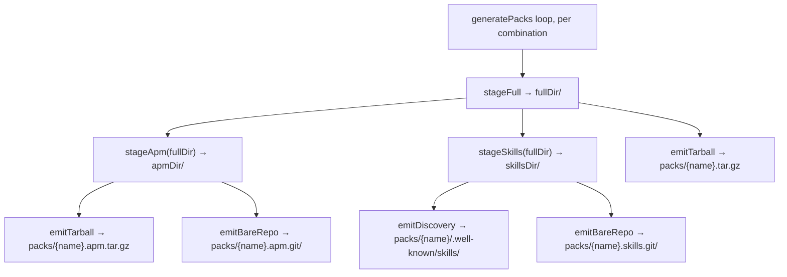

# Design B — Git-Installable Pack Repos (Rearchitected Pipeline)

## How This Differs from Design A

Design A adds `emitBareRepo` to the existing channel model without
restructuring. Design B uses the same spec requirements but rearchitects the
pipeline around two explicit axes — **pack layout** (content) and **distribution
format** (transport) — replacing the "channel" abstraction that conflates
content, format, and consumer tool into a single flat list.

## Overview

Decompose the pack pipeline into three stagers (`stageFull`, `stageApm`,
`stageSkills`) and three emitters (`emitTarball`, `emitBareRepo`,
`emitDiscovery`). The orchestrator composes them via a layout × format matrix.
The `standard.distribution.siteUrl` gate continues to control all output.

The install UI regroups cards by layout (what you get) instead of by ecosystem
(whose tool you use). Output paths follow a uniform scheme:
`{name}[.{layout}].{format-ext}`, renaming `{name}.raw.tar.gz` to
`{name}.tar.gz`.

## Components

| Component       | Lives in                   | Responsibility                                                                       | New / Changed                                     |
| --------------- | -------------------------- | ------------------------------------------------------------------------------------ | ------------------------------------------------- |
| `stageFull`     | `build-packs-stage.js`     | Write agents, skills, team instructions, settings to a staging dir                   | new (extracts from `writePackFiles`)              |
| `stageApm`      | `build-packs-stage.js`     | Restructure full staging into APM layout (`.claude/` subset + `apm.lock.yaml`)       | new (extracts from `stageApmBundle`)              |
| `stageSkills`   | `build-packs-stage.js`     | Extract skill directories + discovery index from full staging                        | new (extracts from `writeSkillsPack`)             |
| `emitTarball`   | `build-packs-emit.js`      | Deterministic `.tar.gz` from any staged dir                                          | new (unifies `archiveRawPack` + `archiveApmPack`) |
| `emitBareRepo`  | `build-packs-emit.js`      | Static bare git repo from any staged dir + version                                   | new (same contract as design A)                   |
| `emitDiscovery` | `build-packs-emit.js`      | Copy staged skills tree to `.well-known/skills/` output path                         | new (extracts from `writeSkillsPack`)             |
| `generatePacks` | `build-packs.js`           | Orchestrator: loops combinations, composes stagers and emitters, handles aggregation | changed (simplified)                              |
| Install UI      | `agent-builder-install.js` | Derives commands from layout × format; groups by layout                              | changed                                           |
| `siteUrl` gate  | `generatePacks`            | Single switch controlling all output                                                 | unchanged                                         |

## Data Flow

Every stager has the same signature (`inputDir → outputDir`). Every emitter has
the same shape (`stagedDir, outputPath, options → void`). The orchestrator
composes them — adding a matrix cell requires no new module, only a new call.

After the per-combination loop, the orchestrator deduplicates skills across
packs and calls `emitDiscovery` once more for the aggregate
`packs/.well-known/skills/` index (same as today's `writeSkillsAggregate`).

## Layout x Format Matrix

|            | tarball             | git                  | discovery                    |
| ---------- | ------------------- | -------------------- | ---------------------------- |
| **full**   | `{name}.tar.gz`     | --                   | --                           |
| **apm**    | `{name}.apm.tar.gz` | `{name}.apm.git/`    | --                           |
| **skills** | --                  | `{name}.skills.git/` | `{name}/.well-known/skills/` |

Empty cells are natural extensions (e.g. full x git) but not required by the
spec. Adding one requires no new stager or emitter.

## Emitter and Stager Contracts

All stagers: `(inputDir) → outputDir`. All emitters:
`(stagedDir, outputPath, options) → void`. Shared error semantics: throw on
failure, remove partial output before re-throwing, write only under the output
path, no global state, no network. `emitBareRepo` takes an additional `version`
string used for the tag and commit message.

## Bare-Repo Layout

Each `.git/` directory emitted by `emitBareRepo` is a frozen single-commit bare
repo cloneable over dumb HTTP. Exhaustive file set:

| Path                           | Contents                                              |
| ------------------------------ | ----------------------------------------------------- |
| `HEAD`                         | `ref: refs/heads/main\n`                              |
| `config`                       | minimal bare config (`bare = true`, format version 0) |
| `description`                  | `Pathway pack: {name}\n`                              |
| `info/refs`                    | sorted refs, one `<sha>\t<ref>` line per ref          |
| `objects/info/packs`           | `P pack-<sha>.pack\n`                                 |
| `objects/pack/pack-<sha>.pack` | all objects in one pack                               |
| `objects/pack/pack-<sha>.idx`  | matching index                                        |
| `packed-refs`                  | header + sorted `<sha> <ref>` lines                   |

No loose objects, no `refs/` directories. Clients discover refs from `info/refs`
→ `packed-refs`, objects from `objects/info/packs` → packfile.

## Determinism Contract

Identical input at the same Pathway version produces byte-identical output
across every emitter — tarball, bare repo, and discovery index.

| Field                   | Pinned value                                          |
| ----------------------- | ----------------------------------------------------- |
| Commit author/committer | `Forward Impact Pathway <pathway@forwardimpact.team>` |
| Commit/author date      | epoch (`1970-01-01T00:00:00Z`)                        |
| Commit message          | `pathway v{version}\n`                                |
| Default branch          | `main`                                                |
| Tag                     | lightweight `v{version}` (no tag object)              |
| Pack input order        | objects in deterministic SHA order                    |
| Pack contents           | all objects, no delta reuse (`--no-reuse-delta`)      |
| Tarball                 | epoch timestamps, sorted file list, `gzip -n`         |
| Discovery index         | `stringifySorted` JSON, sorted skill entries          |

## Install UI Changes

Cards grouped by layout (what you get) instead of by ecosystem (whose tool):

| Group                                      | Card             | Command                                         |
| ------------------------------------------ | ---------------- | ----------------------------------------------- |
| **Full pack** (agents + skills + settings) | Direct download  | `curl -sL .../packs/{name}.tar.gz \| tar xz`    |
| **APM pack** (agents + skills)             | `apm install`    | `apm install .../packs/{name}.apm.git`          |
|                                            | `apm unpack`     | `curl -sLO ... && apm unpack {name}.apm.tar.gz` |
| **Skills only**                            | `npx skills add` | `npx skills add .../packs/{name}`               |
|                                            | `git clone`      | `git clone .../packs/{name}.skills.git`         |

Within each group, the most canonical install path appears first (`apm install`
for APM, `npx skills add` for skills). Engineers choose what to install before
choosing how — layout-first grouping matches that decision order.

## Key Decisions

| #   | Decision                                                            | Rejected                                                      | Why                                                                                                                                                                                                                                                        |
| --- | ------------------------------------------------------------------- | ------------------------------------------------------------- | ---------------------------------------------------------------------------------------------------------------------------------------------------------------------------------------------------------------------------------------------------------- |
| 1   | Separate layout (content) from format (transport) as explicit axes  | Keep channel abstraction (design A)                           | The channel model conflates three concerns; adding git repos produces five channels with four naming patterns. The matrix makes adding a cell mechanical rather than creative                                                                              |
| 2   | Three source files grouped by role: orchestrator, stagers, emitters | One file per channel (current), or single new file (design A) | Each file has one reason to change: stagers when pack content changes, emitters when transport formats change. `archiveRawPack` and `archiveApmPack` are already identical functions — unifying them into `emitTarball` removes duplication                |
| 3   | Rename `{name}.raw.tar.gz` to `{name}.tar.gz`                       | Keep `.raw.` for backwards compat                             | "Raw" is a channel name that loses meaning once channels are decomposed. Output paths follow `{name}[.{layout}].{format-ext}` where the full layout is the default (no prefix). Blast radius is build-time derived URLs only — no consumer hard-codes them |
| 4   | Group install UI by layout, not by ecosystem                        | Per-ecosystem card list (design A)                            | Engineers choose what to install (full vs skills-only) before choosing how. Layout grouping matches that decision order and avoids parenthetical disambiguation ("APM (git)" vs "APM")                                                                     |
| 5   | `emitTarball` unifies `archiveRawPack` + `archiveApmPack`           | Keep per-layout archive functions                             | The two existing functions are identical in logic (epoch timestamps, sorted files, `gzip -n`). A single generic emitter eliminates duplication and makes tarball a first-class format parallel to `emitBareRepo`                                           |
| 6   | Use system `git` binary as packfile engine                          | `isomorphic-git` or hand-written packfile                     | System git is already a transitive build dep and has the canonical wire format; a JS dep adds its own determinism quirks                                                                                                                                   |
| 7   | Lightweight tag (no annotated tag object)                           | Annotated tag                                                 | Annotated tags add a SHA dependency on a second object; consumers gain nothing for a single-commit repo                                                                                                                                                    |
| 8   | No delta reuse — full repack every build                            | Reuse deltas from prior pack or source repo                   | Delta selection is non-deterministic across git versions; `--no-reuse-delta` is the documented stable path                                                                                                                                                 |
| 9   | Latest-only — fresh repo per build, no history                      | Append commits across builds                                  | Spec defers multi-version distribution; matches today's semantics where every channel overwrites                                                                                                                                                           |
| 10  | Reuse existing staging dirs as emitter input                        | Build separate "git" staging trees                            | Avoids tree drift between formats; spec's "directory tree fed to each channel is unchanged" not-affected clause honored                                                                                                                                    |

## Risks

| #   | Risk                                                        | Mitigation                                                                                                                                                                   |
| --- | ----------------------------------------------------------- | ---------------------------------------------------------------------------------------------------------------------------------------------------------------------------- |
| 1   | `.raw.tar.gz` URL rename breaks consumers                   | URLs are derived at build time in `agent-builder-install.js` and `apm.yml` — no consumer hard-codes them. Emit a `{name}.raw.tar.gz` symlink for one release cycle if needed |
| 2   | Larger diff than design A                                   | Stager extraction is mechanical (move + rename). Emitter unification removes code. The change is in naming and file boundaries, not in logic                                 |
| 3   | System git version perturbs packfile bytes                  | Pin git version in CI; byte-equality assertion on every run (same as design A)                                                                                               |
| 4   | Static host serves `.git/` with directory-listing redirects | Dumb-HTTP clone verified against local static server in CI (same as design A)                                                                                                |

## Out of Scope

Same as design A and the spec's Out-of-Scope list. Additionally: this design
does not fill empty matrix cells (full x git, skills x tarball, apm x
discovery). Those are natural extensions not required by the spec.

## References

- `specs/700-git-installable-packs/spec.md`
- `specs/700-git-installable-packs/design-a.md` (the additive alternative)
- `products/pathway/src/commands/build-packs.js`
- `products/pathway/src/commands/build-packs-apm.js`
- `products/pathway/src/pages/agent-builder-install.js`
