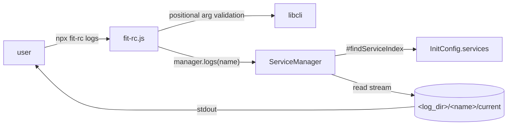
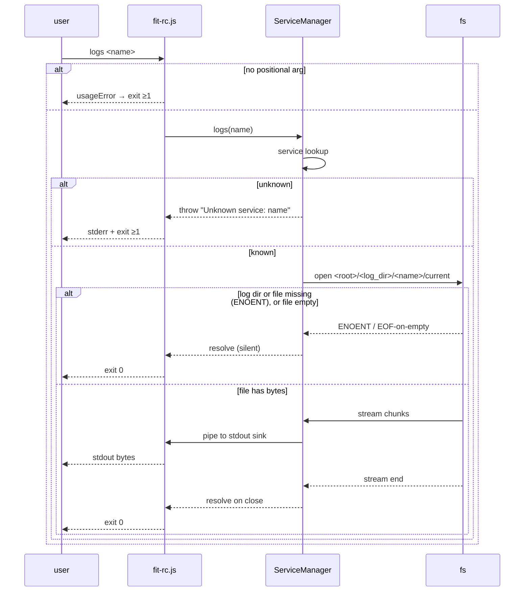

## Architecture

Spec 710 adds one command (`logs`) to the existing `fit-rc` CLI. It fits the
established lane — the CLI declares the command and dispatches a positional
service-name argument to a method on `ServiceManager`. The new method reads the
service's `current` log file from the configured log directory and writes its
contents to stdout. No daemon round-trip, no socket, no svscan dependency: the
log file is a static artifact on disk.

## Components

| Component                       | Role                                                                                                                                                                                                                                          |
| ------------------------------- | --------------------------------------------------------------------------------------------------------------------------------------------------------------------------------------------------------------------------------------------- |
| **`fit-rc` CLI definition**     | Adds `logs` to the libcli `commands` array and the dispatch `switch`. Required positional `<service>` enforced through libcli's usage-error path so missing-arg behavior matches sibling commands.                                            |
| **`ServiceManager.logs(name)`** | New domain method on `ServiceManager`. Validates the service exists via the existing `#findServiceIndex` helper (which throws `Unknown service: <name>`). Resolves the log path and streams its contents to the manager-supplied stdout sink. |
| **Log path resolver**           | Computes `path.join(config.rootDir, config.init.log_dir, name, "current")`. Mirrors the convention `LogWriter` already writes to (`<logDir>/current`, with `<logDir>` produced by the supervisor as `<root>/<log_dir>/<name>/`).              |
| **Doc surfaces**                | Getting-started "Service startup failures" snippet replaced with `npx fit-rc logs <service>`. CLI reference page gains a `logs` row in the `fit-rc` command table and an example block at parity with siblings.                               |

## Interfaces

`ServiceManager.logs(serviceName: string): Promise<void>` — single new public
method. Behavior:

| Condition                                                  | stdout                | stderr                                              | exit (via caller)       |
| ---------------------------------------------------------- | --------------------- | --------------------------------------------------- | ----------------------- |
| Known service, `current` exists with bytes                 | file contents (bytes) | (empty)                                             | 0                       |
| Known service, log dir or `current` missing, or file empty | (empty)               | (empty)                                             | 0 (criterion #5)        |
| Unknown service                                            | (empty)               | `Unknown service: <name>`                           | non-zero (criterion #3) |
| No service argument                                        | (empty)               | usage error matching `/required/i` and `/service/i` | non-zero (criterion #4) |

Non-ENOENT stream errors (e.g. EACCES, EISDIR) propagate as thrown exceptions to
the CLI exception path — they are real failures, not the "no logs yet" condition
criterion #5 covers.

Stdout writing is by injectable sink to keep the test harness pattern
established in `manager-{verb}.test.js` (mock `fs`, capture `logCalls`)
unchanged. The default sink is `process.stdout`.

## Data flow

## Key Decisions

| Decision                                | Choice                             | Rejected alternative                             | Why                                                                                                                                                                                   |
| --------------------------------------- | ---------------------------------- | ------------------------------------------------ | ------------------------------------------------------------------------------------------------------------------------------------------------------------------------------------- |
| Where the file read lives               | `ServiceManager.logs(name)`        | Read directly in `fit-rc.js`                     | Manager is the domain boundary for all sibling commands (`start`/`stop`/`status`); spec puts it in scope. CLI stays a thin dispatcher.                                                |
| How unknown-service is detected         | Reuse `#findServiceIndex`          | New private validator in `logs()`                | The helper already produces the exact `Unknown service: <name>` text spec criterion #3 asserts on. `status()` precedent.                                                              |
| Behavior when `current` file is missing | Exit 0, empty stdout, empty stderr | (a) Non-zero exit; (b) Explanatory `stderr` line | Criterion #5 requires exit 0 and stderr not matching `/error/i`. An empty stream is the simplest contract — non-empty messaging adds wording risk and noise on a non-error condition. |
| Read strategy                           | Stream file → stdout               | `readFileSync` into memory                       | LogWriter rotates at 1 MB so memory is small today, but streaming is the idiom for "emit a file to stdout" and removes the implicit ceiling on file size.                             |
| Missing-arg detection layer             | libcli usage error (CLI layer)     | Throw from `ServiceManager.logs(undefined)`      | Usage errors are a CLI concern; libcli's `usageError` produces criterion #4's stderr shape today for sibling commands. Manager method stays domain-focused.                           |
| Source of truth for log existence       | The file alone — no svscan check   | Gate on `isSvscanRunning()`                      | Spec line 5 of the in-scope table: works whether or not svscan is running. The `current` file persists past the daemon's lifetime.                                                    |

## Out of scope (asserts spec § Scope (out))

`--follow` / archive `@<timestamp>` files / multi-service interleave / JSON or
filter output / changes to `LogWriter` rotation contract are explicitly
deferred. The design surfaces no extension points for them — adding them later
is a separate spec.

## Test surface (architectural shape, not enumeration)

Tests follow the existing `manager-{verb}.test.js` pattern: a new
`manager-logs.test.js` covers the four behavior rows in the Interfaces table
through the same mock-`fs` + `logCalls` harness. The CLI dispatch path picks up
its coverage from libcli's existing usage-error tests; the documentation
surfaces (getting-started + CLI reference) verify by markdown inspection.

## Open questions

None. The spec's seven criteria fully constrain the contract; no architectural
decision is left unsettled.
