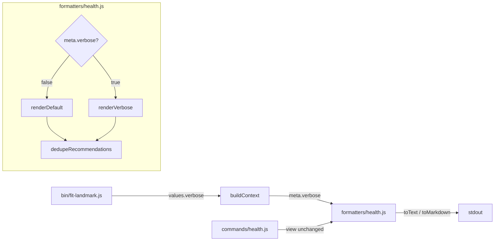
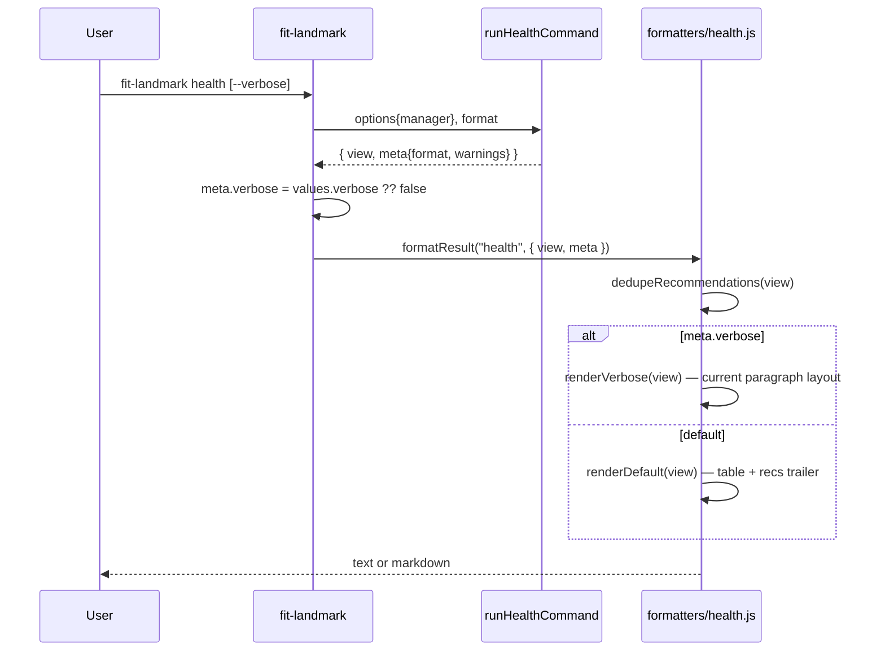

# Design A — Landmark Health View Readability

The spec is a rendering problem with the data already in hand. The view shape
emitted by `products/landmark/src/commands/health.js` is unchanged; everything
ships in the `text` and `markdown` formatters and one new boolean meta field.
JSON output is exempt by spec.

## Components



| Component                          | Where                                                             | Role                                                                |
| ---------------------------------- | ----------------------------------------------------------------- | ------------------------------------------------------------------- |
| `verbose` per-command option       | `bin/fit-landmark.js` health entry                                | Surface a boolean flag on the `health` command only.                |
| `meta.verbose`                     | `lib/context.js` (or equivalent)                                  | Carry the flag from CLI parse to the formatter, alongside `format`. |
| `formatters/health.js#toText`      | unchanged signature `(view, meta)`                                | Dispatch to default or verbose layout.                              |
| `formatters/health.js#toMarkdown`  | unchanged signature `(view, meta)`                                | Same dispatch as text, markdown idiom.                              |
| `dedupeRecommendations(view)`      | new local helper in `health.js`                                   | Collapse identical `(candidateEmail, skillId)` recs across drivers. |
| `renderScoreLine(driver, verbose)` | new local helper in `health.js`                                   | Default: one anchor + hint; verbose: all four anchors.              |
| Doc updates                        | `websites/fit/landmark/index.md`, leadership getting-started page | Sample blocks + `--verbose` mention.                                |

## Data Flow



The formatter is given the view shape produced today: a `drivers[]` array where
each driver carries
`{id, name, score, vs_prev, vs_org, vs_50th, vs_75th, vs_90th, contributingSkills, comments, initiatives, recommendations}`.
The existing command logic that fans recommendations across every driver whose
`contributingSkills` contains the rec's skill is left intact — the formatter is
the single place that owns presentation, including dedup.

## Default Layout (text)

```
  {teamLabel} — health view (snapshot {snapshotDate})

  Drivers (6, ranked by percentile)
  ────────────────────────────────────────────────────────────
  #  Driver          Percentile  vs_org   More
  1  Quality         42nd        -10      vs_prev/50/75/90 → --verbose
  2  Reliability     n/a         n/a      —
  …

  Recommendations (3 unique)
  ────────────────────────────────────────────────────────────
  • Bob (Level II) could develop planning  — for Quality (critical)
  • Alice (Level I) could develop incident_response  — for Reliability (high)
  …
```

Markdown mirrors this with a real `| Driver | Percentile | vs_org | More |`
table and a `## Recommendations` trailer section.

The plural section header (`Drivers (N, ranked by percentile)`) is the row-
dimension anchor the spec asks for: a reader knows before any row that what
follows is one driver per line, not one person or one period. `More` names the
hidden anchors and points to `--verbose`.

## Verbose Layout

`meta.verbose === true` reuses today's paragraph form intact — driver heading,
contributing skills, evidence counts, comments, recommendations, initiatives —
with two changes: (1) the score line lists all four percentile anchors, and (2)
the deduped recommendation set replaces today's per-driver fan-out so the same
`(candidate, skill)` rec never appears twice in one render. Information parity
with today's text formatter is otherwise preserved.

## Key Decisions

| Decision                            | Choice                                                                            | Rejected alternative                                           | Why                                                                                                              |
| ----------------------------------- | --------------------------------------------------------------------------------- | -------------------------------------------------------------- | ---------------------------------------------------------------------------------------------------------------- |
| Where the verbose flag lives        | `meta.verbose` boolean alongside `meta.format`                                    | A new `view.verbose` field, or a third formatter argument      | `meta` already carries rendering control (`format`, `warnings`); `view` is data; signature stays `(view, meta)`. |
| Where recommendation dedup happens  | Formatter pre-pass, keyed by `(candidate.email, rec.skill)`                       | Move dedup into `runHealthCommand` (single rec per driver)     | Spec freezes the command/formatter contract. Dedup is presentation, not data.                                    |
| Default layout shape                | Compact table + separate `Recommendations` trailer                                | Keep paragraphs but trim per-driver lines                      | A table makes the row dimension unambiguous (spec success criterion 1) and trivially fits ≤50 lines.             |
| What the default score column shows | One anchor (`vs_org`) + a `More` cell hinting `--verbose`                         | Show all four anchors inline in one row                        | Four numeric columns plus driver name explodes column width; spec calls out anchor disclosure as the goal.       |
| What verbose adds beyond default    | All four anchors per row + comments + initiatives + per-driver paragraph richness | A different layout — table with extra columns                  | Spec requires "every field currently emitted by today's text formatter"; reusing today's layout proves it.       |
| Recommendation home in default      | Single trailer section under the table                                            | Inline under each driver                                       | Inline placement is what causes the verbatim-repetition bug (success criterion 4).                               |
| Where dedup state lives             | Local `Set<string>` in the helper, scoped per render call                         | A field on the view, computed once and read by both formatters | Formatters must not mutate `view`; both formatters call the helper themselves so JSON stays unaffected.          |
| Initiatives + comments in default   | Hidden in default, visible in `--verbose`                                         | A truncated trailer in default                                 | Default budget is ≤50 lines for 6 drivers; trailer truncation reintroduces the "what's hidden?" ambiguity.       |

## Interfaces

```ts
// formatters/health.js — public exports
toText(view: HealthView, meta: Meta): string
toMarkdown(view: HealthView, meta: Meta): string
toJson(view: HealthView, meta: Meta): string  // unchanged

// new internal helpers, not exported
function dedupeRecommendations(drivers: Driver[]): DedupedRec[]
function renderScoreLine(driver: Driver, verbose: boolean): string

// shape additions
interface Meta {
  format: "text" | "markdown" | "json"
  warnings: string[]
  verbose?: boolean   // new — undefined treated as false
}

interface DedupedRec {
  candidate: { name?: string; email: string; currentLevel: string }
  skill: string
  impact: string
  driverIds: string[]   // every driver the rec was attached to, for the trailer "for X" phrase
}
```

`HealthView` and `Driver` are the shape produced by `runHealthCommand` today —
this design does not modify them.

## Scope-Faithful Notes

- **JSON path untouched.** `toJson` ignores `meta.verbose` and emits the full
  view shape unchanged, satisfying the spec's "JSON output structure" exclusion.
- **No new view fields.** Dedup state is per-render and local. The command
  remains the single producer of `view.drivers[].recommendations`.
- **No new data sources.** Per spec — only data the renderer already receives.
- **`--manager` is unchanged.** The flag is global and continues to feed
  `options.manager` into the command.

## Risks

| Risk                                                            | Mitigation                                                                                                |
| --------------------------------------------------------------- | --------------------------------------------------------------------------------------------------------- |
| Markdown table cells with `n/a` percentiles widen unpredictably | Pin column widths in text; let markdown reflow naturally. Verified by snapshot tests against the fixture. |
| Dedup hides recs the user wants to see per driver               | Trailer line names every driver the rec applies to (`for Quality, Reliability`).                          |
| `--verbose` becomes the new default in users' muscle memory     | Default layout includes the explicit `--verbose` hint in `More` so discovery is self-evident.             |

## Out of Scope (for the planner)

The plan will own: file-level edits (`bin/fit-landmark.js` flag wiring,
`lib/context.js` flag forwarding, `formatters/health.js` rewrite, fixture-driven
tests, doc page updates), execution ordering, and per-test assertions. This
design intentionally stops at the architectural seams.

— Staff Engineer 🛠️
