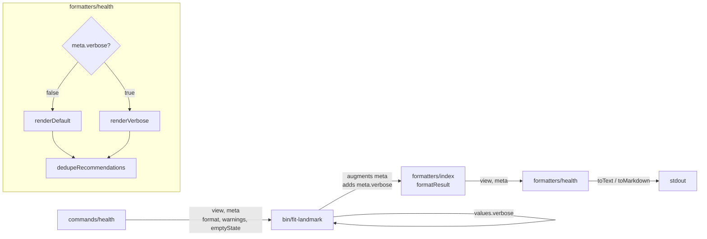
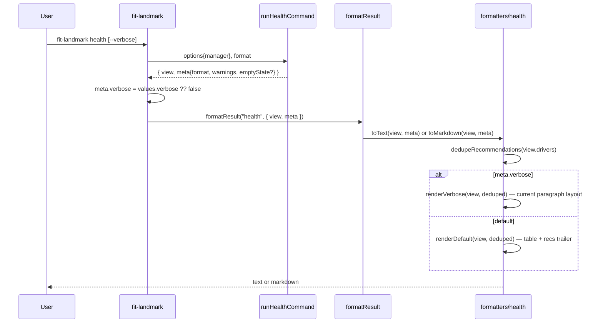

# Design A — Landmark Health View Readability

The spec is a rendering problem with the data already in hand. The view shape
emitted by `products/landmark/src/commands/health.js` is unchanged; everything
ships in the `text` and `markdown` formatters and one new boolean meta field.
JSON output is exempt by spec.

## Components



| Component                              | Module                                         | Role                                                                                                                   |
| -------------------------------------- | ---------------------------------------------- | ---------------------------------------------------------------------------------------------------------------------- |
| `verbose` per-command option           | landmark CLI binary                            | Surface a boolean flag on the `health` command only; `values.verbose` flows out of `cli.parse(...)`.                   |
| `meta.verbose` augmentation            | landmark CLI binary, after the handler returns | The handler builds `meta`; the binary copies `values.verbose` into `meta.verbose` before invoking `formatResult`.      |
| `formatters/health` default formatters | shared formatter module                        | Today's `toText(view)` and `toMarkdown(view)` extend to `(view, meta)` and dispatch on `meta.verbose`. JSON unchanged. |
| `dedupeRecommendations(drivers)`       | private helper inside `formatters/health`      | Walk `drivers[].recommendations[].candidates[]`; collapse to one `DedupedRec` per `(candidate.email, rec.skill)`.      |
| `renderScoreCells(driver, verbose)`    | private helper inside `formatters/health`      | Returns the cell tuple for a driver row in default mode and the multi-anchor block in verbose mode.                    |

## Data Flow



The view shape (`drivers[]` with `score`, all four `vs_*` deltas,
`contributingSkills`, `comments`, `initiatives`, `recommendations`) is produced
by the command today and passed through unchanged. The command's per-driver
recommendation fan-out is kept; the formatter is the single owner of dedup.

## Default Layout

Driver iteration order matches `view.drivers`; no new sort. The plural header
`Drivers (N)` is the row-dimension anchor (success criterion 1).

**Text:**

```
  {teamLabel} — health view

  Drivers (N)
  ────────────────────────────────────────────────────────────
  #  Driver          Percentile  vs_org   More
  1  Quality         42nd        -10      +3 anchors via --verbose
  2  Reliability     n/a         n/a      -
  ...

  Recommendations (K unique)
  ────────────────────────────────────────────────────────────
  - Bob (Level II) could develop planning -- for Quality (critical)
  - Alice (Level I) could develop incident_response -- for Reliability (high)
  ...
```

**Markdown:**

```markdown
# {teamLabel} — health view

## Drivers (N)

| #   | Driver      | Percentile | vs_org | More                       |
| --- | ----------- | ---------- | ------ | -------------------------- |
| 1   | Quality     | 42nd       | -10    | +3 anchors via `--verbose` |
| 2   | Reliability | n/a        | n/a    | -                          |

## Recommendations (K unique)

- **Bob** (Level II) could develop `planning` — for Quality (critical)
- **Alice** (Level I) could develop `incident_response` — for Reliability (high)
```

`More` reads `+N anchors via --verbose` (where N = count of non-null `vs_*`
fields), or `-` if none. No literal arrow glyphs (escape-free in markdown).

## Verbose Layout

`meta.verbose === true` reuses today's paragraph form (driver heading,
contributing skills, evidence counts, comments, recommendations, initiatives)
with two changes: the score line lists all four percentile anchors, and the
deduped recommendation set replaces the per-driver fan-out. Information parity
with today's text formatter holds (success criterion 3).

## Multi-Candidate Recommendation Dedup

`recommendations[].candidates` is an array. Dedup is keyed per
`(candidate.email, rec.skill)`, not per `(rec, skill)` — a rec naming two
candidates yields two `DedupedRec` entries. The helper walks
`drivers → recommendations → candidates`, emits one entry per first-seen key,
and appends `driver.id` to `driverIds` on later hits. `impact` is taken from the
first occurrence; `driverIds` powers the trailer's "for Quality, Reliability"
phrase.

## Key Decisions

| Decision                            | Choice                                                                            | Rejected alternative                                       | Why                                                                                                                        |
| ----------------------------------- | --------------------------------------------------------------------------------- | ---------------------------------------------------------- | -------------------------------------------------------------------------------------------------------------------------- |
| Where the verbose flag lives        | `meta.verbose` boolean alongside `meta.format`                                    | A new `view.verbose` field, or a third formatter argument  | `meta` already carries rendering control; `view` is data; the formatter signature extends from `(view)` to `(view, meta)`. |
| Where recommendation dedup happens  | Formatter pre-pass, keyed by `(candidate.email, rec.skill)`                       | Move dedup into `runHealthCommand` (single rec per driver) | Spec freezes the command/formatter contract. Dedup is presentation, not data.                                              |
| Default layout shape                | Compact table + separate `Recommendations` trailer                                | Keep paragraphs but trim per-driver lines                  | A table makes the row dimension unambiguous (spec success criterion 1) and trivially fits ≤50 lines.                       |
| What the default score column shows | One anchor (`vs_org`) + a `More` cell hinting `--verbose`                         | Show all four anchors inline in one row                    | Four numeric columns plus driver name explodes column width; spec calls out anchor disclosure as the goal.                 |
| What verbose adds beyond default    | All four anchors per row + comments + initiatives + per-driver paragraph richness | A different layout — table with extra columns              | Spec requires "every field currently emitted by today's text formatter"; reusing today's layout proves it.                 |
| Recommendation home in default      | Single trailer section under the table                                            | Inline under each driver                                   | Inline placement is what causes the verbatim-repetition bug (success criterion 4).                                         |
| Initiatives + comments in default   | Hidden in default, visible in `--verbose`                                         | A truncated trailer in default                             | Default budget is ≤50 lines for 6 drivers; trailer truncation reintroduces the "what's hidden?" ambiguity.                 |

## Interfaces

```ts
// formatters/health.js — public exports
// Today's signatures are (view); this design extends both to (view, meta).
toText(view: HealthView, meta: Meta): string
toMarkdown(view: HealthView, meta: Meta): string
toJson(view: HealthView, meta: Meta): string // unchanged

// new internal helpers, not exported
function dedupeRecommendations(drivers: Driver[]): DedupedRec[]
function renderScoreCells(driver: Driver, verbose: boolean):
  | { percentile: string; vsOrg: string; more: string } // default mode → table cells
  | string[] // verbose mode → multiple anchor lines

// Meta — additive shape change. Existing fields (format, warnings, emptyState)
// stay; verbose is the only new field.
interface Meta {
  format: "text" | "markdown" | "json"
  warnings: string[]
  emptyState?: string // pre-existing — preserved
  verbose?: boolean // new — undefined treated as false
}

interface DedupedRec {
  candidate: { name?: string; email: string; currentLevel: string }
  skill: string
  impact: string
  driverIds: string[] // every driver the rec was attached to, for the trailer "for X" phrase
}
```

`HealthView` and `Driver` are the shape produced by `runHealthCommand` today —
this design does not modify them.

## Scope-Faithful Notes

- **JSON path untouched.** `toJson` ignores `meta.verbose`; full view shape
  emitted as today.
- **No view-shape mutation.** Dedup state is per-render and local; the command
  remains the sole producer of `view.drivers[].recommendations`.

## Risks

| Risk                                                            | Mitigation                                                                       |
| --------------------------------------------------------------- | -------------------------------------------------------------------------------- |
| Markdown table cells with `n/a` percentiles widen unpredictably | Pin column widths in text via `padRight`; let markdown reflow naturally.         |
| Dedup hides recs the user wants to see per driver               | Trailer line names every driver the rec applies to (`for Quality, Reliability`). |
| `--verbose` becomes the new default in users' muscle memory     | Default layout's `More` cell hints `--verbose` so discovery is self-evident.     |

## Out of Scope (for the planner)

File-level edits, doc wording, execution ordering, and test assertions are the
plan's job.

— Staff Engineer 🛠️
