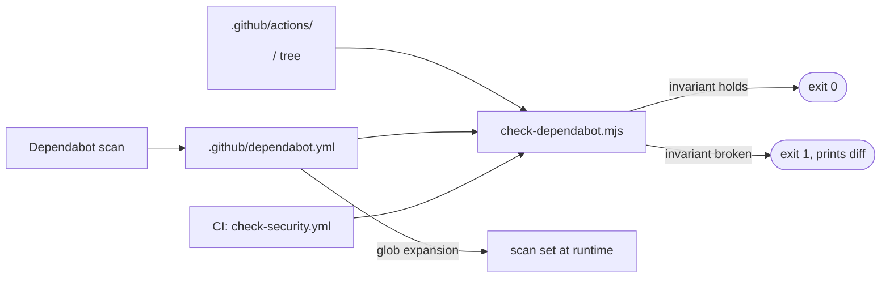

# Design 730 — Dependabot ↔ `.github/actions/` directory sync

## Components

| #   | Component                 | Where                                      | Responsibility                                                                                                                                      |
| --- | ------------------------- | ------------------------------------------ | --------------------------------------------------------------------------------------------------------------------------------------------------- |
| 1   | Glob entry                | `.github/dependabot.yml`                   | One line in the `github-actions` ecosystem `directories:` list — `/.github/actions/*` — that Dependabot expands against the repo tree at scan time. |
| 2   | Coverage check script     | `scripts/check-dependabot.mjs`             | Reads `.github/dependabot.yml`, expands the same glob locally, computes filesystem set, asserts the coverage invariant, exits non-zero on break.    |
| 3   | CI gate                   | `.github/workflows/check-security.yml` job | Runs component 2 on every PR and on `main`. Fails the merge gate when the invariant breaks.                                                         |
| 4   | `package.json` script row | top-level `scripts.context` chain          | `bun run context` already runs the other config-drift checks; component 2 joins as `context:dependabot`.                                            |

## Data flow

The two consumers of `dependabot.yml` glob expansion are independent:

1. **GitHub Dependabot** expands `/.github/actions/*` against `main` at its
   scheduled tick — the production runtime.
2. **`check-dependabot.mjs`** expands the same glob locally against the PR tree
   at CI time — the verification runtime that gates merges.

Both expansions follow the same rule (literal directory paths matching one path
segment under `.github/actions/`), so what CI accepts is what Dependabot will
scan.

## Coverage invariant (restated for the design)

| Set            | How it is computed                                                                                                             |
| -------------- | ------------------------------------------------------------------------------------------------------------------------------ |
| filesystem set | `{ <D> : .github/actions/<D>/action.yml ∨ .github/actions/<D>/action.yaml exists }`                                            |
| scan set       | the `directories:` field for the `github-actions` ecosystem, with each glob entry expanded against the tree at the same commit |
| invariant      | filesystem set ⊆ scan set ∧ (scan set ∖ {/}) ⊆ filesystem set                                                                  |

Component 2 computes both sets and prints the offending elements on failure.

## Verification mapping (spec criteria → design)

| Spec criterion | How design satisfies it                                                                                                                                                       |
| -------------- | ----------------------------------------------------------------------------------------------------------------------------------------------------------------------------- |
| 1              | Component 2 run against post-change `main` returns exit 0; CI in component 3 enforces this every push.                                                                        |
| 2 (add)        | New `.github/actions/<new>/action.yml` is auto-included in the glob expansion. Component 2 confirms invariant; CI gate blocks regression if expansion semantics change.       |
| 3 (rename)     | Old path drops out of the glob expansion, new path joins. No `dependabot.yml` edit needed. CI gate confirms.                                                                  |
| 4 (delete)     | Deleted directory drops out of the glob expansion. The dead-path failure mode of incident #3 (PR #556 auto-close on a stale literal path) cannot occur — the literal is gone. |
| 5              | The literal `/` entry is preserved alongside the glob; component 2 asserts it remains in the file.                                                                            |
| 6              | The contributor edits no config — adding/renaming/deleting a directory under `.github/actions/` requires zero new step.                                                       |

## Key decisions

| Decision                      | Choice                                                           | Rejected alternative                                                                      | Why                                                                                                                                                                               |
| ----------------------------- | ---------------------------------------------------------------- | ----------------------------------------------------------------------------------------- | --------------------------------------------------------------------------------------------------------------------------------------------------------------------------------- |
| Mechanism                     | Glob entry in `directories:` (lever A)                           | CI drift check that gates a manually-maintained `directories:` list (lever B)             | Lever B leaves the manual list as the source of truth — adding a directory still requires editing `dependabot.yml`, breaking spec criterion 6. Lever A removes the edit entirely. |
| Glob shape                    | `/.github/actions/*` (single segment)                            | `/.github/actions/**` (recursive)                                                         | `**` would match nested directories inside an action (e.g., `node_modules/`, vendored bins) and inflate Dependabot's scan set with non-action paths.                              |
| Workflow-root coverage        | Keep literal `/` alongside the glob                              | Replace `/` with `/.github/workflows/*` glob                                              | Spec scope (out): "workflow-file scanning at `/` (the root entry must remain)". The two-entry list — `/` and `/.github/actions/*` — is the minimal change.                        |
| Verification artifact         | Standalone `scripts/check-dependabot.mjs` (Node ESM)             | Inline `bash` step using `find` + `yq` in the workflow                                    | A `.mjs` script is testable, debuggable locally (`bun scripts/check-dependabot.mjs`), and matches the existing `scripts/check-*.mjs` pattern (instructions/metadata/catalog).     |
| CI placement                  | Add a job to `check-security.yml`                                | New workflow `check-dependabot.yml`                                                       | The check is a supply-chain coverage gate — same domain as the existing security workflow. One more workflow file would dilute the merge-gate surface for no benefit.             |
| Failure mode on glob mismatch | Exit non-zero with the offending diff printed                    | Auto-fix and commit                                                                       | Auto-fix would re-introduce the contributor-invisible drift the spec exists to eliminate. A loud failure is the correct shape for a merge gate.                                   |
| Replay-test handling          | Spec criteria 2–4 are checked by component 2 against the PR tree | Add three fixture commits (`_canary` add / rename / delete) and a separate replay harness | The CI gate already evaluates the post-PR tree — it _is_ the replay test for whatever delta the PR carries. A separate harness duplicates the check without new coverage.         |

## Boundaries

- Out: changing the `npm`/`bun` ecosystem block, the `schedule:` cadence, or the
  composite actions themselves (per spec scope).
- Out: SHA-pin enforcement and action-pinning policy (per spec scope).
- Out: any change to `CONTRIBUTING.md` or contributor docs — the design adds no
  new step to the contributor flow.

## Risks

| Risk                                                                                                 | Containment                                                                                                                                                                                                                                         |
| ---------------------------------------------------------------------------------------------------- | --------------------------------------------------------------------------------------------------------------------------------------------------------------------------------------------------------------------------------------------------- |
| Dependabot's glob expansion semantics change (e.g., `*` starts matching files, not just directories) | Component 2 re-implements the same expansion locally and runs every PR. Drift between the two implementations is caught the next time a directory changes — same merge gate, same failure shape.                                                    |
| A future contributor adds a non-action file directly under `.github/actions/` (e.g., a stray README) | The `*` glob matches it as a candidate directory; Dependabot finds no `action.yml` inside and skips it harmlessly. Component 2 only adds files to the filesystem set when an `action.yml`/`action.yaml` is present, so no false positive is raised. |
| The single literal `/` entry is removed by accident                                                  | Component 2 asserts `/` ∈ scan set as part of criterion 5 verification.                                                                                                                                                                             |
