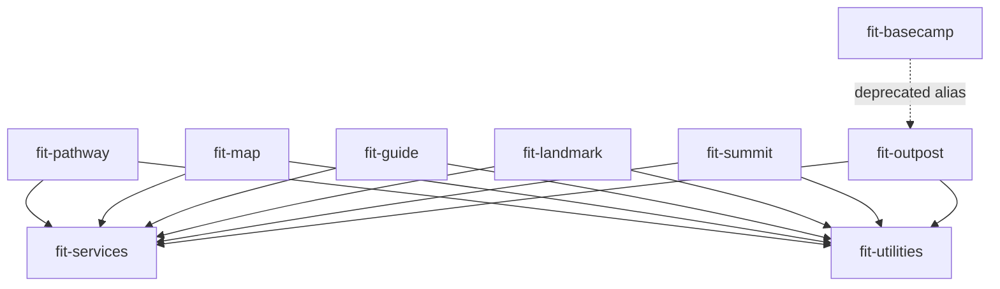

# Design — Seed `forwardimpact/homebrew-tap` with initial casks

## Architecture

Three components collaborate. Nine cask files in the tap repo define what
Homebrew installs. A conventions document in the monorepo prescribes how casks
are authored and maintained. The tap README bridges the two.

| Component              | Location                                         | Purpose                                                      |
| ---------------------- | ------------------------------------------------ | ------------------------------------------------------------ |
| Cask files (x9)        | `forwardimpact/homebrew-tap/Casks/`              | Homebrew cask definitions installed by `brew install`         |
| Conventions doc        | `websites/fit/docs/internals/release/` in mono   | Authoring rules, sed contract, binary-stanza mapping         |
| Tap README             | `forwardimpact/homebrew-tap/README.md`            | Links to conventions doc via published URL                   |

## Dependency Graph



Every product cask declares `depends_on` on both shared-bundle casks (spec 600
SC3: "product casks declare a dependency on the two shared-bundle casks so
installing a product cask delivers the full runtime"). The two shared casks have
no inter-dependencies.

## Cask Anatomy

Each live cask follows an identical structure:

1. **Metadata** — `version`, `sha256` (the two sed-rewritable fields)
2. **URL** — GitHub release asset on `forwardimpact/monorepo`
3. **Livecheck** — per-cask regex against monorepo releases
4. **Dependencies** — `depends_on macos:` and `depends_on cask:` (products only)
5. **App stanza** — installs the `.app` bundle to `/Applications/`
6. **Binary stanzas** — symlinks each executable to Homebrew's `bin/`
7. **Zap stanza** — removes application-support data on `brew zap`

### URL and Asset Scheme

Assets follow the pattern at `publish-brew.yml` line 120:

```
https://github.com/forwardimpact/monorepo/releases/download/{name}@v{version}/{cask}-{version}-darwin-arm64.zip
```

Where `{name}` is the tag prefix (e.g., `pathway`), `{cask}` is `fit-{name}`,
and `{version}` is the semver string.

### Sed Contract

The `tap-pr` job (lines 210-213) rewrites exactly two lines per cask:

```ruby
  version "{version}"
  sha256 "{sha256}"
```

Two-space indent, field name, space, double-quoted value. No other cask content
is modified by the workflow. All other fields — dependencies, binary stanzas,
livecheck — are human-edited in the tap repo and survive releases unchanged.

### Livecheck Strategy

Each cask uses the `:url` strategy against the monorepo's releases atom feed
with a per-cask regex that extracts the version from its tag prefix:

```ruby
livecheck do
  url "https://github.com/forwardimpact/monorepo/releases.atom"
  regex(/{name}@v(\d+(?:\.\d+)+)/i)
end
```

The atom feed is stable and paginated. Each cask's regex matches only its own
tag prefix, filtering out other bundles' tags from the shared releases page.

## Binary Stanza Mapping

Each cask exposes only its own executables via `binary` stanzas. Shared-bundle
executables reach PATH through `depends_on`, not through re-declaration.

| Cask             | Executables on PATH                                                                                                                                                                                                                       | Count |
| ---------------- | ----------------------------------------------------------------------------------------------------------------------------------------------------------------------------------------------------------------------------------------- | ----- |
| `fit-pathway`    | `fit-pathway`                                                                                                                                                                                                                             | 1     |
| `fit-map`        | `fit-map`                                                                                                                                                                                                                                 | 1     |
| `fit-guide`      | `fit-guide`                                                                                                                                                                                                                               | 1     |
| `fit-landmark`   | `fit-landmark`                                                                                                                                                                                                                            | 1     |
| `fit-summit`     | `fit-summit`                                                                                                                                                                                                                              | 1     |
| `fit-outpost`    | `fit-outpost`                                                                                                                                                                                                                             | 1     |
| `fit-services`   | `fit-svcgraph`, `fit-svcmcp`, `fit-svcpathway`, `fit-svctrace`, `fit-svcvector`                                                                                                                                                          | 5     |
| `fit-utilities`  | `fit-codegen`, `fit-terrain`, `fit-eval`, `fit-doc`, `fit-rc`, `fit-xmr`, `fit-storage`, `fit-logger`, `fit-svscan`, `fit-trace`, `fit-visualize`, `fit-query`, `fit-subjects`, `fit-process-graphs`, `fit-process-resources`, `fit-process-vectors`, `fit-search`, `fit-unary`, `fit-tiktoken`, `fit-download-bundle` | 20    |

Outpost's `Outpost` launcher (the Swift GUI process) is accessible via the
installed `.app` in `/Applications/` but is not placed on PATH.

Rejected: exposing `Outpost` on PATH — it is a native GUI launcher, not a CLI.

## Deprecated Cask (`fit-basecamp`)

Uses Homebrew's `deprecate!` DSL:

```ruby
deprecate! date: "2026-04-30", because: "renamed to fit-outpost (USPTO Reg. 3202059)"
```

The cask has no `url`, `sha256`, `app`, or `binary` stanzas — it exists solely
for discoverability via `brew search`. Its `desc` names `fit-outpost` as the
replacement and references the storage-path migration command from #625 8d.

## Conventions Document

A single document under `websites/fit/docs/internals/release/` covering:

- Sed contract — which fields the workflow rewrites, which are human-edited
- Dependency graph rationale and the SC3 mandate
- Binary stanza mapping — authoritative list per cask
- Livecheck regex pattern and atom-feed rationale
- Zap/uninstall paths per cask
- `brew style` / `brew audit` commands for manual verification

Co-located with the workflow because the conventions and the workflow decay
together. The tap README links to this document via its published URL.

## Key Decisions

| Decision | Choice | Rejected | Why |
| --- | --- | --- | --- |
| Product dependency graph | All products depend on both shared bundles | Only guide depends on services | SC3 mandates "the full runtime"; partial deps force users to discover missing pieces |
| Livecheck source | Atom feed with per-cask regex | `:github_releases` strategy | Multi-bundle repo needs tag-prefix filtering |
| Deprecated cask form | Standalone `fit-basecamp.rb` with `deprecate!` | Caveats on `fit-outpost` | `brew search fit-basecamp` must surface results |
| Conventions doc location | Monorepo `internals/release/` | Tap repo README | Conventions co-decay with the workflow |
| Binary stanza scope | Per-cask only | Products re-declare shared binaries | Avoids double-declaration drift; `depends_on` handles it |
