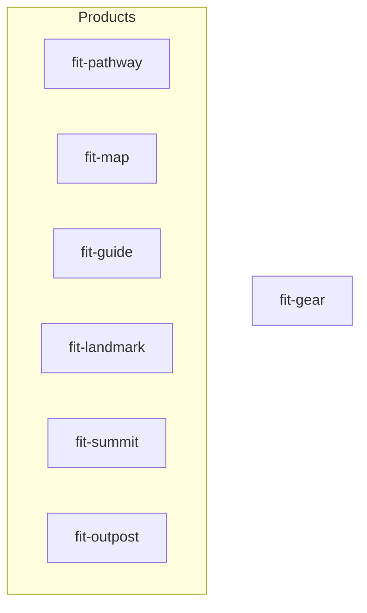

# Plan — Seed `forwardimpact/homebrew-tap` with initial casks

> Spec: [`spec.md`](spec.md) · Design: [`design-a.md`](design-a.md)

## Approach

The seven cask files already live on `forwardimpact/homebrew-tap/main` in the
shape the design prescribes (single `fit-gear` shared bundle, `Forward Impact/`
app subdirectory, `:github_releases` livecheck with anchored per-cask regex).
Three monorepo-side gaps remain before the spec's success criteria pass:
`publish-brew.yml` and `justfile` still build, sign, and publish under the
legacy `services@v*` / `utilities@v*` tag pair, so the `tap-pr` job's sed
contract targets cask filenames that no longer exist; the conventions document
the spec's SC5 names is missing; and no end-to-end check has confirmed the
seeded casks survive the workflow's sed contract. This plan closes those three
gaps in two parallel strands and ends with a verification pass that also
reconciles any drift between the seeded cask bodies and the design tables.

## Files at a glance

| Action | Path                                                                                           | Reason                                                                  |
| ------ | ---------------------------------------------------------------------------------------------- | ----------------------------------------------------------------------- |
| Modify | `.github/workflows/publish-brew.yml`                                                           | Replace `services@v*` / `utilities@v*` tag pair and case branches with `gear` |
| Modify | `justfile`                                                                                     | Replace `build-{service,utility}-binaries` and `build-app-{services,utilities}` with gear recipes |
| Create | `macos/gear/Info.plist`                                                                        | Bundle metadata for `fit-gear.app`                                      |
| Create | `macos/gear/entitlements.plist`                                                                | Codesign entitlements for `fit-gear.app` (byte-copy of the existing services plist) |
| Delete | `macos/services/Info.plist`, `macos/services/entitlements.plist`                               | Replaced by `macos/gear/`                                               |
| Delete | `macos/libraries/Info.plist`, `macos/libraries/entitlements.plist`                             | Replaced by `macos/gear/`                                               |
| Create | `websites/fit/docs/internals/release/index.md`                                                 | Conventions document (spec § In scope, SC5)                             |
| Modify | `websites/fit/docs/internals/index.md`                                                         | Add `release` card to the internals hub grid                            |

## Steps

### 1. Replace the `services@v*` / `utilities@v*` tag pair with `gear@v*`

File modified: `.github/workflows/publish-brew.yml` (lines 9–16).

Before / after:

```yaml
# Before
tags:
  - "outpost@v*"
  - "guide@v*"
  - "landmark@v*"
  - "map@v*"
  - "pathway@v*"
  - "summit@v*"
  - "services@v*"
  - "utilities@v*"

# After
tags:
  - "outpost@v*"
  - "guide@v*"
  - "landmark@v*"
  - "map@v*"
  - "pathway@v*"
  - "summit@v*"
  - "gear@v*"
```

Verify: `grep -E '^\s+- "[a-z]+@v\*"' .github/workflows/publish-brew.yml | wc -l` returns `7`; `grep -nE '"(services|utilities)@v\*"' .github/workflows/publish-brew.yml` returns no matches. (Plain `grep` rather than `yq` because the YAML key `on:` parses to boolean `true` under some `yq` builds.)

### 2. Collapse both `case "$NAME"` blocks onto a single `gear` branch

File modified: `.github/workflows/publish-brew.yml`. Two case blocks need updating: the `build` job's "Extract bundle and version from tag" step (lines 33–37) and the `tap-pr` job's "Extract bundle and version from tag" step (lines 158–161). The blocks differ — the `build` block sets `KIND`, `BUNDLE`, and `CASK`; the `tap-pr` block sets only `KIND` and `CASK` (no `BUNDLE`). Replace each separately:

**Build job** (lines 33–37):

```sh
# Before
case "$NAME" in
  services)   KIND=services;   BUNDLE="FIT Services.app";  CASK=fit-services  ;;
  utilities)  KIND=utilities;  BUNDLE="FIT Utilities.app"; CASK=fit-utilities ;;
  *)          KIND=product;    BUNDLE="fit-${NAME}.app";   CASK=fit-${NAME}   ;;
esac

# After
case "$NAME" in
  gear)  KIND=gear;     BUNDLE="fit-gear.app";    CASK=fit-gear    ;;
  *)     KIND=product;  BUNDLE="fit-${NAME}.app"; CASK=fit-${NAME} ;;
esac
```

**Tap-pr job** (lines 158–161 — no `BUNDLE` variable):

```sh
# Before
case "$NAME" in
  services)   KIND=services;   CASK=fit-services  ;;
  utilities)  KIND=utilities;  CASK=fit-utilities ;;
  *)          KIND=product;    CASK=fit-${NAME}   ;;
esac

# After
case "$NAME" in
  gear)  KIND=gear;     CASK=fit-gear    ;;
  *)     KIND=product;  CASK=fit-${NAME} ;;
esac
```

Verify: `grep -n 'KIND=services\|KIND=utilities\|fit-services\|fit-utilities\|FIT Services\|FIT Utilities' .github/workflows/publish-brew.yml` returns no matches.

### 3. Update the `Build bundle` and `Verify cdhash stability` cases

File modified: `.github/workflows/publish-brew.yml`. Two `case "${{ steps.meta.outputs.kind }}"` blocks share identical structure and both need the same edit: lines 55–68 (`Build bundle`) and lines 91–104 (the rebuild branch inside `Verify cdhash stability`).

Replace each services/utilities pair with one gear arm:

```sh
case "${{ steps.meta.outputs.kind }}" in
  gear)
    just build-gear-binaries
    just build-app-gear
    ;;
  product)
    just build-binary "fit-${{ steps.meta.outputs.name }}"
    just build-app-product "${{ steps.meta.outputs.name }}"
    ;;
esac
```

Verify: `grep -cE '^\s*gear\)' .github/workflows/publish-brew.yml` returns `2` (one `gear)` arm per case block updated by this step); `grep -nE '^\s*(services|utilities)\)' .github/workflows/publish-brew.yml` returns no matches anywhere in the file.

### 4. Update the `Smoke test` step's primary CLI selection

File modified: `.github/workflows/publish-brew.yml` (lines 76–80).

```sh
# Before
case "${{ steps.meta.outputs.kind }}" in
  product)    "$BUNDLE/Contents/MacOS/fit-${{ steps.meta.outputs.name }}" --help ;;
  services)   "$BUNDLE/Contents/MacOS/fit-svcgraph" --help ;;
  utilities)  "$BUNDLE/Contents/MacOS/fit-codegen" --help ;;
esac

# After
case "${{ steps.meta.outputs.kind }}" in
  product)  "$BUNDLE/Contents/MacOS/fit-${{ steps.meta.outputs.name }}" --help ;;
  gear)     "$BUNDLE/Contents/MacOS/fit-svcgraph" --help ;;
esac
```

Verify: `awk '/Smoke test/,/Verify cdhash stability/' .github/workflows/publish-brew.yml | grep -cE '^\s*(services|utilities)\)'` returns `0`; the same range contains exactly one `gear)` arm.

### 5. Refresh the in-line comment on the sed step

File modified: `.github/workflows/publish-brew.yml` (lines 205–208). Replace with:

```yaml
# Only the version and sha256 lines are updated per release. The rest of the
# cask body — binary stanzas, livecheck regex — is human-edited in the tap
# repo and survives releases unchanged. The casks declare no inter-cask
# dependencies, so each release rewrites exactly one cask file.
```

Verify: `git grep -nE 'depends_on graph' -- .github` returns no matches across the repo (catches the same outdated phrase if it migrated to any other workflow file).

### 6. Replace the legacy bundle recipes in the root `justfile`

File modified: `justfile` (`# ── Bundles` section, lines ≈175–323).

Delete: `build-service-binaries` (recipe at line 214), `build-utility-binaries` (line 222), `build-app-services` (line 272), `build-app-utilities` (line 286). Update `build-binaries` (line 202) and `build-apps` (line 315) to fan out through the new gear recipes. Locate each by recipe name (the line numbers above are advisory).

Add `build-gear-binaries` and `build-app-gear`:

```just
# Compile every gear CLI (services + library binaries; must stay in sync with
# Casks/fit-gear.rb in the forwardimpact/homebrew-tap repo)
build-gear-binaries:
    just build-binary fit-svcgraph
    just build-binary fit-svcmcp
    just build-binary fit-svcpathway
    just build-binary fit-svctrace
    just build-binary fit-svcvector
    just build-binary fit-codegen
    just build-binary fit-terrain
    just build-binary fit-eval
    just build-binary fit-doc
    just build-binary fit-rc
    just build-binary fit-xmr
    just build-binary fit-storage
    just build-binary fit-logger
    just build-binary fit-svscan
    just build-binary fit-trace
    just build-binary fit-visualize
    just build-binary fit-query
    just build-binary fit-subjects
    just build-binary fit-process-graphs
    just build-binary fit-process-resources
    just build-binary fit-process-vectors
    just build-binary fit-search
    just build-binary fit-unary
    just build-binary fit-tiktoken
    just build-binary fit-download-bundle

# Assemble dist/apps/fit-gear.app — bundles all 25 service + library CLIs
build-app-gear:
    bash libraries/libmacos/scripts/build-app.sh \
      --bundle-name "fit-gear" \
      --primary-exec "dist/binaries/fit-svcgraph" \
      --extra-exec "dist/binaries/fit-svcmcp" \
      --extra-exec "dist/binaries/fit-svcpathway" \
      --extra-exec "dist/binaries/fit-svctrace" \
      --extra-exec "dist/binaries/fit-svcvector" \
      --extra-exec "dist/binaries/fit-codegen" \
      --extra-exec "dist/binaries/fit-terrain" \
      --extra-exec "dist/binaries/fit-eval" \
      --extra-exec "dist/binaries/fit-doc" \
      --extra-exec "dist/binaries/fit-rc" \
      --extra-exec "dist/binaries/fit-xmr" \
      --extra-exec "dist/binaries/fit-storage" \
      --extra-exec "dist/binaries/fit-logger" \
      --extra-exec "dist/binaries/fit-svscan" \
      --extra-exec "dist/binaries/fit-trace" \
      --extra-exec "dist/binaries/fit-visualize" \
      --extra-exec "dist/binaries/fit-query" \
      --extra-exec "dist/binaries/fit-subjects" \
      --extra-exec "dist/binaries/fit-process-graphs" \
      --extra-exec "dist/binaries/fit-process-resources" \
      --extra-exec "dist/binaries/fit-process-vectors" \
      --extra-exec "dist/binaries/fit-search" \
      --extra-exec "dist/binaries/fit-unary" \
      --extra-exec "dist/binaries/fit-tiktoken" \
      --extra-exec "dist/binaries/fit-download-bundle" \
      --info-plist "macos/gear/Info.plist" \
      --entitlements "macos/gear/entitlements.plist" \
      --version "$(jq -r .version package.json)" \
      --out-dir dist/apps
```

Update fan-out recipes (explicit before/after to prevent partial edits):

```just
# Before
build-binaries: codegen build-product-binaries build-service-binaries build-utility-binaries

build-apps: build-binaries
    just build-app-product outpost
    just build-app-product guide
    just build-app-product landmark
    just build-app-product map
    just build-app-product pathway
    just build-app-product summit
    just build-app-services
    just build-app-utilities

# After
build-binaries: codegen build-product-binaries build-gear-binaries

build-apps: build-binaries
    just build-app-product outpost
    just build-app-product guide
    just build-app-product landmark
    just build-app-product map
    just build-app-product pathway
    just build-app-product summit
    just build-app-gear
```

Verify (`just --list` indents recipes with four spaces, so anchor with `\s*`):
- `just --list | grep -E '^\s+(build-(service|utility)-binaries|build-app-(services|utilities))(\s|$)'` returns nothing.
- `just --list | grep -E '^\s+build-(gear-binaries|app-gear)(\s|$)'` lists both new recipes.
- `just --show build-gear-binaries`, `just --show build-app-gear`, `just --show build-binaries`, `just --show build-apps` each print the post-edit recipe bodies above and contain no `services` / `utilities` references.
- `just --dry-run build-apps` exits 0 (parse-level check; this does not execute `bun build` and so cannot catch a missing `package.json bin` entry — those are caught the first time the workflow runs `gear@v*`).

### 7. Create `macos/gear/` and remove the predecessor directories

Files created: `macos/gear/Info.plist`, `macos/gear/entitlements.plist`.
Files deleted: `macos/services/Info.plist`, `macos/services/entitlements.plist`, `macos/libraries/Info.plist`, `macos/libraries/entitlements.plist`. Remove the now-empty `macos/services/` and `macos/libraries/` directories.

`macos/gear/Info.plist`:

```xml
<?xml version="1.0" encoding="UTF-8"?>
<!DOCTYPE plist PUBLIC "-//Apple//DTD PLIST 1.0//EN"
  "http://www.apple.com/DTDs/PropertyList-1.0.dtd">
<plist version="1.0">
<dict>
    <key>CFBundleName</key>
    <string>fit-gear</string>
    <key>CFBundleDisplayName</key>
    <string>Forward Impact Gear</string>
    <key>CFBundleIdentifier</key>
    <string>team.forwardimpact.gear</string>
    <key>CFBundleVersion</key>
    <string>1.0.0</string>
    <key>CFBundleShortVersionString</key>
    <string>1.0.0</string>
    <key>CFBundleExecutable</key>
    <string>fit-svcgraph</string>
    <key>CFBundlePackageType</key>
    <string>APPL</string>
    <key>LSMinimumSystemVersion</key>
    <string>13.0</string>
    <key>LSUIElement</key>
    <true/>
    <key>NSHumanReadableCopyright</key>
    <string>Copyright © 2026 Forward Impact Engineering</string>
</dict>
</plist>
```

`macos/gear/entitlements.plist`: byte-copy of `macos/services/entitlements.plist` (identical to `macos/libraries/entitlements.plist`; verified `md5sum` match before this plan landed, so the union question is moot).

Verify: `ls macos/` returns `gear` only; `plutil -lint macos/gear/Info.plist` exits 0; `plutil -lint macos/gear/entitlements.plist` exits 0; `git grep -nE 'macos/(services|libraries)/' -- ':!specs'` returns no matches (specs are excluded because design-a.md, state-of.md, and this plan reference the predecessor paths historically).

### 8. Author the conventions document

File created: `websites/fit/docs/internals/release/index.md`.

Frontmatter:

```yaml
---
title: Homebrew Cask Conventions
description: How Forward Impact's Homebrew tap and publish-brew workflow stay coherent.
toc: false
---
```

Body sections (one section per cross-cutting decision named in spec § In scope; body headings start at `##` per `websites/CLAUDE.md`):

| Section heading | Coverage |
| --- | --- |
| `## Overview` | The tap repo's role; the `publish-brew.yml` workflow's role; where each authored field lives. Two paragraphs. |
| `## Sed contract` | The two fields the workflow rewrites (`version`, `sha256`); literal `sed -i` invocation (verbatim block below); required two-space indent + double-quoted shape; what survives unchanged across releases. |
| `## Cask topology` | No inter-cask `depends_on`; six product casks each expose one CLI; `fit-gear` exposes 25 CLIs. Include the Mermaid diagram verbatim (below). |
| `## Binary stanza mapping` | Authoritative table (verbatim below). |
| `## Livecheck regex pattern` | `:github_releases` strategy with the cask's own download URL; per-cask `^{name}@v(\d+(?:\.\d+)+)$` regex anchoring; rationale for `^...$` against the multi-bundle releases page. |
| `## App install path` | `Forward Impact/` subdirectory under `/Applications/`; how `app` and `binary` stanzas reference it; why grouping (vs. flat install) was chosen. |
| `## Zap and uninstall paths` | `~/Library/Preferences/team.forwardimpact.{name}.plist` per cask; one row per cask. |
| `## Verification commands` | `brew style Casks/*.rb` and `brew audit --new-cask Casks/{cask}.rb`; what a human reviewer runs before merging a tap PR; how to dry-run the workflow's sed locally. |
| `## What's next` | Partial-card grid (`<!-- part:card:... -->` only — no markdown link cards per `websites/CLAUDE.md`). Targets: `../operations`, `../kata`. Maximum four cards. |

Verbatim content for sections referencing the design:

**Sed contract** — include this code block:

```sh
sed -i \
  -e "s|^  version \".*\"|  version \"${VERSION}\"|" \
  -e "s|^  sha256 \".*\"|  sha256 \"${SHA256}\"|" \
  "tap/Casks/${CASK}.rb"
```

**Cask topology** — include this Mermaid diagram:



**Binary stanza mapping** — include this table:

| Cask | Executables on PATH | Count |
| --- | --- | --- |
| `fit-pathway` | `fit-pathway` | 1 |
| `fit-map` | `fit-map` | 1 |
| `fit-guide` | `fit-guide` | 1 |
| `fit-landmark` | `fit-landmark` | 1 |
| `fit-summit` | `fit-summit` | 1 |
| `fit-outpost` | `fit-outpost` | 1 |
| `fit-gear` | `fit-svcgraph`, `fit-svcmcp`, `fit-svcpathway`, `fit-svctrace`, `fit-svcvector`, `fit-codegen`, `fit-terrain`, `fit-eval`, `fit-doc`, `fit-rc`, `fit-xmr`, `fit-storage`, `fit-logger`, `fit-svscan`, `fit-trace`, `fit-visualize`, `fit-query`, `fit-subjects`, `fit-process-graphs`, `fit-process-resources`, `fit-process-vectors`, `fit-search`, `fit-unary`, `fit-tiktoken`, `fit-download-bundle` | 25 |

Tables in the doc are denormalized from the design so editing one cask's conventions doesn't require touching the design. The conventions doc is the long-lived reference for tap reviewers; once it lands, the tap README's existing link to `https://www.forwardimpact.team/docs/internals/release/` resolves (the README already targets this URL — no monorepo edit to the tap README is needed).

Verify: `bunx fit-doc build --src=websites/fit` exits 0 and produces `dist/docs/internals/release/index.html`; `grep -c '^## ' websites/fit/docs/internals/release/index.md` returns exactly `9` (one per row of the table above — Overview, Sed contract, Cask topology, Binary stanza mapping, Livecheck regex pattern, App install path, Zap and uninstall paths, Verification commands, What's next).

### 9. Add the release card to the internals hub

File modified: `websites/fit/docs/internals/index.md`. Insert `<!-- part:card:release -->` between the `operations` and `kata` partials so the rendered grid order is `librepl`, `vectors`, `operations`, `release`, `kata`. Order rule: read-flow grouping (developer toolchain → site infra → human-process → automation), not alphabetical; `release` slots into the human-process bucket alongside `operations`.

Step 9 must follow step 8 within the same `technical-writer` PR — `fit-doc build` fails if a `part:card:` target points at a nonexistent page (`websites/CLAUDE.md` § Hub Pages: "the build fails if a partial references a nonexistent page"). Land step 8's `release/index.md` first.

Verify: `grep -c 'part:card:release' websites/fit/docs/internals/index.md` returns `1`; `bunx fit-doc build --src=websites/fit` exits 0 and emits `dist/docs/internals/index.html` with a card linking to `/docs/internals/release/`.

### 10. Audit the seeded tap casks against the design

No files created or modified inside the monorepo. The seven cask files exist on `forwardimpact/homebrew-tap/main` (verified 2026-05-04 via `gh api repos/forwardimpact/homebrew-tap/git/trees/main?recursive=1`): `fit-pathway.rb`, `fit-map.rb`, `fit-guide.rb`, `fit-landmark.rb`, `fit-summit.rb`, `fit-outpost.rb`, `fit-gear.rb`. Run a structural audit:

- For each cask, confirm the stanzas design § Cask Anatomy prescribes are present in the prescribed shape: `version`, `sha256`, `url`, `name`, `desc`, `homepage`, `depends_on arch: :arm64`, `app … target: "Forward Impact/…"`, `binary` stanzas referencing `#{appdir}/Forward Impact/…`, `livecheck` block with `:github_releases` strategy and anchored regex, `zap trash:` clause.
- Cross-check binary stanzas against design § Binary Stanza Mapping — exact name match, no extras, no omissions: 25 entries for `fit-gear.rb`, one entry per product cask.

Reconciliation: the staff-engineer cannot push to `forwardimpact/homebrew-tap` (no `HOMEBREW_TAP_PAT`). For each failing row, file a comment on this plan's PR with the deviation and open a tap-side issue at `forwardimpact/homebrew-tap` titled `spec/740: <cask> drift — <criterion>`, assigning the release-engineer. SC3 ("executable names match … performed at seed time") passes for the casks whose audit row is clean, and is conditionally pending for any failing row until the tap-side reconciliation issue closes.

Verify: a written audit log enumerates each cask with a pass/fail row per criterion; every failing row carries a tap-side issue link assigned to `release-engineer` (no failing row is left unowned).

### 11. Dry-run the workflow's sed contract against each live cask

No files created or modified. The dry-run runs the workflow's literal `sed -i` against each live cask with sample values, confirms the diff is exactly two changed lines, then runs `brew style` against the rewritten file.

Host requirement: the workflow runs on `ubuntu-latest` (GNU sed). The dry-run must replicate the same `sed` semantics. Two options:

1. **Linux host with Linuxbrew.** Native GNU sed; install Homebrew on Linux and `brew tap homebrew/cask`. Cask support on Linuxbrew is partial and may surface false negatives on `brew style` cask-specific rules, so accept that style failures from this host need a macOS confirmation pass.
2. **macOS arm64 with `gnu-sed` installed.** Run `brew install gnu-sed` and substitute `gsed` for `sed` in the loop below — BSD sed's `-i` requires a backup suffix as the next argument and would treat the leading `-e` as the suffix, so the literal contract does not run on default macOS sed.

The two options exist because the literal `sed` on `ubuntu-latest` is GNU; replicating it on macOS requires `gsed`.

If neither host is available to the `staff-engineer` agent, defer this step to the release-engineer's first `gear@v*` release rehearsal — at which point spec **SC2** (sed substitution dry-run) is verified by the rehearsal itself rather than by this plan. The plan close-out audit log records SC2 as deferred-to-rehearsal in that case. Deadline: the deferral expires when the first `gear@v*` or product `@v*` tag is pushed; SC2 must be verified before that tag, because a broken sed contract would cause the `tap-pr` job to fail on a real release.

```sh
# Linux: use `sed`. macOS: install gnu-sed and substitute `gsed` for `sed` below.
git clone https://github.com/forwardimpact/homebrew-tap /tmp/tap-audit
cd /tmp/tap-audit
SAMPLE_SHA256=$(printf 'sample' | shasum -a 256 | awk '{print $1}')
for CASK in fit-pathway fit-map fit-guide fit-landmark fit-summit fit-outpost fit-gear; do
  cp "Casks/${CASK}.rb" "/tmp/${CASK}.rb.bak"
  # Literal workflow sed contract — no backup suffix; matches publish-brew.yml line 210.
  sed -i \
    -e "s|^  version \".*\"|  version \"9.9.9\"|" \
    -e "s|^  sha256 \".*\"|  sha256 \"${SAMPLE_SHA256}\"|" \
    "Casks/${CASK}.rb"
  # `diff | grep -c '^[<>]'` counts each changed line twice (one `<` for the before
  # line, one `>` for the after line); two field substitutions ⇒ 4 markers. Seeded
  # version "0.0.0" and sha256 "00…" never collide with the sample values.
  CHANGED=$(diff "/tmp/${CASK}.rb.bak" "Casks/${CASK}.rb" | grep -c '^[<>]')
  test "$CHANGED" -eq 4 || { echo "FAIL ${CASK}: expected 4 changed-line markers, got ${CHANGED}"; exit 1; }
  brew style "Casks/${CASK}.rb"
  mv "/tmp/${CASK}.rb.bak" "Casks/${CASK}.rb"
done
```

Verify: every iteration of the loop produces a clean `brew style` (exit 0) with no `FAIL` line emitted; the loop exits 0 overall.

## Libraries used: none.

## Success-criteria mapping

How each spec § Success criterion is verified by this plan, and which carry conditional-pass language:

| Spec SC | Verified by | At plan close-out |
| --- | --- | --- |
| SC1 (every bundle has a cask in the tap) | Tap state already satisfies (7 cask files on `forwardimpact/homebrew-tap/main`); step 10's audit re-confirms | Pass |
| SC2 (sed contract succeeds against every live cask) | Step 11 dry-run | Pass on macOS-arm64 / gnu-sed or Linux/Linuxbrew; **deferred to release-engineer's first `gear@v*` rehearsal** if no compatible host is available |
| SC3 (each live cask passes `brew style` / `brew audit --new-cask`) | Step 11 (`brew style`) | Pass; same host caveat as SC2 |
| SC4 (executable names match bundle source) | Step 10 audit | Pass for clean rows; **conditionally pending for any failing audit row** until the matching tap-side reconciliation issue closes |
| SC5 (conventions doc covers every cross-cutting decision) | Step 8 (9-section heading check) | Pass |

## Risks

- **`HOMEBREW_TAP_PAT` not yet provisioned on the monorepo.** The `tap-pr` job at line 190 authenticates against `forwardimpact/homebrew-tap` via `secrets.HOMEBREW_TAP_PAT`. State-of audit § Must-have item 5 flags this secret as not yet set on `forwardimpact/monorepo`. This plan does not add the secret — a repo admin (release-engineer) creates it out-of-band (classic PAT scoped `repo` to `forwardimpact/homebrew-tap` only, ≤ 1-year expiry) before the first `gear@v*` or product tag is pushed, or `tap-pr` will fail at checkout. Owner: `release-engineer`. Verification gate: secret presence audit during the first `kata-release-cut` rehearsal that follows this plan's merge.
- **Cask drift from design.** The tap was seeded externally (commit "feat: seed tap with initial casks", state-of.md § Step 3). Step 10 audits each cask against the design tables before this plan's verification gate closes. Reconciliation requires a `HOMEBREW_TAP_PAT` holder, so the staff-engineer files an issue per failing row at `forwardimpact/homebrew-tap` (title pattern `spec/740: <cask> drift — <criterion>`) and assigns `release-engineer`. SC4 conditionally passes for clean rows and remains pending for failing rows until each tap-side issue closes.

## Execution

Three strands. The two PR-shipping strands (steps 1–7 and 8–9) and the verification strand (steps 10–11) are all independent — the seeded casks on tap main don't change shape based on which monorepo PR lands first, and the dry-run runs the literal sed contract against tap state, not against the post-merge workflow. The verification strand is sequenced second only because its findings are most useful once the implementer can route any drift back into a follow-up tap PR with the consolidation PR's context.

| Steps | Owner | PR title | Notes |
| --- | --- | --- | --- |
| 1, 2, 3, 4, 5, 6, 7 | `staff-engineer` | `feat(740): consolidate gear bundle into publish-brew + justfile` | All monorepo edits in one branch. Steps 1–5 are workflow YAML; step 6 is the justfile; step 7 is plist creation/deletion. |
| 8, 9 | `technical-writer` | `docs(740): homebrew cask conventions` | Conventions doc + internals card in one branch. Step 8 lands first within the PR's commit history so step 9's `part:card:release` partial resolves at build time. Independent of the consolidation PR; can land in either order. |
| 10, 11 | `staff-engineer` (audit) + macOS host (sed dry-run) | (verification only — no monorepo PR) | Audit log filed as a comment on this plan's PR. Step 11's `brew style` dry-run requires a macOS arm64 host with Homebrew installed; if the runner is Linux-only, defer step 11 to the release-engineer's first `gear@v*` rehearsal. |

Sequencing: 1–7 ‖ 8–9 (parallel); 10–11 follows the consolidation PR merge for context, but does not block on it (the audit can run against tap main any time).

— Staff Engineer 🛠️
