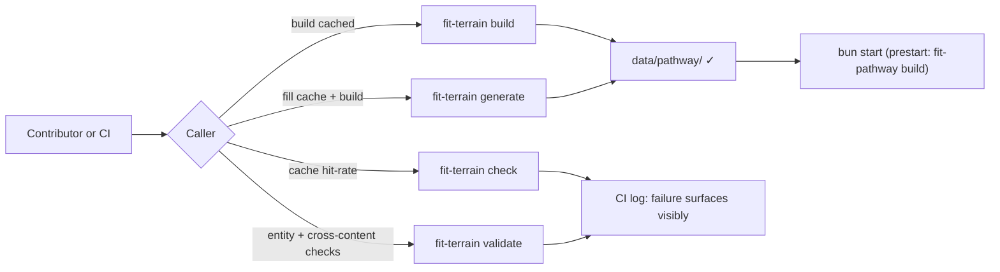

# Design — Spec 750 (terrain refactor CI follow-ups)

## Overview

Spec 750 closes the SCRATCHPAD-3 refactor's caller boundary, restores readable
CI logs on `data:prose`, and removes the merge-gate carve-out that masked the
regression. The architecture has three components in the change surface
(callers, scripts, merge gate) and one fixed point (the `fit-terrain` verb
surface). The design's job is to assign each broken caller to a verb, fix the
log-suppression on `data:prose`, and decide what replaces the carve-out.

## Components

| Component                                   | Role in this design                                                                                          | Owner       |
| ------------------------------------------- | ------------------------------------------------------------------------------------------------------------ | ----------- |
| **`fit-terrain` CLI**                       | Fixed verb surface (`check` / `validate` / `build` / `generate` / `inspect`). Authority for what's accepted. | unchanged   |
| **`justfile` synthetic recipes**            | `synthetic`, `synthetic-update`; entry point for contributors and the e2e cache-miss path.                   | this design |
| **`package.json` scripts**                  | `prestart`, `start`, `dev`, `data:prose`, `data:schema`, `generate`. Contracts that cross the CLI boundary.  | this design |
| **CI workflows**                            | `check-test.yml` (`test`, `e2e`), `check-data.yml` (`prose`), `interview-{landmark,map,summit}-setup.yml`.   | this design |
| **`kata-release-merge` § Step 5 carve-out** | "expected validation failures from missing `data/pathway/`" bypass. Replaced by removal.                     | this design |

## Caller → verb mapping

The boundary sweep is the design's primary deliverable. Each row's verb is
chosen by intent, not by name similarity to the old flag.

| Caller                                                        | Old invocation                                   | New invocation              | Why this verb                                                                                                                                                                                                   |
| ------------------------------------------------------------- | ------------------------------------------------ | --------------------------- | --------------------------------------------------------------------------------------------------------------------------------------------------------------------------------------------------------------- |
| `justfile` `synthetic`                                        | `bunx fit-terrain` (no verb)                     | `bunx fit-terrain build`    | Materializes `data/pathway/` from the cached prose. No LLM. This is the e2e cache-miss path's only requirement.                                                                                                 |
| `justfile` `synthetic-update`                                 | `bunx fit-terrain --generate`                    | `bunx fit-terrain generate` | Same intent: fill cache via LLM, then write.                                                                                                                                                                    |
| `justfile` `synthetic-no-prose`                               | `bunx fit-terrain --no-prose`                    | _recipe removed_            | Post-refactor CLI has no "render without prose" verb; intent ("structural only") collapses into `validate` on the package.json side. Recipe deletion is cleaner than a shim that diverges from the CLI surface. |
| `package.json` `prestart`                                     | `bunx fit-pathway build`                         | unchanged                   | Reads `data/pathway/`. Out of `fit-terrain` scope; ENOENT goes away once `synthetic` is fixed.                                                                                                                  |
| `package.json` `start`, `dev`                                 | `bunx serve public`, `bunx fit-pathway dev`      | unchanged                   | Not `fit-terrain` callers; flagged in spec only because they sit on the `prestart` chain.                                                                                                                       |
| `package.json` `data:prose`                                   | `LOG_LEVEL=error bunx fit-terrain check`         | `bunx fit-terrain check`    | Drops the log-threshold prefix that suppressed the diagnostic in CI. `check` itself is the right verb (cache hit-rate).                                                                                         |
| `package.json` `data:schema`                                  | `LOG_LEVEL=error bunx fit-terrain validate && …` | unchanged                   | Out of scope per spec ("limited to the `data:prose` invocation on the CI path").                                                                                                                                |
| `package.json` `generate`                                     | `fit-terrain` (no verb)                          | `fit-terrain build`         | Same intent as `just synthetic`; deduplication candidate (Risk R3) but resolved by mapping, not removal.                                                                                                        |
| `.github/workflows/check-test.yml` `test` job                 | `bunx fit-terrain` (no verb)                     | `bunx fit-terrain build`    | Materializes inputs the unit-test job consumes.                                                                                                                                                                 |
| `.github/workflows/check-test.yml` `e2e` job                  | `just synthetic` (cache miss)                    | unchanged                   | Already wraps the recipe; fix lands upstream in `justfile`.                                                                                                                                                     |
| `.github/workflows/interview-{landmark,map,summit}-setup.yml` | `bunx fit-terrain` (no verb)                     | `bunx fit-terrain build`    | Same as the `test` job — materialize agent workspace data.                                                                                                                                                      |

## Key decisions

| #   | Decision                                                                                                                                                   | Rejected alternative                                                                                                                                                                                                                                                                                                                           |
| --- | ---------------------------------------------------------------------------------------------------------------------------------------------------------- | ---------------------------------------------------------------------------------------------------------------------------------------------------------------------------------------------------------------------------------------------------------------------------------------------------------------------------------------------- |
| K1  | The CLI's accepted verb surface is the authority — every monorepo caller speaks one of the five verbs.                                                     | **Restore the no-verb default to `build`.** Rejected: re-introduces the very ambiguity SCRATCHPAD-3 deleted; lets a no-verb invocation drift again on the next refactor; success criterion 3 reads "no `unknown verb` failure," not "no-verb still works."                                                                                     |
| K2  | Remove `justfile` `synthetic-no-prose` outright; CONTRIBUTING/operations docs lose the line.                                                               | **Remap to `validate`.** Rejected: the recipe name says "structural data only," but `validate` writes nothing — keeping the alias creates a contract whose name and behaviour disagree. Cleaner to delete the dead name and let contributors call `bunx fit-terrain validate` when that's what they mean.                                      |
| K3  | `data:prose` drops the `LOG_LEVEL=error` prefix; `data:schema` keeps it (out of spec scope).                                                               | **Drop `LOG_LEVEL=error` on both.** Rejected: spec's success criterion 4 names `data:prose` only; widening the change adds a CI-visible behaviour change that this PR cannot test against the spec's verification rule.                                                                                                                        |
| K4  | The merge-gate carve-out is **removed**, not narrowed.                                                                                                     | **Tighten to fingerprint the pre-refactor signature.** Rejected: a fingerprint-based bypass adds a maintenance contract that future renames or error-message edits will silently break. After this fix, `data/pathway/` is materialized by `just synthetic` (cache-only, no LLM), so the bypass has no live use case left to justify the cost. |
| K5  | The "documented sequence" for success criterion 6 is the existing `bun install && just quickstart` (followed by `bun start` when serving the dev site).    | **Add a new top-level recipe (`just dev-bootstrap`).** Rejected: extra recipe with no new behaviour. `quickstart` already calls `synthetic`; once `synthetic` is fixed, the existing sequence works.                                                                                                                                           |
| K6  | The `Test (e2e)` `synthetic-cache` action stays. The cache key (`hashFiles('data/synthetic/**', 'products/map/schema/json/**', 'bun.lock')`) is unchanged. | **Bust the cache to force a clean miss path.** Rejected: an old cache hit hides nothing — the failure mode was on the miss path, where `just synthetic` ran. Once `synthetic` is fixed the miss path passes; the cached output remains valid.                                                                                                  |

## Documentation surface

These docs reference the affected callers and must move in lockstep with the
caller change. The plan owns file-level edits; the design lists the surface so
no doc lags the code.

- `websites/fit/docs/getting-started/contributors/index.md` — drops
  `just synthetic-no-prose`; the `just synthetic` / `just synthetic-update`
  bullets stay.
- `websites/fit/docs/internals/operations/index.md` — same change.
- `.claude/skills/fit-terrain/SKILL.md` and
  `.claude/skills/fit-terrain/references/cli.md` — CLI surface already matches;
  spot-check for stale flag references.
- `.claude/skills/libs-synthetic-data/SKILL.md` — same.

## Risks

| Id  | Risk                                                                                                                           | Mitigation in this design                                                                                                                                                                                     |
| --- | ------------------------------------------------------------------------------------------------------------------------------ | ------------------------------------------------------------------------------------------------------------------------------------------------------------------------------------------------------------- |
| R1  | A `bunx fit-terrain` invocation outside the named surface (justfile / package.json / `.github/workflows/**`) is missed.        | Plan adds an automated grep gate (matches success criterion 3's "static inspection"); fails CI if any `bunx fit-terrain` lacks a verb in the named surface.                                                   |
| R2  | `fit-terrain build` on a clean checkout exits non-zero because `data/synthetic/prose-cache.json` has misses (not regenerated). | The bin's `build` only warns on cache misses (returns ok unless validation/write fail). Verified against the source (`bin/fit-terrain.js`). The plan's verification step replays a clean checkout to confirm. |
| R3  | `package.json` `generate` and `justfile` `synthetic` end up duplicates of each other.                                          | They are. Deduplication is out of scope; the design notes it for a future cleanup spec rather than removing the npm script in this PR.                                                                        |
| R4  | Removing the merge-gate carve-out lets a transient first-time-setup failure block a real PR.                                   | After this fix, every CI path that needs `data/pathway/` materializes it via `just synthetic` (cache-only, no LLM). There is no first-time-setup failure mode left in CI.                                     |

## Out of scope (reaffirmed from spec)

- SCRATCHPAD-3 architecture (verbs, DAG, cache format, sink topology).
- `data/{pathway,knowledge,activity,personal}/` content.
- `data/synthetic/` source-of-truth inputs.
- `Test`/`Data` workflow jobs other than `e2e` and `prose`.
- Other `kata-release-merge` carve-outs and the merge gate beyond Step 5.
- Log-level policy across the rest of the codebase (only `data:prose` changes).
