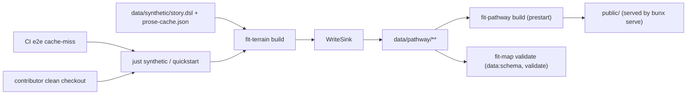

# Design 750 — Terrain refactor CI follow-ups

The spec is a boundary-completion problem: SCRATCHPAD-3 replaced `fit-terrain`'s
flag-driven surface with verb subcommands, and three callers plus one merge-gate
carve-out crossed that boundary without being ported. The design enumerates the
verb mapping for each broken caller, names the single materialization site for
`data/pathway/`, and specifies the artefact that narrows the merge-gate
carve-out.

## Components

| #   | Component                        | Where                                                            | Role                                                                                                                                                                                                |
| --- | -------------------------------- | ---------------------------------------------------------------- | --------------------------------------------------------------------------------------------------------------------------------------------------------------------------------------------------- |
| 1   | `justfile` synthetic recipes     | `justfile` lines 57–69                                           | Three recipes call `fit-terrain` with the removed flag surface. Each maps to one post-refactor verb invocation.                                                                                     |
| 2   | `package.json` script callers    | `scripts.generate`, `scripts.data:prose`                         | Two scripts call `fit-terrain` with no verb (`generate`) or with a `LOG_LEVEL=error` prefix that hides CI diagnostics (`data:prose`).                                                               |
| 3   | Workflow `fit-terrain` callers   | `.github/workflows/check-test.yml` (`test`); `interview-*-setup` | Five workflow steps invoke `bunx fit-terrain` with no verb. Each maps to one post-refactor verb. The `e2e` job's `data/pathway/` cache miss path runs `just synthetic`, fixed via component 1.      |
| 4   | `WriteSink` materialization site | `libraries/libterrain/src/sinks.js` (already implemented)        | Sole writer of `data/pathway/**`. Invoked by `build` and `generate` verbs via `selectOutputSink`. The contract is unchanged; the design names this as the canonical site referenced from elsewhere. |
| 5   | `kata-release-merge` carve-out   | `.claude/skills/kata-release-merge/SKILL.md` Step 5              | The "expected validation failures from missing `data/pathway/`" carve-out is removed. Components 1–3 close the underlying transient gap, so the carve-out becomes dead cover for real regressions.  |
| 6   | Contributor onboarding sequence  | `websites/fit/docs/getting-started/contributors/index.md`        | Names a single sequence (`bun install && just quickstart && bun start`) that lands a clean checkout at a working dev server with `data/pathway/` materialized.                                      |

## Verb mapping (spec criterion 3)

The post-refactor verb surface (from `bin/fit-terrain.js`):
`check | validate | build | generate | inspect <stage>`. `build` and `generate`
are the only verbs that materialize files via `WriteSink`.

| Caller                                         | Today                                          | Post-design                                          | Reason                                                                                                                                               |
| ---------------------------------------------- | ---------------------------------------------- | ---------------------------------------------------- | ---------------------------------------------------------------------------------------------------------------------------------------------------- |
| `just synthetic`                               | `bunx fit-terrain`                             | `bunx fit-terrain build`                             | Production path: render with cached prose, write `data/pathway/**` and siblings. No LLM calls.                                                       |
| `just synthetic-update`                        | `bunx fit-terrain --generate`                  | `bunx fit-terrain generate`                          | Refill the prose cache via LLM, then build. Verb already carries the persist-cache semantics (`bin/fit-terrain.js` line 182).                        |
| `just synthetic-no-prose`                      | `bunx fit-terrain --no-prose`                  | `bunx fit-terrain build --only=pathway`              | Structural-only YAML; skip prose-rendering output types (`html`, `raw`, `markdown`). Closest preserved semantics; planner may collapse if redundant. |
| `package.json scripts.generate`                | `fit-terrain`                                  | `fit-terrain generate`                               | The script name's intent is "generate prose"; `generate` is the LLM-backed verb.                                                                     |
| `package.json scripts.data:prose`              | `LOG_LEVEL=error bunx fit-terrain check`       | `bunx fit-terrain check`                             | Drop the log-threshold prefix (criterion 4). Verb is already correct; only the env prefix masks the diagnostic.                                      |
| `check-test.yml` `test` job step               | `bunx fit-terrain`                             | `bunx fit-terrain build`                             | The follow-up `bun run validate -- --shacl` reads `data/pathway/`. Materialization required.                                                         |
| `check-test.yml` `e2e` job (cache-miss branch) | `just synthetic`                               | (no change — fixed via component 1)                  | Once `just synthetic` works, the cache-miss branch self-heals.                                                                                       |
| `interview-{guide,landmark,map,summit}-setup`  | `bunx fit-terrain` then `cp -r data/pathway …` | `bunx fit-terrain build` then `cp -r data/pathway …` | Each workflow needs `data/pathway/` materialized before the copy step.                                                                               |

`data:schema` keeps `LOG_LEVEL=error` (out of scope per spec — the schema job is
green and the spec narrows logging policy to `data:prose` only).

## Materialization data flow (thread 2)



`data/pathway/` has exactly one writer: `WriteSink` invoked by
`build`/`generate` (`selectOutputSink` returns `NullSink` for
`check`/`validate`). Three readers trigger materialization upstream of
themselves, never inside their own scripts:

- **CI `e2e`** — `actions/cache` restores `data/pathway/`; on miss,
  `just synthetic` runs `fit-terrain build`. `prestart` is a pure reader.
- **CI `prose`/`data:schema`** — operate on the prose cache and entity layer; no
  filesystem dependency on `data/pathway/`.
- **Contributors** — `just quickstart` (or `just synthetic`) before `bun start`.
  `prestart` stays a pure reader; spec criterion 6 is satisfied by
  documentation, not by injecting materialization into the start chain.

## Merge-gate carve-out (thread 3)

The current text in `kata-release-merge` SKILL.md Step 5:

> If checks still fail (excluding **expected validation failures from missing
> `data/pathway/`**), mark **blocked** with the failures and skip to Step 9.

| Decision               | Choice                                                                                                                                     | Rejected alternative                                                                                                                                                 | Why                                                                                                                                                                                                                                                                                      |
| ---------------------- | ------------------------------------------------------------------------------------------------------------------------------------------ | -------------------------------------------------------------------------------------------------------------------------------------------------------------------- | ---------------------------------------------------------------------------------------------------------------------------------------------------------------------------------------------------------------------------------------------------------------------------------------- |
| Carve-out narrowing    | **Remove the parenthetical entirely.** The sentence becomes "If checks still fail, mark **blocked** with the failures and skip to Step 9." | (a) Replace with a signature-matching predicate (e.g. allow only `ENOENT: data/pathway` in `prestart` + `fit-terrain check` non-zero in `prose`). (b) Keep verbatim. | After components 1–3 land, missing `data/pathway/` cannot recur in CI — every entry-point that crossed the boundary materializes via `build`. Signature-matching gives the gate phenomenological knowledge of regression shapes, which is the exact failure the issue #673 mask exposed. |
| Carve-out replacement  | **None — the underlying transient gap is closed by design.**                                                                               | Add a one-time "first-merge-after-spec-750" exception.                                                                                                               | One-time exceptions accumulate. The verb-mapping fix is the artefact; no second one is required.                                                                                                                                                                                         |
| Coordination at design | **Release-engineer review on this section before approval.**                                                                               | Plan-time review only.                                                                                                                                               | Removing a merge-gate clause changes release-engineer's runtime contract. The spec calls this out as a cross-skill coordination point.                                                                                                                                                   |

## Onboarding sequence (criterion 6)

Single documented sequence in
`websites/fit/docs/getting-started/contributors/index.md`:

```sh
bun install        # workspace install
just quickstart    # env-setup → synthetic (build) → data-init → codegen → process-fast
bun start          # prestart reads data/pathway/; serve runs against public/
```

`just quickstart` already chains `synthetic` (which after component 1 runs
`fit-terrain build` and writes `data/pathway/`). The doc's "Generate synthetic
data" section is updated to use the new verb names; the existing "Clone and
install" block already names `just quickstart`. No new commands; one corrected
verb table and one new "Run the dev site" pointer.

## Key decisions (cross-cutting)

| Decision                                       | Choice                                                    | Rejected alternative                                                 | Why                                                                                                                                                                                                                      |
| ---------------------------------------------- | --------------------------------------------------------- | -------------------------------------------------------------------- | ------------------------------------------------------------------------------------------------------------------------------------------------------------------------------------------------------------------------ |
| Materialization site                           | `WriteSink` (existing); callers invoke `build`/`generate` | Inject `bunx fit-terrain build` into `package.json scripts.prestart` | `prestart` runs on every `bun start`/`bun dev`; auto-materializing turns one developer concept (build the data once, run the server N times) into N pipeline runs. CI's cache layer also assumes `prestart` is a reader. |
| `data/pathway/` ENOENT in CI is a real failure | Yes — remove the carve-out                                | Treat ENOENT as transient                                            | The cache-miss path now runs `just synthetic` → `fit-terrain build` deterministically. ENOENT can only occur if the materialization step itself failed, which is the real failure to surface.                            |
| `synthetic-no-prose` semantics                 | `build --only=pathway` (planner may collapse)             | Delete the recipe                                                    | Recipe deletion is a contributor-flow break that's out of scope. The closest semantic preserves intent; if the planner finds it identical to `synthetic`, that's a plan-time call.                                       |
| `LOG_LEVEL=error` removal scope                | `data:prose` only                                         | Remove from `data:schema` too                                        | Spec scope is explicit: "logging / log-level policy across the rest of the codebase. Scope is limited to the `data:prose` invocation on the CI path."                                                                    |
| Documentation surface                          | `getting-started/contributors/index.md` only              | Multiple onboarding pages updated in lockstep                        | Spec criterion 6 names "one documented sequence". Other product pages already address external-user installs (`npx`-based, no monorepo).                                                                                 |

## Verification mapping (spec criteria → design)

| Spec criterion  | Design satisfies via                                                                                                                                          |
| --------------- | ------------------------------------------------------------------------------------------------------------------------------------------------------------- |
| 1 (e2e green)   | Components 1 + 3 + 4: `just synthetic` materializes `data/pathway/` via `WriteSink`; `prestart` finds its input.                                              |
| 2 (prose green) | Component 2: `data:prose` verb is correct; the only failure mode now is a real `check` failure, surfaced because `LOG_LEVEL=error` is gone.                   |
| 3 (CLI accept)  | The verb-mapping table — every `bunx fit-terrain` invocation in `justfile`, `package.json`, and `.github/workflows/**` resolves to a verb the binary accepts. |
| 4 (visibility)  | `data:prose` row of the verb-mapping table drops the `LOG_LEVEL=error` prefix.                                                                                |
| 5 (carve-out)   | Component 5: parenthetical removed from `kata-release-merge` Step 5.                                                                                          |
| 6 (onboarding)  | Component 6: single sequence `bun install && just quickstart && bun start` documented in `getting-started/contributors/index.md`.                             |

## Out of scope (for the planner)

File-level diff hunks, execution ordering, test fixtures, the
`synthetic-no-prose` collapse-vs-preserve decision, the exact prose of the doc
edit. The planner also picks the commit boundary between
`justfile`/`package.json`/workflow edits and the `kata-release-merge` SKILL.md
edit.

## Risks

| Risk                                                                                               | Mitigation                                                                                                                                                                                                |
| -------------------------------------------------------------------------------------------------- | --------------------------------------------------------------------------------------------------------------------------------------------------------------------------------------------------------- |
| Removing the carve-out blocks merges if an unrelated transient cache-restore failure appears in CI | The cache-restore step is `if: cache-hit != 'true' → just synthetic`; failure of `just synthetic` would itself be a real regression, not a transient.                                                     |
| `build --only=pathway` produces a different file set than `--no-prose` did                         | Internal-doc verification at plan time. If divergent, planner converges on `build` (synonymous with `synthetic`) and notes the recipe collapse.                                                           |
| `LOG_LEVEL=error` was masking a noisy non-error stream that now floods CI logs                     | The verb's default log level is governed by `createLogger("terrain")` and `createScriptConfig`; `info` and below are not error-stream output. The spec's intent is exactly to surface error-level output. |
| Contributor `bun start` runs without prior `just synthetic` and hits ENOENT                        | Documentation update names `just quickstart` (which includes `synthetic`) before `bun start`. The error message points at the missing prerequisite.                                                       |

— Staff Engineer 🛠️
