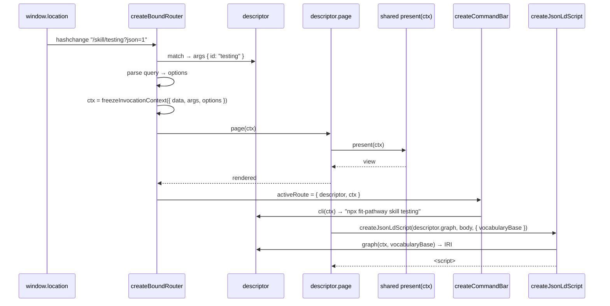

# Design 760-a — Shared invocation surfaces for LibUI and LibCLI

Spec 760 collapses pathway's three route↔CLI↔graph bindings into reusable
`@forwardimpact/libui` exports and converges handler input on a single
`InvocationContext` contract that libui and libcli both produce. This design
names the components, the public-API surface in each library, and the dispatch
sequence — then records the architectural choices and their rejected
alternatives.

## Components

```mermaid
flowchart LR
  subgraph libui[libraries/libui]
    DR[defineRoute]
    BR[createBoundRouter]
    CB[createCommandBar]
    JL[createJsonLdScript]
  end
  subgraph libcli[libraries/libcli]
    CC[createCli]
  end
  subgraph host[Host product, e.g. pathway]
    BS[bootstrap → ctx.data]
    PR[shared presenter present ctx]
  end
  DR -.descriptor.-> BR
  BR -- InvocationContext --> PR
  CC -- InvocationContext --> PR
  BR -- activeRoute reactive --> CB
  BR -.descriptor.graph.-> JL
  BS --> BR
  BS --> CC
```

| #   | Component                                                                 | Library                           | Role                                                                                                                                                                            |
| --- | ------------------------------------------------------------------------- | --------------------------------- | ------------------------------------------------------------------------------------------------------------------------------------------------------------------------------- |
| 1   | `InvocationContext` typedef + `freezeInvocationContext`                   | libui **and** libcli (duplicated) | Shared handler-input contract — JSDoc and the runtime helper that enforces the frozen invariant                                                                                 |
| 2   | `defineRoute({ pattern, page, cli?, graph? }) → descriptor`               | libui                             | Pure data builder — the descriptor is plain enumerable values, not a closure on a router instance                                                                               |
| 3   | `createBoundRouter({ vocabularyBase, onNotFound, onError, renderError })` | libui                             | Registry + dispatcher. `register(descriptor)` mounts a route; `start/stop/navigate` mirror today's router; `activeRoute` is a reactive carrying `{ descriptor, ctx }` or `null` |
| 4   | `createCommandBar(router, { mountInto, copyButton })`                     | libui                             | DOM component subscribing to `activeRoute`; reflects the active route's CLI channel and offers copy-to-clipboard                                                                |
| 5   | `createJsonLdScript(graphFormatter, body)`                                | libui                             | Returns `<script type="application/ld+json">` with `@id` minted by the formatter merged with body fields, or `null` if the formatter is absent                                  |
| 6   | `createCli(def)` (amended)                                                | libcli                            | Subcommand handlers receive `InvocationContext`; subcommand definition gains `args: string[]` (positional names)                                                                |
| 7   | Host bootstrap                                                            | product                           | Folds runtime extras (`dataDir`, `templateLoader`, …) into `ctx.data` before invocation — there is no third channel                                                             |

## Dispatch sequence



The CLI surface follows the same shape: libcli parses argv, calls
`freezeInvocationContext({ data, args: namedMap, options })`, dispatches the
subcommand handler — which calls `present(ctx)` and prints the view to stdout.
**One presenter per capability**, exercised by both surfaces against synthetic
contexts with no DOM or stdout scaffolding.

Channels behave as follows when absent:

- **No `cli`** — descriptor omits the slot; `createCommandBar` renders empty
  text, never throws or shows a stale command from the prior route.
- **No `graph`** — descriptor omits the slot; `createJsonLdScript` returns
  `null`; the caller skips mounting.

## Key decisions

| #       | Decision                     | Choice                                                                                                                                                                                                                                       | Rejected                                                                                                                 | Why rejected                                                                                                                                                                                                                                                                                                                                                   |
| ------- | ---------------------------- | -------------------------------------------------------------------------------------------------------------------------------------------------------------------------------------------------------------------------------------------- | ------------------------------------------------------------------------------------------------------------------------ | -------------------------------------------------------------------------------------------------------------------------------------------------------------------------------------------------------------------------------------------------------------------------------------------------------------------------------------------------------------- |
| **D1**  | `InvocationContext` location | Duplicated JSDoc + `freezeInvocationContext` runtime helper in both `libui/src/invocation-context.js` and `libcli/src/invocation-context.js` (same file, copied verbatim, with a shape-equivalence test in each)                             | (a) New shared package `@forwardimpact/libinvoke`; (b) host in `libtype`                                                 | (a) introduces a third package to publish/version for ~40 lines of JSDoc plus a 10-line freeze helper; (b) `libtype` is protobuf-generated types — typedef does not fit its purpose and its codegen step would couple unrelated build chains. JSDoc is documentation, so duplication is type-safe; the equivalence test catches drift at `bun run check` time. |
| **D2**  | Descriptor API shape         | Sibling primitive `defineRoute({ pattern, page, cli?, graph? })` returning a plain descriptor object; `boundRouter.register(descriptor)` mounts it                                                                                           | (a) Extend `router.on(pattern, options)` with optional channels; (b) `router.on(pattern, page, { cli, graph })` overload | Both overloads break `router.on()`'s `(pattern, handler)` invariant and conflate declaration with registration. A first-class descriptor is enumerable — a future graph-walking agent surface (spec § Out of scope) reads the registry without rendering, which is the property the spec calls out as agent-shaped.                                            |
| **D3**  | Top-bar surface              | Full component `createCommandBar(router, opts)` plus the underlying `router.activeRoute` reactive as an escape hatch                                                                                                                         | (a) Hook-only "command provider" that products wrap into their own bar                                                   | Hook-only re-introduces the duplication the spec exists to remove — Landmark and Summit would each rebuild the same Safari-style bar. The reactive escape hatch covers products that want a non-bar treatment (status line, agent surface) without forcing a hook-only baseline.                                                                               |
| **D4**  | JSON-LD helper signature     | `createJsonLdScript(graphFormatter, body, { vocabularyBase })` — the helper invokes the formatter; the caller never mints an IRI                                                                                                             | (a) `createJsonLdScript(iri, body)` — caller mints the IRI then passes it as a string                                    | Caller-mints invites a page to bypass the descriptor and forge its own IRI, which is exactly the drift mode the spec is closing. Single round-trip through the descriptor's Graph channel keeps `@id` and the registry in lockstep.                                                                                                                            |
| **D5**  | Vocabulary-base wiring       | Option on `createBoundRouter({ vocabularyBase })`; the router passes the base to `descriptor.graph(ctx, vocabularyBase)` and to `createJsonLdScript` via `activeRoute`. Host passes the same string `libgraph` exposes in `RDF_PREFIXES.fit` | (a) Per-call argument on every JSON-LD helper invocation; (b) hardcode `RDF_PREFIXES.fit` from libgraph inside libui     | (a) diffuses the base across pages — the centralisation the spec wants is undone; (b) creates a libui→libgraph dependency for one string and prevents a non-pathway host from using a different vocabulary. The linkage to `libgraph` stays explicit at the host call site, unenforced — pathway's bootstrap reads `RDF_PREFIXES.fit` once and passes it in.   |
| **D6**  | libcli `args` shape          | Subcommand definitions gain `args: string[]` (declared positional names); the command builder maps argv positionals to a named map keyed by those names before invoking the handler                                                          | (a) Keep array, expose `argNames` separately for callers to zip themselves                                               | Keeping the array forces every handler to remember positional order — drift-prone, and inconsistent with the web side which has named params from the route pattern. The named map is what the spec mandates and matches the web-side route-pattern parameters.                                                                                                |
| **D7**  | Host runtime extras          | Folded into `ctx.data` by host bootstrap before invocation; libui and libcli have no third channel                                                                                                                                           | (a) Add a `runtime` channel on `InvocationContext` (`{ data, args, options, runtime }`)                                  | A third channel re-creates the surface dispatch the contract is removing — `dataDir` belongs only to CLI, `templateLoader` only to web. Folding is the host's responsibility and is documented in the libui guide; `data` remains the single host-supplied dependency channel.                                                                                 |
| **D8**  | Frozenness enforcement       | `freezeInvocationContext(raw)` runtime helper exported by both libraries; deep-freezes context, `args`, `options`, and any `Array` values inside `options`                                                                                   | (a) Document the invariant; trust producers to call `Object.freeze` themselves                                           | The spec mandates handlers MAY assume immutability without checking — without a runtime helper the invariant is folklore and a future producer (graph-walking agent surface) lands without it. The helper is ~10 lines; the cost is negligible and the test in success-criterion 2 asserts on it.                                                              |
| **D9**  | Library-guide task slug      | `web-cli-graph-bindings` → `websites/fit/docs/libraries/web-cli-graph-bindings/index.md`                                                                                                                                                     | (a) `invocation-context`; (b) `route-channels`                                                                           | (a) names a concept, not a task — the slug rule in `libraries/CLAUDE.md` is task-shaped; (b) elides the CLI/graph half. The chosen slug is task-shaped and unique.                                                                                                                                                                                             |
| **D10** | `forwardimpact.needs` entry  | `"Bind a web route to its CLI command and graph entity"`                                                                                                                                                                                     | (a) "Define route–CLI–graph bindings"; (b) "Unify handler input across web and CLI"                                      | (a) feature-shaped, not outcome-shaped, and `libraries/CLAUDE.md` forbids that; (b) covers the contract but not the route↔CLI↔graph triangle that is the spec's lead motivation. The chosen phrase is imperative + outcome-shaped + unique.                                                                                                                    |

## Public API surface (additions and changes)

`@forwardimpact/libui` (additions):

- `defineRoute({ pattern: string, page: (ctx) => void, cli?: (ctx) => string, graph?: (ctx, vocabularyBase: string) => string }) → RouteDescriptor`
- `createBoundRouter({ vocabularyBase, onNotFound, onError, renderError }) → BoundRouter`
  with `register(descriptor)`, `start()`, `stop()`, `navigate(path)`, and an
  `activeRoute` reactive carrying `{ descriptor, ctx } | null`.
- `createCommandBar(router, { mountInto: HTMLElement, copyButton?: boolean }) → { destroy }`
- `createJsonLdScript(graphFormatter, body, { vocabularyBase }) → HTMLScriptElement | null`
- `freezeInvocationContext(raw) → InvocationContext` and the `InvocationContext`
  typedef.

`@forwardimpact/libcli` (changes):

- Subcommand definition gains `args: string[]` (declared positional names).
- Handler signature: `(ctx: InvocationContext) → void | Promise<void>` (replaces
  today's `({ data, args, options })`).
- New exports: `freezeInvocationContext` and the `InvocationContext` typedef.

`@forwardimpact/libui` and `@forwardimpact/libcli` keep all existing exports
unchanged. `createRouter` (the today-router) stays for products that don't opt
into bindings; `createBoundRouter` is additive.

## Pathway adoption shape

- Three files removed: `lib/cli-command.js`, `components/top-bar.js`, and the
  `@id`-minting + `<script>`-construction halves of `formatters/json-ld.js`
  (per-entity body builders remain — `Skill.proficiencyDescriptions`,
  `Discipline.coreSkills`, etc. — owned by the product).
- `main.js`'s `setupRoutes()` becomes a list of `defineRoute(...)` calls plus
  one `boundRouter.register(descriptor)` per route. Per-entity CLI command
  strings and graph IRIs live as inline arrow functions on the descriptor —
  drift-resistant because they sit beside the URL pattern.
- Every page in `src/pages/*.js` and every shared presenter in
  `src/formatters/<entity>/shared.js` takes a single `ctx: InvocationContext`
  argument; no `getState()` reaches and no `window.location.hash` parsing.
- `commands/command-factory.js` builds an `InvocationContext` from
  `{ data, argMap, options }` (where `argMap` is keyed by the subcommand's
  declared positional names) and dispatches to the same shared presenter the
  descriptor's `page` invokes.

The vendored libui primitives in `products/pathway/src/lib/` (router-core,
render, …) stay imported by relative path; the new descriptor API is imported
from `@forwardimpact/libui`. Whether to also retire pathway's vendored
primitives is a plan-phase decision — the design's correctness does not depend
on it.

## Out of scope (per spec)

- Backwards-compat shims, parallel re-exports, or `params`-only handler aliases.
- Adding the descriptor API to Landmark or Summit web UIs.
- Changes to `libgraph`'s `RDF_PREFIXES`.
- Reverse mapping (CLI string → URL, graph IRI → URL).
- Server-side JSON-LD rendering.
- A graph-walking agent surface (the contract is shaped to admit one later; the
  producer is not in this spec).

— Staff Engineer 🛠️
