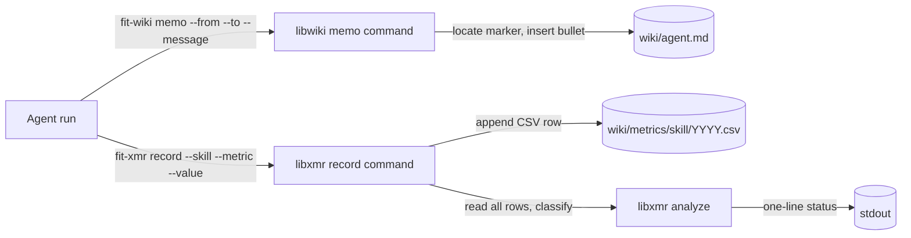
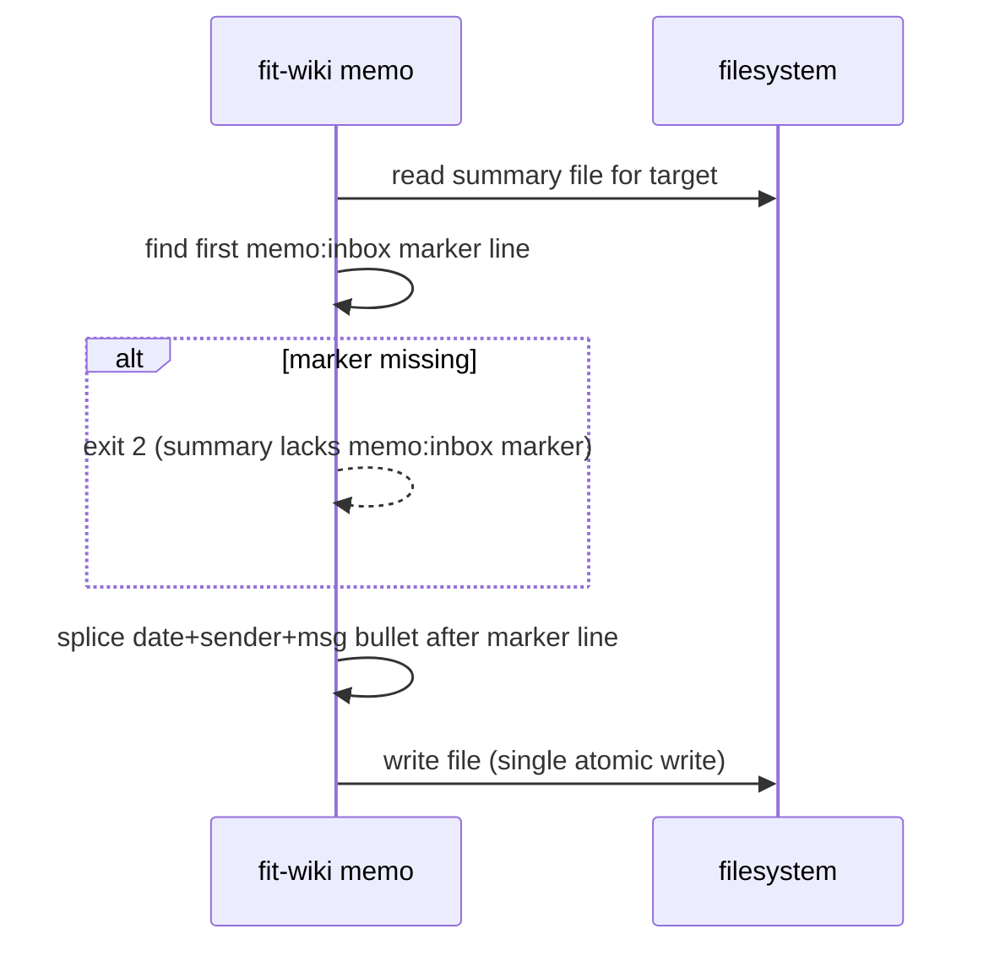
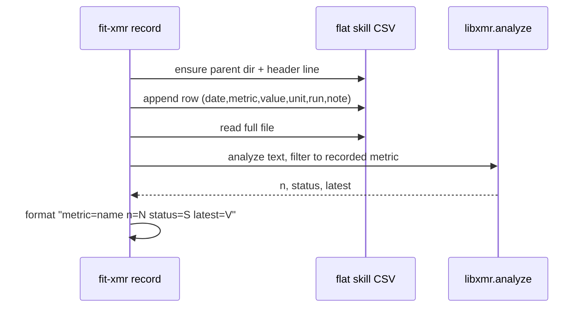

# Design A — Spec 770 Agent Tooling: `fit-wiki memo` and `fit-xmr record`

## Architecture

Two CLI surfaces collapse the two procedural hot paths the spec identified.
Each lives in the package that owns its primary data type: memos write to wiki
summaries, so they belong to a new `libwiki` package; metric rows write to
`fit-xmr` CSVs, so the existing `libxmr` package gains a new subcommand.



## Components

| Component                 | Package                  | Responsibility                                                                                                              |
| ------------------------- | ------------------------ | --------------------------------------------------------------------------------------------------------------------------- |
| `@forwardimpact/libwiki`  | new package              | Cohesive home for wiki-write primitives — memo writer, agent roster discovery, marker migration helper.                     |
| `fit-wiki` CLI            | libwiki                  | One binary, one subcommand in this spec (`memo`); subcommand dispatch via `@forwardimpact/libcli` (matches `fit-xmr`).      |
| `MemoWriter`              | libwiki                  | Locate the marker line in a single agent summary, splice a new bullet, single atomic write.                                 |
| `AgentRoster`             | libwiki                  | Discover agents by globbing `.claude/agents/*.md` (excluding subdirectories); derive wiki summary paths from agent names.   |
| `MarkerMigrator`          | libwiki                  | Idempotent insertion of `<!-- memo:inbox -->` into existing summaries that lack it.                                         |
| `fit-xmr record` command  | libxmr (extension)       | Resolve flat CSV path from `--skill`, append row (creating header if missing), call existing `analyze()`, format one line.  |
| Metrics flat-migration    | one-shot repo script     | Consolidation of `{agent}/{domain}/{YYYY}.csv` files into per-skill `{YYYY}.csv` with row-count assertion against sources. |

The two libraries stay decoupled: `libxmr` does **not** depend on `libwiki`.
Both depend on `@forwardimpact/libutil` for `Finder`-based project-root
resolution (P4), and derive wiki/agent paths from there so they work
seamlessly from any working directory. The dependency graph stays a tree.

## Marker contract

The marker is a single HTML comment that anchors `fit-wiki memo` writes:

```markdown
## Observations for Teammates

<!-- memo:inbox -->
```

- **Literal token.** `memo:inbox` is the contract — any future tool that
  appends to the same channel uses the same marker.
- **Placement.** Immediately after the `## Observations for Teammates`
  heading, before any existing bullets (see decision M2).
- **Insertion.** `MemoWriter` inserts a new bullet on the line directly
  following the marker, so the most recent memo sits at the section top
  (see decision M3 for ordering rationale).
- **Render-invisible.** HTML comments do not appear in rendered markdown,
  so the marker is invisible to humans reading the wiki and stable for
  machine writes.
- **Bullet format.** `- YYYY-MM-DD **{sender}**: {message}` — one line per
  memo, sender bold so the target's eye lands on it during boot.

## Memo write algorithm



- Single read + single write per target. No locking; concurrent writers
  collide loudly via git (the wiki is checked into git and reread at boot).
- Broadcast iterates the AgentRoster and runs the same algorithm per file.

## `fit-xmr record` flow



The append is the durable side-effect; the analyze pass is read-only and may
fail without losing the row.

## Key decisions

| #   | Choice                     | Decision                                                                                                                                | Rejected alternative                                                                                                                                                |
| --- | -------------------------- | --------------------------------------------------------------------------------------------------------------------------------------- | ------------------------------------------------------------------------------------------------------------------------------------------------------------------- |
| P1  | `memo` host package        | New `libwiki` package with the `fit-wiki` binary owned by this skill family.                                                            | Add `memo` to `librc` or `libtelemetry` — both already overloaded; their dep graphs would pull unrelated runtime concerns into a low-frequency CLI.                  |
| P2  | `record` host package      | Extend the existing `libxmr` `fit-xmr` CLI rather than a new binary.                                                                    | Put `record` on `fit-wiki` — splits the `fit-xmr` story (analyze elsewhere, record here) and forces agents to learn two CLIs for one CSV.                          |
| P3  | Library dependency edge    | `libxmr` and `libwiki` stay independent; each resolves its own paths from the wiki root.                                                | Have `libxmr` import `libwiki` for a shared `paths` helper — creates a cross-library edge for one constant string and tightens an otherwise simple module graph.    |
| P4  | Path resolution            | Both CLIs resolve the project root via `Finder.findProjectRoot(cwd)` and derive all paths from it. `--wiki-root` is an optional override. | Require explicit `--wiki-root` on every call — agents navigate the codebase during work; a mandatory path flag breaks seamless inline use.                          |
| M1  | Marker token               | `<!-- memo:inbox -->` (lower-case, colon-separated).                                                                                    | Use the H2 heading itself as anchor — heading text is human-edited and renames silently break tooling; the dedicated marker is purpose-built and cheap to insert.   |
| M2  | Marker placement           | Immediately after `## Observations for Teammates` (before any bullets).                                                                 | Place at end of file or end of section — appending past arbitrary trailing whitespace and section drift is unsafe; placement directly under heading is unambiguous. |
| M3  | New-bullet position        | Splice on the line directly following the marker (newest-first within the section).                                                    | Append at end of section — would require parsing the next H2 boundary, failing if the section is last in file.                                                     |
| M4  | Concurrent writes          | Best-effort single read + single write; rely on git for collision detection.                                                            | File locks (`flock`) — wiki writes already pass through git, which surfaces collisions deterministically; locks add complexity without raising the safety floor.    |
| M5  | Roster discovery           | Glob `.claude/agents/*.md`; agent names are basenames; summary paths derived as `<wikiRoot>/<agent>.md`.                                 | Glob wiki markdown and filter by H1 regex — heading format is human-edited and renames silently break discovery. Static list — grows maintenance surface per agent. |
| M6  | `memo` CLI surface         | Three flags: `--from`, `--to`, `--message`. `--to` and `--message` required; `--from` optional with fallback to `LIBEVAL_AGENT_PROFILE` env var (M8). | Positional args — order ambiguity costs more than three explicit flags ever save.                                                                                   |
| M7  | Broadcast spelling         | Reserved sentinel `--to all`; `AgentRoster` enforces no agent file may be named `all`.                                                  | Separate `--broadcast` flag — duplicates the routing surface; the sentinel is a single value in the same dimension as targeted sends.                              |
| M8  | Agent identity env var     | `--from` falls back to `LIBEVAL_AGENT_PROFILE`, set by `fit-eval` when spawning agents. Identity comes from the environment, not manual input. | Require `--from` always — agents redundantly declare identity on every call even though the harness already knows who they are.                                     |
| X1  | CSV path                   | `wiki/metrics/{skill}/{YYYY}.csv` — organized by process (skill), not agent. XmR charts measure the voice of a process; the skill is the process boundary. | Per-agent path — scatters process data when multiple agents participate in the same skill (e.g. `kata-review`, `kata-release-merge`).                               |
| X2  | One-line summary           | `metric=<name> n=<n> status=<status> latest=<value>` — four fields, space-separated, machine-greppable.                                 | Render the 14-line chart inline — too large for a recording confirmation; agent already has `bunx fit-xmr analyze` for that.                                       |
| X3  | Append-vs-analyze ordering | Append CSV row first, then analyze; analyze failure prints a warning but does not roll back the row.                                    | Analyze first, then append — suppresses recording when an unrelated analysis bug fires, which is the wrong failure mode for a write-throughput tool.                |
| X4  | Resolve skill + path       | `--skill` optional with fallback to `LIBEVAL_SKILL` env var (X6); CLI joins it with the wiki root and `{YYYY}.csv` internally.          | Require `--skill` always — agents redundantly specify the skill they're already operating within.                                                                  |
| X5  | Migration mechanism        | One-shot delivery: marker insertion via `MarkerMigrator` and metrics consolidation via a repo-root script. Both run once during the plan. | Permanent `fit-wiki migrate` subcommand — adds surface area for a one-time job; the post-migration codebase has no use for it.                                     |
| X6  | Skill context env var      | `fit-eval` detects `Skill` tool_use events in the streaming trace and sets `process.env.LIBEVAL_SKILL` to the invoked skill name. Subsequent Bash tool calls inherit the updated env. | Require `--skill` always — agents must name the skill even though the harness already knows from the trace which skill is active.                                   |

## Data flow

- **Memo** — `Finder.findProjectRoot(cwd)` → derive wikiRoot + agentsDir →
  input via flags → marker locator → splice → single atomic write per
  target. No state, no cache.
- **Record** — `Finder.findProjectRoot(cwd)` → derive wikiRoot → CSV path
  assembled from `--skill` + current year → CSV append → file re-read →
  `libxmr.analyze` filtered to the recorded metric → stdout line. Pure
  functional pipeline except for the single append.

## Boundaries

- `libwiki` has no XmR dependency in this spec's scope. Spec 780's
  `fit-wiki refresh` adds the libxmr edge.
- `libxmr` has no libwiki dependency. The two-tree shape is preserved by
  decision P3.
- Templates and protocol updates (`memory-protocol.md`,
  `kata-metrics/SKILL.md`, `storyboard-template.md`, `fit-xmr` help) change
  text only; no shared module imports.

## Risks

| Risk                                                                          | Mitigation                                                                                                                                                              |
| ----------------------------------------------------------------------------- | ----------------------------------------------------------------------------------------------------------------------------------------------------------------------- |
| An agent summary is missing the marker (e.g., new agent added post-migration). | `MarkerMigrator` is idempotent and rerunnable. `fit-wiki memo` exits 2 with the missing-marker message — a loud, recoverable failure that triggers another migration run. |
| Concurrent runs race on the same summary.                                      | The wiki is git-tracked; collisions surface as merge conflicts at push time. Decision M4 documents this is intentional.                                                 |
| Domain consolidation drops a row.                                              | The flat-migration script asserts row-count parity (sum of source files == flat file) and exits non-zero on mismatch. Verified by spec success criterion #6.            |
| Bullet format drift over time.                                                 | A single `MemoWriter` helper owns the bullet template; downstream changes go through one symbol.                                                                         |
| Agent definition exists in `.claude/agents/` without a wiki summary counterpart. | `fit-wiki memo` resolves the summary path as `<wikiRoot>/<agent>.md` and fails with exit 2 + a clear message if the file is missing. The failure is loud and tells the operator which file to create. |
