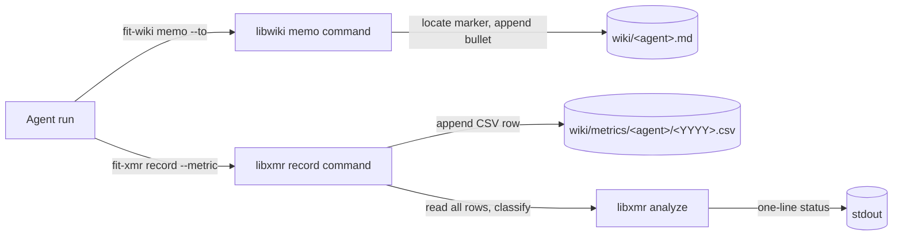
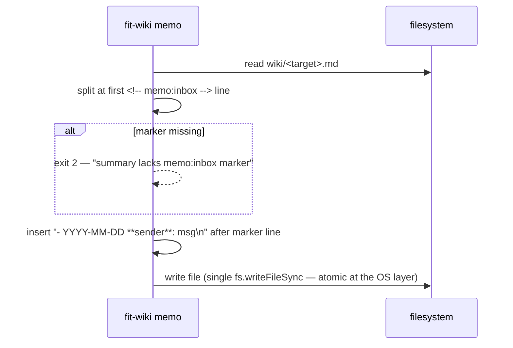

# Design A — Spec 770 Agent Tooling: `fit-wiki memo` and `fit-xmr record`

## Architecture

Two CLI surfaces collapse the two procedural hot paths the spec identified.
Each lives in the package that owns its primary data type: memos write to wiki
summaries, so they belong to a new `libwiki` package; metric rows write to
`fit-xmr` CSVs, so the existing `libxmr` package gains a new subcommand.



## Components

| Component                       | Location                                       | Responsibility                                                                                                |
| ------------------------------- | ---------------------------------------------- | ------------------------------------------------------------------------------------------------------------- |
| `@forwardimpact/libwiki`        | `libraries/libwiki/` (new)                     | Resolve wiki root, enumerate agent summaries, read/write the memo marker block.                               |
| `fit-wiki` CLI                  | `libraries/libwiki/bin/fit-wiki.js` (new)      | `memo` subcommand only in this spec; subcommand dispatch via `@forwardimpact/libcli` (matches `fit-xmr.js`).  |
| `MemoWriter`                    | `libraries/libwiki/src/memo.js` (new)          | Open file, locate marker, splice bullet, single atomic write.                                                  |
| `AgentRoster`                   | `libraries/libwiki/src/roster.js` (new)        | Discover agent summaries by `# … — Summary` H1 (the contract already enforced by memory-protocol.md).         |
| `fit-xmr record` command        | `libraries/libxmr/src/commands/record.js` (new) | Resolve flat CSV path, append row (creating header if missing), call `analyze()`, format one-line status.      |
| `paths` resolver                | `libraries/libwiki/src/paths.js` (new)         | Single source of truth for `wiki/` root + agent-CSV path; `libxmr` consumes it via re-export, no circular dep. |
| Marker migration                | `libraries/libwiki/src/migrate.js` (new)       | Idempotent insertion of `<!-- memo:inbox -->` into existing summaries; called by ad-hoc script in plan.        |
| Metrics migration               | `scripts/migrate-metrics-flat.mjs` (new)       | One-shot per-agent consolidation of `{domain}/{YYYY}.csv` files into `{YYYY}.csv` with stable date-then-metric ordering. |

## Marker contract

The marker is a single HTML comment that anchors `fit-wiki memo` writes:

```markdown
## Observations for Teammates

<!-- memo:inbox -->
```

- **Literal token.** `memo:inbox` is the contract — any future tool that
  appends to the same channel uses the same marker.
- **Placement.** Immediately after the `## Observations for Teammates`
  heading, before any existing bullets. Memo bullets are appended _after_
  the marker, so the most-recent memo lands directly under it; older
  pre-existing bullets sit further down. (See decision M3 for ordering
  rationale.)
- **Render-invisible.** HTML comments do not appear in rendered markdown,
  so the marker is invisible to humans reading the wiki and stable for
  machine writes.
- **Bullet format.** `- YYYY-MM-DD **{sender}**: {message}` — one line per
  memo, sender bold so the target's eye lands on it during boot.

## Memo write algorithm



- Single read + single write per target. No locking; concurrent writers
  collide loudly via git (the wiki is checked into git and read at boot).
- Broadcast (`--to all`) iterates the AgentRoster and runs the same algorithm
  per file.

## `fit-xmr record` flow

```mermaid
sequenceDiagram
  participant CLI as fit-xmr record
  participant Csv as wiki/metrics/<agent>/<YYYY>.csv
  participant Lib as libxmr.analyze
  CLI->>Csv: ensure parent dir + header line
  CLI->>Csv: append "<date>,<metric>,<value>,<unit>,<run>,<note>\n"
  CLI->>Csv: read full file
  CLI->>Lib: analyze(text); filter to --metric
  Lib-->>CLI: { n, status, latest }
  CLI->>CLI: format "metric=<name> n=<n> status=<status> latest=<value>"
```

The append is the durable side-effect; the analyze pass is read-only and may
fail without losing the row.

## Key decisions

| #  | Choice                              | Decision                                                                                                                                                | Rejected alternative                                                                                                                                                |
| -- | ----------------------------------- | ------------------------------------------------------------------------------------------------------------------------------------------------------- | ------------------------------------------------------------------------------------------------------------------------------------------------------------------- |
| P1 | `memo` host package                  | New `libwiki` package, with `fit-wiki` binary owned by this skill family.                                                                              | Add `memo` to `librc` or `libtelemetry` — both already overloaded; their dep graphs would pull unrelated runtime concerns into a low-frequency CLI.                  |
| P2 | `record` host package                | Extend the existing `libxmr` `fit-xmr` CLI rather than a new binary.                                                                                  | Put `record` on `fit-wiki` — splits the `fit-xmr` story (analyze elsewhere, record here) and forces agents to learn two CLIs for one CSV.                          |
| M1 | Marker token                         | `<!-- memo:inbox -->` (lower-case, colon-separated).                                                                                                   | Use the H2 heading itself as anchor — heading text is human-edited and renames silently break tooling; the dedicated marker is purpose-built and cheap to insert.   |
| M2 | Marker placement                     | Immediately after `## Observations for Teammates` (before any bullets).                                                                                | Place at end of file or end of section — appending past arbitrary trailing whitespace and section drift is unsafe; placement directly under heading is unambiguous. |
| M3 | New-bullet position                  | Insert after the marker line (newest-first within the section).                                                                                        | Append at end of section — would require parsing the next H2 boundary; failure mode if section is last in file.                                                     |
| M4 | Concurrent writes                    | Best-effort single read + single write; rely on git for collision detection.                                                                            | File locks (`flock`) — wiki writes already pass through git which surfaces collisions deterministically; locks add complexity without raising the safety floor.    |
| M5 | Roster discovery                     | Glob `wiki/*.md`, filter to files whose first H1 matches `# … — Summary` (the Summary Contract).                                                       | Static list in code or yaml — couples to agent count and grows the maintenance surface every time an agent is added.                                                |
| X1 | CSV path                              | `wiki/metrics/{agent}/{YYYY}.csv` — flat, per spec.                                                                                                    | Keep `{domain}` segment — already redundant per the spec's domain-removal rationale.                                                                                |
| X2 | One-line summary content              | `metric=<name> n=<n> status=<status> latest=<value>` — four fields, space-separated, machine-greppable.                                                | Render the 14-line chart inline — too large for a recording confirmation; agent already has `bunx fit-xmr analyze` for that.                                       |
| X3 | Append-vs-analyze ordering            | Append CSV row first, then analyze; analyze failure prints a warning but does not roll back the row.                                                    | Analyze first, then append — would suppress recording when the analysis stage hits an unrelated bug, which is the wrong failure mode for a write-throughput tool.   |
| X4 | Resolve agent + path                  | `--agent` flag is required; CLI looks up `wiki/metrics/{agent}/{YYYY}.csv` relative to the resolved wiki root from `libwiki/paths`.                    | Auto-detect agent from cwd or env — too magical; explicit flag is one extra token but removes a class of "wrote to the wrong file" bugs.                           |
| MIG | Migration mechanism                   | One-shot script in plan: marker insertion via `libwiki/migrate.js` invoked from a `node` one-liner; metrics consolidation via `scripts/migrate-metrics-flat.mjs`. | Bundle migration as a `fit-wiki migrate` subcommand — adds permanent surface area for a one-time job; the post-migration codebase has no use for it.                |

## Data flow

- **Memo** — input on stdin/argv → marker locator → splice → single
  `fs.writeFileSync` per target. No state, no cache.
- **Record** — input via flags → CSV append → file re-read → libxmr.analyze
  filtered to the recorded metric → stdout line. Pure functional pipeline
  except for the single append.

## Boundaries

- libwiki has no XmR dependency in this spec's scope. Spec 780's
  `fit-wiki refresh` adds the libxmr edge.
- libxmr does not depend on libwiki; it consumes a path string. The `paths`
  helper lives in libwiki and is _re-exported_ from there for tools that want
  one canonical resolver, but `fit-xmr record` accepts an explicit `--agent`
  and constructs the path internally to avoid creating a libwiki dependency.
- Templates and protocol updates (`memory-protocol.md`,
  `kata-metrics/SKILL.md`, `storyboard-template.md`, `fit-xmr` help) change
  text only; no shared module imports.

## Risks

| Risk                                                                          | Mitigation                                                                                                                                                                                |
| ----------------------------------------------------------------------------- | ----------------------------------------------------------------------------------------------------------------------------------------------------------------------------------------- |
| An agent summary is missing the marker (e.g., new agent added post-migration). | Migration is idempotent; the plan adds a CHECKLIST or boot-time guard. `fit-wiki memo` exits 2 with the missing-marker message, which is loud and recoverable.                            |
| Concurrent runs race on the same summary.                                      | The wiki is git-tracked; collisions surface as merge conflicts at push time. Decision M4 documents this is intentional.                                                                   |
| Domain consolidation drops a row.                                              | `migrate-metrics-flat.mjs` asserts row count parity (sum of source files == flat file) and exits non-zero on mismatch. Verified by spec success criterion #6.                             |
| Bullet format drift over time.                                                 | The bullet template lives in one helper inside `MemoWriter` and is fixture-tested.                                                                                                        |

— Staff Engineer 🛠️
