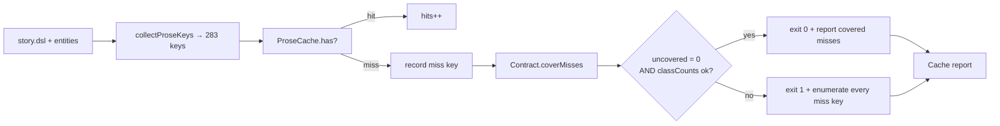

# Design 770a — Terrain cache contract for uncacheable keys

Spec: [`spec.md`](spec.md). Closes spec 750 success criterion #2 once criterion
1 holds on `main` HEAD.

## Diagnostic finding

Criterion 2 of the spec is the architectural input: it tells design whether
today's misses cluster into one class or split. Running the to-be-built
diagnostic by hand on `main` HEAD (`f1576f2d`) returns:

| Class                 | Misses | Class size today | Cached entries |
| --------------------- | -----: | ---------------: | -------------: |
| `snapshot_comment_*`  |     48 |              147 |             99 |
| every other prose key |      0 |              136 |            136 |

All 48 misses are in one class. The `enrich_drug_*` keys named in commit
`54e11c02` are `generateStructured()` content-hash entries, not prose keys; they
are out of this spec's scope. The cache holds `snapshot_comment_*` values that
are non-empty and substantive — these are not empty-LLM-response keys. They are
honestly missing because `generateCommentKeys`
(`libsyntheticgen/src/engine/activity-comments.js:97`) shuffles candidates with
`rng.shuffle`, and the regen run produced a partly different key set than
today's run. The cause is **seed/shuffle drift**, not "intentionally empty
generator".

This reframes the spec's three options. Allowlist-by-name is incoherent against
drift (the names change). Negative-cache sentinel is incoherent against drift
(no LLM call was attempted, so there is nothing to mark empty). Class-of-key is
the only mechanism that fits.

## Components

| #   | Component                              | Role                                                                                                    |
| --- | -------------------------------------- | ------------------------------------------------------------------------------------------------------- |
| 1   | Cache contract registry (data file)    | Single source of truth for which key classes may be absent and a per-class miss-budget upper bound      |
| 2   | Contract loader (libsyntheticprose)    | Parse the registry and expose `coverMisses(missKeys)` returning `{ covered, uncovered, classCounts }`   |
| 3   | Diagnostic enumeration (libterrain)    | When `result.stats.prose.misses > 0`, emit every miss key (no truncation, no sampling) before the table |
| 4   | `check` exit-code rule (libterrain)    | `ok` reduces to "every miss key is covered AND each class miss count ≤ its class budget"                |
| 5   | Contract documentation (markdown)      | Reader-facing doc naming the registered classes, their budgets, and the registration procedure          |
| 6   | Criterion-5 guard (kata-release-merge) | No reintroduction of any `Data (prose)` exception in §§ 4–6; the merge gate is the merge gate           |

## Data flow



## Contract shape (decision K1)

A contract entry is `{ classPattern, maxMisses, rationale }`. `classPattern` is
a glob anchored at the start of a key (`snapshot_comment_*`). `maxMisses` is an
integer cap; misses beyond it fail the gate even if the prefix matches.
`rationale` is human prose explaining why the class drifts and what the planner
should do if the cap is hit (regen, then revisit).

The registry is `data/synthetic/prose-cache-contract.json`, a sibling of
`prose-cache.json`, with shape:

```json
{
  "_schema": 1,
  "classes": [
    {
      "classPattern": "snapshot_comment_*",
      "maxMisses": 60,
      "rationale": "RNG shuffle in generateCommentKeys can elect a different actor set per run; misses above this cap signal that regen drifted faster than the cache covers and a fresh `fit-terrain generate` is needed."
    }
  ]
}
```

`maxMisses` set at 60 (= 25% headroom over today's 48) per K3.

## Key Decisions

| Key | Decision                                                             | Trade-off vs. rejected                                                                                                                                                                                                          |
| --- | -------------------------------------------------------------------- | ------------------------------------------------------------------------------------------------------------------------------------------------------------------------------------------------------------------------------- |
| K1  | Class-of-key registry (glob prefix + cap), not allowlist or sentinel | Allowlist-by-name fails against drift (names rotate run-to-run). Sentinel fails against drift (no LLM call attempted, nothing to mark empty). Class-of-key is the only mechanism that survives the actual root cause.           |
| K2  | Per-class `maxMisses` cap, not unbounded class exemption             | Unbounded exemption hides a structural change in the keyspace. The cap turns the gate from "is anything missing" into "is the missing set within tolerance for this class." Catches regressions that are not pure RNG drift.    |
| K3  | Cap = 60 (25% headroom over current 48), not 48 or 147               | 48 = today's exact value, fragile to one extra rotation. 147 = whole class size, no signal. 25% over today's value tolerates one normal rotation cycle while still firing on a structural break.                                |
| K4  | Registry file is JSON beside `prose-cache.json`, not in code         | A code-resident allowlist is invisible to non-JS reviewers. JSON next to the cache makes the contract diff-readable, makes the `_schema` versioning consistent with the cache itself, and centralizes "what may be absent."     |
| K5  | Diagnostic enumeration always fires when `misses > 0`                | Spec criterion 2 wording is unconditional. Enumerating only on uncovered miss would hide drift growth approaching the cap; emitting on every miss-bearing run keeps the data point visible in CI without requiring a failure.   |
| K6  | One artifact for criterion 3: registry JSON + a README section       | Two artifacts (registry + dedicated doc) duplicates the source of truth. The registry is canonical; a README section in `libraries/libterrain/README.md` cross-links to it and describes the registration procedure.            |
| K7  | Criterion 5 enforced by static absence, not by a positive guard      | A "guard test that fails if X is added" requires a synthetic SKILL.md mutation harness. Static absence of `prose`/`prose-cache`/`data/pathway/` exception language in §§ 4–6 is verifiable in plan review and PR review.        |
| K8  | Determinism follow-up is out of scope                                | The right long-term fix is making `generateCommentKeys` cache-aware (re-elect cached actors first). That is a behavioural change to libsyntheticgen and belongs in a follow-up spec; this spec ships the contract and the gate. |

## Interfaces

```js
// libsyntheticprose/engine/contract.js — new
export class CacheContract {
  static load(contractPath, logger) { /* read+parse+validate _schema */ }
  coverMisses(missKeys) {
    return {
      covered: string[],          // keys whose class matched, within cap
      uncovered: string[],        // keys whose class did not match, OR caps blew
      classCounts: Map<string, { matched: number, cap: number, ok: boolean }>,
    };
  }
}
```

```js
// libterrain/src/cli-helpers.js — extended printCacheReport signature
export function printCacheReport(result, summary, ok, contractCoverage) {
  // when stats.prose.misses > 0, write every miss key one per line
  // before the existing table (covered keys prefixed "covered:", uncovered
  // prefixed "uncovered:" so the output is grep-able).
}
```

```js
// libterrain/bin/fit-terrain.js — check verb
const coverage = contract.coverMisses(missKeys);
const ok =
  coverage.uncovered.length === 0 &&
  [...coverage.classCounts.values()].every((c) => c.ok);
printCacheReport(result, summary, ok, coverage);
return { ok };
```

The miss-key list is threaded through `cache-lookup` so the verb sees the
ordered miss keys, not just the count. `ProseCache.stats` gains
`missKeys: string[]` alongside the existing `hits` / `misses` counters.

## Cross-skill coordination

Routed to release-engineer before publication: criterion 5's anchor is the
current §§ 4–6 wording of `kata-release-merge` SKILL.md. The wording in play is
"After rebase, run `bun run check:fix` then `bun run check`. If checks still
fail, mark **blocked**…" — no parenthetical exception for `data/pathway/`,
prose, or any other surface. The implementation diff and the plan review must
verify §§ 4–6 still match this anchor with no added carve-out for
`Data (prose)`. RE will be asked to confirm the anchor wording on the design PR.

## Risks (architecture-level)

| #   | Risk                                                                                                     | Why visible only at design                                                                         |
| --- | -------------------------------------------------------------------------------------------------------- | -------------------------------------------------------------------------------------------------- |
| R1  | Cap drift over time as scenarios add quarters → silent cap raises                                        | Plan must include a "raising the cap is a registry edit, not a CI fix" note for contributors       |
| R2  | A new prose-key generator returning empty would not match an existing class — falls through as uncovered | Criterion 6 verifiable: such a key fails locally and in CI with that key listed in the diagnostic. |

## Out of scope

- Making `generateCommentKeys` cache-aware (true determinism fix) — follow-up
  spec; tracked in #687 superset.
- The cache file format / `_schema` versioning of `prose-cache.json` — per spec
  scope (out).
- `enriched` / `pathway` content-hash cache entries — per spec scope (out).

— Staff Engineer 🛠️
