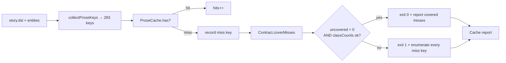

# Design 770a — Terrain cache contract for uncacheable keys

Spec: [`spec.md`](spec.md). Closes spec 750 success criterion #2 once criterion
1 holds on `main` HEAD.

## Architectural input

Spec criterion 2 names the enumerated-miss diagnostic as the input that tells
design whether today's misses cluster into one class or split. Manual
enumeration on `main` HEAD (`f1576f2d`) — set-difference of `collectProseKeys`
against the keys present in `data/synthetic/prose-cache.json`, the same
comparison the to-be-built diagnostic will perform — gives:

| Class                 | Misses | Class size today | Cached entries |
| --------------------- | -----: | ---------------: | -------------: |
| `snapshot_comment_*`  |     48 |              147 |             99 |
| every other prose key |      0 |              136 |            136 |

All 48 misses are in one class. The cached `snapshot_comment_*` values are
non-empty and substantive — these are not empty-LLM-response keys. The cause is
**seed/shuffle drift**: `generateCommentKeys` shuffles candidates with
`rng.shuffle`, so a regen run produces a partly different key set than today's.
The `enrich_drug_*` keys named in commit `54e11c02` are `generateStructured()`
content-hash entries, not prose keys, and are out of this spec's scope.

Drift, not empty generators, eliminates two of the spec's three options:
allowlist-by-name fails because names rotate; negative-cache sentinel fails
because no LLM call was attempted, so there is nothing to mark empty.
Class-of-key is the only mechanism that fits.

## Components

| #   | Component                             | Role                                                                                                                                                                                                |
| --- | ------------------------------------- | --------------------------------------------------------------------------------------------------------------------------------------------------------------------------------------------------- |
| 1   | Cache contract registry (data file)   | Single source of truth for which key classes may be absent and a per-class miss-budget upper bound; doubles as the criterion-3 single artifact via embedded `_doc` and per-class `rationale` fields |
| 2   | Contract loader (`libsyntheticprose`) | Parses the registry and exposes `coverMisses(missKeys) → { covered, uncovered, classCounts }`                                                                                                       |
| 3   | Diagnostic enumeration (`libterrain`) | Emits every miss key (no truncation, no sampling) whenever `result.stats.prose.misses > 0`                                                                                                          |
| 4   | `check` exit-code rule (`libterrain`) | `ok` reduces to "every miss key is covered AND each class miss count ≤ its class budget"                                                                                                            |

The `kata-release-merge` §§ 4–6 invariant for criterion 5 is a cross-skill
constraint verified by static inspection of the SKILL (per the spec), not a
component this design builds — see
[Cross-skill coordination](#cross-skill-coordination).

## Data flow



## Contract data structure

A contract entry is `{ classPattern, maxMisses, rationale }`. `classPattern` is
a glob anchored at the start of a key. `maxMisses` is an integer cap; misses
beyond it fail the gate even if the prefix matches. `rationale` is human prose
explaining why the class drifts and what to do if the cap is hit.

The registry lives at `data/synthetic/prose-cache-contract.json`, a sibling of
`prose-cache.json`. Top-level `_doc` describes the registration procedure and
the resolution rule (criterion 3's single-artifact requirement). Shape:

```json
{
  "_schema": 1,
  "_doc": "Lists prose-key classes whose absence from prose-cache.json is permitted up to maxMisses. fit-terrain check covers a miss when its key matches a classPattern and the class's miss count is within cap. Register a class by appending to classes[] with a rationale; raising maxMisses is a registry edit reviewed by humans, not a CI fix.",
  "classes": [
    {
      "classPattern": "snapshot_comment_*",
      "maxMisses": "<plan-set integer; see K3 formula>",
      "rationale": "RNG shuffle in generateCommentKeys can elect a different actor set per run; misses above this cap signal that regen drifted faster than the cache covers and a fresh `fit-terrain generate` is needed."
    }
  ]
}
```

## Interfaces

`CacheContract` (new class in `libsyntheticprose`):

- `static load(contractPath, logger)` — read, parse, validate `_schema`.
- `coverMisses(missKeys)` — returns
  `{ covered: string[], uncovered: string[], classCounts: Map<classPattern, { matched, cap, ok }> }`.

`ProseCache.stats` extension: gains `missKeys: string[]` alongside `hits` /
`misses`, so the verb receives the ordered miss-key list threaded through
`cache-lookup`, not just a count.

`printCacheReport` extension: takes `contractCoverage` as an additional
argument. When `stats.prose.misses > 0`, the report names every miss key with
its coverage state in a grep-able form (output formatting is plan-level).

`fit-terrain check` exit rule:

```
ok = coverage.uncovered.length === 0
   && every classCounts entry has ok = true
```

## Key Decisions

| Key | Decision                                                                                                                                    | Trade-off vs. rejected                                                                                                                                                                                                                                                                                                                                |
| --- | ------------------------------------------------------------------------------------------------------------------------------------------- | ----------------------------------------------------------------------------------------------------------------------------------------------------------------------------------------------------------------------------------------------------------------------------------------------------------------------------------------------------- |
| K1  | Class-of-key registry (glob prefix + cap), not allowlist or sentinel                                                                        | Allowlist-by-name fails against drift (names rotate run-to-run). Sentinel fails against drift (no LLM call attempted, nothing to mark empty). Class-of-key is the only mechanism that survives the actual root cause.                                                                                                                                 |
| K2  | Per-class `maxMisses` cap, not unbounded class exemption; "covered" in spec criterion 4 = `classPattern` matches AND class miss count ≤ cap | Unbounded exemption hides a structural change in the keyspace. The cap turns the gate from "is anything missing" into "is the missing set within tolerance for this class." Defining "covered" to include the cap keeps the spec's criterion-4 wording semantically coherent with the cap mechanism — caps are part of coverage, not a separate gate. |
| K3  | Static cap formula — `maxMisses ≥ today's measured class miss count + headroom for one normal rotation cycle`; never auto-ratcheted by CI   | Auto-tightening adds mechanism for no clear gain — the cap is a structural-change tripwire, not a miss-count optimizer. The integer instantiation is plan-set; the architectural commitment is "static, registry-edited, headroom for one rotation cycle."                                                                                            |
| K4  | Registry file is JSON beside `prose-cache.json`, not in code                                                                                | A code-resident allowlist is invisible to non-JS reviewers. JSON next to the cache makes the contract diff-readable, makes `_schema` versioning consistent with the cache itself, and centralizes "what may be absent."                                                                                                                               |
| K5  | Diagnostic enumeration always fires when `misses > 0`                                                                                       | Spec criterion 2 wording is unconditional. Enumerating only on uncovered miss would hide drift growth approaching the cap; emitting on every miss-bearing run keeps the data point visible in CI without requiring a failure.                                                                                                                         |
| K6  | The registry JSON itself is the single criterion-3 artifact (`_doc` + per-class `rationale`); no separate README                            | Spec criterion 3 says "single artifact". Registry + README is two sources readers reconcile. Registry-with-embedded-doc keeps data and explanation in lockstep — registering a class without its rationale becomes structurally impossible because the schema requires the field.                                                                     |

## Cross-skill coordination

Criterion 5 is verified by static inspection of `kata-release-merge` SKILL.md
after the implementation PR merges (per the spec), not by a runtime guard
component in this design. Release-engineer confirmed §§ 4–6 of that SKILL remain
unchanged since spec 750 S4 (bb1a8aea): no carve-out / exception language for
`Data (prose)`, `prose-red`, `prose-cache`, or "missing `data/pathway/`"
anywhere in §§ 4–6. The plan chooses how to operationalize the static inspection
(literal-string match, structural-qualifier check, or both).

## Risks (architecture-level)

| #   | Risk                                                                                                     | Why visible only at design                                                                                                                                                                                              |
| --- | -------------------------------------------------------------------------------------------------------- | ----------------------------------------------------------------------------------------------------------------------------------------------------------------------------------------------------------------------- |
| R1  | Cap drift over time as scenarios add quarters → silent cap raises                                        | Cap is a static registry value, never auto-tightened or auto-raised by CI. Raising it is a contributor PR edit reviewed by humans; the registry `_doc` must repeat this rule, and the plan must call it out explicitly. |
| R2  | A new prose-key generator returning empty would not match an existing class — falls through as uncovered | Criterion 6 verifiable: such a key fails locally and in CI with that key listed in the diagnostic.                                                                                                                      |

## Out of scope

- Making `generateCommentKeys` cache-aware (true determinism fix) — follow-up
  spec. The right long-term fix is to re-elect cached actors first; that is a
  behavioural change to `libsyntheticgen`.
- The cache file format / `_schema` versioning of `prose-cache.json` — per spec
  scope (out).
- `enriched` / `pathway` content-hash cache entries — per spec scope (out).
