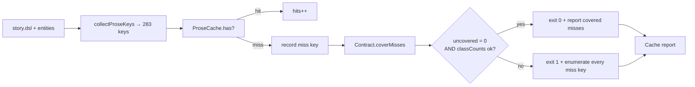

# Design 770a — Terrain cache contract for uncacheable keys

Spec: [`spec.md`](spec.md). Closes spec 750 success criterion #2 once criterion
1 holds on `main` HEAD.

## Diagnostic finding

Criterion 2 of the spec is the architectural input: it tells design whether
today's misses cluster into one class or split. Running the to-be-built
diagnostic by hand on `main` HEAD (`f1576f2d`) returns:

| Class                 | Misses | Class size today | Cached entries |
| --------------------- | -----: | ---------------: | -------------: |
| `snapshot_comment_*`  |     48 |              147 |             99 |
| every other prose key |      0 |              136 |            136 |

All 48 misses are in one class. The `enrich_drug_*` keys named in commit
`54e11c02` are `generateStructured()` content-hash entries, not prose keys; they
are out of this spec's scope. The cache holds `snapshot_comment_*` values that
are non-empty and substantive — these are not empty-LLM-response keys. They are
honestly missing because `generateCommentKeys` shuffles candidates with
`rng.shuffle`, and the regen run produced a partly different key set than
today's run. The cause is **seed/shuffle drift**, not "intentionally empty
generator".

This reframes the spec's three options. Allowlist-by-name is incoherent against
drift (the names change). Negative-cache sentinel is incoherent against drift
(no LLM call was attempted, so there is nothing to mark empty). Class-of-key is
the only mechanism that fits.

## Components

| #   | Component                             | Role                                                                                                                                                                                                |
| --- | ------------------------------------- | --------------------------------------------------------------------------------------------------------------------------------------------------------------------------------------------------- |
| 1   | Cache contract registry (data file)   | Single source of truth for which key classes may be absent and a per-class miss-budget upper bound; doubles as the criterion-3 single artifact via embedded `_doc` and per-class `rationale` fields |
| 2   | Contract loader (`libsyntheticprose`) | Parses the registry and exposes `coverMisses(missKeys) → { covered, uncovered, classCounts }`                                                                                                       |
| 3   | Diagnostic enumeration (`libterrain`) | When `result.stats.prose.misses > 0`, emits every miss key (no truncation, no sampling) before the cache report table                                                                               |
| 4   | `check` exit-code rule (`libterrain`) | `ok` reduces to "every miss key is covered AND each class miss count ≤ its class budget"                                                                                                            |

The `kata-release-merge` § 4–6 invariant for criterion 5 is a cross-skill
constraint, not a component this design builds — handled in
[Cross-skill coordination](#cross-skill-coordination).

## Data flow



## Contract data structure

A contract entry is `{ classPattern, maxMisses, rationale }`. `classPattern` is
a glob anchored at the start of a key. `maxMisses` is an integer cap; misses
beyond it fail the gate even if the prefix matches. `rationale` is human prose
explaining why the class drifts and what to do if the cap is hit.

The registry lives at `data/synthetic/prose-cache-contract.json`, a sibling of
`prose-cache.json`. Top-level `_doc` describes the registration procedure and
the resolution rule (criterion 3's single artifact requirement). Shape:

```json
{
  "_schema": 1,
  "_doc": "Lists prose-key classes whose absence from prose-cache.json is permitted up to maxMisses. fit-terrain check covers a miss when its key matches a classPattern and the class's miss count is within cap. Register a class by appending to classes[] with a rationale; raising maxMisses is a registry edit reviewed by humans, not a CI fix.",
  "classes": [
    {
      "classPattern": "snapshot_comment_*",
      "maxMisses": 60,
      "rationale": "RNG shuffle in generateCommentKeys can elect a different actor set per run; misses above this cap signal that regen drifted faster than the cache covers and a fresh `fit-terrain generate` is needed."
    }
  ]
}
```

`maxMisses` set at 60 (= 25% headroom over today's 48).

## Interfaces

`CacheContract` (new class in `libsyntheticprose`):

- `static load(contractPath, logger)` — read, parse, validate `_schema`.
- `coverMisses(missKeys)` — returns
  `{ covered: string[], uncovered: string[], classCounts: Map<classPattern, { matched, cap, ok }> }`.

`ProseCache.stats` extension: gains `missKeys: string[]` alongside the existing
`hits` / `misses` counters, so the verb receives the ordered miss-key list
threaded through `cache-lookup`, not just a count.

`printCacheReport` extension: takes `contractCoverage` as an additional
argument. When `stats.prose.misses > 0`, the report prints every miss key one
per line (`covered: <key>` / `uncovered: <key>` for grep-ability) preceding the
existing table.

`fit-terrain check` exit rule:

```
ok = coverage.uncovered.length === 0
   && every classCounts entry has ok = true
```

## Key Decisions

| Key | Decision                                                                                                                                                                                                                                          | Trade-off vs. rejected                                                                                                                                                                                                                                                                                                                                                                                                                                   |
| --- | ------------------------------------------------------------------------------------------------------------------------------------------------------------------------------------------------------------------------------------------------- | -------------------------------------------------------------------------------------------------------------------------------------------------------------------------------------------------------------------------------------------------------------------------------------------------------------------------------------------------------------------------------------------------------------------------------------------------------- |
| K1  | Class-of-key registry (glob prefix + cap), not allowlist or sentinel                                                                                                                                                                              | Allowlist-by-name fails against drift (names rotate run-to-run). Sentinel fails against drift (no LLM call attempted, nothing to mark empty). Class-of-key is the only mechanism that survives the actual root cause.                                                                                                                                                                                                                                    |
| K2  | Per-class `maxMisses` cap, not unbounded class exemption                                                                                                                                                                                          | Unbounded exemption hides a structural change in the keyspace. The cap turns the gate from "is anything missing" into "is the missing set within tolerance for this class." Catches regressions that are not pure RNG drift.                                                                                                                                                                                                                             |
| K3  | Cap = 60 (25% headroom over today's 48), static budget — not 48, not 147, not auto-ratcheting                                                                                                                                                     | 48 = today's exact value, fragile to one extra rotation. 147 = whole class size, no signal. Auto-tightening adds mechanism for no clear gain — the cap is a structural-change tripwire, not a miss-count optimizer. Cap moves are registry edits reviewed by humans, not CI side-effects. Revisit when the determinism follow-up (see Out of scope) lands.                                                                                               |
| K4  | Registry file is JSON beside `prose-cache.json`, not in code                                                                                                                                                                                      | A code-resident allowlist is invisible to non-JS reviewers. JSON next to the cache makes the contract diff-readable, makes the `_schema` versioning consistent with the cache itself, and centralizes "what may be absent."                                                                                                                                                                                                                              |
| K5  | Diagnostic enumeration always fires when `misses > 0`                                                                                                                                                                                             | Spec criterion 2 wording is unconditional. Enumerating only on uncovered miss would hide drift growth approaching the cap; emitting on every miss-bearing run keeps the data point visible in CI without requiring a failure.                                                                                                                                                                                                                            |
| K6  | The registry JSON itself is the single criterion-3 artifact (top-level `_doc` + per-class `rationale`); no separate README                                                                                                                        | Spec criterion 3 says "single artifact". Registry + README is two sources readers reconcile. Registry-with-embedded-doc keeps data and explanation in lockstep — registering a class without its rationale becomes structurally impossible because the schema requires the field.                                                                                                                                                                        |
| K7  | Criterion 5 verified primarily by **literal absence** of the four spec-named strings (`Data (prose)`, `prose-red`, `prose-cache`, `missing data/pathway/`) in §§ 4–6, with a structural-qualifier check scoped to those four subjects as backstop | Literal-string match against the current § 5 sentence is brittle to refactor. A purely structural rule ("any qualifier mentioning a path or check") over-matches legitimate prose. Literal coverage of the spec's enumerated strings is the primary check; the structural backstop fires only when a paraphrase scopes a step to one of the four subjects without using their exact wording. RE confirmed §§ 4–6 unchanged since spec 750 S4 (bb1a8aea). |

## Cross-skill coordination

**RE anchor confirmation (received).** Release-engineer confirmed §§ 4–6 of
`kata-release-merge` SKILL.md is unchanged since spec 750 S4 (bb1a8aea):

- § 4 (Assess Merge State) — no carve-out.
- § 5 (Rebase + Mechanical Fixes), lines 121–122: "After rebase, run
  `bun run check:fix` then `bun run check`. If checks still fail, mark
  **blocked** with the failures and skip to Step 9." — no parenthetical
  exception for `data/pathway/`, prose, or any other surface.
- § 6 (Approval Gate) — gates only on `<phase>:approved` label or APPROVED
  review, no carve-out.

The plan and implementation diff must keep this anchor intact per K7.

## Risks (architecture-level)

| #   | Risk                                                                                                     | Why visible only at design                                                                                                                                                                             |
| --- | -------------------------------------------------------------------------------------------------------- | ------------------------------------------------------------------------------------------------------------------------------------------------------------------------------------------------------ |
| R1  | Cap drift over time as scenarios add quarters → silent cap raises                                        | Cap is a static registry value, never auto-tightened or auto-raised by CI. Raising it is a contributor PR edit reviewed by humans; the plan must call this out and the registry `_doc` must repeat it. |
| R2  | A new prose-key generator returning empty would not match an existing class — falls through as uncovered | Criterion 6 verifiable: such a key fails locally and in CI with that key listed in the diagnostic.                                                                                                     |

## Out of scope

- Making `generateCommentKeys` cache-aware (true determinism fix) — follow-up
  spec; tracked in #687 superset. The right long-term fix is to re-elect cached
  actors first; that is a behavioural change to `libsyntheticgen` and belongs in
  a separate spec.
- The cache file format / `_schema` versioning of `prose-cache.json` — per spec
  scope (out).
- `enriched` / `pathway` content-hash cache entries — per spec scope (out).

— Staff Engineer 🛠️
